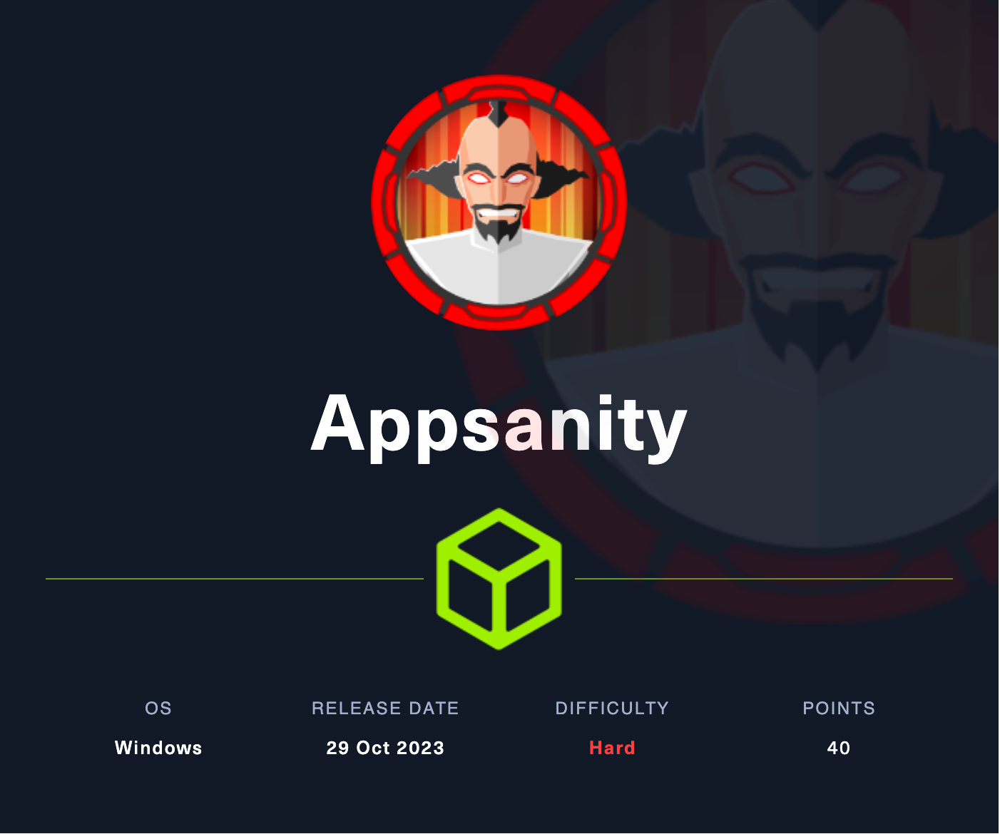

# Appsanity

## Machine Info



<p align="center"><strong>Notice: the full version of write-up is <a href="https://zhsh9.info/HackTheBox/2024/season3/Appsanity/" style="color: red;">here</a>.</strong></p>

## Beyond Root

### ACL & icacls

In Windows, `icacls` is a command-line utility used to display and modify the access control lists (ACLs) of files and directories. `ACLs` specify the permissions that different users and groups have on files and directories.

In this example, the command `icacls .` is executed in the `C:\Users\devdoc\Documents` directory (where `.` represents the current directory), and the output displays the permission settings for the current directory:

```
. APPSANITY\devdoc:(OI)(CI)(RX,W)
  CREATOR OWNER:(I)(OI)(CI)(IO)(F)
	NT AUTHORITY\SYSTEM:(I)(OI)(CI)(F)
  BUILTIN\Administrators:(I)(OI)(CI)(F)
```

The permissions are listed here, with each line representing a different security principal (user or group) and their permissions for the folder:

- `CREATOR OWNER:(I)(OI)(CI)(IO)(F)`: The `CREATOR OWNER` is a placeholder for the user who creates a new object within the directory.

- `NT AUTHORITY\SYSTEM`: This is a high-privilege system account that has almost all permissions.
- `BUILTIN\Administrators`: This is the local administrators group, which has full control permissions.
- `APPSANITY\devdoc`: This is a domain user or local user account (depending on whether `APPSANITY` is a domain name or a local computer name), and it also has full control permissions.

The letters in the parentheses following the permissions indicate the following:

- `(I)`: Inherited permissions, meaning the permissions are inherited from a parent directory.
- `(OI)`: Object inherit, meaning child files should also inherit these permissions.
- `(CI)`: Container inherit, meaning child directories should also inherit these permissions.
- `(F)`: Full control permissions, allowing all actions (read, write, execute, modify, delete, etc.).
- `(RX)`: Read and execute permissions - the ability to read and run executable files.
- `(W)`: Write permission - the ability to modify files and write new files within the directory.
